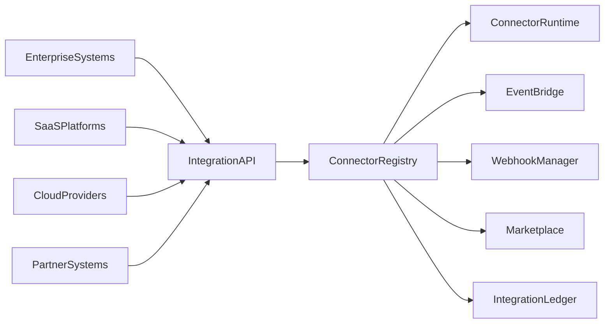
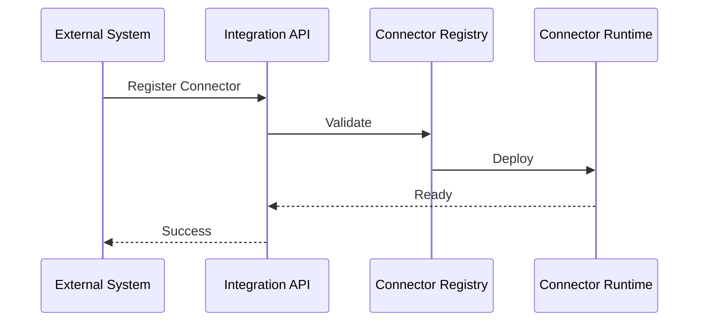
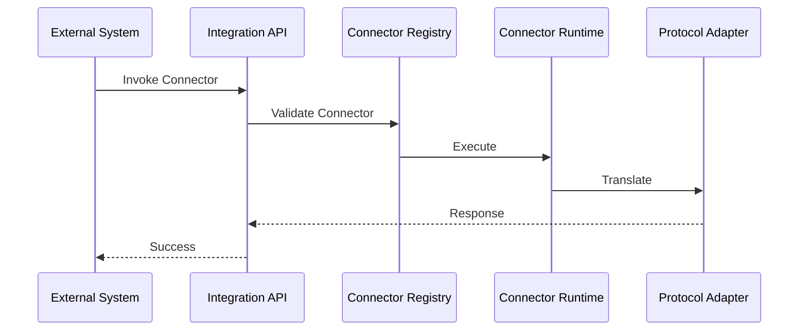

# Enterprise AI Software Factory
# Architecture Design Specification (ADS)

> **Document ID:** ADS-030-v3
>
> **Document Name:** Integration & Ecosystem Platform — APIs, Events & Contracts
>
> **Version:** 2.0.0
>
> **Classification:** Enterprise Platform Plane
>
> **Importance:** HIGH
>
> **Depends On:** ADS-030-v1
>
> **Depends On:** ADS-030-v2
>
> **Next:** ADS-030-v4 — Runtime & Integration Infrastructure

---

# Executive Summary

The Integration & Ecosystem Platform exposes standardized APIs for connector registration, contract validation, event routing, webhook management, partner onboarding, marketplace operations, and integration lifecycle management.

Every external interaction occurs through these contracts.

Connector implementations may evolve.

Integration contracts remain stable.

---

# Communication Principles

Every integration request MUST satisfy

- Authenticated
- Authorized
- Versioned
- Observable
- Governed
- Replayable
- Secure
- Tenant Isolated

No external system bypasses the Integration Platform.

---

# Integration Communication Architecture



Connector Registry coordinates every external interaction.

---

# Public REST API

The Integration Platform exposes APIs for

- Enterprise Applications
- SaaS Platforms
- Cloud Providers
- Partner Systems
- Marketplace
- Event Producers
- Webhook Providers
- Developer SDKs

---

## API-030-001

### Register Connector

```http
POST /integration/v1/connectors
```

Purpose

Registers a Connector Record.

---

Request

```json
{
  "provider":"Acme",
  "connectorType":"REST",
  "contractId":"IC-045"
}
```

---

Response

```json
{
  "connectorId":"CONN-210",
  "status":"Registered"
}
```

---

## API-030-002

### Validate Contract

```http
POST /integration/v1/contracts/validate
```

Validates an Integration Contract.

---

## API-030-003

### Start Integration Session

```http
POST /integration/v1/sessions
```

Creates an Integration Session.

---

## API-030-004

### Publish Event

```http
POST /integration/v1/events
```

Publishes an integration event.

---

## API-030-005

### Register Webhook

```http
POST /integration/v1/webhooks
```

Registers a managed webhook endpoint.

---

# Internal gRPC Services

```protobuf
service IntegrationService {

rpc RegisterConnector(ConnectorRequest)
returns(ConnectorResponse);

rpc ValidateContract(ContractRequest)
returns(ContractResponse);

rpc StartIntegrationSession(SessionRequest)
returns(SessionResponse);

rpc PublishEvent(EventRequest)
returns(EventResponse);

rpc RegisterWebhook(WebhookRequest)
returns(WebhookResponse);

}
```

---

# Integration Contract Schema

```protobuf
message IntegrationContract {

string contract_id = 1;

string connector_id = 2;

string external_system = 3;

string protocol = 4;

string authentication = 5;

string version = 6;

}
```

---

# Connector Record Schema

```protobuf
message ConnectorRecord {

string connector_id = 1;

string provider = 2;

string connector_type = 3;

string deployment_model = 4;

string version = 5;

}
```

---

# Integration Session Schema

```protobuf
message IntegrationSession {

string session_id = 1;

string connector_id = 2;

string workflow_id = 3;

string protocol = 4;

string endpoint = 5;

string outcome = 6;

}
```

---

# MCP Tool Contracts

The Integration Platform exposes

```
register_connector

validate_contract

start_integration_session

publish_event

register_webhook

query_marketplace

connector_health

integration_diagnostics
```

Every invocation is authenticated and audited.

---

# Integration Events

Every integration operation emits immutable events.

---

## EVT-030-001

ConnectorRegistered

---

## EVT-030-002

ContractValidated

---

## EVT-030-003

IntegrationSessionStarted

---

## EVT-030-004

EventPublished

---

## EVT-030-005

WebhookRegistered

---

## EVT-030-006

PartnerOnboarded

---

## EVT-030-007

ConnectorDeprecated

---

## EVT-030-008

ConnectorRetired

---

# Event Flow



---

# Event Ordering

```text
ConnectorRegistered

↓

ContractValidated

↓

ConnectorApproved

↓

IntegrationSessionStarted

↓

EventPublished

↓

SessionCompleted
```

---

# Event Metadata

Every event contains

```yaml
eventId:
connectorId:
contractId:
sessionId:
workflowId:
traceId:
timestamp:
schemaVersion:
```

---

# End of Part 1

---

# Contract Validation

Every integration request follows a deterministic validation pipeline.

```text
Receive Request

↓

Schema Validation

↓

Authentication

↓

Authorization

↓

Integration Contract Validation

↓

Connector Validation

↓

Protocol Translation

↓

Integration Session
```

Execution begins only after successful validation.

---

# Validation Rules

Every request MUST satisfy

| Rule | Description |
|------|-------------|
| API Version | Supported contract version |
| Authentication | Valid connector identity |
| Authorization | Authorized provider |
| Contract Version | Active Integration Contract |
| Connector Status | Active and approved |
| Security Profile | Valid security configuration |
| Governance Policy | Approved integration policy |
| Tenant | Tenant isolation enforced |

Validation failures reject the request.

---

# Authentication

Integration authentication supports

- OAuth 2.1
- Mutual TLS
- API Keys
- JWT
- OpenID Connect
- SPIFFE / SPIRE

Anonymous integrations are prohibited.

---

# Authorization

Authorization evaluates

- Connector Identity
- Organization
- Provider
- Integration Scope
- Allowed Operations
- Governance Policies

Decision

```text
Allow

↓

Execute

Deny

↓

Reject

Throttle

↓

Rate Limit
```

Every authorization decision is audited.

---

# Protocol Translation Record

Every protocol transformation creates an immutable Protocol Translation Record.

```yaml
protocolTranslationRecord:

  translationId:

  integrationSession:

  sourceProtocol:

  targetProtocol:

  requestTransform:

  responseTransform:

  schemaMappings:

  validationResults:

  transformationLatency:

  completedAt:
```

Protocol Translation Records remain immutable.

---

# Runtime Sequence



---

# Retry Policy

Retryable operations

| Operation | Retry |
|-----------|------:|
| Connector Timeout | Yes |
| Event Delivery Timeout | Yes |
| Webhook Delivery Failure | Yes |
| Temporary Protocol Failure | Yes |
| Invalid Contract | No |
| Authentication Failure | No |
| Connector Deprecated | No |

Retry schedule

```text
1 s

↓

2 s

↓

4 s

↓

8 s

↓

Escalation
```

Retries remain bounded.

---

# Circuit Breakers

Integration services isolate unhealthy connectors.

```text
Connector Failure

↓

Retry

↓

Failure Threshold

↓

Circuit Open

↓

Fallback Connector

↓

Recovery Probe

↓

Circuit Closed
```

Failures remain localized.

---

# Distributed Tracing

Every integration operation includes

- Trace ID
- Connector ID
- Integration Contract ID
- Integration Session ID
- Protocol Translation Record ID

Trace Flow

```text
Integration API

↓

Connector Runtime

↓

Protocol Adapter

↓

Event Bridge

↓

Webhook Manager

↓

Integration Ledger
```

Every stage contributes trace spans.

---

# Prometheus Metrics

```text
integration_requests_total

connector_registrations_total

integration_sessions_total

protocol_translations_total

webhook_deliveries_total

event_publications_total

connector_validation_failures_total

connector_latency_seconds

connector_health_score

marketplace_downloads_total
```

---

# Structured Logging

Example

```json
{
  "traceId":"trace-17001",
  "connectorId":"CONN-210",
  "contractId":"IC-045",
  "sessionId":"IS-087",
  "translationId":"PTR-012",
  "protocol":"REST",
  "status":"Success"
}
```

Logs remain immutable and correlated.

---

# Audit Records

Every integration operation records

- Integration Contract
- Connector Record
- Integration Session
- Protocol Translation Record
- Workflow ID
- Trace ID
- Timestamp
- Connector Version

Audit history is append-only.

---

# Reference Standards & Specifications

The Integration Platform aligns with

| Standard | Purpose |
|----------|---------|
| OpenAPI 3.1 | REST APIs |
| AsyncAPI | Event contracts |
| gRPC | Internal communication |
| OAuth 2.1 | Authentication |
| OpenID Connect | Identity federation |
| CloudEvents | Event interoperability |
| OpenTelemetry | Distributed tracing |

---

# Architecture Decision Records

## ADR-030-06

### Decision

Represent every connector execution as an Integration Session.

### Status

Accepted

### Reason

Integration Sessions provide deterministic replay, observability, and operational diagnostics.

---

## ADR-030-07

### Decision

Represent protocol adaptation as Protocol Translation Records.

### Status

Accepted

### Reason

Translation Records improve interoperability, troubleshooting, replayability, and auditability.

---

## ADR-030-08

### Decision

Separate Integration Contracts from Connector Records.

### Status

Accepted

### Reason

Stable interface definitions allow multiple connector implementations while preserving compatibility.

---

# Operational Readiness Scorecard

| Capability | Status |
|------------|--------|
| Integration Contracts | ✅ Required |
| Connector Records | ✅ Required |
| Integration Sessions | ✅ Required |
| Protocol Translation Records | ✅ Required |
| Distributed Tracing | ✅ Required |
| Immutable Audit | ✅ Required |
| Standards Compliance | ✅ Required |
| Deterministic Replay | ✅ Required |

---

# Related Documents

ADS-021-v5 — Workflow Kernel

ADS-022-v5 — Identity & Trust Plane

ADS-023-v5 — Enterprise Memory Plane

ADS-024-v5 — Agent Execution Platform

ADS-025-v5 — Compute & Infrastructure Platform

ADS-026-v5 — Security Platform

ADS-027-v5 — Observability Platform

ADS-028-v5 — Governance Platform

ADS-029-v5 — Developer Experience Platform

ADS-030-v1 — Integration & Ecosystem Platform

ADS-030-v2 — Integration Algorithms & Connector Framework

ADS-030-v4 — Runtime & Integration Infrastructure

---

# End of Document