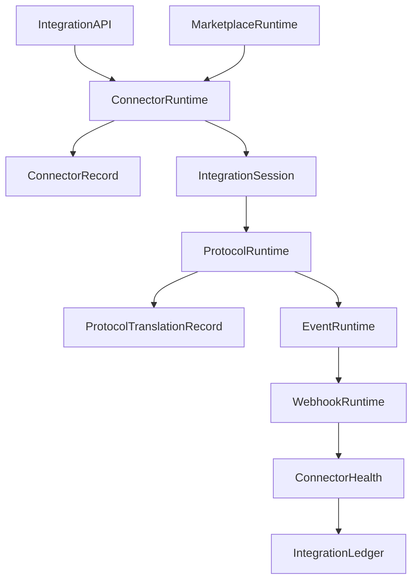

# Enterprise AI Software Factory
# Architecture Design Specification (ADS)

> **Document ID:** ADS-030-v4
>
> **Document Name:** Integration & Ecosystem Platform — Runtime & Integration Infrastructure
>
> **Version:** 2.0.0
>
> **Classification:** Enterprise Runtime Specification
>
> **Importance:** HIGH
>
> **Depends On:** ADS-030-v1
>
> **Depends On:** ADS-030-v2
>
> **Depends On:** ADS-030-v3
>
> **Next:** ADS-030-v5 — End-to-End Integration Lifecycle

---

# Executive Summary

This document defines the runtime infrastructure responsible for continuously executing enterprise integrations across connectors, APIs, event streams, webhooks, SaaS platforms, cloud providers, partner systems, and marketplace extensions.

The runtime provides secure, observable, governed, and resilient integration services while remaining independent from workflow execution.

External systems interact only through the Integration Runtime.

---

# Runtime Philosophy

The Integration Runtime follows seven principles.

- Contract First
- Runtime Isolation
- Continuous Availability
- Event-Driven Communication
- Deterministic Translation
- Observable Execution
- Governed Connectivity

Every connector executes inside a controlled runtime.

---

# Runtime Layers

## Connector Runtime

Responsible for

- Connector Execution
- Session Management
- Connector Isolation
- Runtime Configuration

---

## Protocol Runtime

Responsible for

- Protocol Translation
- Serialization
- Schema Mapping
- Payload Validation

---

## Event Runtime

Responsible for

- Event Routing
- Event Transformation
- Delivery Guarantees
- Retry Management

---

## Webhook Runtime

Responsible for

- Webhook Validation
- Signature Verification
- Replay Protection
- Delivery Tracking

---

## Marketplace Runtime

Responsible for

- Connector Distribution
- Version Updates
- Marketplace Synchronization
- Connector Discovery

---

# Runtime Architecture



Connector Runtime coordinates all external communication.

---

# Runtime Components

| Component | Responsibility |
|------------|----------------|
| Connector Runtime | Connector execution |
| Protocol Runtime | Protocol adaptation |
| Event Runtime | Event routing |
| Webhook Runtime | Webhook processing |
| Marketplace Runtime | Connector distribution |
| Health Monitor | Connector monitoring |
| Integration Ledger | Immutable integration history |
| Runtime Monitor | Runtime health |

---

# Runtime Pipeline

```text
Connector

↓

Authentication

↓

Validation

↓

Protocol Translation

↓

Execution

↓

Observation

↓

Connector Health

↓

Integration Ledger
```

Every connector execution follows this lifecycle.

---

# Connector Runtime

Connector Runtime manages

- Connector Loading
- Version Resolution
- Runtime Configuration
- Session Isolation
- Dependency Management

Connector execution remains isolated.

---

# Event Runtime

Event Runtime processes

- Business Events
- Workflow Events
- Partner Events
- Marketplace Events
- Integration Events

Event routing remains policy-driven.

---

# Integration Session Management

Every runtime session tracks

- Connector
- Contract
- Protocol
- Authentication
- Requests
- Responses
- Health

Integration Sessions remain isolated.

---

# Runtime Guarantees

The Integration Runtime guarantees

- Connector Isolation
- Deterministic Translation
- Continuous Availability
- Replayable Integrations
- Version Consistency
- Observable Execution
- Policy Enforcement

---

# End of Part 1
