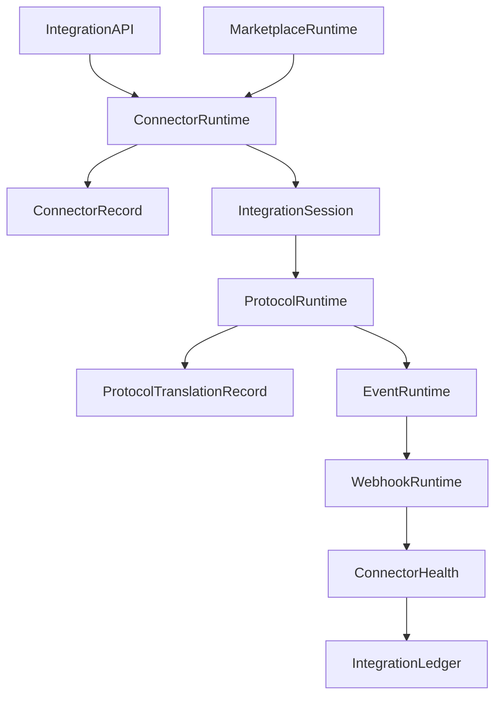
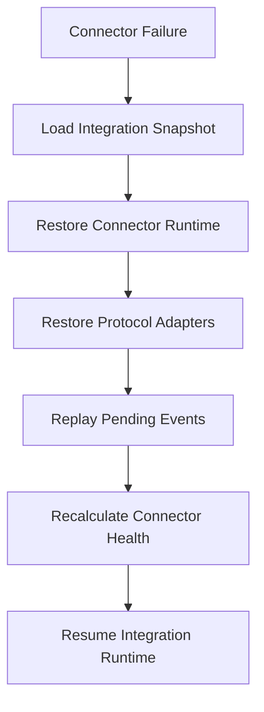

# Enterprise AI Software Factory
# Architecture Design Specification (ADS)

> **Document ID:** ADS-030-v4
>
> **Document Name:** Integration & Ecosystem Platform — Runtime & Integration Infrastructure
>
> **Version:** 2.0.0
>
> **Classification:** Enterprise Runtime Specification
>
> **Importance:** HIGH
>
> **Depends On:** ADS-030-v1
>
> **Depends On:** ADS-030-v2
>
> **Depends On:** ADS-030-v3
>
> **Next:** ADS-030-v5 — End-to-End Integration Lifecycle

---

# Executive Summary

This document defines the runtime infrastructure responsible for continuously executing enterprise integrations across connectors, APIs, event streams, webhooks, SaaS platforms, cloud providers, partner systems, and marketplace extensions.

The runtime provides secure, observable, governed, and resilient integration services while remaining independent from workflow execution.

External systems interact only through the Integration Runtime.

---

# Runtime Philosophy

The Integration Runtime follows seven principles.

- Contract First
- Runtime Isolation
- Continuous Availability
- Event-Driven Communication
- Deterministic Translation
- Observable Execution
- Governed Connectivity

Every connector executes inside a controlled runtime.

---

# Runtime Layers

## Connector Runtime

Responsible for

- Connector Execution
- Session Management
- Connector Isolation
- Runtime Configuration

---

## Protocol Runtime

Responsible for

- Protocol Translation
- Serialization
- Schema Mapping
- Payload Validation

---

## Event Runtime

Responsible for

- Event Routing
- Event Transformation
- Delivery Guarantees
- Retry Management

---

## Webhook Runtime

Responsible for

- Webhook Validation
- Signature Verification
- Replay Protection
- Delivery Tracking

---

## Marketplace Runtime

Responsible for

- Connector Distribution
- Version Updates
- Marketplace Synchronization
- Connector Discovery

---

# Runtime Architecture



Connector Runtime coordinates all external communication.

---

# Runtime Components

| Component | Responsibility |
|------------|----------------|
| Connector Runtime | Connector execution |
| Protocol Runtime | Protocol adaptation |
| Event Runtime | Event routing |
| Webhook Runtime | Webhook processing |
| Marketplace Runtime | Connector distribution |
| Health Monitor | Connector monitoring |
| Integration Ledger | Immutable integration history |
| Runtime Monitor | Runtime health |

---

# Runtime Pipeline

```text
Connector

↓

Authentication

↓

Validation

↓

Protocol Translation

↓

Execution

↓

Observation

↓

Connector Health

↓

Integration Ledger
```

Every connector execution follows this lifecycle.

---

# Connector Runtime

Connector Runtime manages

- Connector Loading
- Version Resolution
- Runtime Configuration
- Session Isolation
- Dependency Management

Connector execution remains isolated.

---

# Event Runtime

Event Runtime processes

- Business Events
- Workflow Events
- Partner Events
- Marketplace Events
- Integration Events

Event routing remains policy-driven.

---

# Integration Session Management

Every runtime session tracks

- Connector
- Contract
- Protocol
- Authentication
- Requests
- Responses
- Health

Integration Sessions remain isolated.

---

# Runtime Guarantees

The Integration Runtime guarantees

- Connector Isolation
- Deterministic Translation
- Continuous Availability
- Replayable Integrations
- Version Consistency
- Observable Execution
- Policy Enforcement

---

# End of Part 1

---

# Failure Recovery

The Integration Runtime automatically recovers from connector and communication failures while preserving integration integrity.

Recovery never violates Integration Contracts.



Recovery guarantees

- No connector corruption
- No contract violation
- No event loss
- Deterministic recovery

---

# Runtime Health Monitoring

Every runtime component continuously reports health.

Collected metrics

- Connector Runtime Health
- Protocol Runtime Health
- Event Runtime Health
- Webhook Runtime Health
- Marketplace Runtime Health
- Connector Availability
- Queue Depth
- Processing Latency

Health Flow

```text
Runtime Component

↓

Heartbeat

↓

Integration Runtime Monitor

↓

Integration Dashboard

↓

Alert Engine

↓

Operations Team
```

Health monitoring remains continuous.

---

# Integration Snapshot

The runtime periodically generates Integration Snapshots.

```yaml
integrationSnapshot:

  snapshotId:

  generatedAt:

  activeConnectors:

  activeSessions:

  eventBacklog:

  webhookQueue:

  marketplaceVersion:

  connectorHealth:

  protocolAdapters:

  runtimeHealth:

  throughput:
```

Integration Snapshots provide point-in-time operational state.

---

# Runtime Configuration

Example

```yaml
integrationRuntime:

  connectorIsolation: enabled

  protocolTranslation: automatic

  webhookVerification: strict

  marketplaceSync: enabled

  healthMonitoring: continuous

  integrationSnapshots: enabled

  retryPolicy: exponential

  snapshotInterval: 10m
```

Configuration remains version-controlled.

---

# Connector Scaling

Connector Runtime supports

- Horizontal Scaling
- Dynamic Provisioning
- Load Balancing
- Session Affinity
- Automatic Recovery

Scaling remains transparent to workflows.

---

# Runtime Isolation

Integration Runtime isolates

- Connectors
- Integration Sessions
- Protocol Adapters
- Event Streams
- Webhook Processing
- Marketplace Services

Isolation prevents connector interference.

---

# Prometheus Metrics

```text
integration_snapshots_total

active_connectors_total

active_integration_sessions_total

protocol_translation_seconds

event_processing_seconds

webhook_delivery_latency_seconds

connector_restart_total

connector_recovery_seconds

integration_throughput_total

integration_runtime_health_score
```

---

# OpenTelemetry

Distributed tracing spans

```text
Integration API

↓

Connector Runtime

↓

Protocol Runtime

↓

Event Runtime

↓

Webhook Runtime

↓

Integration Ledger
```

Every runtime stage contributes trace spans.

---

# Structured Logging

Example

```json
{
  "connectorId":"CONN-210",
  "integrationSnapshot":"ISNAP-007",
  "integrationSession":"IS-087",
  "protocolTranslation":"PTR-012",
  "runtimeHealth":"Healthy",
  "throughput":"184 req/s"
}
```

Logs remain immutable and correlated.

---

# Disaster Recovery

Recovery flow

```text
Connector Runtime Failure

↓

Restore Integration Snapshot

↓

Reload Connector Registry

↓

Restore Active Sessions

↓

Replay Pending Events

↓

Resume Runtime
```

Recovery targets

Recovery Point Objective (RPO)

Near-zero integration event loss

Recovery Time Objective (RTO)

Less than five minutes

---

# Recommended Production Deployment

```text
Integration API

↓

Connector Runtime

↓

Protocol Runtime

↓

Event Runtime

↓

Webhook Runtime

↓

Marketplace Runtime

↓

Integration Ledger

↓

OpenTelemetry

↓

Prometheus

↓

Grafana
```

---

# Technology Decision Records

## TDR-030-01

### Technology

Apache Kafka

### Decision

Use Kafka as the default enterprise event backbone.

### Reason

Provides durable, scalable event delivery for integration workloads.

---

## TDR-030-02

### Technology

AsyncAPI

### Decision

Use AsyncAPI for event-driven integration contracts.

### Reason

Standardizes event documentation and interoperability.

---

## TDR-030-03

### Technology

Connector Registry

### Decision

Persist immutable Connector Records and Integration Contracts.

### Reason

Supports versioning, governance, and reproducible integrations.

---

## TDR-030-04

### Technology

Integration Snapshot

### Decision

Persist periodic Integration Snapshots.

### Reason

Supports operational dashboards, recovery, diagnostics, and capacity planning.

---

## TDR-030-05

### Technology

Protocol Translation Engine

### Decision

Use dedicated protocol translation services.

### Reason

Separates transport adaptation from connector business logic and improves maintainability.

---

# Runtime Checklist

The Integration Platform MUST

- Enforce Integration Contracts
- Isolate connector execution
- Produce Integration Snapshots
- Track Connector Health
- Support deterministic protocol translation
- Preserve Integration Sessions
- Continuously monitor runtime health

The Integration Platform MUST NOT

- Bypass contract validation
- Execute deprecated connectors
- Lose validated integration events
- Modify immutable Connector Records
- Allow cross-connector state leakage

---

# Architecture Decision Records

## ADR-030-09

### Decision

Treat Integration Snapshots as immutable runtime artifacts.

### Status

Accepted

### Reason

Snapshots improve diagnostics, recovery, connector fleet management, and operational reporting.

---

## ADR-030-10

### Decision

Separate protocol translation from connector implementations.

### Status

Accepted

### Reason

Independent protocol adaptation simplifies interoperability and connector evolution.

---

## ADR-030-11

### Decision

Maintain isolated connector runtimes.

### Status

Accepted

### Reason

Isolation improves resilience, scalability, security, and fault containment.

---

# Operational Readiness Scorecard

| Capability | Status |
|------------|--------|
| Connector Runtime | ✅ Required |
| Integration Snapshots | ✅ Required |
| Protocol Runtime | ✅ Required |
| Event Runtime | ✅ Required |
| Runtime Recovery | ✅ Required |
| Connector Isolation | ✅ Required |
| Continuous Monitoring | ✅ Required |
| Deterministic Translation | ✅ Required |

---

# Related Documents

ADS-021-v5 — Workflow Kernel

ADS-022-v5 — Identity & Trust Plane

ADS-023-v5 — Enterprise Memory Plane

ADS-024-v5 — Agent Execution Platform

ADS-025-v5 — Compute & Infrastructure Platform

ADS-026-v5 — Security Platform

ADS-027-v5 — Observability Platform

ADS-028-v5 — Governance Platform

ADS-029-v5 — Developer Experience Platform

ADS-030-v1 — Integration & Ecosystem Platform

ADS-030-v2 — Integration Algorithms & Connector Framework

ADS-030-v3 — APIs, Events & Contracts

ADS-030-v5 — End-to-End Integration Lifecycle

---

# End of Document