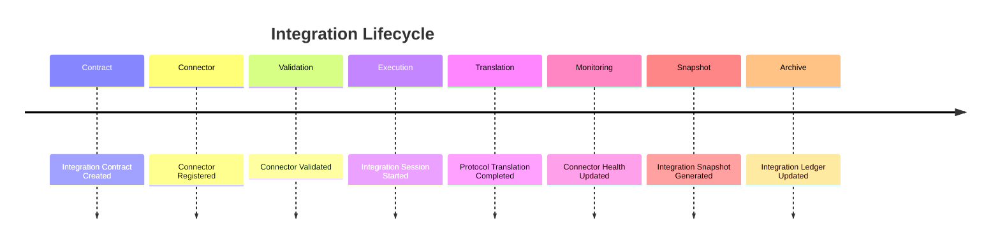

# Enterprise AI Software Factory
# Architecture Design Specification (ADS)

> **Document ID:** ADS-030-v5
>
> **Document Name:** Integration & Ecosystem Platform — End-to-End Integration Lifecycle
>
> **Version:** 2.0.0
>
> **Classification:** Reference Implementation
>
> **Importance:** HIGH
>
> **Depends On:** ADS-030-v1
>
> **Depends On:** ADS-030-v2
>
> **Depends On:** ADS-030-v3
>
> **Depends On:** ADS-030-v4

---

# Executive Summary

This document demonstrates how the Integration & Ecosystem Platform manages a complete enterprise integration lifecycle—from connector registration through runtime execution, protocol translation, monitoring, governance, and archival.

It illustrates how Integration Contracts, Connector Records, Integration Sessions, Protocol Translation Records, Connector Health Records, Integration Snapshots, and Integration Ledger Entries interact during real production operations.

Every connector is governed.

Every exchange is observable.

Every integration is replayable.

---

# Scenario

An enterprise connects Salesforce CRM to the Enterprise AI Software Factory to synchronize customer opportunities with AI-powered workflow automation.

Participating systems

- Workflow Kernel
- Identity Plane
- Security Platform
- Governance Platform
- Observability Platform
- Integration Platform

---

# Stage 1 — Integration Contract

Generated

```
IC-2026-011
```

Defines

- REST API
- OAuth 2.1
- Rate Limits
- Data Schemas
- Event Mappings
- SLA

Integration Contract becomes immutable.

---

# Stage 2 — Connector Registration

Generated

```
CONN-2026-004
```

Connector validates

- Provider
- Version
- Security Profile
- Governance Policy

Connector Record archived.

---

# Stage 3 — Connector Validation

Validation succeeds

- Contract Compatibility
- Schema Validation
- Authentication
- Authorization
- Policy Compliance

Connector becomes Active.

---

# Stage 4 — Integration Session

Generated

```
IS-2026-018
```

Session records

- Workflow
- Endpoint
- Authentication
- Request Metadata
- Response Metadata

Session remains isolated.

---

# Stage 5 — Protocol Translation

Generated

```
PTR-2026-006
```

Translation performs

- JSON Mapping
- Header Translation
- Schema Validation
- Response Normalization

Protocol Translation Record archived.

---

# Stage 6 — Event Processing

Event Runtime routes

- Customer Updated
- Opportunity Created
- Workflow Started

Event delivery succeeds.

---

# Stage 7 — Connector Health

Generated

```
CHR-2026-003
```

Health metrics

- Availability: 99.98%
- Average Latency: 142 ms
- Error Rate: 0.04%
- Throughput: 318 requests/min

Connector remains Healthy.

---

# Stage 8 — Integration Snapshot

Generated

```
ISNAP-2026-005
```

Snapshot contains

- Active Connectors
- Active Sessions
- Event Backlog
- Runtime Health
- Marketplace Version

Snapshot archived.

---

# Stage 9 — Runtime Monitoring

Runtime continuously evaluates

- Connector Availability
- Queue Depth
- Translation Errors
- Event Delivery
- SLA Compliance

No violations detected.

---

# Stage 10 — Integration Ledger

Generated

```
IL-2026-022
```

Ledger Entry references

- Integration Contract
- Connector Record
- Integration Session
- Protocol Translation Record
- Connector Health Record

Entry becomes immutable.

---

# Stage 11 — Connector Upgrade

Connector upgraded

```
v2.4.0 → v2.5.0
```

Compatibility validated.

No workflow interruption occurs.

---

# Stage 12 — Archive

Archived artifacts

- Integration Contract
- Connector Record
- Integration Session
- Protocol Translation Record
- Connector Health Record
- Integration Snapshot
- Integration Ledger Entry

Integration history remains replayable.

---

# Integration Timeline



---

# Integration Event Stream

```text
IntegrationContractCreated

↓

ConnectorRegistered

↓

ConnectorValidated

↓

IntegrationSessionStarted

↓

ProtocolTranslated

↓

EventPublished

↓

ConnectorHealthUpdated

↓

IntegrationSnapshotCreated

↓

IntegrationLedgerWritten

↓

ConnectorUpgraded
```

---

# Produced Artifacts

| Artifact | Identifier |
|-----------|------------|
| Integration Contract | IC-2026-011 |
| Connector Record | CONN-2026-004 |
| Integration Session | IS-2026-018 |
| Protocol Translation Record | PTR-2026-006 |
| Connector Health Record | CHR-2026-003 |
| Integration Snapshot | ISNAP-2026-005 |
| Integration Ledger Entry | IL-2026-022 |

---

# Runtime Metrics

| Metric | Value |
|---------|------:|
| Active Connectors | 486 |
| Integration Sessions | 19,812 |
| Protocol Translations | 31,504 |
| Average Connector Latency | 142 ms |
| Event Delivery Success | 99.99% |
| Connector Availability | 99.98% |
| Marketplace Connectors | 274 |
| Runtime Health Score | 100% |

---

# Operational Readiness Scorecard

| Capability | Status |
|------------|--------|
| Integration Contracts | ✅ Verified |
| Connector Records | ✅ Verified |
| Integration Sessions | ✅ Verified |
| Protocol Translation Records | ✅ Verified |
| Connector Health Records | ✅ Verified |
| Integration Snapshots | ✅ Verified |
| Integration Ledger | ✅ Verified |
| Deterministic Replay | ✅ Verified |

---

# Lessons Learned

The Integration & Ecosystem Platform demonstrates the following principles.

- Integration Contracts provide stable interfaces for external systems.
- Connector Records separate implementation from interface definitions.
- Integration Sessions capture deterministic runtime execution.
- Protocol Translation Records document transformations between heterogeneous protocols.
- Connector Health Records continuously measure operational quality.
- Integration Snapshots provide point-in-time operational visibility.
- Integration Ledger Entries preserve an immutable integration history.

---

# Architecture Decision Record

## ADR-030-12

### Decision

Represent enterprise integrations as a deterministic lifecycle composed of immutable integration artifacts.

### Status

Accepted

### Reason

Artifact-centric integration improves interoperability, governance, replayability, troubleshooting, compliance, and operational consistency.

---

# Technology Decision Record

## TDR-030-06

### Technology

Enterprise Integration Platform

### Decision

Implement a centralized Integration & Ecosystem Platform responsible for connector lifecycle management, protocol translation, event routing, marketplace governance, partner integration, and immutable integration history.

### Reason

A unified Integration Platform enables secure, observable, and governed communication between the Enterprise AI Software Factory and external enterprise ecosystems while maintaining deterministic behavior and operational resilience.

---

# Related Documents

ADS-021-v5 — Workflow Kernel

ADS-022-v5 — Identity & Trust Plane

ADS-023-v5 — Enterprise Memory Plane

ADS-024-v5 — Agent Execution Platform

ADS-025-v5 — Compute & Infrastructure Platform

ADS-026-v5 — Security Platform

ADS-027-v5 — Observability Platform

ADS-028-v5 — Governance Platform

ADS-029-v5 — Developer Experience Platform

ADS-030-v1 — Integration & Ecosystem Platform

ADS-030-v2 — Integration Algorithms & Connector Framework

ADS-030-v3 — APIs, Events & Contracts

ADS-030-v4 — Runtime & Integration Infrastructure

---

# End of Document
