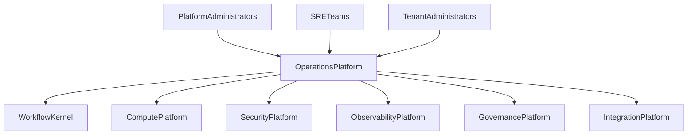
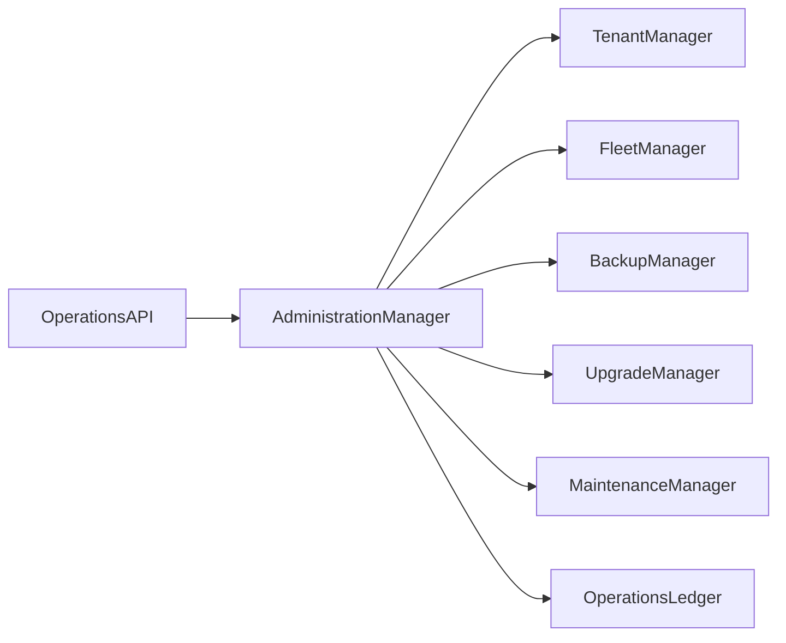

# Enterprise AI Software Factory
# Architecture Design Specification (ADS)

> **Document ID:** ADS-031-v1
>
> **Document Name:** Operations & Platform Administration — Architecture
>
> **Version:** 2.0.0
>
> **Classification:** Enterprise Platform Plane
>
> **Importance:** CRITICAL
>
> **Depends On:** ADS-021-v5
>
> **Depends On:** ADS-022-v5
>
> **Depends On:** ADS-023-v5
>
> **Depends On:** ADS-024-v5
>
> **Depends On:** ADS-025-v5
>
> **Depends On:** ADS-026-v5
>
> **Depends On:** ADS-027-v5
>
> **Depends On:** ADS-028-v5
>
> **Depends On:** ADS-029-v5
>
> **Depends On:** ADS-030-v5
>
> **Next:** ADS-031-v2 — Operations Algorithms & Administration Framework

---

# Executive Summary

The Operations & Platform Administration Platform provides centralized enterprise operations, tenant administration, lifecycle management, SRE workflows, backup orchestration, disaster recovery coordination, upgrade management, capacity planning, and operational governance.

It serves as the operational control plane responsible for keeping the Enterprise AI Software Factory healthy, resilient, and continuously available.

---

# Why This System Exists

Enterprise platforms require more than runtime execution.

Organizations must continuously

- Operate infrastructure
- Manage tenants
- Upgrade services
- Restore failures
- Perform backups
- Plan capacity
- Coordinate maintenance
- Manage platform lifecycle
- Administer organizations
- Maintain operational readiness

The Operations Platform standardizes these responsibilities.

---

# Core Philosophy

Operate Reliably.

Automate Everything.

Recover Quickly.

Administer Centrally.

---

# Design Goals

The platform provides

- Tenant Administration
- Platform Administration
- Fleet Management
- Backup Orchestration
- Disaster Recovery Coordination
- Upgrade Management
- Maintenance Scheduling
- Capacity Planning
- Operational Automation
- Administrative Portal

---

# Architectural Position

Every operational activity flows through the Operations Platform.

---

# High-Level Architecture

Administration Manager coordinates all platform operations.

---

# Major Components

| Component | Responsibility |
|------------|----------------|
| Operations API | Administrative interface |
| Administration Manager | Operational coordination |
| Tenant Manager | Tenant lifecycle |
| Fleet Manager | Service fleet management |
| Backup Manager | Backup orchestration |
| Upgrade Manager | Platform upgrades |
| Maintenance Manager | Maintenance windows |
| Operations Ledger | Immutable operations history |

---

# Operational Domains

| Domain | Purpose |
|---------|---------|
| Tenant Administration | Organizations & tenants |
| Fleet Management | Runtime services |
| Backup | Data protection |
| Disaster Recovery | Recovery orchestration |
| Maintenance | Planned operations |
| Upgrades | Version lifecycle |
| Capacity | Resource planning |
| Administration | Enterprise operations |

Each domain operates independently while sharing common governance and observability.

---

# Operational Principles

The Operations Platform follows

- Automation First
- Immutable Operations
- Zero Trust Administration
- Continuous Health Validation
- Deterministic Recovery
- Versioned Infrastructure
- Observable Operations

---

# Administration Boundaries

Every administrative action passes through

- Identity Verification
- Security Validation
- Governance Approval
- Observability
- Immutable Audit

No privileged action bypasses operational governance.

---

# Architecture Decision Records

## ADR-031-01

### Decision

Centralize enterprise operations into a dedicated Operations Platform.

### Status

Accepted

### Reason

Centralized operations improve reliability, governance, automation, and enterprise scalability.

---

## ADR-031-02

### Decision

Represent operational activities as immutable platform artifacts.

### Status

Accepted

### Reason

Artifact-centric operations improve replayability, auditing, disaster recovery, and operational consistency.

---

# Operational Readiness Scorecard

| Capability | Status |
|------------|--------|
| Tenant Administration | ✅ Required |
| Fleet Management | ✅ Required |
| Backup Orchestration | ✅ Required |
| Disaster Recovery | ✅ Required |
| Upgrade Management | ✅ Required |
| Maintenance Scheduling | ✅ Required |
| Operations Ledger | ✅ Required |
| Operational Automation | ✅ Required |

---

# Version Roadmap

| Version | Description |
|----------|-------------|
| v1 | Architecture |
| v2 | Operations Algorithms & Administration Framework |
| v3 | APIs, Events & Contracts |
| v4 | Runtime & Operations Infrastructure |
| v5 | End-to-End Operations Lifecycle |

---

# Related Documents

ADS-021-v5 — Workflow Kernel

ADS-022-v5 — Identity & Trust Plane

ADS-023-v5 — Enterprise Memory Plane

ADS-024-v5 — Agent Execution Platform

ADS-025-v5 — Compute & Infrastructure Platform

ADS-026-v5 — Security Platform

ADS-027-v5 — Observability Platform

ADS-028-v5 — Governance Platform

ADS-029-v5 — Developer Experience Platform

ADS-030-v5 — Integration & Ecosystem Platform

---

# Next Document

**ADS-031-v2 — Operations Algorithms & Administration Framework**

Defines tenant lifecycle algorithms, fleet orchestration, backup strategies, maintenance scheduling, upgrade workflows, disaster recovery procedures, and enterprise operational automation.

---

# End of Document
