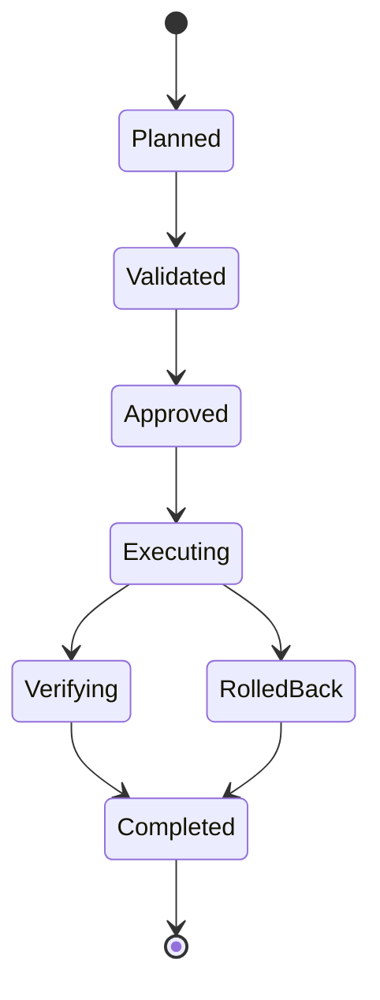

# Enterprise AI Software Factory
# Architecture Design Specification (ADS)

> **Document ID:** ADS-031-v2
>
> **Document Name:** Operations & Platform Administration — Operations Algorithms & Administration Framework
>
> **Version:** 2.0.0
>
> **Classification:** Enterprise Platform Plane
>
> **Importance:** CRITICAL
>
> **Depends On:** ADS-031-v1
>
> **Next:** ADS-031-v3 — APIs, Events & Contracts

---

# Executive Summary

This document defines the algorithms responsible for tenant lifecycle management, operational planning, fleet coordination, backup orchestration, maintenance scheduling, upgrade execution, disaster recovery planning, and operational governance.

Every administrative operation is deterministic.

Every operational activity is observable.

Every administrative action is governed.

---

# Design Philosophy

The Operations Platform follows six principles.

- Automation First
- Plan Before Execute
- Immutable Operations
- Continuous Validation
- Recover by Design
- Observe Everything

Operations remain reproducible.

---

# Operations Lifecycle

```text
Operation Planning

↓

Context Creation

↓

Validation

↓

Approval

↓

Execution

↓

Observation

↓

Verification

↓

Archival
```

Every administrative operation follows this lifecycle.

---

# Operations Context

Every administrative activity begins with an immutable Operations Context.

```yaml
operationsContext:

  contextId:

  operationType:

  organization:

  tenant:

  targetResources:

  maintenanceWindow:

  approvalReference:

  operator:

  executionPlan:

  rollbackPlan:

  createdAt:
```

Operations Contexts remain immutable.

---

# ALG-031-001

## Tenant Lifecycle

Tenant lifecycle stages

- Provisioning
- Activation
- Suspension
- Upgrade
- Migration
- Decommission

Every transition is audited.

---

# ALG-031-002

## Fleet Coordination

Fleet Manager coordinates

- Compute Nodes
- Agent Runtimes
- Workflow Services
- Connectors
- Platform Services

Coordination remains deterministic.

---

# ALG-031-003

## Backup Orchestration

Backup Manager schedules

- Configuration Backups
- Metadata Backups
- Workflow Snapshots
- Platform State
- Operational Records

Backups remain versioned.

---

# Backup Policies

| Policy | Purpose |
|---------|----------|
| Full | Complete platform backup |
| Incremental | Changed data only |
| Differential | Since last full backup |
| Snapshot | Point-in-time recovery |
| Continuous | Streaming protection |

Policies remain configurable.

---

# ALG-031-004

## Upgrade Planning

Upgrade Manager validates

- Version Compatibility
- Dependency Graph
- Security Requirements
- Maintenance Window
- Rollback Plan

Upgrades are planned before execution.

---

# Operational Domains

| Domain | Responsibility |
|---------|----------------|
| Tenant Management | Tenant lifecycle |
| Fleet Management | Platform services |
| Backup | Data protection |
| Upgrades | Version management |
| Maintenance | Planned downtime |
| Recovery | Disaster response |

Each domain operates independently.

---

# ALG-031-005

## Maintenance Scheduling

Maintenance Manager coordinates

- Planned Maintenance
- Emergency Maintenance
- Rolling Maintenance
- Zero-Downtime Maintenance

Maintenance remains policy-driven.

---

# End of Part 1

---

# ALG-031-006

## Disaster Recovery Planning

Disaster Recovery Manager coordinates

- Failure Assessment
- Recovery Planning
- Backup Selection
- Recovery Execution
- Validation
- Service Restoration

Recovery plans remain version-controlled.

---

# ALG-031-007

## Capacity Planning

Capacity Planning evaluates

- Compute Utilization
- Storage Growth
- Memory Consumption
- Network Throughput
- Workflow Volume
- Tenant Growth

Capacity planning remains predictive.

---

# ALG-031-008

## Operational Automation

Automation coordinates

- Scheduled Jobs
- Health Validation
- Backup Execution
- Upgrade Pipelines
- Maintenance Workflows
- Recovery Drills

Automation remains policy-driven.

---

# Operation Record

Every completed administrative action creates an immutable Operation Record.

```yaml
operationRecord:

  operationId:

  operationsContext:

  operationType:

  targetResources:

  executionStatus:

  startedAt:

  completedAt:

  executedBy:

  affectedArtifacts:

  rollbackExecuted:

  outcome:
```

Operation Records remain immutable.

---

# Disaster Recovery Levels

| Level | Purpose |
|--------|----------|
| Local Recovery | Single component restoration |
| Service Recovery | Platform service recovery |
| Regional Recovery | Regional failover |
| Multi-Region Recovery | Geographic continuity |
| Enterprise Recovery | Full platform restoration |

Recovery strategies remain configurable.

---

# Maintenance Types

Supported maintenance

| Type | Purpose |
|------|----------|
| Planned | Scheduled updates |
| Emergency | Critical fixes |
| Rolling | Zero or minimal downtime |
| Blue/Green | Environment switching |
| Canary | Progressive rollout |

Maintenance policies remain version-controlled.

---

# Operations State Machine



Every administrative operation follows this lifecycle.

---

# Automation Categories

| Category | Purpose |
|----------|----------|
| Backup Automation | Scheduled protection |
| Upgrade Automation | Controlled version rollout |
| Recovery Automation | Disaster response |
| Maintenance Automation | Operational tasks |
| Health Automation | Continuous validation |
| Capacity Automation | Resource optimization |

Automation remains observable.

---

# Operations Metrics

```text
operations_total

tenant_provisioning_total

fleet_operations_total

backup_jobs_total

upgrade_operations_total

maintenance_windows_total

recovery_operations_total

automation_executions_total

capacity_forecasts_total

operations_latency_seconds
```

---

# Structured Logging

Example

```json
{
  "operationId":"OP-214",
  "contextId":"OC-081",
  "operationType":"Upgrade",
  "target":"Workflow Cluster",
  "status":"Completed",
  "rollbackExecuted":false,
  "timestamp":"2026-10-12T03:42:15Z"
}
```

Logs remain immutable and correlated.

---

# Architecture Decision Records

## ADR-031-03

### Decision

Represent every executed administrative action as an Operation Record.

### Status

Accepted

### Reason

Operation Records separate planning from execution while improving auditability, replayability, and post-incident analysis.

---

## ADR-031-04

### Decision

Standardize operational lifecycle management.

### Status

Accepted

### Reason

A common lifecycle improves automation, governance, and operational consistency.

---

## ADR-031-05

### Decision

Automate routine operational activities.

### Status

Accepted

### Reason

Automation reduces operational risk, improves reliability, and increases platform availability.

---

# Operational Readiness Scorecard

| Capability | Status |
|------------|--------|
| Operations Context | ✅ Required |
| Operation Records | ✅ Required |
| Fleet Coordination | ✅ Required |
| Backup Orchestration | ✅ Required |
| Disaster Recovery | ✅ Required |
| Capacity Planning | ✅ Required |
| Operational Automation | ✅ Required |
| Maintenance Scheduling | ✅ Required |

---

# Related Documents

ADS-021-v5 — Workflow Kernel

ADS-022-v5 — Identity & Trust Plane

ADS-023-v5 — Enterprise Memory Plane

ADS-024-v5 — Agent Execution Platform

ADS-025-v5 — Compute & Infrastructure Platform

ADS-026-v5 — Security Platform

ADS-027-v5 — Observability Platform

ADS-028-v5 — Governance Platform

ADS-029-v5 — Developer Experience Platform

ADS-030-v5 — Integration & Ecosystem Platform

ADS-031-v1 — Operations & Platform Administration

ADS-031-v3 — APIs, Events & Contracts

---

# End of Document