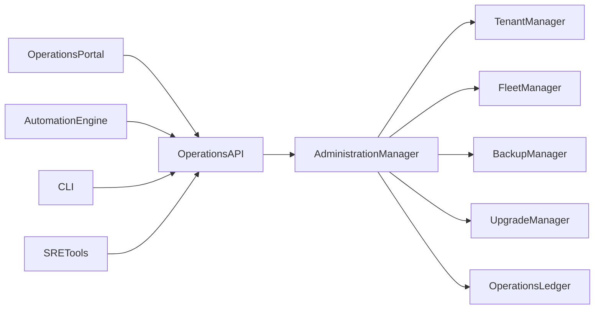
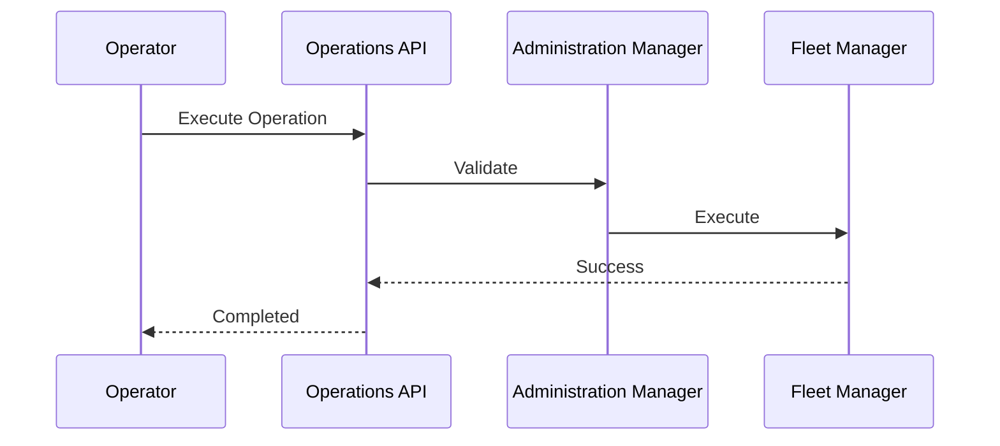

# Enterprise AI Software Factory
# Architecture Design Specification (ADS)

> **Document ID:** ADS-031-v3
>
> **Document Name:** Operations & Platform Administration — APIs, Events & Contracts
>
> **Version:** 2.0.0
>
> **Classification:** Enterprise Platform Plane
>
> **Importance:** CRITICAL
>
> **Depends On:** ADS-031-v1
>
> **Depends On:** ADS-031-v2
>
> **Next:** ADS-031-v4 — Runtime & Operations Infrastructure

---

# Executive Summary

The Operations Platform exposes standardized APIs for tenant administration, fleet coordination, backup orchestration, disaster recovery, maintenance scheduling, operational automation, upgrade management, and enterprise administration.

Every operational activity occurs through these contracts.

Operational implementations may evolve.

Operational contracts remain stable.

---

# Communication Principles

Every operational request MUST satisfy

- Authenticated
- Authorized
- Versioned
- Observable
- Auditable
- Replayable
- Governed
- Tenant Isolated

No administrative action bypasses the Operations Platform.

---

# Operations Communication Architecture



Administration Manager coordinates every operational activity.

---

# Public REST API

The Operations Platform exposes APIs for

- Operations Portal
- Enterprise CLI
- Automation Systems
- SRE Tooling
- Administrative Dashboard
- Disaster Recovery Services

---

## API-031-001

### Create Operations Context

```http
POST /operations/v1/contexts
```

Purpose

Creates an immutable Operations Context.

---

Request

```json
{
  "operationType":"Upgrade",
  "organization":"Acme",
  "targetResources":[
    "workflow-cluster"
  ]
}
```

---

Response

```json
{
  "contextId":"OC-081",
  "status":"Created"
}
```

---

## API-031-002

### Execute Operation

```http
POST /operations/v1/operations
```

Executes an approved administrative operation.

---

## API-031-003

### Schedule Maintenance

```http
POST /operations/v1/maintenance
```

Schedules a maintenance window.

---

## API-031-004

### Start Backup

```http
POST /operations/v1/backups
```

Initiates a managed backup operation.

---

## API-031-005

### Execute Recovery

```http
POST /operations/v1/recovery
```

Executes a Recovery Plan.

---

# Internal gRPC Services

```protobuf
service OperationsService {

rpc CreateOperationsContext(ContextRequest)
returns(ContextResponse);

rpc ExecuteOperation(OperationRequest)
returns(OperationResponse);

rpc ScheduleMaintenance(MaintenanceRequest)
returns(MaintenanceResponse);

rpc StartBackup(BackupRequest)
returns(BackupResponse);

rpc ExecuteRecovery(RecoveryRequest)
returns(RecoveryResponse);

}
```

---

# Operations Context Schema

```protobuf
message OperationsContext {

string context_id = 1;

string operation_type = 2;

string organization = 3;

string tenant = 4;

string maintenance_window = 5;

string operator = 6;

}
```

---

# Operation Record Schema

```protobuf
message OperationRecord {

string operation_id = 1;

string context_id = 2;

string operation_type = 3;

string execution_status = 4;

bool rollback_executed = 5;

}
```

---

# Recovery Plan Schema

```protobuf
message RecoveryPlan {

string recovery_plan_id = 1;

string context_id = 2;

string recovery_strategy = 3;

string rollback_procedure = 4;

string version = 5;

}
```

---

# MCP Tool Contracts

The Operations Platform exposes

```
create_operations_context

execute_operation

schedule_maintenance

start_backup

execute_recovery

operations_status

fleet_health

operations_diagnostics
```

Every invocation is authenticated and audited.

---

# Operations Events

Every operational activity emits immutable events.

---

## EVT-031-001

OperationsContextCreated

---

## EVT-031-002

OperationStarted

---

## EVT-031-003

OperationCompleted

---

## EVT-031-004

MaintenanceScheduled

---

## EVT-031-005

BackupStarted

---

## EVT-031-006

RecoveryExecuted

---

## EVT-031-007

FleetUpdated

---

## EVT-031-008

UpgradeCompleted

---

# Event Flow



---

# Event Ordering

```text
OperationsContextCreated

↓

OperationValidated

↓

OperationApproved

↓

OperationStarted

↓

OperationCompleted

↓

OperationArchived
```

---

# Event Metadata

Every event contains

```yaml
eventId:
contextId:
operationId:
recoveryPlanId:
traceId:
timestamp:
schemaVersion:
```

---

# End of Part 1
