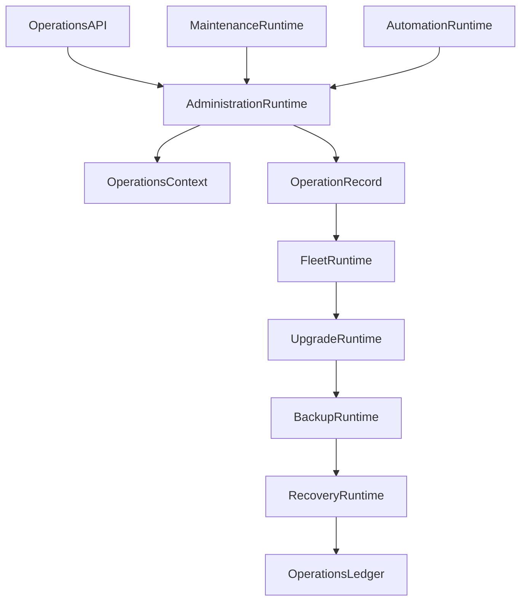
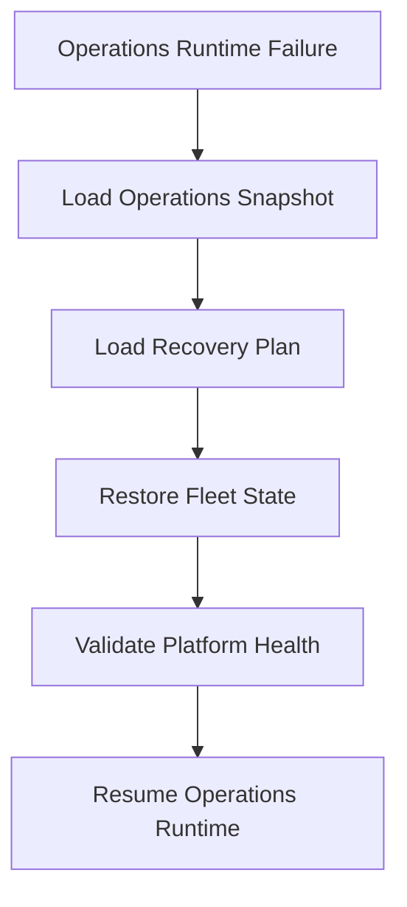

# Enterprise AI Software Factory
# Architecture Design Specification (ADS)

> **Document ID:** ADS-031-v4
>
> **Document Name:** Operations & Platform Administration — Runtime & Operations Infrastructure
>
> **Version:** 2.0.0
>
> **Classification:** Enterprise Runtime Specification
>
> **Importance:** CRITICAL
>
> **Depends On:** ADS-031-v1
>
> **Depends On:** ADS-031-v2
>
> **Depends On:** ADS-031-v3
>
> **Next:** ADS-031-v5 — End-to-End Operations Lifecycle

---

# Executive Summary

This document defines the runtime infrastructure responsible for continuously operating the Enterprise AI Software Factory.

The runtime manages administrative operations, tenant lifecycle, fleet coordination, backups, upgrades, disaster recovery, maintenance execution, and operational automation while maintaining continuous platform availability.

Operations Runtime acts as the enterprise operational kernel.

---

# Runtime Philosophy

The Operations Runtime follows seven principles.

- Automation First
- Continuous Validation
- Deterministic Recovery
- Zero Trust Administration
- Immutable Operations
- Observable Operations
- Continuous Availability

Operations never bypass governance.

---

# Runtime Layers

## Administration Runtime

Responsible for

- Administrative Operations
- Approval Coordination
- Execution Scheduling
- Operational Validation

---

## Fleet Runtime

Responsible for

- Fleet Coordination
- Service Placement
- Health Monitoring
- Scaling Coordination

---

## Backup Runtime

Responsible for

- Backup Scheduling
- Snapshot Management
- Retention Policies
- Restore Validation

---

## Upgrade Runtime

Responsible for

- Version Rollout
- Compatibility Validation
- Progressive Deployment
- Rollback Coordination

---

## Recovery Runtime

Responsible for

- Recovery Execution
- Failover Coordination
- Restoration Validation
- Recovery Monitoring

---

# Runtime Architecture



Operations Runtime coordinates all enterprise administrative activities.

---

# Runtime Components

| Component | Responsibility |
|------------|----------------|
| Administration Runtime | Administrative orchestration |
| Fleet Runtime | Platform fleet management |
| Backup Runtime | Data protection |
| Upgrade Runtime | Version lifecycle |
| Recovery Runtime | Disaster recovery |
| Maintenance Runtime | Maintenance execution |
| Automation Runtime | Operational automation |
| Operations Ledger | Immutable operational history |

---

# Runtime Pipeline

```text
Operations Context

↓

Validation

↓

Approval

↓

Operation Execution

↓

Verification

↓

Recovery (if required)

↓

Operations Ledger
```

Every administrative action follows this lifecycle.

---

# Administration Runtime

Administration Runtime manages

- Operations Contexts
- Execution Scheduling
- Approval Validation
- Resource Coordination
- Rollback Preparation

Administrative execution remains deterministic.

---

# Fleet Runtime

Fleet Runtime coordinates

- Platform Services
- Runtime Nodes
- Cluster Health
- Scaling Operations
- Resource Allocation

Fleet operations remain policy-driven.

---

# Operations Session Management

Every runtime operation tracks

- Operations Context
- Target Resources
- Operator
- Current Stage
- Rollback State
- Health Status

Operations remain isolated and auditable.

---

# Runtime Guarantees

The Operations Runtime guarantees

- Deterministic Administration
- Fleet Consistency
- Version Integrity
- Continuous Availability
- Safe Rollback
- Immutable Operations History
- Policy Enforcement

---

# End of Part 1

---

# Failure Recovery

The Operations Runtime automatically recovers from administrative failures while preserving operational integrity.

Recovery follows approved Recovery Plans.



Recovery guarantees

- No operational corruption
- No administrative state loss
- Deterministic rollback
- Verified restoration

---

# Runtime Health Monitoring

Every runtime component continuously reports health.

Collected metrics

- Administration Runtime Health
- Fleet Runtime Health
- Backup Runtime Health
- Upgrade Runtime Health
- Recovery Runtime Health
- Maintenance Runtime Health
- Automation Runtime Health
- Operations Queue Depth

Health Flow

```text
Runtime Component

↓

Heartbeat

↓

Operations Runtime Monitor

↓

Integration Dashboard

↓

Alert Engine

↓

Operations Team
```

Health monitoring remains continuous.

---

# Operations Snapshot

The runtime periodically generates Operations Snapshots.

```yaml
operationsSnapshot:

  snapshotId:

  generatedAt:

  activeOperations:

  activeMaintenance:

  fleetHealth:

  backupStatus:

  upgradeStatus:

  recoveryStatus:

  automationStatus:

  platformHealth:

  operationalCapacity:
```

Operations Snapshots provide deterministic operational state.

---

# Runtime Configuration

Example

```yaml
operationsRuntime:

  automation: enabled

  backupValidation: continuous

  rollingUpgrades: enabled

  maintenanceScheduling: automatic

  recoveryAutomation: enabled

  operationsSnapshots: enabled

  healthValidation: continuous

  snapshotInterval: 10m
```

Configuration remains version-controlled.

---

# Fleet Scaling

Fleet Runtime supports

- Horizontal Expansion
- Controlled Scale Down
- Node Replacement
- Capacity Rebalancing
- Workload Redistribution

Scaling remains policy-driven.

---

# Runtime Isolation

Operations Runtime isolates

- Administrative Operations
- Fleet Operations
- Backup Jobs
- Upgrade Workflows
- Recovery Procedures
- Maintenance Activities

Isolation prevents operational interference.

---

# Prometheus Metrics

```text
operations_snapshots_total

active_operations_total

active_maintenance_windows_total

backup_execution_seconds

upgrade_execution_seconds

recovery_execution_seconds

fleet_reconciliation_total

automation_success_ratio

platform_capacity_utilization

operations_runtime_health_score
```

---

# OpenTelemetry

Distributed tracing spans

```text
Operations API

↓

Administration Runtime

↓

Fleet Runtime

↓

Upgrade Runtime

↓

Backup Runtime

↓

Recovery Runtime

↓

Operations Ledger
```

Every runtime stage contributes trace spans.

---

# Structured Logging

Example

```json
{
  "operationId":"OP-214",
  "operationsSnapshot":"OSNAP-009",
  "contextId":"OC-081",
  "operationType":"Upgrade",
  "runtimeHealth":"Healthy",
  "rollbackExecuted":false
}
```

Logs remain immutable and correlated.

---

# Disaster Recovery

Recovery flow

```text
Operations Runtime Failure

↓

Restore Operations Snapshot

↓

Load Recovery Plan

↓

Restore Fleet State

↓

Validate Platform Health

↓

Resume Operations Runtime
```

Recovery targets

Recovery Point Objective (RPO)

Near-zero operational state loss

Recovery Time Objective (RTO)

Less than five minutes

---

# Recommended Production Deployment

```text
Operations API

↓

Administration Runtime

↓

Fleet Runtime

↓

Backup Runtime

↓

Upgrade Runtime

↓

Recovery Runtime

↓

Maintenance Runtime

↓

Automation Runtime

↓

Operations Ledger

↓

OpenTelemetry

↓

Prometheus

↓

Grafana
```

---

# Technology Decision Records

## TDR-031-01

### Technology

GitOps

### Decision

Use GitOps for operational configuration and infrastructure reconciliation.

### Reason

Provides declarative, auditable, and reproducible operational changes.

---

## TDR-031-02

### Technology

Argo CD

### Decision

Use Argo CD for continuous deployment and operational synchronization.

### Reason

Supports automated reconciliation, rollback, and drift detection.

---

## TDR-031-03

### Technology

Velero

### Decision

Use Velero for Kubernetes-native backup and disaster recovery.

### Reason

Provides reliable backup, restore, and migration capabilities.

---

## TDR-031-04

### Technology

Operations Snapshot

### Decision

Persist periodic Operations Snapshots.

### Reason

Supports recovery, diagnostics, capacity planning, and operational reporting.

---

## TDR-031-05

### Technology

Recovery Automation

### Decision

Automate disaster recovery where policy permits.

### Reason

Reduces recovery time while maintaining governance and operational safety.

---

# Runtime Checklist

The Operations Platform MUST

- Generate Operations Snapshots
- Execute approved Recovery Plans
- Coordinate fleet operations
- Validate backups continuously
- Support deterministic rollback
- Preserve immutable Operations Records
- Continuously monitor runtime health

The Operations Platform MUST NOT

- Execute unapproved administrative actions
- Bypass governance policies
- Lose operational history
- Skip recovery validation
- Allow cross-operation interference

---

# Architecture Decision Records

## ADR-031-06

### Decision

Treat Operations Snapshots as immutable runtime artifacts.

### Status

Accepted

### Reason

Snapshots improve recovery, reporting, diagnostics, and operational continuity.

---

## ADR-031-07

### Decision

Separate operational planning from execution.

### Status

Accepted

### Reason

Operations Contexts define intent, while Operation Records capture actual execution.

---

## ADR-031-08

### Decision

Execute operational automation through policy-controlled runtimes.

### Status

Accepted

### Reason

Controlled automation improves reliability while maintaining governance and auditability.

---

# Operational Readiness Scorecard

| Capability | Status |
|------------|--------|
| Operations Runtime | ✅ Required |
| Operations Snapshots | ✅ Required |
| Fleet Runtime | ✅ Required |
| Recovery Runtime | ✅ Required |
| Runtime Recovery | ✅ Required |
| Operational Automation | ✅ Required |
| Continuous Validation | ✅ Required |
| Deterministic Rollback | ✅ Required |

---

# Related Documents

ADS-021-v5 — Workflow Kernel

ADS-022-v5 — Identity & Trust Plane

ADS-023-v5 — Enterprise Memory Plane

ADS-024-v5 — Agent Execution Platform

ADS-025-v5 — Compute & Infrastructure Platform

ADS-026-v5 — Security Platform

ADS-027-v5 — Observability Platform

ADS-028-v5 — Governance Platform

ADS-029-v5 — Developer Experience Platform

ADS-030-v5 — Integration & Ecosystem Platform

ADS-031-v1 — Operations & Platform Administration

ADS-031-v2 — Operations Algorithms & Administration Framework

ADS-031-v3 — APIs, Events & Contracts

ADS-031-v5 — End-to-End Operations Lifecycle

---

# End of Document