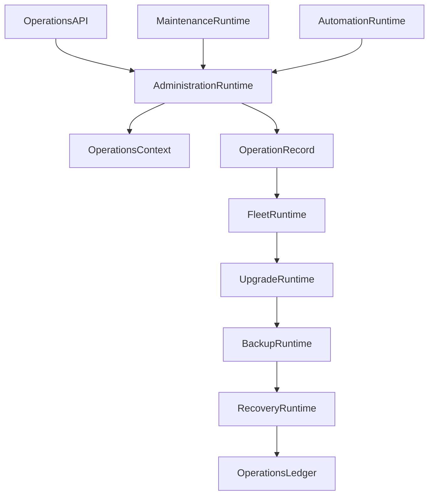

# Enterprise AI Software Factory
# Architecture Design Specification (ADS)

> **Document ID:** ADS-031-v4
>
> **Document Name:** Operations & Platform Administration — Runtime & Operations Infrastructure
>
> **Version:** 2.0.0
>
> **Classification:** Enterprise Runtime Specification
>
> **Importance:** CRITICAL
>
> **Depends On:** ADS-031-v1
>
> **Depends On:** ADS-031-v2
>
> **Depends On:** ADS-031-v3
>
> **Next:** ADS-031-v5 — End-to-End Operations Lifecycle

---

# Executive Summary

This document defines the runtime infrastructure responsible for continuously operating the Enterprise AI Software Factory.

The runtime manages administrative operations, tenant lifecycle, fleet coordination, backups, upgrades, disaster recovery, maintenance execution, and operational automation while maintaining continuous platform availability.

Operations Runtime acts as the enterprise operational kernel.

---

# Runtime Philosophy

The Operations Runtime follows seven principles.

- Automation First
- Continuous Validation
- Deterministic Recovery
- Zero Trust Administration
- Immutable Operations
- Observable Operations
- Continuous Availability

Operations never bypass governance.

---

# Runtime Layers

## Administration Runtime

Responsible for

- Administrative Operations
- Approval Coordination
- Execution Scheduling
- Operational Validation

---

## Fleet Runtime

Responsible for

- Fleet Coordination
- Service Placement
- Health Monitoring
- Scaling Coordination

---

## Backup Runtime

Responsible for

- Backup Scheduling
- Snapshot Management
- Retention Policies
- Restore Validation

---

## Upgrade Runtime

Responsible for

- Version Rollout
- Compatibility Validation
- Progressive Deployment
- Rollback Coordination

---

## Recovery Runtime

Responsible for

- Recovery Execution
- Failover Coordination
- Restoration Validation
- Recovery Monitoring

---

# Runtime Architecture



Operations Runtime coordinates all enterprise administrative activities.

---

# Runtime Components

| Component | Responsibility |
|------------|----------------|
| Administration Runtime | Administrative orchestration |
| Fleet Runtime | Platform fleet management |
| Backup Runtime | Data protection |
| Upgrade Runtime | Version lifecycle |
| Recovery Runtime | Disaster recovery |
| Maintenance Runtime | Maintenance execution |
| Automation Runtime | Operational automation |
| Operations Ledger | Immutable operational history |

---

# Runtime Pipeline

```text
Operations Context

↓

Validation

↓

Approval

↓

Operation Execution

↓

Verification

↓

Recovery (if required)

↓

Operations Ledger
```

Every administrative action follows this lifecycle.

---

# Administration Runtime

Administration Runtime manages

- Operations Contexts
- Execution Scheduling
- Approval Validation
- Resource Coordination
- Rollback Preparation

Administrative execution remains deterministic.

---

# Fleet Runtime

Fleet Runtime coordinates

- Platform Services
- Runtime Nodes
- Cluster Health
- Scaling Operations
- Resource Allocation

Fleet operations remain policy-driven.

---

# Operations Session Management

Every runtime operation tracks

- Operations Context
- Target Resources
- Operator
- Current Stage
- Rollback State
- Health Status

Operations remain isolated and auditable.

---

# Runtime Guarantees

The Operations Runtime guarantees

- Deterministic Administration
- Fleet Consistency
- Version Integrity
- Continuous Availability
- Safe Rollback
- Immutable Operations History
- Policy Enforcement

---

# End of Part 1
