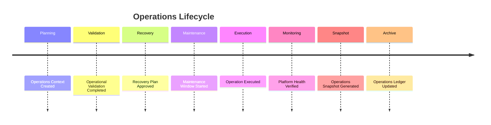

# Enterprise AI Software Factory
# Architecture Design Specification (ADS)

> **Document ID:** ADS-031-v5
>
> **Document Name:** Operations & Platform Administration — End-to-End Operations Lifecycle
>
> **Version:** 2.0.0
>
> **Classification:** Reference Implementation
>
> **Importance:** CRITICAL
>
> **Depends On:** ADS-031-v1
>
> **Depends On:** ADS-031-v2
>
> **Depends On:** ADS-031-v3
>
> **Depends On:** ADS-031-v4

---

# Executive Summary

This document demonstrates how the Operations & Platform Administration Platform manages a complete operational lifecycle—from planning and approval through execution, monitoring, recovery, and archival.

It illustrates how Operations Contexts, Operation Records, Recovery Plans, Maintenance Records, Operations Snapshots, and Operations Ledger Entries interact throughout real enterprise platform operations.

Every operation is deterministic.

Every administrative action is traceable.

Every recovery is reproducible.

---

# Scenario

The platform operations team performs a rolling upgrade of the production Workflow Platform while maintaining service availability.

Participating systems

- Operations Platform
- Workflow Kernel
- Compute Platform
- Security Platform
- Governance Platform
- Observability Platform

---

# Stage 1 — Operations Context

Generated

```
OC-2026-012
```

Contains

- Upgrade Type
- Target Resources
- Maintenance Window
- Execution Plan
- Rollback Plan
- Approval Reference

Operations Context becomes immutable.

---

# Stage 2 — Operational Validation

Platform validates

- Version Compatibility
- Dependency Graph
- Capacity Availability
- Security Policies
- Governance Approval

Validation succeeds.

---

# Stage 3 — Recovery Plan

Generated

```
RP-2026-004
```

Recovery strategy includes

- Automated Rollback
- Backup Restoration
- Cluster Validation
- Service Health Verification

Recovery Plan archived.

---

# Stage 4 — Maintenance Window

Scheduled

```
MW-2026-008
```

Window includes

- Rolling Upgrade
- Capacity Buffer
- Health Validation
- Notification Schedule

Maintenance begins.

---

# Stage 5 — Operation Execution

Generated

```
OP-2026-017
```

Operation performs

- Node Drain
- Version Upgrade
- Health Verification
- Traffic Rebalancing

Operation completes successfully.

---

# Stage 6 — Fleet Coordination

Fleet Runtime validates

- Cluster Health
- Service Distribution
- Resource Capacity
- Scaling Policies

Fleet remains healthy.

---

# Stage 7 — Backup Validation

Backup Runtime verifies

- Latest Snapshots
- Restore Integrity
- Backup Metadata
- Retention Policies

Backup validation succeeds.

---

# Stage 8 — Operations Snapshot

Generated

```
OSNAP-2026-006
```

Snapshot contains

- Active Operations
- Fleet Health
- Upgrade Status
- Platform Capacity
- Automation Status

Snapshot archived.

---

# Stage 9 — Runtime Monitoring

Operations Runtime continuously evaluates

- Fleet Health
- Upgrade Progress
- Capacity Utilization
- Recovery Readiness
- Automation Status

No operational anomalies detected.

---

# Stage 10 — Operations Ledger

Generated

```
OL-2026-021
```

Ledger Entry references

- Operations Context
- Operation Record
- Recovery Plan
- Maintenance Record
- Operations Snapshot

Entry becomes immutable.

---

# Stage 11 — Maintenance Closure

Maintenance window closes.

Platform verifies

- Service Availability
- Upgrade Success
- Operational Readiness
- Capacity Targets

Platform returns to normal operations.

---

# Stage 12 — Archive

Archived artifacts

- Operations Context
- Operation Record
- Recovery Plan
- Maintenance Record
- Operations Snapshot
- Operations Ledger Entry

Integration history remains replayable.

---

# Operations Timeline



---

# Operations Event Stream

```text
OperationsContextCreated

↓

OperationValidated

↓

RecoveryPlanApproved

↓

MaintenanceStarted

↓

OperationExecuted

↓

FleetValidated

↓

BackupValidated

↓

OperationsSnapshotCreated

↓

OperationsLedgerWritten

↓

MaintenanceClosed
```

---

# Produced Artifacts

| Artifact | Identifier |
|-----------|------------|
| Operations Context | OC-2026-012 |
| Operation Record | OP-2026-017 |
| Recovery Plan | RP-2026-004 |
| Maintenance Record | MR-2026-008 |
| Operations Snapshot | OSNAP-2026-006 |
| Operations Ledger Entry | OL-2026-021 |

---

# Runtime Metrics

| Metric | Value |
|---------|------:|
| Active Tenants | 528 |
| Fleet Nodes | 1,742 |
| Upgrade Success Rate | 99.8% |
| Backup Success Rate | 100% |
| Recovery Drills Completed | 52 |
| Average Recovery Time | 3.8 min |
| Maintenance Windows | 214 |
| Platform Availability | 99.99% |

---

# Operational Readiness Scorecard

| Capability | Status |
|------------|--------|
| Operations Context | ✅ Verified |
| Operation Records | ✅ Verified |
| Recovery Plans | ✅ Verified |
| Maintenance Records | ✅ Verified |
| Operations Snapshots | ✅ Verified |
| Operations Ledger | ✅ Verified |
| Deterministic Recovery | ✅ Verified |
| Continuous Operations | ✅ Verified |

---

# Lessons Learned

The Operations Platform demonstrates the following principles.

- Operations Contexts define deterministic operational intent.
- Operation Records capture actual administrative execution.
- Recovery Plans ensure deterministic restoration strategies.
- Maintenance Records preserve evidence of operational activities.
- Operations Snapshots provide point-in-time operational visibility.
- Operations Ledger Entries create an immutable operational history.
- Automation and governance together improve operational reliability and resilience.

---

# Architecture Decision Record

## ADR-031-09

### Decision

Represent enterprise operations as a deterministic lifecycle composed of immutable operational artifacts.

### Status

Accepted

### Reason

Artifact-centric operations improve automation, governance, resilience, auditability, and enterprise-scale operational consistency.

---

# Technology Decision Record

## TDR-031-06

### Technology

Enterprise Operations Platform

### Decision

Implement a centralized Operations & Platform Administration Platform responsible for tenant administration, fleet coordination, backup orchestration, disaster recovery, maintenance management, upgrade execution, and immutable operational history.

### Reason

A unified Operations Platform ensures reliable, observable, governed, and automated enterprise operations across every platform plane while preserving deterministic execution and recovery.

---

# Related Documents

ADS-021-v5 — Workflow Kernel

ADS-022-v5 — Identity & Trust Plane

ADS-023-v5 — Enterprise Memory Plane

ADS-024-v5 — Agent Execution Platform

ADS-025-v5 — Compute & Infrastructure Platform

ADS-026-v5 — Security Platform

ADS-027-v5 — Observability Platform

ADS-028-v5 — Governance Platform

ADS-029-v5 — Developer Experience Platform

ADS-030-v5 — Integration & Ecosystem Platform

ADS-031-v1 — Operations & Platform Administration

ADS-031-v2 — Operations Algorithms & Administration Framework

ADS-031-v3 — APIs, Events & Contracts

ADS-031-v4 — Runtime & Operations Infrastructure

---

# End of Document
