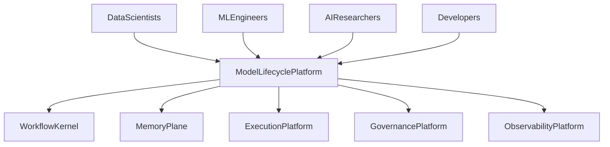
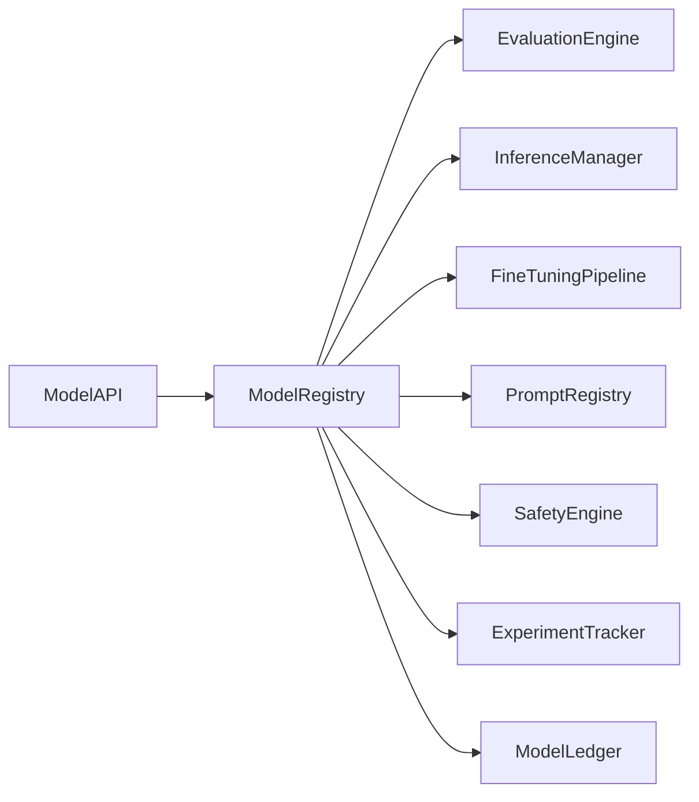

# Enterprise AI Software Factory
# Architecture Design Specification (ADS)

> **Document ID:** ADS-032-v1
>
> **Document Name:** AI/ML & Model Lifecycle Platform — Architecture
>
> **Version:** 2.0.0
>
> **Classification:** Enterprise Platform Plane
>
> **Importance:** CRITICAL
>
> **Depends On:** ADS-021-v5
>
> **Depends On:** ADS-022-v5
>
> **Depends On:** ADS-023-v5
>
> **Depends On:** ADS-024-v5
>
> **Depends On:** ADS-025-v5
>
> **Depends On:** ADS-026-v5
>
> **Depends On:** ADS-027-v5
>
> **Depends On:** ADS-028-v5
>
> **Depends On:** ADS-029-v5
>
> **Depends On:** ADS-030-v5
>
> **Depends On:** ADS-031-v5
>
> **Next:** ADS-032-v2 — Model Lifecycle Algorithms & MLOps Framework

---

# Executive Summary

The AI/ML & Model Lifecycle Platform provides centralized management for foundation models, fine-tuned models, embedding models, prompt assets, evaluation pipelines, inference deployments, safety validation, model governance, and continuous improvement.

The platform enables deterministic, governed, observable, and reproducible AI model operations across the Enterprise AI Software Factory.

Models become first-class enterprise assets.

---

# Why This System Exists

Modern enterprise AI systems require more than model inference.

Organizations must continuously

- Register Models
- Evaluate Models
- Deploy Models
- Monitor Models
- Fine-Tune Models
- Govern Models
- Compare Models
- Roll Back Models
- Retire Models
- Audit Model Decisions

The Model Lifecycle Platform standardizes these responsibilities.

---

# Core Philosophy

Evaluate Before Deploy.

Govern Every Model.

Monitor Continuously.

Improve Iteratively.

---

# Design Goals

The platform provides

- Model Registry
- Prompt Registry
- Evaluation Framework
- Inference Management
- Fine-Tuning Pipelines
- Safety Validation
- Model Governance
- Drift Detection
- Experiment Tracking
- Model Marketplace

---

# Architectural Position

Every enterprise model passes through the Model Lifecycle Platform.

---

# High-Level Architecture

The Model Registry coordinates the complete model lifecycle.

---

# Major Components

| Component | Responsibility |
|------------|----------------|
| Model API | Public model interface |
| Model Registry | Model lifecycle |
| Prompt Registry | Prompt assets |
| Evaluation Engine | Quality validation |
| Inference Manager | Model deployment |
| Fine-Tuning Pipeline | Model training |
| Safety Engine | Safety evaluation |
| Experiment Tracker | Experiment history |
| Model Ledger | Immutable model history |

---

# Model Domains

| Domain | Purpose |
|---------|---------|
| Foundation Models | Base LLMs |
| Fine-Tuned Models | Domain-specific models |
| Embedding Models | Retrieval & semantic search |
| Prompt Assets | Prompt engineering |
| Evaluations | Benchmarks & testing |
| Safety | Guardrails & validation |
| Experiments | Training & comparisons |
| Inference | Runtime serving |

Every domain follows a governed lifecycle.

---

# Model Principles

The platform follows

- Registry First
- Evaluation Before Deployment
- Continuous Monitoring
- Reproducible Training
- Immutable Lineage
- Explainable AI
- Policy-Driven Governance

---

# Model Boundaries

Every model operation passes through

- Identity Verification
- Security Validation
- Governance Approval
- Evaluation Framework
- Observability
- Immutable Audit

No model bypasses lifecycle governance.

---

# Architecture Decision Records

## ADR-032-01

### Decision

Centralize all enterprise AI assets into a dedicated Model Lifecycle Platform.

### Status

Accepted

### Reason

Centralized lifecycle management improves governance, reproducibility, observability, and operational consistency.

---

## ADR-032-02

### Decision

Represent models and prompts as immutable enterprise artifacts.

### Status

Accepted

### Reason

Artifact-centric AI improves lineage, auditing, reproducibility, rollback, and enterprise governance.

---

# Operational Readiness Scorecard

| Capability | Status |
|------------|--------|
| Model Registry | ✅ Required |
| Prompt Registry | ✅ Required |
| Evaluation Framework | ✅ Required |
| Fine-Tuning | ✅ Required |
| Safety Validation | ✅ Required |
| Experiment Tracking | ✅ Required |
| Model Governance | ✅ Required |
| Model Ledger | ✅ Required |

---

# Version Roadmap

| Version | Description |
|----------|-------------|
| v1 | Architecture |
| v2 | Model Lifecycle Algorithms & MLOps Framework |
| v3 | APIs, Events & Contracts |
| v4 | Runtime & Model Infrastructure |
| v5 | End-to-End Model Lifecycle |

---

# Related Documents

ADS-021-v5 — Workflow Kernel

ADS-022-v5 — Identity & Trust Plane

ADS-023-v5 — Enterprise Memory Plane

ADS-024-v5 — Agent Execution Platform

ADS-025-v5 — Compute & Infrastructure Platform

ADS-026-v5 — Security Platform

ADS-027-v5 — Observability Platform

ADS-028-v5 — Governance Platform

ADS-029-v5 — Developer Experience Platform

ADS-030-v5 — Integration & Ecosystem Platform

ADS-031-v5 — Operations & Platform Administration

---

# Next Document

**ADS-032-v2 — Model Lifecycle Algorithms & MLOps Framework**

Defines model registration, evaluation pipelines, prompt lifecycle management, fine-tuning workflows, inference promotion, model versioning, drift detection, experiment tracking, and retirement strategies.

---

# End of Document
