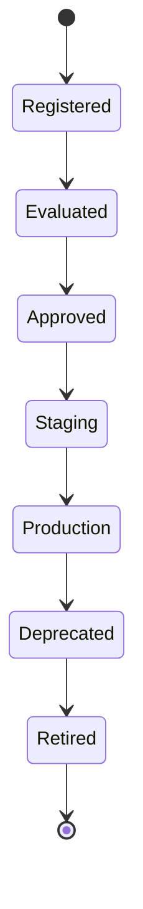

# Enterprise AI Software Factory
# Architecture Design Specification (ADS)

> **Document ID:** ADS-032-v2
>
> **Document Name:** AI/ML & Model Lifecycle Platform — Model Lifecycle Algorithms & MLOps Framework
>
> **Version:** 2.0.0
>
> **Classification:** Enterprise Platform Plane
>
> **Importance:** CRITICAL
>
> **Depends On:** ADS-032-v1
>
> **Next:** ADS-032-v3 — APIs, Events & Contracts

---

# Executive Summary

This document defines the algorithms responsible for model registration, prompt lifecycle management, evaluation pipelines, experiment tracking, fine-tuning workflows, inference promotion, drift detection, model governance, and retirement.

Every model is versioned.

Every deployment is evaluated.

Every model decision is governed.

---

# Design Philosophy

The Model Lifecycle Platform follows six principles.

- Registry First
- Evaluate Before Deploy
- Continuous Validation
- Immutable Lineage
- Safe Deployment
- Continuous Improvement

Models remain deterministic and reproducible.

---

# Model Lifecycle

```text
Registration

↓

Evaluation

↓

Experimentation

↓

Fine-Tuning

↓

Validation

↓

Deployment

↓

Monitoring

↓

Retirement
```

Every model follows this lifecycle.

---

# Model Card

Every enterprise model begins with an immutable Model Card.

```yaml
modelCard:

  modelId:

  modelName:

  modelType:

  provider:

  architecture:

  trainingData:

  intendedUse:

  limitations:

  safetyProfile:

  evaluationResults:

  deploymentStatus:

  lineage:

  version:

  registeredAt:
```

Model Cards remain immutable.

---

# ALG-032-001

## Model Registration

Model registration validates

- Model Identity
- Provider
- Architecture
- Version
- Licensing
- Governance Profile
- Security Classification

Registration creates a Model Record.

---

# ALG-032-002

## Prompt Registration

Prompt Registry validates

- Prompt Identity
- Version
- Supported Models
- Safety Constraints
- Usage Policies

Prompts remain versioned independently.

---

# ALG-032-003

## Evaluation Pipeline

Evaluation validates

- Accuracy
- Latency
- Cost
- Hallucination Rate
- Safety
- Toxicity
- Bias
- Robustness

Only validated models advance.

---

# Evaluation Categories

| Category | Purpose |
|----------|----------|
| Functional | Task correctness |
| Performance | Speed & throughput |
| Safety | Harm prevention |
| Robustness | Adversarial resilience |
| Fairness | Bias evaluation |
| Cost | Resource efficiency |
| Compliance | Regulatory validation |

Evaluation remains reproducible.

---

# ALG-032-004

## Experiment Tracking

Experiment Tracker records

- Dataset
- Hyperparameters
- Prompt Version
- Model Version
- Metrics
- Artifacts

Every experiment becomes reproducible.

---

# Model Types

| Type | Purpose |
|------|----------|
| Foundation | Base LLMs |
| Fine-Tuned | Domain specialization |
| Embedding | Vector generation |
| Reranker | Retrieval optimization |
| Classification | Prediction |
| Vision | Image understanding |
| Speech | Audio processing |
| Multimodal | Mixed modalities |

Model categories remain extensible.

---

# ALG-032-005

## Fine-Tuning Workflow

Fine-Tuning validates

- Training Dataset
- Hyperparameters
- Evaluation Dataset
- Safety Policies
- Governance Approval

Fine-tuning precedes deployment.

---

# End of Part 1

# ALG-032-006

## Model Promotion

Models advance through controlled promotion stages.

Promotion validates

- Evaluation Results
- Safety Assessment
- Governance Approval
- Performance Thresholds
- Deployment Readiness

Promotion remains deterministic.

---

# ALG-032-007

## Drift Detection

Drift Detection continuously evaluates

- Prediction Drift
- Data Drift
- Concept Drift
- Embedding Drift
- Prompt Drift
- Latency Degradation

Detected drift creates operational alerts.

---

# ALG-032-008

## Model Retirement

Retirement validates

- Active Dependencies
- Replacement Availability
- Governance Approval
- Archive Strategy
- Rollback Capability

Retired models remain reproducible.

---

# Model Record

Every registered implementation creates a Model Record.

```yaml
modelRecord:

  modelRecordId:

  modelCard:

  artifactUri:

  runtimeProfile:

  supportedEndpoints:

  deploymentTargets:

  resourceRequirements:

  healthStatus:

  governanceStatus:

  version:

  registeredAt:
```

Model Records remain immutable.

---

# Deployment Stages

| Stage | Purpose |
|--------|----------|
| Registered | Registry only |
| Evaluated | Quality verified |
| Approved | Governance approved |
| Staging | Pre-production |
| Production | Live inference |
| Deprecated | Scheduled replacement |
| Retired | Archived |

Deployments remain policy-driven.

---

# Experiment Lifecycle

Supported stages

| Stage | Purpose |
|--------|----------|
| Planned | Experiment defined |
| Running | Training or evaluation |
| Completed | Results generated |
| Compared | Benchmark analysis |
| Promoted | Candidate selected |
| Archived | Historical record |

Experiments remain reproducible.

---

# Model State Machine



Every model follows this lifecycle.

---

# Drift Response

When drift exceeds policy thresholds

```text
Detect Drift

↓

Generate Alert

↓

Run Evaluation

↓

Recommend Fine-Tuning

↓

Governance Review

↓

Redeploy or Roll Back
```

Every response remains auditable.

---

# Model Metrics

```text
registered_models_total

active_models_total

evaluation_runs_total

fine_tuning_jobs_total

deployment_promotions_total

model_drift_events_total

experiment_runs_total

model_retirements_total

model_latency_seconds

model_health_score
```

---

# Structured Logging

Example

```json
{
  "modelId":"MODEL-204",
  "modelRecordId":"MR-051",
  "provider":"OpenAI",
  "deploymentStage":"Production",
  "health":"Healthy",
  "driftStatus":"Normal",
  "timestamp":"2026-11-08T15:22:11Z"
}
```

Logs remain immutable and correlated.

---

# Architecture Decision Records

## ADR-032-03

### Decision

Represent every deployable implementation as a Model Record.

### Status

Accepted

### Reason

Model Records separate deployable implementations from logical model descriptions while improving governance, deployment flexibility, and lifecycle management.

---

## ADR-032-04

### Decision

Standardize model promotion through staged environments.

### Status

Accepted

### Reason

Controlled promotion improves reliability, reproducibility, and deployment safety.

---

## ADR-032-05

### Decision

Continuously monitor deployed models for drift.

### Status

Accepted

### Reason

Continuous drift detection enables proactive retraining, rollback, and sustained model quality.

---

# Operational Readiness Scorecard

| Capability | Status |
|------------|--------|
| Model Cards | ✅ Required |
| Model Records | ✅ Required |
| Evaluation Pipelines | ✅ Required |
| Experiment Tracking | ✅ Required |
| Drift Detection | ✅ Required |
| Fine-Tuning | ✅ Required |
| Model Promotion | ✅ Required |
| Model Retirement | ✅ Required |

---

# Related Documents

ADS-021-v5 — Workflow Kernel

ADS-022-v5 — Identity & Trust Plane

ADS-023-v5 — Enterprise Memory Plane

ADS-024-v5 — Agent Execution Platform

ADS-025-v5 — Compute & Infrastructure Platform

ADS-026-v5 — Security Platform

ADS-027-v5 — Observability Platform

ADS-028-v5 — Governance Platform

ADS-029-v5 — Developer Experience Platform

ADS-030-v5 — Integration & Ecosystem Platform

ADS-031-v5 — Operations & Platform Administration

ADS-032-v1 — AI/ML & Model Lifecycle Platform

ADS-032-v3 — APIs, Events & Contracts

---

# End of Document
