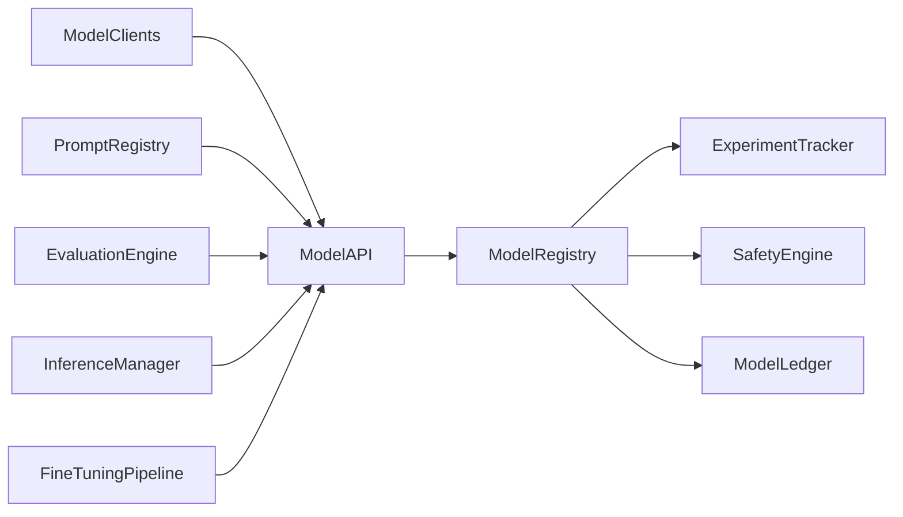
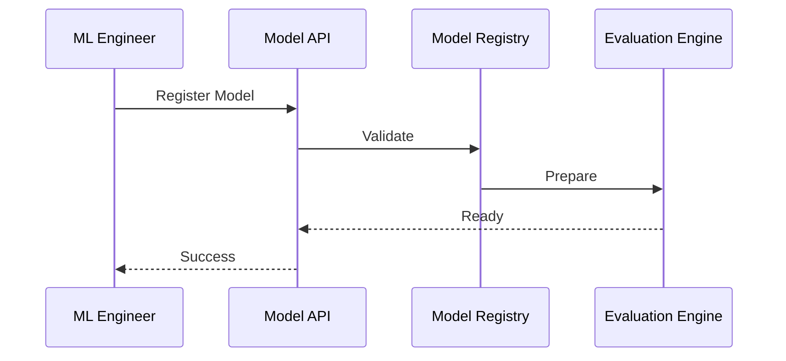
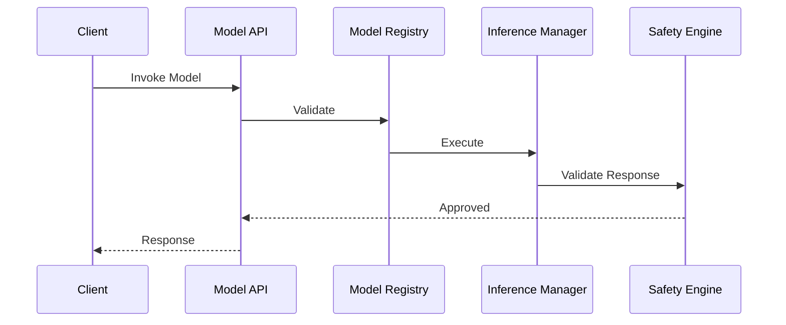

# Enterprise AI Software Factory
# Architecture Design Specification (ADS)

> **Document ID:** ADS-032-v3
>
> **Document Name:** AI/ML & Model Lifecycle Platform — APIs, Events & Contracts
>
> **Version:** 2.0.0
>
> **Classification:** Enterprise Platform Plane
>
> **Importance:** CRITICAL
>
> **Depends On:** ADS-032-v1
>
> **Depends On:** ADS-032-v2
>
> **Next:** ADS-032-v4 — Runtime & Model Infrastructure

---

# Executive Summary

The AI/ML & Model Lifecycle Platform exposes standardized APIs for model registration, prompt management, evaluation pipelines, experiment tracking, fine-tuning, deployment promotion, drift detection, inference management, and model retirement.

Every AI lifecycle activity occurs through these contracts.

Model implementations may evolve.

Lifecycle contracts remain stable.

---

# Communication Principles

Every model request MUST satisfy

- Authenticated
- Authorized
- Versioned
- Observable
- Reproducible
- Governed
- Secure
- Tenant Isolated

No model bypasses the Model Lifecycle Platform.

---

# Model Communication Architecture



The Model Registry coordinates every lifecycle operation.

---

# Public REST API

The Model Lifecycle Platform exposes APIs for

- Model Registry
- Prompt Registry
- Evaluation Engine
- Fine-Tuning Pipeline
- Inference Manager
- Experiment Tracker
- Governance Services
- Developer SDKs

---

## API-032-001

### Register Model

```http
POST /models/v1/registry
```

Purpose

Registers a Model Record.

---

Request

```json
{
  "modelName":"EnterpriseGPT",
  "provider":"OpenAI",
  "modelType":"Foundation",
  "version":"1.0.0"
}
```

---

Response

```json
{
  "modelRecordId":"MR-051",
  "status":"Registered"
}
```

---

## API-032-002

### Register Prompt

```http
POST /models/v1/prompts
```

Registers a versioned prompt asset.

---

## API-032-003

### Start Evaluation

```http
POST /models/v1/evaluations
```

Creates a new Evaluation Report.

---

## API-032-004

### Start Fine-Tuning

```http
POST /models/v1/fine-tuning
```

Starts a governed fine-tuning job.

---

## API-032-005

### Promote Model

```http
POST /models/v1/promotions
```

Promotes a model to the next deployment stage.

---

# Internal gRPC Services

```protobuf
service ModelLifecycleService {

rpc RegisterModel(ModelRequest)
returns(ModelResponse);

rpc RegisterPrompt(PromptRequest)
returns(PromptResponse);

rpc StartEvaluation(EvaluationRequest)
returns(EvaluationResponse);

rpc StartFineTuning(FineTuningRequest)
returns(FineTuningResponse);

rpc PromoteModel(PromotionRequest)
returns(PromotionResponse);

}
```

---

# Model Card Schema

```protobuf
message ModelCard {

string model_id = 1;

string model_name = 2;

string model_type = 3;

string provider = 4;

string version = 5;

string deployment_status = 6;

}
```

---

# Model Record Schema

```protobuf
message ModelRecord {

string model_record_id = 1;

string model_id = 2;

string artifact_uri = 3;

string runtime_profile = 4;

string deployment_stage = 5;

}
```

---

# Evaluation Report Schema

```protobuf
message EvaluationReport {

string report_id = 1;

string model_record_id = 2;

string evaluation_suite = 3;

string recommendation = 4;

string evaluated_at = 5;

}
```

---

# MCP Tool Contracts

The Model Lifecycle Platform exposes

```
register_model

register_prompt

start_evaluation

start_fine_tuning

promote_model

detect_drift

query_model_registry

model_diagnostics
```

Every invocation is authenticated and audited.

---

# Model Events

Every lifecycle activity emits immutable events.

---

## EVT-032-001

ModelRegistered

---

## EVT-032-002

PromptRegistered

---

## EVT-032-003

EvaluationStarted

---

## EVT-032-004

EvaluationCompleted

---

## EVT-032-005

FineTuningStarted

---

## EVT-032-006

ModelPromoted

---

## EVT-032-007

DriftDetected

---

## EVT-032-008

ModelRetired

---

# Event Flow



---

# Event Ordering

```text
ModelRegistered

↓

EvaluationStarted

↓

EvaluationCompleted

↓

GovernanceApproved

↓

ModelPromoted

↓

ProductionDeployment
```

---

# Event Metadata

Every event contains

```yaml
eventId:
modelId:
modelRecordId:
evaluationReportId:
traceId:
timestamp:
schemaVersion:
```

---

# End of Part 1

# Request Validation

Every model lifecycle request follows a deterministic validation pipeline.

```text
Receive Request

↓

Schema Validation

↓

Authentication

↓

Authorization

↓

Model Validation

↓

Governance Validation

↓

Safety Validation

↓

Execution
```

Execution begins only after successful validation.

---

# Validation Rules

Every request MUST satisfy

| Rule | Description |
|------|-------------|
| API Version | Supported lifecycle contract |
| Authentication | Valid identity |
| Authorization | Approved operation |
| Model Version | Registered model |
| Prompt Version | Compatible prompt |
| Governance | Approved lifecycle stage |
| Safety | Policy-compliant model |
| Tenant | Tenant isolation enforced |

Validation failures reject the request.

---

# Authentication

Model authentication supports

- OAuth 2.1
- Mutual TLS
- API Keys
- JWT
- OpenID Connect
- SPIFFE / SPIRE

Anonymous lifecycle operations are prohibited.

---

# Authorization

Authorization evaluates

- User Identity
- Organization
- Model Ownership
- Lifecycle Permissions
- Deployment Stage
- Governance Policies

Decision

```text
Allow

↓

Execute

Deny

↓

Reject

Review

↓

Governance Approval
```

Every authorization decision is audited.

---

# Inference Session

Every governed inference creates an immutable Inference Session.

```yaml
inferenceSession:

  sessionId:

  modelRecord:

  deploymentStage:

  promptVersion:

  inferenceProfile:

  requestMetadata:

  responseMetadata:

  latency:

  tokenUsage:

  safetyDecision:

  completedAt:
```

Inference Sessions remain immutable.

---

# Runtime Sequence



---

# Deployment Gates

Promotion requires

| Gate | Purpose |
|------|----------|
| Evaluation | Benchmark success |
| Safety | Guardrail validation |
| Governance | Approval workflow |
| Performance | Latency & throughput |
| Cost | Budget compliance |
| Monitoring | Observability enabled |

All gates must pass before production.

---

# Inference Policies

Supported policies

| Policy | Purpose |
|---------|----------|
| Token Limits | Resource control |
| Cost Limits | Budget enforcement |
| Rate Limits | Fair usage |
| Safety Filters | Harm prevention |
| Prompt Policies | Prompt governance |
| Output Validation | Response verification |

Policies remain version-controlled.

---

# Distributed Tracing

Every lifecycle operation includes

- Trace ID
- Model ID
- Model Record ID
- Evaluation Report ID
- Inference Session ID

Trace Flow

```text
Model API

↓

Model Registry

↓

Inference Manager

↓

Safety Engine

↓

Observability Platform

↓

Model Ledger
```

Every stage contributes trace spans.

---

# Prometheus Metrics

```text
registered_models_total

active_models_total

evaluation_reports_total

fine_tuning_jobs_total

inference_sessions_total

model_promotions_total

drift_alerts_total

token_consumption_total

model_inference_latency_seconds

model_runtime_health_score
```

---

# Structured Logging

Example

```json
{
  "traceId":"trace-25018",
  "modelId":"MODEL-204",
  "modelRecordId":"MR-051",
  "evaluationReport":"ER-033",
  "inferenceSession":"INF-914",
  "deploymentStage":"Production",
  "status":"Success"
}
```

Logs remain immutable and correlated.

---

# Audit Records

Every lifecycle operation records

- Model Card
- Model Record
- Evaluation Report
- Inference Session
- Workflow ID
- Trace ID
- Timestamp
- Model Version

Audit history is append-only.

---

# Reference Standards & Specifications

The Model Lifecycle Platform aligns with

| Standard | Purpose |
|----------|---------|
| MLflow Model Registry | Model lifecycle |
| OpenTelemetry | Distributed tracing |
| OpenAPI 3.1 | REST APIs |
| OCI Artifacts | Model packaging |
| SPDX | Software & model provenance |
| OpenID Connect | Identity federation |
| NIST AI RMF | AI risk management |

---

# Architecture Decision Records

## ADR-032-06

### Decision

Represent every production inference as an Inference Session.

### Status

Accepted

### Reason

Inference Sessions provide replayability, operational analytics, cost attribution, governance evidence, and production auditability.

---

## ADR-032-07

### Decision

Separate offline evaluation from online inference.

### Status

Accepted

### Reason

Offline benchmarking and production inference have different objectives, governance requirements, and operational characteristics.

---

## ADR-032-08

### Decision

Enforce gated model promotion before production deployment.

### Status

Accepted

### Reason

Promotion gates improve reliability, safety, governance, and deployment consistency.

---

# Operational Readiness Scorecard

| Capability | Status |
|------------|--------|
| Model Cards | ✅ Required |
| Model Records | ✅ Required |
| Evaluation Reports | ✅ Required |
| Inference Sessions | ✅ Required |
| Distributed Tracing | ✅ Required |
| Immutable Audit | ✅ Required |
| Standards Compliance | ✅ Required |
| Gated Promotion | ✅ Required |

---

# Related Documents

ADS-021-v5 — Workflow Kernel

ADS-022-v5 — Identity & Trust Plane

ADS-023-v5 — Enterprise Memory Plane

ADS-024-v5 — Agent Execution Platform

ADS-025-v5 — Compute & Infrastructure Platform

ADS-026-v5 — Security Platform

ADS-027-v5 — Observability Platform

ADS-028-v5 — Governance Platform

ADS-029-v5 — Developer Experience Platform

ADS-030-v5 — Integration & Ecosystem Platform

ADS-031-v5 — Operations & Platform Administration

ADS-032-v1 — AI/ML & Model Lifecycle Platform

ADS-032-v2 — Model Lifecycle Algorithms & MLOps Framework

ADS-032-v4 — Runtime & Model Infrastructure

---

# End of Document
