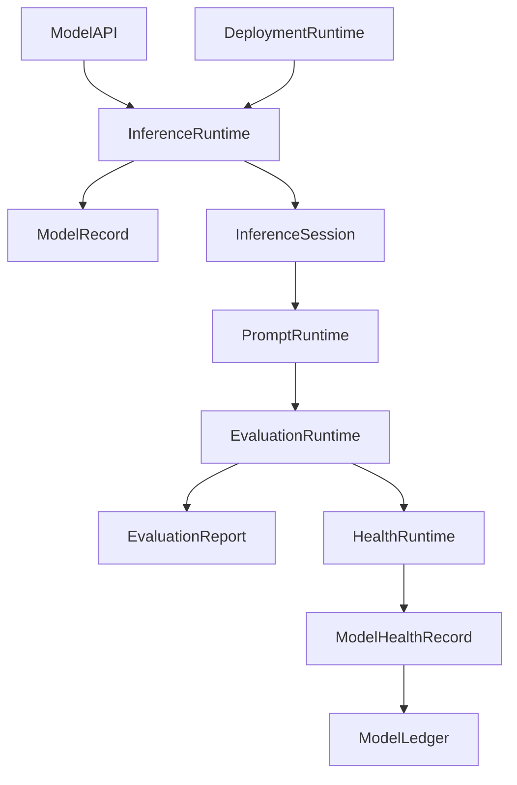
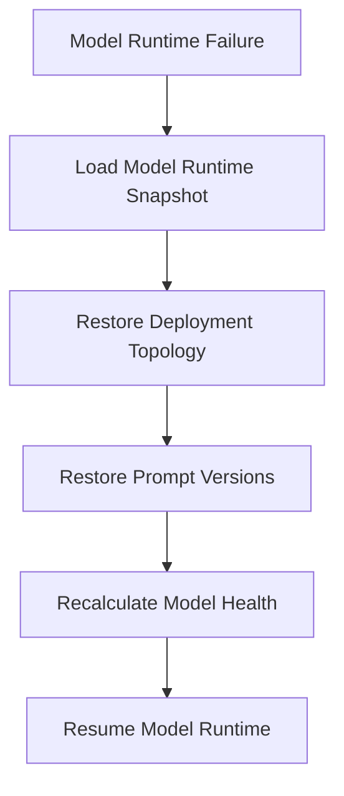

# Enterprise AI Software Factory
# Architecture Design Specification (ADS)

> **Document ID:** ADS-032-v4
>
> **Document Name:** AI/ML & Model Lifecycle Platform — Runtime & Model Infrastructure
>
> **Version:** 2.0.0
>
> **Classification:** Enterprise Runtime Specification
>
> **Importance:** CRITICAL
>
> **Depends On:** ADS-032-v1
>
> **Depends On:** ADS-032-v2
>
> **Depends On:** ADS-032-v3
>
> **Next:** ADS-032-v5 — End-to-End Model Lifecycle

---

# Executive Summary

This document defines the runtime infrastructure responsible for continuously executing enterprise AI models.

The runtime manages inference execution, deployment routing, prompt execution, model scaling, evaluation scheduling, health monitoring, drift detection, and lifecycle automation while maintaining deterministic, governed, and observable AI services.

The Model Runtime serves as the execution kernel for all enterprise AI models.

---

# Runtime Philosophy

The Model Runtime follows seven principles.

- Registry First
- Deterministic Inference
- Continuous Validation
- Safe Deployment
- Continuous Monitoring
- Adaptive Scaling
- Immutable Lineage

Runtime execution never bypasses governance.

---

# Runtime Layers

## Inference Runtime

Responsible for

- Inference Execution
- Request Scheduling
- Token Management
- Response Delivery

---

## Deployment Runtime

Responsible for

- Model Routing
- Deployment Promotion
- Rollback Coordination
- Canary Releases

---

## Prompt Runtime

Responsible for

- Prompt Resolution
- Template Expansion
- Prompt Version Selection
- Context Injection

---

## Evaluation Runtime

Responsible for

- Continuous Evaluation
- Benchmark Scheduling
- Quality Validation
- Drift Verification

---

## Health Runtime

Responsible for

- Health Monitoring
- Drift Detection
- Latency Monitoring
- Cost Monitoring

---

# Runtime Architecture



Model Runtime coordinates every inference.

---

# Runtime Components

| Component | Responsibility |
|------------|----------------|
| Inference Runtime | Model execution |
| Deployment Runtime | Deployment routing |
| Prompt Runtime | Prompt resolution |
| Evaluation Runtime | Continuous validation |
| Health Runtime | Operational monitoring |
| Drift Engine | Drift detection |
| Runtime Monitor | Runtime health |
| Model Ledger | Immutable model history |

---

# Runtime Pipeline

```text
Inference Request

↓

Prompt Resolution

↓

Model Selection

↓

Inference Execution

↓

Safety Validation

↓

Health Update

↓

Model Ledger
```

Every inference follows this lifecycle.

---

# Inference Runtime

Inference Runtime manages

- Model Selection
- Request Scheduling
- Token Accounting
- Response Generation
- Session Tracking

Inference remains deterministic.

---

# Prompt Runtime

Prompt Runtime coordinates

- Prompt Templates
- Version Resolution
- Dynamic Variables
- Context Injection
- Prompt Validation

Prompt execution remains reproducible.

---

# Inference Session Management

Every runtime session tracks

- Model Record
- Prompt Version
- Deployment Stage
- Request Metadata
- Response Metadata
- Safety Decisions
- Token Usage

Inference Sessions remain immutable.

---

# Runtime Guarantees

The Model Runtime guarantees

- Deterministic Inference
- Safe Deployment
- Continuous Monitoring
- Prompt Version Consistency
- Drift Detection
- Immutable Lineage
- Policy Enforcement

---

# End of Part 1

# Failure Recovery

The Model Runtime automatically recovers from inference and deployment failures while preserving model integrity.

Recovery follows approved deployment and rollback policies.



Recovery guarantees

- No model corruption
- No prompt inconsistency
- No deployment ambiguity
- Deterministic recovery

---

# Runtime Health Monitoring

Every runtime component continuously reports health.

Collected metrics

- Inference Runtime Health
- Deployment Runtime Health
- Prompt Runtime Health
- Evaluation Runtime Health
- Drift Engine Health
- Active Inference Sessions
- Token Throughput
- Queue Depth

Health Flow

```text
Runtime Component

↓

Heartbeat

↓

Model Runtime Monitor

↓

AI Operations Dashboard

↓

Alert Engine

↓

ML Operations Team
```

Health monitoring remains continuous.

---

# Model Runtime Snapshot

The runtime periodically generates Model Runtime Snapshots.

```yaml
modelRuntimeSnapshot:

  snapshotId:

  generatedAt:

  activeModels:

  activeInferenceSessions:

  deploymentTopology:

  promptVersions:

  evaluationQueue:

  driftStatus:

  runtimeHealth:

  tokenUtilization:

  throughput:
```

Model Runtime Snapshots provide deterministic operational state.

---

# Runtime Configuration

Example

```yaml
modelRuntime:

  canaryDeployments: enabled

  promptVersionLocking: enabled

  continuousEvaluation: enabled

  driftMonitoring: enabled

  automaticRollback: enabled

  runtimeSnapshots: enabled

  inferenceTracing: enabled

  snapshotInterval: 10m
```

Configuration remains version-controlled.

---

# Model Scaling

Inference Runtime supports

- Horizontal Scaling
- Dynamic Autoscaling
- GPU Allocation
- Batch Inference
- Streaming Inference

Scaling remains policy-driven.

---

# Runtime Isolation

Model Runtime isolates

- Inference Sessions
- Model Deployments
- Prompt Execution
- Evaluation Jobs
- Fine-Tuning Jobs
- Drift Analysis

Isolation prevents cross-model interference.

---

# Prometheus Metrics

```text
model_runtime_snapshots_total

active_models_total

active_inference_sessions_total

inference_latency_seconds

token_throughput_total

evaluation_duration_seconds

drift_detection_total

deployment_rollbacks_total

gpu_utilization_ratio

model_runtime_health_score
```

---

# OpenTelemetry

Distributed tracing spans

```text
Model API

↓

Inference Runtime

↓

Prompt Runtime

↓

Evaluation Runtime

↓

Health Runtime

↓

Model Ledger
```

Every runtime stage contributes trace spans.

---

# Structured Logging

Example

```json
{
  "modelRecordId":"MR-051",
  "runtimeSnapshot":"MRS-012",
  "inferenceSession":"INF-914",
  "deploymentStage":"Production",
  "runtimeHealth":"Healthy",
  "tokenUsage":2847
}
```

Logs remain immutable and correlated.

---

# Disaster Recovery

Recovery flow

```text
Model Runtime Failure

↓

Restore Model Runtime Snapshot

↓

Reload Deployment Topology

↓

Restore Prompt Versions

↓

Resume Inference

↓

Validate Runtime Health
```

Recovery targets

Recovery Point Objective (RPO)

Near-zero inference state loss

Recovery Time Objective (RTO)

Less than three minutes

---

# Recommended Production Deployment

```text
Model API

↓

Inference Runtime

↓

Deployment Runtime

↓

Prompt Runtime

↓

Evaluation Runtime

↓

Health Runtime

↓

Model Ledger

↓

OpenTelemetry

↓

Prometheus

↓

Grafana
```

---

# Technology Decision Records

## TDR-032-01

### Technology

MLflow

### Decision

Use MLflow as the default model registry and experiment tracking backend.

### Reason

Provides reproducible model versioning, experiment lineage, and deployment metadata.

---

## TDR-032-02

### Technology

KServe

### Decision

Use KServe for Kubernetes-native model serving.

### Reason

Supports scalable, production-grade inference with autoscaling and canary deployments.

---

## TDR-032-03

### Technology

Model Runtime Snapshot

### Decision

Persist periodic Model Runtime Snapshots.

### Reason

Supports recovery, diagnostics, operational visibility, and capacity planning.

---

## TDR-032-04

### Technology

vLLM

### Decision

Use vLLM for high-throughput LLM inference.

### Reason

Optimizes token throughput, memory utilization, and serving efficiency.

---

## TDR-032-05

### Technology

NVIDIA Triton Inference Server

### Decision

Support Triton as a runtime backend for heterogeneous AI workloads.

### Reason

Enables unified serving for LLMs, vision, speech, and traditional ML models.

---

# Runtime Checklist

The Model Lifecycle Platform MUST

- Generate Model Runtime Snapshots
- Continuously evaluate deployed models
- Detect drift automatically
- Support deterministic inference
- Preserve immutable Inference Sessions
- Continuously monitor runtime health
- Enable safe deployment rollback

The Model Lifecycle Platform MUST NOT

- Deploy unevaluated models
- Bypass governance approval
- Lose model lineage
- Execute unversioned prompts
- Allow cross-model runtime interference

---

# Architecture Decision Records

## ADR-032-09

### Decision

Treat Model Runtime Snapshots as immutable runtime artifacts.

### Status

Accepted

### Reason

Snapshots improve diagnostics, recovery, capacity planning, and AI operational visibility.

---

## ADR-032-10

### Decision

Separate prompt execution from inference execution.

### Status

Accepted

### Reason

Prompt lifecycle management evolves independently from model deployment and inference infrastructure.

---

## ADR-032-11

### Decision

Execute every production inference within an isolated runtime session.

### Status

Accepted

### Reason

Session isolation improves security, reproducibility, observability, and operational reliability.

---

# Operational Readiness Scorecard

| Capability | Status |
|------------|--------|
| Model Runtime | ✅ Required |
| Runtime Snapshots | ✅ Required |
| Drift Detection | ✅ Required |
| Deployment Runtime | ✅ Required |
| Runtime Recovery | ✅ Required |
| Continuous Evaluation | ✅ Required |
| Safe Rollback | ✅ Required |
| Deterministic Inference | ✅ Required |

---

# Related Documents

ADS-021-v5 — Workflow Kernel

ADS-022-v5 — Identity & Trust Plane

ADS-023-v5 — Enterprise Memory Plane

ADS-024-v5 — Agent Execution Platform

ADS-025-v5 — Compute & Infrastructure Platform

ADS-026-v5 — Security Platform

ADS-027-v5 — Observability Platform

ADS-028-v5 — Governance Platform

ADS-029-v5 — Developer Experience Platform

ADS-030-v5 — Integration & Ecosystem Platform

ADS-031-v5 — Operations & Platform Administration

ADS-032-v1 — AI/ML & Model Lifecycle Platform

ADS-032-v2 — Model Lifecycle Algorithms & MLOps Framework

ADS-032-v3 — APIs, Events & Contracts

ADS-032-v5 — End-to-End Model Lifecycle

---

# End of Document
