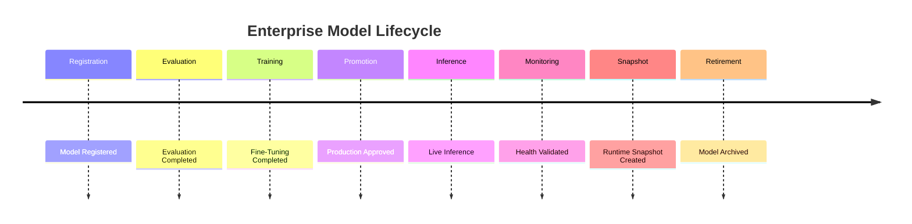

# Enterprise AI Software Factory
# Architecture Design Specification (ADS)

> **Document ID:** ADS-032-v5
>
> **Document Name:** AI/ML & Model Lifecycle Platform — End-to-End Model Lifecycle
>
> **Version:** 2.0.0
>
> **Classification:** Reference Implementation
>
> **Importance:** CRITICAL
>
> **Depends On:** ADS-032-v1
>
> **Depends On:** ADS-032-v2
>
> **Depends On:** ADS-032-v3
>
> **Depends On:** ADS-032-v4
>
> **Next:** ADS-032-v6 — Future Enhancements

---

# Executive Summary

This document demonstrates how the AI/ML & Model Lifecycle Platform manages the complete lifecycle of an enterprise AI model—from registration and evaluation through deployment, production inference, monitoring, retraining, and retirement.

It illustrates how Model Cards, Model Records, Evaluation Reports, Inference Sessions, Model Health Records, Model Runtime Snapshots, and Model Ledger Entries interact throughout real enterprise AI operations.

Every model is governed.

Every inference is observable.

Every deployment is reproducible.

---

# Scenario

An enterprise deploys a customer-support LLM that assists agents with ticket resolution while complying with organizational governance, safety, and observability requirements.

Participating systems

- Model Lifecycle Platform
- Workflow Kernel
- Memory Plane
- Agent Execution Platform
- Governance Platform
- Observability Platform
- Operations Platform

---

# Stage 1 — Model Registration

Generated

```
MODEL-2026-014
```

Model Card contains

- Provider
- Architecture
- Intended Use
- Safety Profile
- Training Metadata
- Version

Model Card becomes immutable.

---

# Stage 2 — Model Record

Generated

```
MR-2026-009
```

Model Record includes

- Artifact URI
- Runtime Profile
- Deployment Targets
- Resource Requirements
- Governance Status

Model Record archived.

---

# Stage 3 — Evaluation

Generated

```
ER-2026-021
```

Evaluation validates

- Accuracy
- Hallucination Rate
- Latency
- Safety
- Bias
- Cost

Recommendation

```
Approved for Staging
```

Evaluation Report archived.

---

# Stage 4 — Fine-Tuning

Fine-tuning executes using

- Approved Dataset
- Governance Policies
- Hyperparameter Configuration
- Validation Dataset

Training succeeds.

---

# Stage 5 — Deployment Promotion

Model advances

```
Registered

↓

Evaluated

↓

Approved

↓

Staging

↓

Production
```

Promotion gates pass successfully.

---

# Stage 6 — Production Inference

Generated

```
INF-2026-084
```

Inference Session records

- Prompt Version
- Request Metadata
- Response Metadata
- Token Usage
- Safety Decision
- Latency

Inference completes successfully.

---

# Stage 7 — Runtime Monitoring

Generated

```
MHR-2026-012
```

Model Health metrics

- Availability: 99.99%
- Average Latency: 176 ms
- Token Throughput: 9,200 tokens/s
- Drift Status: Normal
- Safety Score: 99.8%

Model remains Healthy.

---

# Stage 8 — Runtime Snapshot

Generated

```
MRS-2026-006
```

Snapshot contains

- Active Models
- Active Inference Sessions
- Deployment Topology
- Prompt Versions
- Runtime Health

Snapshot archived.

---

# Stage 9 — Drift Detection

Evaluation Runtime identifies

- Minor Prompt Drift

Automatic evaluation executes.

Drift remains below governance threshold.

No rollback required.

---

# Stage 10 — Model Ledger

Generated

```
ML-2026-028
```

Ledger Entry references

- Model Card
- Model Record
- Evaluation Report
- Inference Session
- Model Health Record
- Runtime Snapshot

Entry becomes immutable.

---

# Stage 11 — Model Upgrade

Model upgraded

```
v3.2.1

↓

v3.3.0
```

Canary deployment succeeds.

Production rollout completes.

---

# Stage 12 — Retirement

Model retired after successor deployment.

Archived artifacts

- Model Card
- Model Record
- Evaluation Report
- Inference Session
- Model Health Record
- Runtime Snapshot
- Model Ledger Entry

Lifecycle remains fully reproducible.

---

# Model Timeline



---

# Model Event Stream

```text
ModelRegistered

↓

EvaluationCompleted

↓

FineTuningCompleted

↓

ModelPromoted

↓

InferenceExecuted

↓

ModelHealthUpdated

↓

RuntimeSnapshotCreated

↓

ModelLedgerWritten

↓

ModelRetired
```

---

# Produced Artifacts

| Artifact | Identifier |
|-----------|------------|
| Model Card | MODEL-2026-014 |
| Model Record | MR-2026-009 |
| Evaluation Report | ER-2026-021 |
| Inference Session | INF-2026-084 |
| Model Health Record | MHR-2026-012 |
| Model Runtime Snapshot | MRS-2026-006 |
| Model Ledger Entry | ML-2026-028 |

---

# Runtime Metrics

| Metric | Value |
|---------|------:|
| Registered Models | 1,248 |
| Production Models | 318 |
| Daily Inference Sessions | 14.8 M |
| Average Inference Latency | 176 ms |
| Drift Events | 12 |
| Fine-Tuning Jobs | 86 |
| Evaluation Success Rate | 99.6% |
| Runtime Availability | 99.99% |

---

# Operational Readiness Scorecard

| Capability | Status |
|------------|--------|
| Model Cards | ✅ Verified |
| Model Records | ✅ Verified |
| Evaluation Reports | ✅ Verified |
| Inference Sessions | ✅ Verified |
| Model Health Records | ✅ Verified |
| Runtime Snapshots | ✅ Verified |
| Model Ledger | ✅ Verified |
| Deterministic Lifecycle | ✅ Verified |

---

# Lessons Learned

The Model Lifecycle Platform demonstrates the following principles.

- Model Cards define authoritative AI asset metadata.
- Model Records separate deployable implementations from logical model definitions.
- Evaluation Reports provide reproducible evidence for promotion decisions.
- Inference Sessions preserve governed production interactions.
- Model Health Records continuously measure operational quality.
- Model Runtime Snapshots enable deterministic recovery and operational visibility.
- Model Ledger Entries preserve immutable model history.

---

# Architecture Decision Record

## ADR-032-12

### Decision

Represent enterprise AI models as a deterministic lifecycle composed of immutable AI artifacts.

### Status

Accepted

### Reason

Artifact-centric AI improves governance, reproducibility, auditability, rollback capability, operational visibility, and enterprise-scale lifecycle management.

---

# Technology Decision Record

## TDR-032-06

### Technology

Enterprise Model Lifecycle Platform

### Decision

Implement a centralized AI/ML & Model Lifecycle Platform responsible for model registration, evaluation, prompt management, inference governance, deployment promotion, continuous monitoring, drift detection, and immutable lifecycle history.

### Reason

A unified Model Lifecycle Platform provides secure, governed, observable, and reproducible AI operations while integrating seamlessly with workflow execution, governance, observability, and enterprise operations.

---

# Related Documents

ADS-021-v5 — Workflow Kernel

ADS-022-v5 — Identity & Trust Plane

ADS-023-v5 — Enterprise Memory Plane

ADS-024-v5 — Agent Execution Platform

ADS-025-v5 — Compute & Infrastructure Platform

ADS-026-v5 — Security Platform

ADS-027-v5 — Observability Platform

ADS-028-v5 — Governance Platform

ADS-029-v5 — Developer Experience Platform

ADS-030-v5 — Integration & Ecosystem Platform

ADS-031-v5 — Operations & Platform Administration

ADS-032-v1 — AI/ML & Model Lifecycle Platform

ADS-032-v2 — Model Lifecycle Algorithms & MLOps Framework

ADS-032-v3 — APIs, Events & Contracts

ADS-032-v4 — Runtime & Model Infrastructure

---

# End of Document
