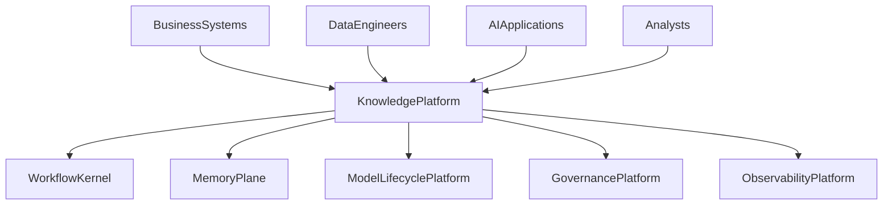
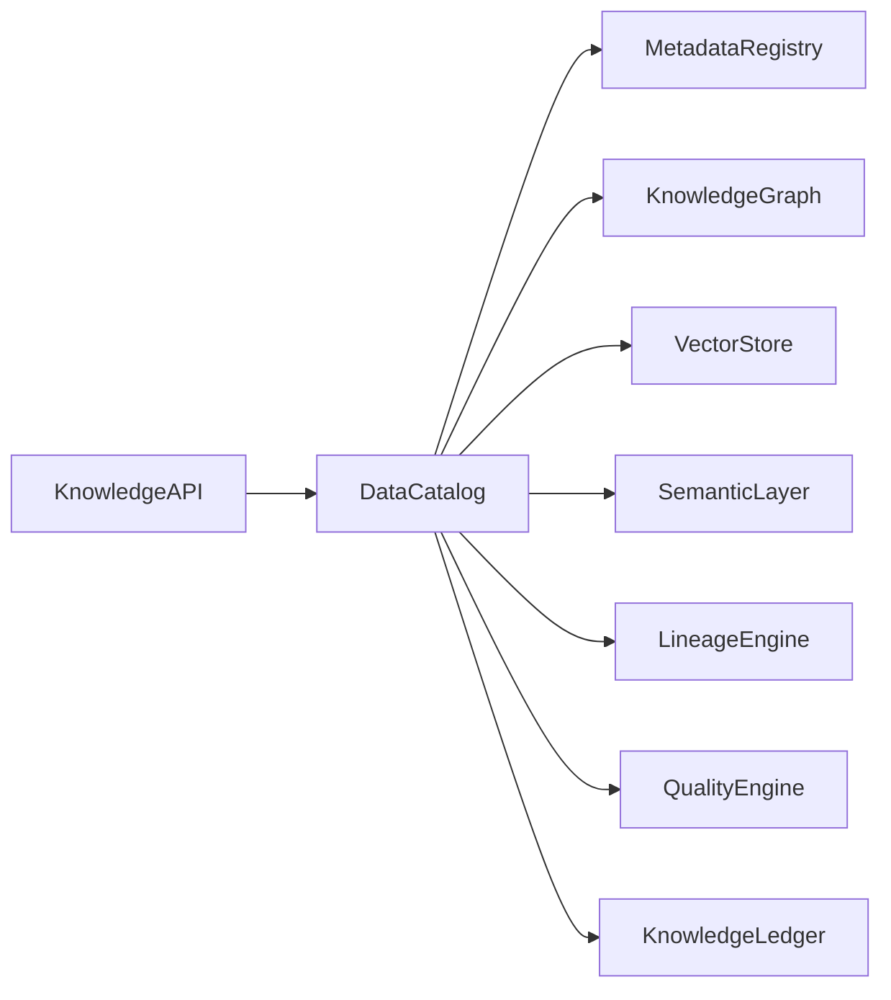

# Enterprise AI Software Factory
# Architecture Design Specification (ADS)

> **Document ID:** ADS-033-v1
>
> **Document Name:** Enterprise Data Platform & Knowledge Fabric — Architecture
>
> **Version:** 2.0.0
>
> **Classification:** Enterprise Platform Plane
>
> **Importance:** CRITICAL
>
> **Depends On:** ADS-021-v5
>
> **Depends On:** ADS-022-v5
>
> **Depends On:** ADS-023-v5
>
> **Depends On:** ADS-024-v5
>
> **Depends On:** ADS-025-v5
>
> **Depends On:** ADS-026-v5
>
> **Depends On:** ADS-027-v5
>
> **Depends On:** ADS-028-v5
>
> **Depends On:** ADS-029-v5
>
> **Depends On:** ADS-030-v5
>
> **Depends On:** ADS-031-v5
>
> **Depends On:** ADS-032-v5
>
> **Next:** ADS-033-v2 — Data Lifecycle Algorithms & Knowledge Framework

---

# Executive Summary

The Enterprise Data Platform & Knowledge Fabric provides centralized management for structured data, unstructured documents, vector knowledge, metadata, semantic models, enterprise catalogs, lineage, data quality, governance, and knowledge retrieval.

The platform enables trusted, governed, observable, and reproducible enterprise knowledge operations across the Enterprise AI Software Factory.

Knowledge becomes a first-class enterprise asset.

---

# Why This System Exists

Enterprise AI depends on trusted enterprise knowledge.

Organizations must continuously

- Ingest Data
- Catalog Assets
- Maintain Metadata
- Track Lineage
- Build Semantic Models
- Generate Embeddings
- Validate Data Quality
- Govern Knowledge
- Enable Enterprise Search
- Archive Knowledge Assets

The Knowledge Fabric standardizes these responsibilities.

---

# Core Philosophy

Trust Every Dataset.

Govern Every Asset.

Understand Every Relationship.

Retrieve Every Fact.

---

# Design Goals

The platform provides

- Enterprise Data Catalog
- Metadata Registry
- Knowledge Graph
- Vector Store
- Semantic Layer
- Data Lineage
- Data Quality Framework
- Enterprise Search
- Knowledge Governance
- Knowledge Ledger

---

# Architectural Position

Every enterprise knowledge asset passes through the Knowledge Platform.

---

# High-Level Architecture

The Enterprise Data Catalog coordinates the complete knowledge lifecycle.

---

# Major Components

| Component | Responsibility |
|------------|----------------|
| Knowledge API | Public knowledge interface |
| Data Catalog | Enterprise asset registry |
| Metadata Registry | Metadata lifecycle |
| Knowledge Graph | Relationship modeling |
| Vector Store | Embedding storage |
| Semantic Layer | Business abstractions |
| Lineage Engine | Provenance tracking |
| Quality Engine | Data validation |
| Knowledge Ledger | Immutable history |

---

# Knowledge Domains

| Domain | Purpose |
|---------|---------|
| Structured Data | Relational & analytical |
| Documents | Unstructured content |
| Metadata | Asset descriptions |
| Knowledge Graph | Entity relationships |
| Vector Knowledge | Semantic retrieval |
| Semantic Models | Business abstractions |
| Data Quality | Validation |
| Enterprise Search | Discovery |

Every domain follows a governed lifecycle.

---

# Knowledge Principles

The platform follows

- Catalog First
- Metadata Driven
- Immutable Lineage
- Continuous Quality Validation
- Semantic Consistency
- Governed Access
- Explainable Knowledge

---

# Knowledge Boundaries

Every knowledge operation passes through

- Identity Verification
- Security Validation
- Governance Approval
- Data Quality Validation
- Observability
- Immutable Audit

No enterprise knowledge bypasses lifecycle governance.

---

# Architecture Decision Records

## ADR-033-01

### Decision

Centralize enterprise knowledge into a dedicated Knowledge Fabric.

### Status

Accepted

### Reason

Centralized knowledge management improves governance, discoverability, lineage, quality, and AI readiness.

---

## ADR-033-02

### Decision

Represent enterprise knowledge assets as immutable platform artifacts.

### Status

Accepted

### Reason

Artifact-centric knowledge improves reproducibility, provenance, governance, and enterprise trust.

---

# Operational Readiness Scorecard

| Capability | Status |
|------------|--------|
| Enterprise Data Catalog | ✅ Required |
| Metadata Registry | ✅ Required |
| Knowledge Graph | ✅ Required |
| Vector Store | ✅ Required |
| Semantic Layer | ✅ Required |
| Data Lineage | ✅ Required |
| Data Quality | ✅ Required |
| Knowledge Ledger | ✅ Required |

---

# Version Roadmap

| Version | Description |
|----------|-------------|
| v1 | Architecture |
| v2 | Data Lifecycle Algorithms & Knowledge Framework |
| v3 | APIs, Events & Contracts |
| v4 | Runtime & Knowledge Infrastructure |
| v5 | End-to-End Knowledge Lifecycle |

---

# Related Documents

ADS-021-v5 — Workflow Kernel

ADS-022-v5 — Identity & Trust Plane

ADS-023-v5 — Enterprise Memory Plane

ADS-024-v5 — Agent Execution Platform

ADS-025-v5 — Compute & Infrastructure Platform

ADS-026-v5 — Security Platform

ADS-027-v5 — Observability Platform

ADS-028-v5 — Governance Platform

ADS-029-v5 — Developer Experience Platform

ADS-030-v5 — Integration & Ecosystem Platform

ADS-031-v5 — Operations & Platform Administration

ADS-032-v5 — AI/ML & Model Lifecycle Platform

---

# Next Document

**ADS-033-v2 — Data Lifecycle Algorithms & Knowledge Framework**

Defines data ingestion, metadata management, catalog registration, lineage generation, semantic modeling, vector indexing, quality validation, knowledge retrieval, and archival strategies.

---

# End of Document
