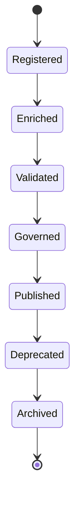

# Enterprise AI Software Factory
# Architecture Design Specification (ADS)

> **Document ID:** ADS-033-v2
>
> **Document Name:** Enterprise Data Platform & Knowledge Fabric — Data Lifecycle Algorithms & Knowledge Framework
>
> **Version:** 2.0.0
>
> **Classification:** Enterprise Platform Plane
>
> **Importance:** CRITICAL
>
> **Depends On:** ADS-033-v1
>
> **Next:** ADS-033-v3 — APIs, Events & Contracts

---

# Executive Summary

This document defines the algorithms responsible for enterprise data ingestion, metadata management, catalog registration, semantic enrichment, lineage generation, vector indexing, quality validation, knowledge retrieval, governance, and archival.

Every knowledge asset is versioned.

Every relationship is traceable.

Every retrieval is governed.

---

# Design Philosophy

The Knowledge Platform follows six principles.

- Catalog First
- Metadata Driven
- Lineage Before Trust
- Semantic Consistency
- Continuous Quality Validation
- Immutable Knowledge

Knowledge remains deterministic and reproducible.

---

# Knowledge Lifecycle

```text
Ingestion

↓

Registration

↓

Metadata Enrichment

↓

Semantic Modeling

↓

Quality Validation

↓

Governance

↓

Knowledge Retrieval

↓

Archival
```

Every knowledge asset follows this lifecycle.

---

# Knowledge Asset

Every enterprise asset begins with an immutable Knowledge Asset.

```yaml
knowledgeAsset:

  assetId:

  assetType:

  sourceSystem:

  owner:

  classification:

  schema:

  metadata:

  lineage:

  qualityProfile:

  semanticTags:

  governanceStatus:

  version:

  registeredAt:
```

Knowledge Assets remain immutable.

---

# ALG-033-001

## Data Ingestion

Data ingestion validates

- Source Identity
- Schema Compatibility
- Data Format
- Security Classification
- Governance Policies
- Integrity Checks

Successful ingestion creates a registered Knowledge Asset.

---

# ALG-033-002

## Metadata Management

Metadata Registry maintains

- Technical Metadata
- Business Metadata
- Operational Metadata
- Ownership
- Classification
- Retention Policies

Metadata remains version-controlled.

---

# ALG-033-003

## Catalog Registration

Enterprise Catalog indexes

- Structured Data
- Documents
- APIs
- Data Products
- Vector Collections
- Knowledge Graphs

Catalog entries remain searchable.

---

# Catalog Categories

| Category | Purpose |
|----------|----------|
| Dataset | Structured data |
| Document | Unstructured content |
| Data Product | Curated business asset |
| API | External interfaces |
| Vector Collection | Embedding storage |
| Knowledge Graph | Entity relationships |
| Semantic Model | Business abstraction |

Catalog remains extensible.

---

# ALG-033-004

## Lineage Generation

Lineage Engine records

- Data Source
- Transformations
- Processing Pipelines
- Dependencies
- Downstream Consumers
- Version History

Every lineage graph remains reproducible.

---

# Knowledge Domains

| Domain | Purpose |
|------|----------|
| Operational Data | Transactional systems |
| Analytical Data | Warehouses & lakes |
| Documents | Enterprise content |
| Vectors | Semantic retrieval |
| Graphs | Relationships |
| Semantic Models | Business knowledge |
| Metadata | Asset governance |
| Search | Discovery |

Knowledge domains remain extensible.

---

# ALG-033-005

## Semantic Modeling

Semantic Layer validates

- Business Vocabulary
- Entity Relationships
- Domain Concepts
- Ontologies
- Synonyms
- Taxonomies

Semantic models precede enterprise search.

---

# ALG-033-006

## Vector Indexing

Vector Indexing validates

- Embedding Model
- Chunk Strategy
- Similarity Metric
- Metadata Mapping
- Index Configuration

Vector indexes remain versioned.

---

# ALG-033-007

## Data Quality Validation

Quality Engine continuously evaluates

- Completeness
- Accuracy
- Consistency
- Timeliness
- Uniqueness
- Validity

Quality scores remain reproducible.

---

# ALG-033-008

## Knowledge Retrieval

Knowledge Retrieval performs

- Catalog Search
- Semantic Search
- Vector Similarity
- Graph Traversal
- Metadata Filtering
- Governance Validation

Every retrieval is policy-controlled.

---

# Knowledge Record

Every registered implementation creates a Knowledge Record.

```yaml
knowledgeRecord:

  knowledgeRecordId:

  knowledgeAsset:

  storageLocation:

  storageType:

  indexingProfile:

  vectorCollection:

  lifecycleStatus:

  governanceStatus:

  qualityScore:

  version:

  registeredAt:
```

Knowledge Records remain immutable.

---

# Knowledge Lifecycle Stages

| Stage | Purpose |
|--------|----------|
| Registered | Asset cataloged |
| Enriched | Metadata completed |
| Validated | Quality verified |
| Governed | Policy approved |
| Published | Available for consumption |
| Deprecated | Scheduled replacement |
| Archived | Historical preservation |

Knowledge lifecycle remains policy-driven.

---

# Lineage Lifecycle

Supported stages

| Stage | Purpose |
|--------|----------|
| Captured | Source identified |
| Linked | Dependencies connected |
| Validated | Provenance verified |
| Published | Available for analysis |
| Updated | Lineage evolved |
| Archived | Historical lineage |

Lineage remains reproducible.

---

# Knowledge State Machine



Every Knowledge Asset follows this lifecycle.

---

# Retrieval Pipeline

Every governed retrieval follows

```text
Receive Query

↓

Identity Verification

↓

Governance Validation

↓

Catalog Search

↓

Semantic Expansion

↓

Vector Retrieval

↓

Graph Traversal

↓

Ranking

↓

Response Assembly
```

Every retrieval remains explainable.

---

# Knowledge Metrics

```text
knowledge_assets_total

knowledge_records_total

catalog_entries_total

metadata_updates_total

lineage_relationships_total

semantic_models_total

vector_indexes_total

quality_validation_runs_total

knowledge_retrieval_latency_seconds

knowledge_platform_health_score
```

---

# Structured Logging

Example

```json
{
  "knowledgeAsset":"KA-214",
  "knowledgeRecord":"KR-051",
  "storageType":"Lakehouse",
  "qualityScore":98.7,
  "lineageStatus":"Validated",
  "timestamp":"2026-12-14T10:22:31Z"
}
```

Logs remain immutable and correlated.

---

# Architecture Decision Records

## ADR-033-03

### Decision

Represent every managed implementation as a Knowledge Record.

### Status

Accepted

### Reason

Knowledge Records separate logical knowledge definitions from physical storage implementations while improving governance, portability, and lifecycle management.

---

## ADR-033-04

### Decision

Require lineage generation for every managed knowledge asset.

### Status

Accepted

### Reason

Complete lineage improves trust, reproducibility, compliance, and impact analysis.

---

## ADR-033-05

### Decision

Continuously validate enterprise data quality.

### Status

Accepted

### Reason

Continuous validation maintains reliable enterprise knowledge and improves downstream AI and analytics.

---

# Operational Readiness Scorecard

| Capability | Status |
|------------|--------|
| Knowledge Assets | ✅ Required |
| Knowledge Records | ✅ Required |
| Metadata Registry | ✅ Required |
| Data Lineage | ✅ Required |
| Semantic Modeling | ✅ Required |
| Vector Indexing | ✅ Required |
| Data Quality | ✅ Required |
| Governed Retrieval | ✅ Required |

---

# Related Documents

ADS-021-v5 — Workflow Kernel

ADS-022-v5 — Identity & Trust Plane

ADS-023-v5 — Enterprise Memory Plane

ADS-024-v5 — Agent Execution Platform

ADS-025-v5 — Compute & Infrastructure Platform

ADS-026-v5 — Security Platform

ADS-027-v5 — Observability Platform

ADS-028-v5 — Governance Platform

ADS-029-v5 — Developer Experience Platform

ADS-030-v5 — Integration & Ecosystem Platform

ADS-031-v5 — Operations & Platform Administration

ADS-032-v5 — AI/ML & Model Lifecycle Platform

ADS-033-v1 — Enterprise Data Platform & Knowledge Fabric

ADS-033-v3 — APIs, Events & Contracts

---

# End of Document
