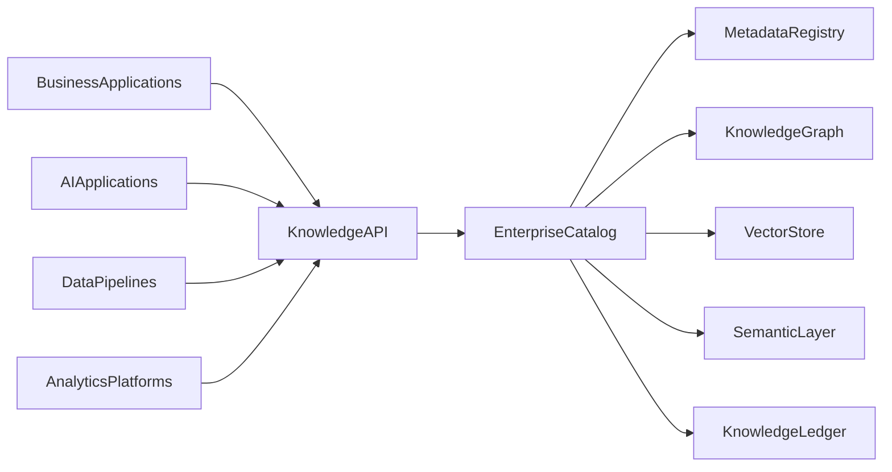
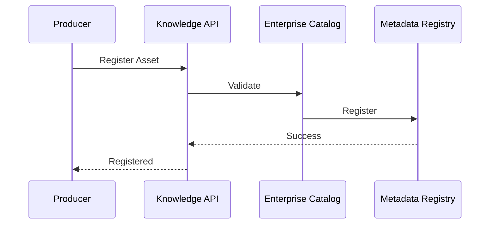

# Enterprise AI Software Factory
# Architecture Design Specification (ADS)

> **Document ID:** ADS-033-v3
>
> **Document Name:** Enterprise Data Platform & Knowledge Fabric — APIs, Events & Contracts
>
> **Version:** 2.0.0
>
> **Classification:** Enterprise Platform Plane
>
> **Importance:** CRITICAL
>
> **Depends On:** ADS-033-v1
>
> **Depends On:** ADS-033-v2
>
> **Next:** ADS-033-v4 — Runtime & Knowledge Infrastructure

---

# Executive Summary

The Enterprise Data Platform & Knowledge Fabric exposes standardized APIs for data ingestion, metadata management, catalog registration, lineage tracking, semantic modeling, vector indexing, enterprise search, governance, and knowledge retrieval.

Every knowledge lifecycle activity occurs through these contracts.

Knowledge implementations may evolve.

Knowledge contracts remain stable.

---

# Communication Principles

Every knowledge request MUST satisfy

- Authenticated
- Authorized
- Versioned
- Observable
- Traceable
- Governed
- Secure
- Tenant Isolated

No enterprise knowledge bypasses the Knowledge Platform.

---

# Knowledge Communication Architecture



Enterprise Catalog coordinates every knowledge lifecycle operation.

---

# Public REST API

The Knowledge Platform exposes APIs for

- Enterprise Catalog
- Metadata Registry
- Lineage Engine
- Semantic Layer
- Vector Store
- Knowledge Graph
- Enterprise Search
- Governance Services

---

## API-033-001

### Register Knowledge Asset

```http
POST /knowledge/v1/assets
```

Purpose

Registers a Knowledge Asset.

---

Request

```json
{
  "assetType":"Dataset",
  "sourceSystem":"Sales",
  "classification":"Internal",
  "version":"1.0.0"
}
```

---

Response

```json
{
  "knowledgeRecordId":"KR-051",
  "status":"Registered"
}
```

---

## API-033-002

### Update Metadata

```http
PUT /knowledge/v1/metadata/{assetId}
```

Updates governed metadata for an existing asset.

---

## API-033-003

### Create Lineage

```http
POST /knowledge/v1/lineage
```

Creates a Lineage Record.

---

## API-033-004

### Index Vectors

```http
POST /knowledge/v1/vector-indexes
```

Creates or updates a governed vector index.

---

## API-033-005

### Search Knowledge

```http
POST /knowledge/v1/search
```

Performs governed enterprise knowledge retrieval.

---

# Internal gRPC Services

```protobuf
service KnowledgeService {

rpc RegisterKnowledgeAsset(KnowledgeRequest)
returns(KnowledgeResponse);

rpc UpdateMetadata(MetadataRequest)
returns(MetadataResponse);

rpc CreateLineage(LineageRequest)
returns(LineageResponse);

rpc IndexVectors(VectorRequest)
returns(VectorResponse);

rpc SearchKnowledge(SearchRequest)
returns(SearchResponse);

}
```

---

# Knowledge Asset Schema

```protobuf
message KnowledgeAsset {

string asset_id = 1;

string asset_type = 2;

string source_system = 3;

string classification = 4;

string version = 5;

string governance_status = 6;

}
```

---

# Knowledge Record Schema

```protobuf
message KnowledgeRecord {

string knowledge_record_id = 1;

string asset_id = 2;

string storage_location = 3;

string storage_type = 4;

string lifecycle_status = 5;

}
```

---

# Lineage Record Schema

```protobuf
message LineageRecord {

string lineage_record_id = 1;

string knowledge_record_id = 2;

string transformation_pipeline = 3;

string validation_status = 4;

string generated_at = 5;

}
```

---

# MCP Tool Contracts

The Knowledge Platform exposes

```
register_knowledge_asset

update_metadata

create_lineage

index_vectors

search_knowledge

query_catalog

knowledge_diagnostics

lineage_visualization
```

Every invocation is authenticated and audited.

---

# Knowledge Events

Every lifecycle activity emits immutable events.

---

## EVT-033-001

KnowledgeAssetRegistered

---

## EVT-033-002

MetadataUpdated

---

## EVT-033-003

LineageGenerated

---

## EVT-033-004

VectorIndexCreated

---

## EVT-033-005

KnowledgePublished

---

## EVT-033-006

KnowledgeRetrieved

---

## EVT-033-007

QualityValidated

---

## EVT-033-008

KnowledgeArchived

---

# Event Flow



---

# Event Ordering

```text
KnowledgeAssetRegistered

↓

MetadataUpdated

↓

LineageGenerated

↓

QualityValidated

↓

KnowledgePublished

↓

KnowledgeRetrieved
```

---

# Event Metadata

Every event contains

```yaml
eventId:
assetId:
knowledgeRecordId:
lineageRecordId:
traceId:
timestamp:
schemaVersion:
```

---

# End of Part 1
