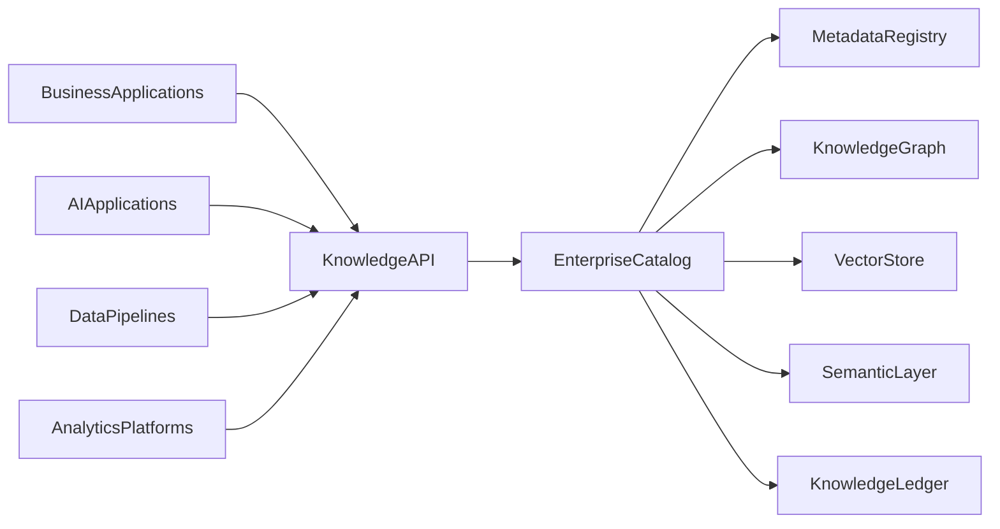
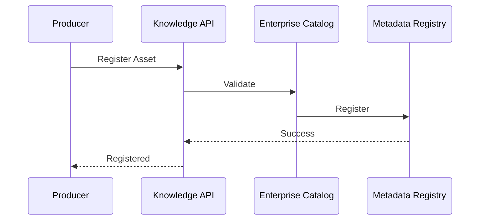
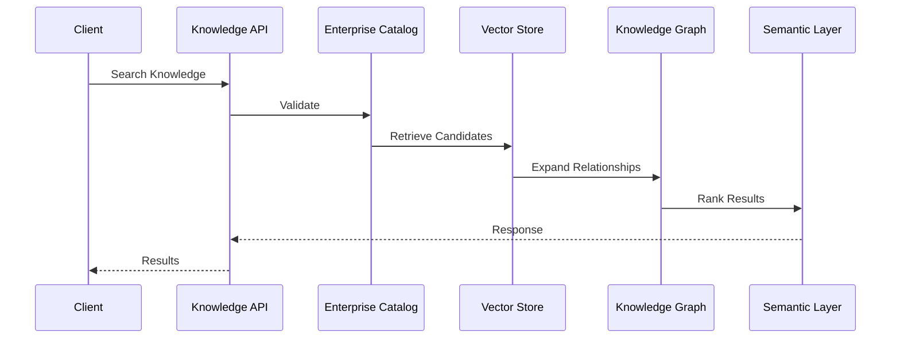

# Enterprise AI Software Factory
# Architecture Design Specification (ADS)

> **Document ID:** ADS-033-v3
>
> **Document Name:** Enterprise Data Platform & Knowledge Fabric — APIs, Events & Contracts
>
> **Version:** 2.0.0
>
> **Classification:** Enterprise Platform Plane
>
> **Importance:** CRITICAL
>
> **Depends On:** ADS-033-v1
>
> **Depends On:** ADS-033-v2
>
> **Next:** ADS-033-v4 — Runtime & Knowledge Infrastructure

---

# Executive Summary

The Enterprise Data Platform & Knowledge Fabric exposes standardized APIs for data ingestion, metadata management, catalog registration, lineage tracking, semantic modeling, vector indexing, enterprise search, governance, and knowledge retrieval.

Every knowledge lifecycle activity occurs through these contracts.

Knowledge implementations may evolve.

Knowledge contracts remain stable.

---

# Communication Principles

Every knowledge request MUST satisfy

- Authenticated
- Authorized
- Versioned
- Observable
- Traceable
- Governed
- Secure
- Tenant Isolated

No enterprise knowledge bypasses the Knowledge Platform.

---

# Knowledge Communication Architecture



Enterprise Catalog coordinates every knowledge lifecycle operation.

---

# Public REST API

The Knowledge Platform exposes APIs for

- Enterprise Catalog
- Metadata Registry
- Lineage Engine
- Semantic Layer
- Vector Store
- Knowledge Graph
- Enterprise Search
- Governance Services

---

## API-033-001

### Register Knowledge Asset

```http
POST /knowledge/v1/assets
```

Purpose

Registers a Knowledge Asset.

---

Request

```json
{
  "assetType":"Dataset",
  "sourceSystem":"Sales",
  "classification":"Internal",
  "version":"1.0.0"
}
```

---

Response

```json
{
  "knowledgeRecordId":"KR-051",
  "status":"Registered"
}
```

---

## API-033-002

### Update Metadata

```http
PUT /knowledge/v1/metadata/{assetId}
```

Updates governed metadata for an existing asset.

---

## API-033-003

### Create Lineage

```http
POST /knowledge/v1/lineage
```

Creates a Lineage Record.

---

## API-033-004

### Index Vectors

```http
POST /knowledge/v1/vector-indexes
```

Creates or updates a governed vector index.

---

## API-033-005

### Search Knowledge

```http
POST /knowledge/v1/search
```

Performs governed enterprise knowledge retrieval.

---

# Internal gRPC Services

```protobuf
service KnowledgeService {

rpc RegisterKnowledgeAsset(KnowledgeRequest)
returns(KnowledgeResponse);

rpc UpdateMetadata(MetadataRequest)
returns(MetadataResponse);

rpc CreateLineage(LineageRequest)
returns(LineageResponse);

rpc IndexVectors(VectorRequest)
returns(VectorResponse);

rpc SearchKnowledge(SearchRequest)
returns(SearchResponse);

}
```

---

# Knowledge Asset Schema

```protobuf
message KnowledgeAsset {

string asset_id = 1;

string asset_type = 2;

string source_system = 3;

string classification = 4;

string version = 5;

string governance_status = 6;

}
```

---

# Knowledge Record Schema

```protobuf
message KnowledgeRecord {

string knowledge_record_id = 1;

string asset_id = 2;

string storage_location = 3;

string storage_type = 4;

string lifecycle_status = 5;

}
```

---

# Lineage Record Schema

```protobuf
message LineageRecord {

string lineage_record_id = 1;

string knowledge_record_id = 2;

string transformation_pipeline = 3;

string validation_status = 4;

string generated_at = 5;

}
```

---

# MCP Tool Contracts

The Knowledge Platform exposes

```
register_knowledge_asset

update_metadata

create_lineage

index_vectors

search_knowledge

query_catalog

knowledge_diagnostics

lineage_visualization
```

Every invocation is authenticated and audited.

---

# Knowledge Events

Every lifecycle activity emits immutable events.

---

## EVT-033-001

KnowledgeAssetRegistered

---

## EVT-033-002

MetadataUpdated

---

## EVT-033-003

LineageGenerated

---

## EVT-033-004

VectorIndexCreated

---

## EVT-033-005

KnowledgePublished

---

## EVT-033-006

KnowledgeRetrieved

---

## EVT-033-007

QualityValidated

---

## EVT-033-008

KnowledgeArchived

---

# Event Flow



---

# Event Ordering

```text
KnowledgeAssetRegistered

↓

MetadataUpdated

↓

LineageGenerated

↓

QualityValidated

↓

KnowledgePublished

↓

KnowledgeRetrieved
```

---

# Event Metadata

Every event contains

```yaml
eventId:
assetId:
knowledgeRecordId:
lineageRecordId:
traceId:
timestamp:
schemaVersion:
```

---

# Request Validation

Every knowledge lifecycle request follows a deterministic validation pipeline.

```text
Receive Request

↓

Schema Validation

↓

Authentication

↓

Authorization

↓

Knowledge Validation

↓

Governance Validation

↓

Quality Validation

↓

Execution
```

Execution begins only after successful validation.

---

# Validation Rules

Every request MUST satisfy

| Rule | Description |
|------|-------------|
| API Version | Supported lifecycle contract |
| Authentication | Valid identity |
| Authorization | Approved operation |
| Knowledge Version | Registered asset |
| Metadata | Valid metadata profile |
| Governance | Approved lifecycle stage |
| Quality | Data quality thresholds satisfied |
| Tenant | Tenant isolation enforced |

Validation failures reject the request.

---

# Authentication

Knowledge authentication supports

- OAuth 2.1
- Mutual TLS
- API Keys
- JWT
- OpenID Connect
- SPIFFE / SPIRE

Anonymous knowledge operations are prohibited.

---

# Authorization

Authorization evaluates

- User Identity
- Organization
- Knowledge Ownership
- Access Policies
- Classification Level
- Governance Rules

Decision

```text
Allow

↓

Execute

Deny

↓

Reject

Review

↓

Governance Approval
```

Every authorization decision is audited.

---

# Retrieval Session

Every governed retrieval creates an immutable Retrieval Session.

```yaml
retrievalSession:

  sessionId:

  knowledgeRecord:

  queryProfile:

  retrievalStrategy:

  semanticFilters:

  vectorFilters:

  graphTraversal:

  retrievedAssets:

  rankingProfile:

  completedAt:
```

Retrieval Sessions remain immutable.

---

# Runtime Sequence



---

# Retrieval Policies

Supported policies

| Policy | Purpose |
|---------|----------|
| Classification Filters | Protect sensitive knowledge |
| Tenant Isolation | Organization separation |
| Metadata Constraints | Controlled discovery |
| Semantic Ranking | Relevant results |
| Freshness | Prefer recent knowledge |
| Lineage Validation | Trusted provenance |

Policies remain version-controlled.

---

# Distributed Tracing

Every knowledge lifecycle operation includes

- Trace ID
- Knowledge Asset ID
- Knowledge Record ID
- Lineage Record ID
- Retrieval Session ID

Trace Flow

```text
Knowledge API

↓

Enterprise Catalog

↓

Metadata Registry

↓

Vector Store

↓

Knowledge Graph

↓

Semantic Layer

↓

Knowledge Ledger
```

Every stage contributes trace spans.

---

# Prometheus Metrics

```text
knowledge_assets_total

knowledge_records_total

retrieval_sessions_total

metadata_updates_total

lineage_records_total

vector_queries_total

graph_traversals_total

quality_validation_runs_total

knowledge_retrieval_latency_seconds

knowledge_runtime_health_score
```

---

# Structured Logging

Example

```json
{
  "traceId":"trace-41752",
  "knowledgeAsset":"KA-214",
  "knowledgeRecord":"KR-051",
  "lineageRecord":"LR-022",
  "retrievalSession":"RS-318",
  "retrievalStrategy":"Hybrid",
  "status":"Success"
}
```

Logs remain immutable and correlated.

---

# Audit Records

Every knowledge lifecycle operation records

- Knowledge Asset
- Knowledge Record
- Lineage Record
- Retrieval Session
- Workflow ID
- Trace ID
- Timestamp
- Knowledge Version

Audit history is append-only.

---

# Reference Standards & Specifications

The Knowledge Platform aligns with

| Standard | Purpose |
|----------|---------|
| OpenMetadata | Metadata management |
| Apache Atlas | Data governance & lineage |
| OpenLineage | Pipeline lineage |
| OpenTelemetry | Distributed tracing |
| OpenAPI 3.1 | REST APIs |
| Apache Iceberg | Table format |
| Delta Lake | Lakehouse transactions |
| NIST SP 800-53 | Enterprise security controls |

---

# Architecture Decision Records

## ADR-033-06

### Decision

Represent every governed retrieval as a Retrieval Session.

### Status

Accepted

### Reason

Retrieval Sessions provide replayability, auditability, retrieval analytics, governance evidence, and production observability.

---

## ADR-033-07

### Decision

Separate lineage management from runtime retrieval.

### Status

Accepted

### Reason

Lineage captures provenance, while retrieval captures operational knowledge access and optimization.

---

## ADR-033-08

### Decision

Require governed retrieval before enterprise knowledge consumption.

### Status

Accepted

### Reason

Governed retrieval improves security, trust, explainability, and compliance.

---

# Operational Readiness Scorecard

| Capability | Status |
|------------|--------|
| Knowledge Assets | ✅ Required |
| Knowledge Records | ✅ Required |
| Lineage Records | ✅ Required |
| Retrieval Sessions | ✅ Required |
| Distributed Tracing | ✅ Required |
| Immutable Audit | ✅ Required |
| Standards Compliance | ✅ Required |
| Governed Retrieval | ✅ Required |

---

# Related Documents

ADS-021-v5 — Workflow Kernel

ADS-022-v5 — Identity & Trust Plane

ADS-023-v5 — Enterprise Memory Plane

ADS-024-v5 — Agent Execution Platform

ADS-025-v5 — Compute & Infrastructure Platform

ADS-026-v5 — Security Platform

ADS-027-v5 — Observability Platform

ADS-028-v5 — Governance Platform

ADS-029-v5 — Developer Experience Platform

ADS-030-v5 — Integration & Ecosystem Platform

ADS-031-v5 — Operations & Platform Administration

ADS-032-v5 — AI/ML & Model Lifecycle Platform

ADS-033-v1 — Enterprise Data Platform & Knowledge Fabric

ADS-033-v2 — Data Lifecycle Algorithms & Knowledge Framework

ADS-033-v4 — Runtime & Knowledge Infrastructure

---

# End of Document
