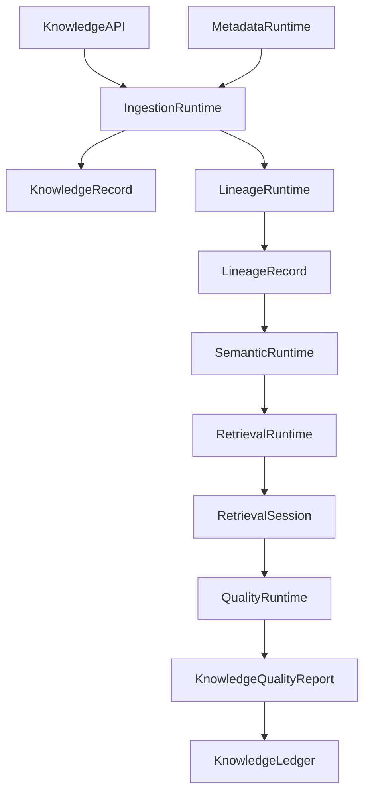

# Enterprise AI Software Factory
# Architecture Design Specification (ADS)

> **Document ID:** ADS-033-v4
>
> **Document Name:** Enterprise Data Platform & Knowledge Fabric — Runtime & Knowledge Infrastructure
>
> **Version:** 2.0.0
>
> **Classification:** Enterprise Runtime Specification
>
> **Importance:** CRITICAL
>
> **Depends On:** ADS-033-v1
>
> **Depends On:** ADS-033-v2
>
> **Depends On:** ADS-033-v3
>
> **Next:** ADS-033-v5 — End-to-End Knowledge Lifecycle

---

# Executive Summary

This document defines the runtime infrastructure responsible for continuously operating the Enterprise Knowledge Fabric.

The runtime manages data ingestion, metadata synchronization, semantic indexing, vector retrieval, lineage generation, knowledge graph updates, enterprise search, and quality validation while maintaining deterministic, governed, and observable knowledge services.

The Knowledge Runtime serves as the execution kernel for all enterprise knowledge operations.

---

# Runtime Philosophy

The Knowledge Runtime follows seven principles.

- Catalog First
- Metadata Driven
- Immutable Lineage
- Continuous Quality Validation
- Governed Retrieval
- Deterministic Knowledge Processing
- Continuous Availability

Runtime execution never bypasses governance.

---

# Runtime Layers

## Ingestion Runtime

Responsible for

- Data Ingestion
- Schema Validation
- Source Registration
- Asset Synchronization

---

## Metadata Runtime

Responsible for

- Metadata Updates
- Classification
- Ownership Management
- Catalog Synchronization

---

## Semantic Runtime

Responsible for

- Semantic Modeling
- Ontology Resolution
- Taxonomy Management
- Business Vocabulary

---

## Retrieval Runtime

Responsible for

- Hybrid Search
- Vector Retrieval
- Graph Traversal
- Result Ranking

---

## Quality Runtime

Responsible for

- Data Quality Validation
- Freshness Monitoring
- Completeness Analysis
- Consistency Validation

---

# Runtime Architecture



Knowledge Runtime coordinates every enterprise knowledge operation.

---

# Runtime Components

| Component | Responsibility |
|------------|----------------|
| Ingestion Runtime | Enterprise data ingestion |
| Metadata Runtime | Metadata lifecycle |
| Semantic Runtime | Semantic processing |
| Retrieval Runtime | Enterprise search |
| Lineage Runtime | Provenance generation |
| Quality Runtime | Knowledge validation |
| Runtime Monitor | Runtime health |
| Knowledge Ledger | Immutable knowledge history |

---

# Runtime Pipeline

```text
Knowledge Request

↓

Metadata Resolution

↓

Governance Validation

↓

Retrieval Strategy

↓

Knowledge Processing

↓

Quality Validation

↓

Knowledge Ledger
```

Every knowledge operation follows this lifecycle.

---

# Ingestion Runtime

Ingestion Runtime manages

- Source Discovery
- Schema Evolution
- Asset Registration
- Incremental Synchronization
- Validation

Knowledge ingestion remains deterministic.

---

# Retrieval Runtime

Retrieval Runtime coordinates

- Catalog Search
- Semantic Search
- Vector Search
- Knowledge Graph Traversal
- Hybrid Ranking

Knowledge retrieval remains reproducible.

---

# Retrieval Session Management

Every runtime session tracks

- Knowledge Record
- Query Profile
- Retrieval Strategy
- Retrieved Assets
- Ranking Profile
- Governance Decisions
- Quality Validation

Retrieval Sessions remain immutable.

---

# Runtime Guarantees

The Knowledge Runtime guarantees

- Deterministic Retrieval
- Immutable Lineage
- Continuous Quality Validation
- Metadata Consistency
- Explainable Search
- Governed Access
- Policy Enforcement

---

# End of Part 1
