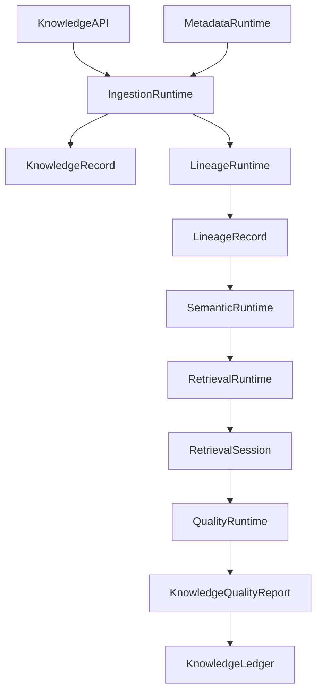
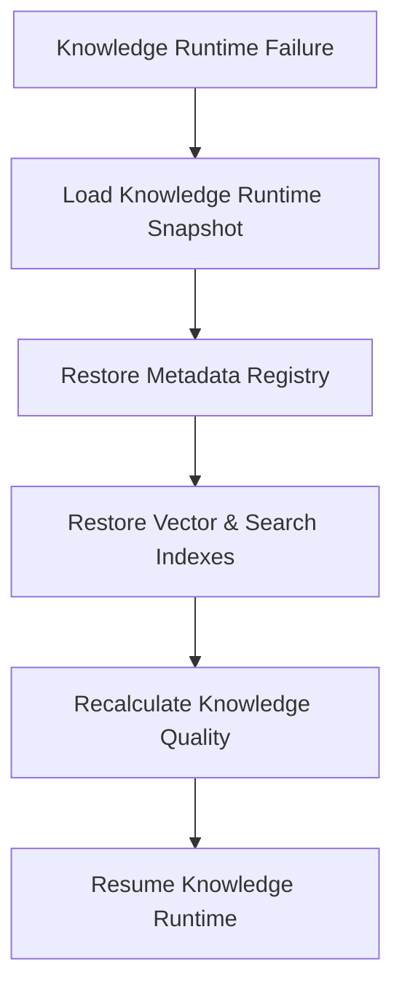

# Enterprise AI Software Factory
# Architecture Design Specification (ADS)

> **Document ID:** ADS-033-v4
>
> **Document Name:** Enterprise Data Platform & Knowledge Fabric — Runtime & Knowledge Infrastructure
>
> **Version:** 2.0.0
>
> **Classification:** Enterprise Runtime Specification
>
> **Importance:** CRITICAL
>
> **Depends On:** ADS-033-v1
>
> **Depends On:** ADS-033-v2
>
> **Depends On:** ADS-033-v3
>
> **Next:** ADS-033-v5 — End-to-End Knowledge Lifecycle

---

# Executive Summary

This document defines the runtime infrastructure responsible for continuously operating the Enterprise Knowledge Fabric.

The runtime manages data ingestion, metadata synchronization, semantic indexing, vector retrieval, lineage generation, knowledge graph updates, enterprise search, and quality validation while maintaining deterministic, governed, and observable knowledge services.

The Knowledge Runtime serves as the execution kernel for all enterprise knowledge operations.

---

# Runtime Philosophy

The Knowledge Runtime follows seven principles.

- Catalog First
- Metadata Driven
- Immutable Lineage
- Continuous Quality Validation
- Governed Retrieval
- Deterministic Knowledge Processing
- Continuous Availability

Runtime execution never bypasses governance.

---

# Runtime Layers

## Ingestion Runtime

Responsible for

- Data Ingestion
- Schema Validation
- Source Registration
- Asset Synchronization

---

## Metadata Runtime

Responsible for

- Metadata Updates
- Classification
- Ownership Management
- Catalog Synchronization

---

## Semantic Runtime

Responsible for

- Semantic Modeling
- Ontology Resolution
- Taxonomy Management
- Business Vocabulary

---

## Retrieval Runtime

Responsible for

- Hybrid Search
- Vector Retrieval
- Graph Traversal
- Result Ranking

---

## Quality Runtime

Responsible for

- Data Quality Validation
- Freshness Monitoring
- Completeness Analysis
- Consistency Validation

---

# Runtime Architecture



Knowledge Runtime coordinates every enterprise knowledge operation.

---

# Runtime Components

| Component | Responsibility |
|------------|----------------|
| Ingestion Runtime | Enterprise data ingestion |
| Metadata Runtime | Metadata lifecycle |
| Semantic Runtime | Semantic processing |
| Retrieval Runtime | Enterprise search |
| Lineage Runtime | Provenance generation |
| Quality Runtime | Knowledge validation |
| Runtime Monitor | Runtime health |
| Knowledge Ledger | Immutable knowledge history |

---

# Runtime Pipeline

```text
Knowledge Request

↓

Metadata Resolution

↓

Governance Validation

↓

Retrieval Strategy

↓

Knowledge Processing

↓

Quality Validation

↓

Knowledge Ledger
```

Every knowledge operation follows this lifecycle.

---

# Ingestion Runtime

Ingestion Runtime manages

- Source Discovery
- Schema Evolution
- Asset Registration
- Incremental Synchronization
- Validation

Knowledge ingestion remains deterministic.

---

# Retrieval Runtime

Retrieval Runtime coordinates

- Catalog Search
- Semantic Search
- Vector Search
- Knowledge Graph Traversal
- Hybrid Ranking

Knowledge retrieval remains reproducible.

---

# Retrieval Session Management

Every runtime session tracks

- Knowledge Record
- Query Profile
- Retrieval Strategy
- Retrieved Assets
- Ranking Profile
- Governance Decisions
- Quality Validation

Retrieval Sessions remain immutable.

---

# Runtime Guarantees

The Knowledge Runtime guarantees

- Deterministic Retrieval
- Immutable Lineage
- Continuous Quality Validation
- Metadata Consistency
- Explainable Search
- Governed Access
- Policy Enforcement

---

# Failure Recovery

The Knowledge Runtime automatically recovers from ingestion, indexing, and retrieval failures while preserving knowledge integrity.

Recovery follows approved governance and recovery policies.



Recovery guarantees

- No knowledge corruption
- No metadata inconsistency
- No lineage loss
- Deterministic recovery

---

# Runtime Health Monitoring

Every runtime component continuously reports health.

Collected metrics

- Ingestion Runtime Health
- Metadata Runtime Health
- Semantic Runtime Health
- Retrieval Runtime Health
- Lineage Runtime Health
- Quality Runtime Health
- Active Retrieval Sessions
- Index Synchronization Status

Health Flow

```text
Runtime Component

↓

Heartbeat

↓

Knowledge Runtime Monitor

↓

Knowledge Operations Dashboard

↓

Alert Engine

↓

Knowledge Operations Team
```

Health monitoring remains continuous.

---

# Knowledge Runtime Snapshot

The runtime periodically generates Knowledge Runtime Snapshots.

```yaml
knowledgeRuntimeSnapshot:

  snapshotId:

  generatedAt:

  activeKnowledgeAssets:

  activeRetrievalSessions:

  ingestionStatus:

  metadataStatus:

  vectorIndexStatus:

  graphStatus:

  qualityStatus:

  runtimeHealth:

  throughput:
```

Knowledge Runtime Snapshots provide deterministic operational state.

---

# Runtime Configuration

Example

```yaml
knowledgeRuntime:

  continuousIngestion: enabled

  metadataSynchronization: enabled

  hybridRetrieval: enabled

  lineageValidation: enabled

  qualityMonitoring: enabled

  runtimeSnapshots: enabled

  semanticIndexUpdates: automatic

  snapshotInterval: 10m
```

Configuration remains version-controlled.

---

# Knowledge Scaling

Knowledge Runtime supports

- Horizontal Ingestion
- Distributed Metadata Processing
- Elastic Vector Indexing
- Knowledge Graph Scaling
- Federated Search

Scaling remains policy-driven.

---

# Runtime Isolation

Knowledge Runtime isolates

- Ingestion Pipelines
- Retrieval Sessions
- Metadata Updates
- Semantic Processing
- Quality Validation
- Lineage Generation

Isolation prevents cross-domain interference.

---

# Prometheus Metrics

```text
knowledge_runtime_snapshots_total

active_knowledge_assets_total

active_retrieval_sessions_total

ingestion_pipeline_latency_seconds

metadata_sync_duration_seconds

vector_index_update_seconds

knowledge_graph_update_seconds

quality_validation_duration_seconds

retrieval_latency_seconds

knowledge_runtime_health_score
```

---

# OpenTelemetry

Distributed tracing spans

```text
Knowledge API

↓

Ingestion Runtime

↓

Metadata Runtime

↓

Semantic Runtime

↓

Retrieval Runtime

↓

Quality Runtime

↓

Knowledge Ledger
```

Every runtime stage contributes trace spans.

---

# Structured Logging

Example

```json
{
  "knowledgeRecord":"KR-051",
  "runtimeSnapshot":"KRS-018",
  "retrievalSession":"RS-318",
  "qualityReport":"KQR-044",
  "runtimeHealth":"Healthy",
  "retrievalStrategy":"Hybrid"
}
```

Logs remain immutable and correlated.

---

# Disaster Recovery

Recovery flow

```text
Knowledge Runtime Failure

↓

Restore Knowledge Runtime Snapshot

↓

Restore Metadata Registry

↓

Rebuild Vector Indexes

↓

Validate Knowledge Quality

↓

Resume Runtime
```

Recovery targets

Recovery Point Objective (RPO)

Near-zero knowledge state loss

Recovery Time Objective (RTO)

Less than five minutes

---

# Recommended Production Deployment

```text
Knowledge API

↓

Ingestion Runtime

↓

Metadata Runtime

↓

Semantic Runtime

↓

Retrieval Runtime

↓

Lineage Runtime

↓

Quality Runtime

↓

Knowledge Ledger

↓

OpenTelemetry

↓

Prometheus

↓

Grafana
```

---

# Technology Decision Records

## TDR-033-01

### Technology

Apache Iceberg

### Decision

Use Apache Iceberg as the primary enterprise table format.

### Reason

Provides ACID transactions, schema evolution, partition evolution, and time travel.

---

## TDR-033-02

### Technology

OpenSearch

### Decision

Use OpenSearch for enterprise full-text indexing and hybrid retrieval.

### Reason

Supports scalable search, filtering, ranking, and analytics.

---

## TDR-033-03

### Technology

Knowledge Runtime Snapshot

### Decision

Persist periodic Knowledge Runtime Snapshots.

### Reason

Supports diagnostics, recovery, operational visibility, and capacity planning.

---

## TDR-033-04

### Technology

Apache Atlas

### Decision

Use Apache Atlas for enterprise metadata governance and lineage.

### Reason

Provides metadata management, governance integration, and end-to-end lineage.

---

## TDR-033-05

### Technology

Neo4j

### Decision

Support Neo4j as the default enterprise knowledge graph backend.

### Reason

Enables scalable graph traversal, semantic relationships, and explainable knowledge exploration.

---

# Runtime Checklist

The Knowledge Platform MUST

- Generate Knowledge Runtime Snapshots
- Continuously validate knowledge quality
- Preserve immutable lineage
- Support deterministic retrieval
- Maintain metadata consistency
- Continuously monitor runtime health
- Enforce governed knowledge access

The Knowledge Platform MUST NOT

- Publish unvalidated knowledge
- Bypass governance approval
- Lose lineage history
- Execute retrieval without authorization
- Allow cross-domain runtime interference

---

# Architecture Decision Records

## ADR-033-09

### Decision

Treat Knowledge Runtime Snapshots as immutable runtime artifacts.

### Status

Accepted

### Reason

Snapshots improve diagnostics, recovery, capacity planning, and operational visibility.

---

## ADR-033-10

### Decision

Separate metadata processing from retrieval execution.

### Status

Accepted

### Reason

Metadata management evolves independently from retrieval infrastructure and improves scalability.

---

## ADR-033-11

### Decision

Execute every enterprise retrieval within an isolated Retrieval Session.

### Status

Accepted

### Reason

Session isolation improves governance, reproducibility, observability, and operational reliability.

---

# Operational Readiness Scorecard

| Capability | Status |
|------------|--------|
| Knowledge Runtime | ✅ Required |
| Runtime Snapshots | ✅ Required |
| Metadata Runtime | ✅ Required |
| Retrieval Runtime | ✅ Required |
| Runtime Recovery | ✅ Required |
| Continuous Quality Validation | ✅ Required |
| Governed Retrieval | ✅ Required |
| Deterministic Processing | ✅ Required |

---

# Related Documents

ADS-021-v5 — Workflow Kernel

ADS-022-v5 — Identity & Trust Plane

ADS-023-v5 — Enterprise Memory Plane

ADS-024-v5 — Agent Execution Platform

ADS-025-v5 — Compute & Infrastructure Platform

ADS-026-v5 — Security Platform

ADS-027-v5 — Observability Platform

ADS-028-v5 — Governance Platform

ADS-029-v5 — Developer Experience Platform

ADS-030-v5 — Integration & Ecosystem Platform

ADS-031-v5 — Operations & Platform Administration

ADS-032-v5 — AI/ML & Model Lifecycle Platform

ADS-033-v1 — Enterprise Data Platform & Knowledge Fabric

ADS-033-v2 — Data Lifecycle Algorithms & Knowledge Framework

ADS-033-v3 — APIs, Events & Contracts

ADS-033-v5 — End-to-End Knowledge Lifecycle

---

# End of Document
