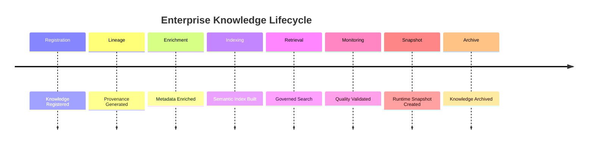

# Enterprise AI Software Factory
# Architecture Design Specification (ADS)

> **Document ID:** ADS-033-v5
>
> **Document Name:** Enterprise Data Platform & Knowledge Fabric — End-to-End Knowledge Lifecycle
>
> **Version:** 2.0.0
>
> **Classification:** Reference Implementation
>
> **Importance:** CRITICAL
>
> **Depends On:** ADS-033-v1
>
> **Depends On:** ADS-033-v2
>
> **Depends On:** ADS-033-v3
>
> **Depends On:** ADS-033-v4

---

# Executive Summary

This document demonstrates how the Enterprise Data Platform & Knowledge Fabric manages the complete lifecycle of enterprise knowledge—from ingestion and registration through governance, semantic enrichment, retrieval, monitoring, and archival.

It illustrates how Knowledge Assets, Knowledge Records, Lineage Records, Retrieval Sessions, Knowledge Quality Reports, Knowledge Runtime Snapshots, and Knowledge Ledger Entries interact throughout real enterprise knowledge operations.

Every knowledge asset is governed.

Every retrieval is explainable.

Every transformation is reproducible.

---

# Scenario

An enterprise ingests customer-support documentation from multiple business systems and exposes governed semantic search for AI agents, analysts, and business users.

Participating systems

- Knowledge Platform
- Workflow Kernel
- Memory Plane
- Model Lifecycle Platform
- Governance Platform
- Observability Platform
- Operations Platform

---

# Stage 1 — Knowledge Registration

Generated

```
KA-2027-018
```

Knowledge Asset contains

- Source System
- Classification
- Schema
- Ownership
- Governance Status
- Version

Knowledge Asset becomes immutable.

---

# Stage 2 — Knowledge Record

Generated

```
KR-2027-011
```

Knowledge Record includes

- Storage Location
- Storage Type
- Indexing Profile
- Vector Collection
- Lifecycle Status

Knowledge Record archived.

---

# Stage 3 — Lineage Generation

Generated

```
LR-2027-019
```

Lineage captures

- Source Assets
- Transformation Pipeline
- Processing Stages
- Downstream Consumers
- Provenance Hash

Lineage Record archived.

---

# Stage 4 — Metadata Enrichment

Metadata Registry validates

- Technical Metadata
- Business Metadata
- Classification
- Ownership
- Semantic Tags

Metadata enrichment succeeds.

---

# Stage 5 — Semantic Indexing

Knowledge Platform creates

- Vector Embeddings
- Search Indexes
- Graph Relationships
- Semantic Models

Indexing completes successfully.

---

# Stage 6 — Knowledge Retrieval

Generated

```
RS-2027-094
```

Retrieval Session records

- Query Profile
- Retrieval Strategy
- Retrieved Assets
- Ranking Profile
- Governance Decisions

Knowledge retrieval succeeds.

---

# Stage 7 — Quality Validation

Generated

```
KQR-2027-015
```

Quality metrics

- Completeness: 99.4%
- Accuracy: 99.2%
- Consistency: 99.8%
- Timeliness: 98.7%
- Overall Score: 99.3%

Knowledge remains Trusted.

---

# Stage 8 — Runtime Snapshot

Generated

```
KRS-2027-007
```

Snapshot contains

- Active Knowledge Assets
- Active Retrieval Sessions
- Metadata Status
- Runtime Health
- Throughput

Snapshot archived.

---

# Stage 9 — Runtime Monitoring

Knowledge Runtime continuously evaluates

- Ingestion Health
- Metadata Synchronization
- Retrieval Performance
- Quality Scores
- Lineage Integrity

No anomalies detected.

---

# Stage 10 — Knowledge Ledger

Generated

```
KL-2027-026
```

Ledger Entry references

- Knowledge Asset
- Knowledge Record
- Lineage Record
- Retrieval Session
- Knowledge Quality Report
- Runtime Snapshot

Entry becomes immutable.

---

# Stage 11 — Knowledge Evolution

Knowledge asset updated

```
v2.4.0

↓

v2.5.0
```

Metadata, lineage, and semantic indexes remain synchronized.

No governance violations occur.

---

# Stage 12 — Archival

Knowledge asset retired after replacement.

Archived artifacts

- Knowledge Asset
- Knowledge Record
- Lineage Record
- Retrieval Session
- Knowledge Quality Report
- Runtime Snapshot
- Knowledge Ledger Entry

Knowledge lifecycle remains fully reproducible.

---

# Knowledge Timeline



---

# Knowledge Event Stream

```text
KnowledgeAssetRegistered

↓

LineageGenerated

↓

MetadataEnriched

↓

SemanticIndexBuilt

↓

KnowledgeRetrieved

↓

QualityValidated

↓

RuntimeSnapshotCreated

↓

KnowledgeLedgerWritten

↓

KnowledgeArchived
```

---

# Produced Artifacts

| Artifact | Identifier |
|-----------|------------|
| Knowledge Asset | KA-2027-018 |
| Knowledge Record | KR-2027-011 |
| Lineage Record | LR-2027-019 |
| Retrieval Session | RS-2027-094 |
| Knowledge Quality Report | KQR-2027-015 |
| Knowledge Runtime Snapshot | KRS-2027-007 |
| Knowledge Ledger Entry | KL-2027-026 |

---

# Runtime Metrics

| Metric | Value |
|---------|------:|
| Registered Knowledge Assets | 2.6 M |
| Active Retrieval Sessions | 138 K |
| Average Retrieval Latency | 148 ms |
| Metadata Synchronization Success | 99.99% |
| Quality Validation Success | 99.8% |
| Semantic Index Updates | 12,400/day |
| Lineage Coverage | 100% |
| Runtime Availability | 99.99% |

---

# Operational Readiness Scorecard

| Capability | Status |
|------------|--------|
| Knowledge Assets | ✅ Verified |
| Knowledge Records | ✅ Verified |
| Lineage Records | ✅ Verified |
| Retrieval Sessions | ✅ Verified |
| Knowledge Quality Reports | ✅ Verified |
| Runtime Snapshots | ✅ Verified |
| Knowledge Ledger | ✅ Verified |
| Deterministic Lifecycle | ✅ Verified |

---

# Lessons Learned

The Enterprise Data Platform & Knowledge Fabric demonstrates the following principles.

- Knowledge Assets define authoritative enterprise knowledge.
- Knowledge Records separate managed implementations from logical definitions.
- Lineage Records preserve provenance and transformation history.
- Retrieval Sessions capture governed runtime knowledge access.
- Knowledge Quality Reports provide objective trust assessments.
- Knowledge Runtime Snapshots enable deterministic operational recovery.
- Knowledge Ledger Entries preserve immutable enterprise knowledge history.

---

# Architecture Decision Record

## ADR-033-12

### Decision

Represent enterprise knowledge as a deterministic lifecycle composed of immutable knowledge artifacts.

### Status

Accepted

### Reason

Artifact-centric knowledge improves governance, reproducibility, explainability, operational visibility, regulatory compliance, and enterprise-scale AI readiness.

---

# Technology Decision Record

## TDR-033-06

### Technology

Enterprise Knowledge Fabric

### Decision

Implement a centralized Enterprise Data Platform & Knowledge Fabric responsible for data ingestion, metadata management, semantic modeling, vector indexing, lineage tracking, governed retrieval, quality validation, and immutable knowledge history.

### Reason

A unified Knowledge Fabric enables trusted enterprise knowledge for AI, analytics, automation, and business operations while maintaining governance, observability, reproducibility, and explainability.

---

# Related Documents

ADS-021-v5 — Workflow Kernel

ADS-022-v5 — Identity & Trust Plane

ADS-023-v5 — Enterprise Memory Plane

ADS-024-v5 — Agent Execution Platform

ADS-025-v5 — Compute & Infrastructure Platform

ADS-026-v5 — Security Platform

ADS-027-v5 — Observability Platform

ADS-028-v5 — Governance Platform

ADS-029-v5 — Developer Experience Platform

ADS-030-v5 — Integration & Ecosystem Platform

ADS-031-v5 — Operations & Platform Administration

ADS-032-v5 — AI/ML & Model Lifecycle Platform

ADS-033-v1 — Enterprise Data Platform & Knowledge Fabric

ADS-033-v2 — Data Lifecycle Algorithms & Knowledge Framework

ADS-033-v3 — APIs, Events & Contracts

ADS-033-v4 — Runtime & Knowledge Infrastructure

---

# End of Document
