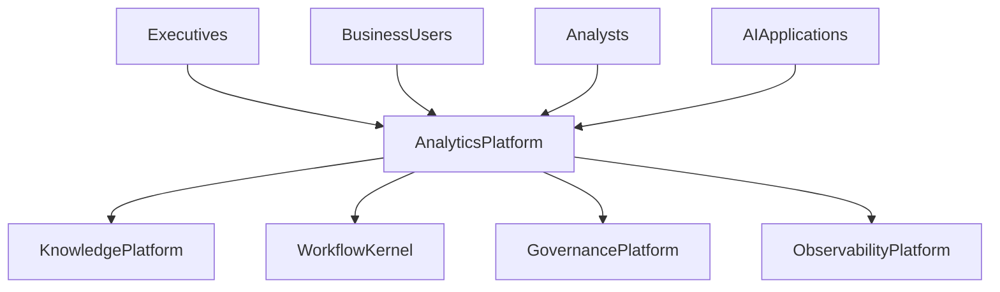
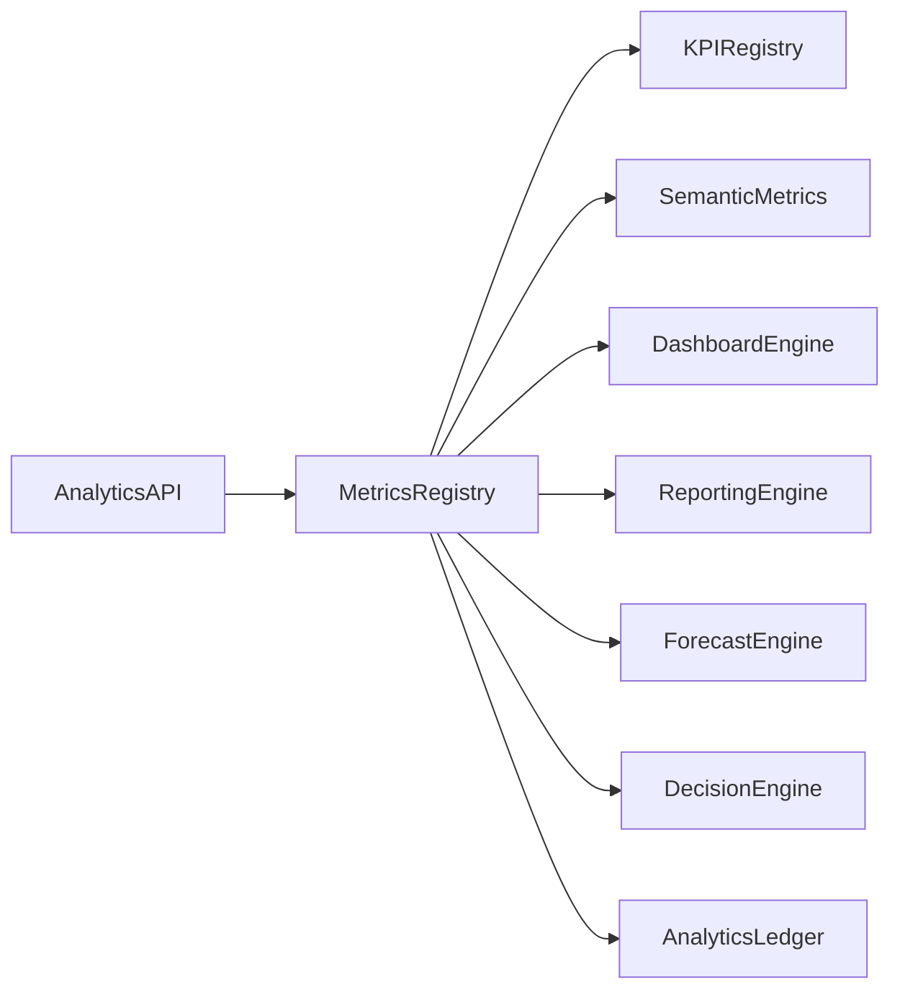

# Enterprise AI Software Factory
# Architecture Design Specification (ADS)

> **Document ID:** ADS-034-v1
>
> **Document Name:** Enterprise Analytics & Business Intelligence — Architecture
>
> **Version:** 2.0.0
>
> **Classification:** Enterprise Platform Plane
>
> **Importance:** CRITICAL
>
> **Depends On:** ADS-021-v5
>
> **Depends On:** ADS-022-v5
>
> **Depends On:** ADS-023-v5
>
> **Depends On:** ADS-024-v5
>
> **Depends On:** ADS-025-v5
>
> **Depends On:** ADS-026-v5
>
> **Depends On:** ADS-027-v5
>
> **Depends On:** ADS-028-v5
>
> **Depends On:** ADS-029-v5
>
> **Depends On:** ADS-030-v5
>
> **Depends On:** ADS-031-v5
>
> **Depends On:** ADS-032-v5
>
> **Depends On:** ADS-033-v5
>
> **Next:** ADS-034-v2 — Analytics Algorithms & Decision Intelligence Framework

---

# Executive Summary

The Enterprise Analytics & Business Intelligence Platform provides centralized management for enterprise metrics, KPIs, dashboards, semantic metrics, OLAP cubes, executive reporting, forecasting, business insights, and decision intelligence.

The platform transforms governed enterprise knowledge into trusted, explainable, and actionable business decisions.

Decisions become first-class enterprise assets.

---

# Why This System Exists

Enterprise knowledge alone does not create business value.

Organizations must continuously

- Measure KPIs
- Monitor Business Performance
- Build Dashboards
- Generate Reports
- Forecast Trends
- Detect Anomalies
- Analyze Performance
- Compare Time Periods
- Recommend Actions
- Support Executive Decisions

The Analytics Platform standardizes these responsibilities.

---

# Core Philosophy

Measure Everything.

Explain Every Insight.

Govern Every Metric.

Enable Better Decisions.

---

# Design Goals

The platform provides

- Metrics Registry
- KPI Registry
- Semantic Metrics Layer
- Dashboard Engine
- Reporting Engine
- OLAP Engine
- Forecasting Engine
- Decision Intelligence Engine
- Analytics Governance
- Analytics Ledger

---

# Architectural Position

Every enterprise decision flows through the Analytics Platform.

---

# High-Level Architecture

The Metrics Registry coordinates the complete analytics lifecycle.

---

# Major Components

| Component | Responsibility |
|------------|----------------|
| Analytics API | Public analytics interface |
| Metrics Registry | Metric lifecycle |
| KPI Registry | KPI definitions |
| Semantic Metrics | Business metrics |
| Dashboard Engine | Visual analytics |
| Reporting Engine | Enterprise reporting |
| Forecast Engine | Predictive analytics |
| Decision Engine | Decision intelligence |
| Analytics Ledger | Immutable analytics history |

---

# Analytics Domains

| Domain | Purpose |
|---------|---------|
| KPIs | Business performance |
| Metrics | Operational measurements |
| Dashboards | Visualization |
| Reports | Executive reporting |
| Forecasting | Predictive insights |
| OLAP | Multidimensional analysis |
| Decision Intelligence | Recommendations |
| Alerts | Threshold monitoring |

Every domain follows a governed lifecycle.

---

# Analytics Principles

The platform follows

- Metric First
- Explainable Analytics
- Governed KPIs
- Continuous Measurement
- Semantic Consistency
- Reproducible Insights
- Immutable Decision History

---

# Analytics Boundaries

Every analytics operation passes through

- Identity Verification
- Security Validation
- Governance Approval
- Metric Validation
- Observability
- Immutable Audit

No enterprise decision bypasses analytics governance.

---

# Architecture Decision Records

## ADR-034-01

### Decision

Centralize enterprise analytics into a dedicated Analytics Platform.

### Status

Accepted

### Reason

Centralized analytics improves consistency, governance, explainability, forecasting, and enterprise decision making.

---

## ADR-034-02

### Decision

Represent enterprise metrics and decisions as immutable platform artifacts.

### Status

Accepted

### Reason

Artifact-centric analytics improves reproducibility, auditability, explainability, and historical analysis.

---

# Operational Readiness Scorecard

| Capability | Status |
|------------|--------|
| Metrics Registry | ✅ Required |
| KPI Registry | ✅ Required |
| Dashboard Engine | ✅ Required |
| Reporting Engine | ✅ Required |
| Forecast Engine | ✅ Required |
| Decision Intelligence | ✅ Required |
| Analytics Governance | ✅ Required |
| Analytics Ledger | ✅ Required |

---

# Version Roadmap

| Version | Description |
|----------|-------------|
| v1 | Architecture |
| v2 | Analytics Algorithms & Decision Intelligence Framework |
| v3 | APIs, Events & Contracts |
| v4 | Runtime & Analytics Infrastructure |
| v5 | End-to-End Analytics Lifecycle |

---

# Related Documents

ADS-021-v5 — Workflow Kernel

ADS-022-v5 — Identity & Trust Plane

ADS-023-v5 — Enterprise Memory Plane

ADS-024-v5 — Agent Execution Platform

ADS-025-v5 — Compute & Infrastructure Platform

ADS-026-v5 — Security Platform

ADS-027-v5 — Observability Platform

ADS-028-v5 — Governance Platform

ADS-029-v5 — Developer Experience Platform

ADS-030-v5 — Integration & Ecosystem Platform

ADS-031-v5 — Operations & Platform Administration

ADS-032-v5 — AI/ML & Model Lifecycle Platform

ADS-033-v5 — Enterprise Data Platform & Knowledge Fabric

---

# Next Document

**ADS-034-v2 — Analytics Algorithms & Decision Intelligence Framework**

Defines KPI lifecycle, metric computation, dashboard composition, forecasting pipelines, anomaly detection, executive reporting, semantic metrics, and decision recommendation algorithms.

---

# End of Document
