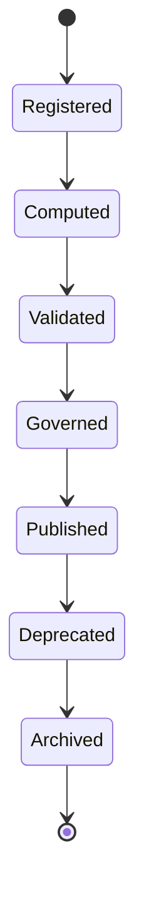

# Enterprise AI Software Factory
# Architecture Design Specification (ADS)

> **Document ID:** ADS-034-v2
>
> **Document Name:** Enterprise Analytics & Business Intelligence — Analytics Algorithms & Decision Intelligence Framework
>
> **Version:** 2.0.0
>
> **Classification:** Enterprise Platform Plane
>
> **Importance:** CRITICAL
>
> **Depends On:** ADS-034-v1
>
> **Next:** ADS-034-v3 — APIs, Events & Contracts

---

# Executive Summary

This document defines the algorithms responsible for metric definition, KPI lifecycle management, semantic metric computation, dashboard generation, forecasting, anomaly detection, executive reporting, and decision recommendation.

Every metric is versioned.

Every KPI is explainable.

Every recommendation is reproducible.

---

# Design Philosophy

The Analytics Platform follows six principles.

- Metric First
- Semantic Consistency
- Explainable Decisions
- Continuous Measurement
- Reproducible Analytics
- Immutable History

Enterprise analytics remain deterministic.

---

# Analytics Lifecycle

```text
Metric Definition

↓

Data Collection

↓

Metric Computation

↓

KPI Evaluation

↓

Forecasting

↓

Decision Analysis

↓

Reporting

↓

Archival
```

Every metric follows this lifecycle.

---

# Metric Definition

Every enterprise metric begins with an immutable Metric Definition.

```yaml
metricDefinition:

  metricId:

  metricName:

  businessDomain:

  owner:

  formula:

  dimensions:

  measures:

  aggregationStrategy:

  dataSources:

  refreshPolicy:

  governanceStatus:

  version:

  registeredAt:
```

Metric Definitions remain immutable.

---

# ALG-034-001

## Metric Registration

Metric registration validates

- Metric Identity
- Formula
- Dimensions
- Measures
- Data Sources
- Governance Policies
- Ownership

Registration creates a Metric Record.

---

# ALG-034-002

## KPI Computation

KPI Engine computes

- Current Value
- Historical Trend
- Target Comparison
- Threshold Status
- Confidence Score

KPIs remain reproducible.

---

# ALG-034-003

## Semantic Metric Computation

Semantic Metrics validates

- Business Vocabulary
- Dimension Consistency
- Aggregation Rules
- Calculation Logic
- Time Windows

Semantic metrics remain deterministic.

---

# Metric Categories

| Category | Purpose |
|----------|----------|
| Financial | Revenue, cost, profit |
| Operational | Throughput, utilization |
| Customer | Satisfaction, retention |
| Product | Adoption, engagement |
| AI | Model performance |
| Security | Risk & compliance |
| Reliability | Availability & uptime |

Metric taxonomy remains extensible.

---

# ALG-034-004

## Dashboard Composition

Dashboard Engine assembles

- KPI Widgets
- Trend Charts
- Tables
- Heatmaps
- Geographic Views
- Drill-down Navigation

Dashboards remain version-controlled.

---

# Analytics Domains

| Domain | Purpose |
|------|----------|
| Metrics | Enterprise measurements |
| KPIs | Business objectives |
| Dashboards | Visualization |
| Forecasting | Predictive analysis |
| Reporting | Executive summaries |
| Recommendations | Decision support |
| Alerts | Threshold monitoring |
| Benchmarking | Comparative analysis |

Analytics domains remain extensible.

---

# ALG-034-005

## Forecast Generation

Forecast Engine validates

- Historical Data
- Seasonality
- Trend Analysis
- Confidence Intervals
- Prediction Horizon
- Scenario Parameters

Forecasts precede executive recommendations.

---

# ALG-034-006

## Anomaly Detection

Anomaly Detection continuously evaluates

- KPI Deviations
- Seasonal Variance
- Trend Breaks
- Threshold Violations
- Statistical Outliers
- Forecast Divergence

Detected anomalies generate governed alerts.

---

# ALG-034-007

## Executive Reporting

Reporting Engine assembles

- Executive Summaries
- KPI Dashboards
- Forecast Results
- Trend Analysis
- Risk Indicators
- Recommendations

Reports remain reproducible.

---

# ALG-034-008

## Decision Recommendation

Decision Engine evaluates

- Business Objectives
- KPI Performance
- Forecast Results
- Constraints
- Risk Profiles
- Historical Outcomes

Recommendations remain explainable.

---

# Metric Record

Every computed metric creates a Metric Record.

```yaml
metricRecord:

  metricRecordId:

  metricDefinition:

  computationEngine:

  calculationWindow:

  computedValue:

  confidenceScore:

  qualityStatus:

  governanceStatus:

  version:

  computedAt:
```

Metric Records remain immutable.

---

# Analytics Lifecycle Stages

| Stage | Purpose |
|--------|----------|
| Registered | Metric defined |
| Computed | Metric calculated |
| Validated | Quality verified |
| Governed | Approved for use |
| Published | Available to consumers |
| Deprecated | Scheduled replacement |
| Archived | Historical preservation |

Analytics lifecycle remains policy-driven.

---

# KPI Lifecycle

Supported stages

| Stage | Purpose |
|--------|----------|
| Defined | KPI registered |
| Measured | Current value computed |
| Evaluated | Compared with targets |
| Forecasted | Future projection generated |
| Reported | Shared with stakeholders |
| Archived | Historical KPI retained |

KPI history remains reproducible.

---

# Analytics State Machine



Every Metric Definition follows this lifecycle.

---

# Decision Pipeline

Every governed decision follows

```text
Collect Metrics

↓

Validate Quality

↓

Compute KPIs

↓

Run Forecasts

↓

Detect Anomalies

↓

Generate Recommendations

↓

Executive Review

↓

Publish Decision
```

Every recommendation remains explainable.

---

# Analytics Metrics

```text
metric_definitions_total

metric_records_total

kpi_computations_total

dashboard_renders_total

forecast_runs_total

anomaly_detections_total

executive_reports_total

decision_recommendations_total

analytics_query_latency_seconds

analytics_platform_health_score
```

---

# Structured Logging

Example

```json
{
  "metricDefinition":"MD-214",
  "metricRecord":"MR-051",
  "kpi":"CustomerRetention",
  "forecastConfidence":0.94,
  "recommendation":"Increase onboarding investment",
  "timestamp":"2027-01-18T09:42:13Z"
}
```

Logs remain immutable and correlated.

---

# Architecture Decision Records

## ADR-034-03

### Decision

Represent every computed metric as a Metric Record.

### Status

Accepted

### Reason

Metric Records separate logical metric definitions from runtime computations while improving governance, reproducibility, explainability, and lifecycle management.

---

## ADR-034-04

### Decision

Require explainable recommendations for all decision intelligence outputs.

### Status

Accepted

### Reason

Explainable recommendations improve executive trust, governance, regulatory compliance, and business adoption.

---

## ADR-034-05

### Decision

Continuously monitor enterprise KPIs for anomalies.

### Status

Accepted

### Reason

Continuous anomaly detection enables proactive business response, operational resilience, and better forecasting accuracy.

---

# Operational Readiness Scorecard

| Capability | Status |
|------------|--------|
| Metric Definitions | ✅ Required |
| Metric Records | ✅ Required |
| KPI Computation | ✅ Required |
| Dashboard Composition | ✅ Required |
| Forecasting | ✅ Required |
| Anomaly Detection | ✅ Required |
| Executive Reporting | ✅ Required |
| Decision Intelligence | ✅ Required |

---

# Related Documents

ADS-021-v5 — Workflow Kernel

ADS-022-v5 — Identity & Trust Plane

ADS-023-v5 — Enterprise Memory Plane

ADS-024-v5 — Agent Execution Platform

ADS-025-v5 — Compute & Infrastructure Platform

ADS-026-v5 — Security Platform

ADS-027-v5 — Observability Platform

ADS-028-v5 — Governance Platform

ADS-029-v5 — Developer Experience Platform

ADS-030-v5 — Integration & Ecosystem Platform

ADS-031-v5 — Operations & Platform Administration

ADS-032-v5 — AI/ML & Model Lifecycle Platform

ADS-033-v5 — Enterprise Data Platform & Knowledge Fabric

ADS-034-v1 — Enterprise Analytics & Business Intelligence

ADS-034-v3 — APIs, Events & Contracts

---

# End of Document
