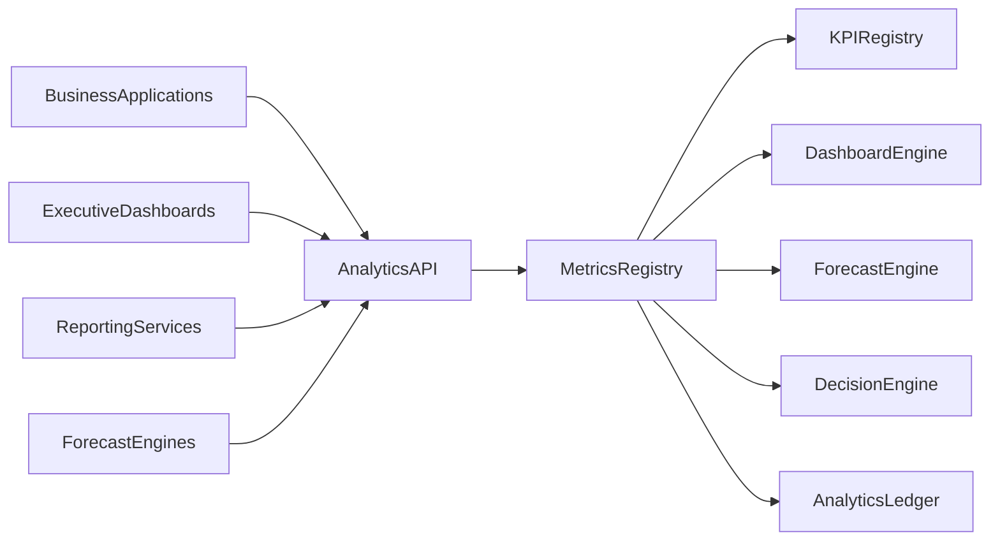
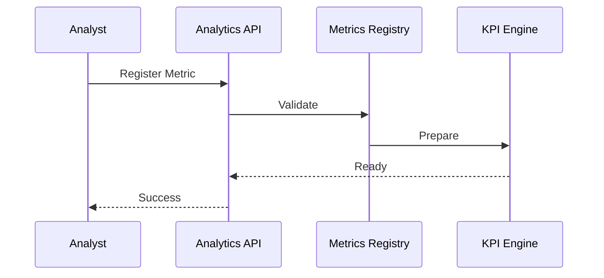

# Enterprise AI Software Factory
# Architecture Design Specification (ADS)

> **Document ID:** ADS-034-v3
>
> **Document Name:** Enterprise Analytics & Business Intelligence — APIs, Events & Contracts
>
> **Version:** 2.0.0
>
> **Classification:** Enterprise Platform Plane
>
> **Importance:** CRITICAL
>
> **Depends On:** ADS-034-v1
>
> **Depends On:** ADS-034-v2
>
> **Next:** ADS-034-v4 — Runtime & Analytics Infrastructure

---

# Executive Summary

The Enterprise Analytics & Business Intelligence Platform exposes standardized APIs for metric registration, KPI computation, dashboard management, forecasting, anomaly detection, executive reporting, and decision intelligence.

Every analytics lifecycle activity occurs through these contracts.

Analytics implementations may evolve.

Analytics contracts remain stable.

---

# Communication Principles

Every analytics request MUST satisfy

- Authenticated
- Authorized
- Versioned
- Observable
- Explainable
- Governed
- Secure
- Tenant Isolated

No analytics operation bypasses the Analytics Platform.

---

# Analytics Communication Architecture



Metrics Registry coordinates every analytics lifecycle operation.

---

# Public REST API

The Analytics Platform exposes APIs for

- Metrics Registry
- KPI Registry
- Dashboard Engine
- Reporting Engine
- Forecast Engine
- Decision Intelligence
- Analytics Governance
- Executive SDKs

---

## API-034-001

### Register Metric

```http
POST /analytics/v1/metrics
```

Purpose

Registers a Metric Definition.

---

Request

```json
{
  "metricName":"CustomerRetention",
  "businessDomain":"Customer Success",
  "aggregationStrategy":"Monthly",
  "version":"1.0.0"
}
```

---

Response

```json
{
  "metricRecordId":"MR-051",
  "status":"Registered"
}
```

---

## API-034-002

### Compute KPI

```http
POST /analytics/v1/kpis
```

Computes a governed KPI.

---

## API-034-003

### Generate Dashboard

```http
POST /analytics/v1/dashboards
```

Creates or refreshes a dashboard.

---

## API-034-004

### Run Forecast

```http
POST /analytics/v1/forecasts
```

Executes a governed forecast.

---

## API-034-005

### Generate Decision Report

```http
POST /analytics/v1/decision-reports
```

Creates an explainable Decision Report.

---

# Internal gRPC Services

```protobuf
service AnalyticsService {

rpc RegisterMetric(MetricRequest)
returns(MetricResponse);

rpc ComputeKPI(KPIRequest)
returns(KPIResponse);

rpc GenerateDashboard(DashboardRequest)
returns(DashboardResponse);

rpc RunForecast(ForecastRequest)
returns(ForecastResponse);

rpc GenerateDecisionReport(DecisionRequest)
returns(DecisionResponse);

}
```

---

# Metric Definition Schema

```protobuf
message MetricDefinition {

string metric_id = 1;

string metric_name = 2;

string business_domain = 3;

string aggregation_strategy = 4;

string version = 5;

string governance_status = 6;

}
```

---

# Metric Record Schema

```protobuf
message MetricRecord {

string metric_record_id = 1;

string metric_id = 2;

string computed_value = 3;

string confidence_score = 4;

string computed_at = 5;

}
```

---

# Decision Report Schema

```protobuf
message DecisionReport {

string report_id = 1;

string recommendation = 2;

string confidence_score = 3;

string approved_by = 4;

string generated_at = 5;

}
```

---

# MCP Tool Contracts

The Analytics Platform exposes

```
register_metric

compute_kpi

generate_dashboard

run_forecast

generate_decision_report

query_metrics

analytics_diagnostics

forecast_comparison
```

Every invocation is authenticated and audited.

---

# Analytics Events

Every lifecycle activity emits immutable events.

---

## EVT-034-001

MetricRegistered

---

## EVT-034-002

KPIComputed

---

## EVT-034-003

DashboardGenerated

---

## EVT-034-004

ForecastCompleted

---

## EVT-034-005

DecisionReportGenerated

---

## EVT-034-006

AnomalyDetected

---

## EVT-034-007

RecommendationPublished

---

## EVT-034-008

AnalyticsArchived

---

# Event Flow



---

# Event Ordering

```text
MetricRegistered

↓

KPIComputed

↓

ForecastCompleted

↓

AnomalyDetected

↓

DecisionReportGenerated

↓

RecommendationPublished
```

---

# Event Metadata

Every event contains

```yaml
eventId:
metricId:
metricRecordId:
decisionReportId:
traceId:
timestamp:
schemaVersion:
```

---

# End of Part 1
