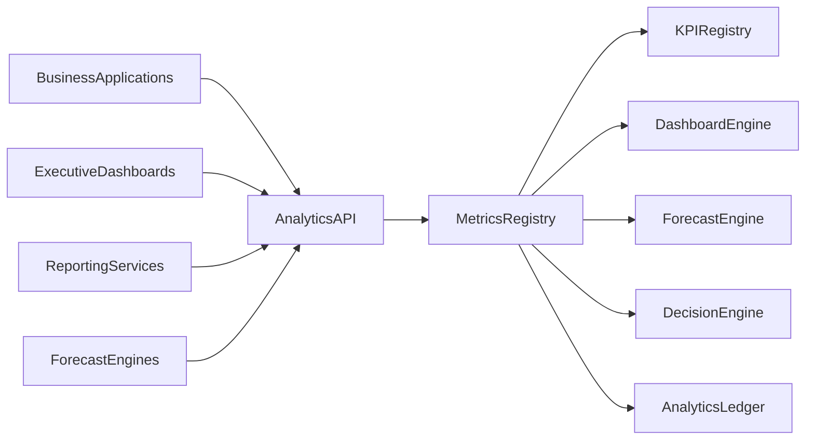
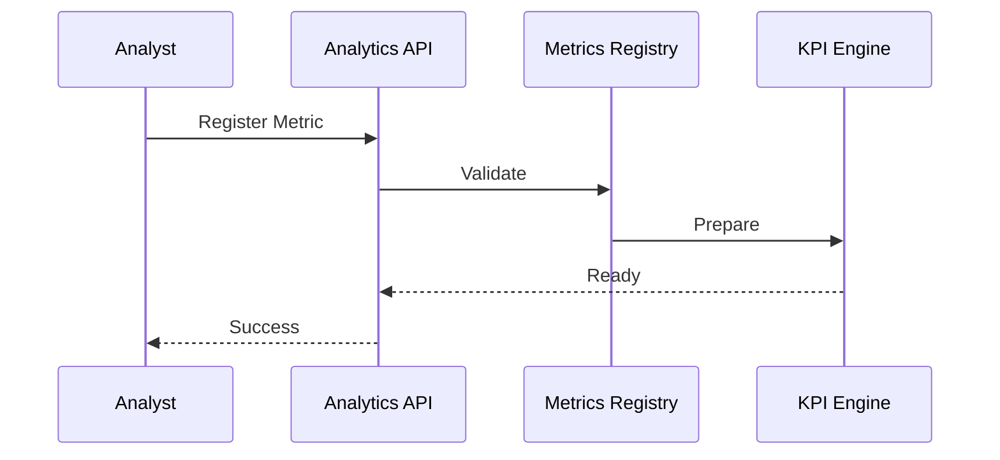
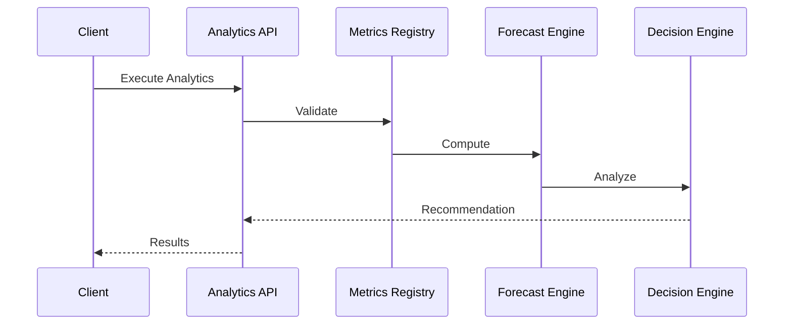

# Enterprise AI Software Factory
# Architecture Design Specification (ADS)

> **Document ID:** ADS-034-v3
>
> **Document Name:** Enterprise Analytics & Business Intelligence — APIs, Events & Contracts
>
> **Version:** 2.0.0
>
> **Classification:** Enterprise Platform Plane
>
> **Importance:** CRITICAL
>
> **Depends On:** ADS-034-v1
>
> **Depends On:** ADS-034-v2
>
> **Next:** ADS-034-v4 — Runtime & Analytics Infrastructure

---

# Executive Summary

The Enterprise Analytics & Business Intelligence Platform exposes standardized APIs for metric registration, KPI computation, dashboard management, forecasting, anomaly detection, executive reporting, and decision intelligence.

Every analytics lifecycle activity occurs through these contracts.

Analytics implementations may evolve.

Analytics contracts remain stable.

---

# Communication Principles

Every analytics request MUST satisfy

- Authenticated
- Authorized
- Versioned
- Observable
- Explainable
- Governed
- Secure
- Tenant Isolated

No analytics operation bypasses the Analytics Platform.

---

# Analytics Communication Architecture



Metrics Registry coordinates every analytics lifecycle operation.

---

# Public REST API

The Analytics Platform exposes APIs for

- Metrics Registry
- KPI Registry
- Dashboard Engine
- Reporting Engine
- Forecast Engine
- Decision Intelligence
- Analytics Governance
- Executive SDKs

---

## API-034-001

### Register Metric

```http
POST /analytics/v1/metrics
```

Purpose

Registers a Metric Definition.

---

Request

```json
{
  "metricName":"CustomerRetention",
  "businessDomain":"Customer Success",
  "aggregationStrategy":"Monthly",
  "version":"1.0.0"
}
```

---

Response

```json
{
  "metricRecordId":"MR-051",
  "status":"Registered"
}
```

---

## API-034-002

### Compute KPI

```http
POST /analytics/v1/kpis
```

Computes a governed KPI.

---

## API-034-003

### Generate Dashboard

```http
POST /analytics/v1/dashboards
```

Creates or refreshes a dashboard.

---

## API-034-004

### Run Forecast

```http
POST /analytics/v1/forecasts
```

Executes a governed forecast.

---

## API-034-005

### Generate Decision Report

```http
POST /analytics/v1/decision-reports
```

Creates an explainable Decision Report.

---

# Internal gRPC Services

```protobuf
service AnalyticsService {

rpc RegisterMetric(MetricRequest)
returns(MetricResponse);

rpc ComputeKPI(KPIRequest)
returns(KPIResponse);

rpc GenerateDashboard(DashboardRequest)
returns(DashboardResponse);

rpc RunForecast(ForecastRequest)
returns(ForecastResponse);

rpc GenerateDecisionReport(DecisionRequest)
returns(DecisionResponse);

}
```

---

# Metric Definition Schema

```protobuf
message MetricDefinition {

string metric_id = 1;

string metric_name = 2;

string business_domain = 3;

string aggregation_strategy = 4;

string version = 5;

string governance_status = 6;

}
```

---

# Metric Record Schema

```protobuf
message MetricRecord {

string metric_record_id = 1;

string metric_id = 2;

string computed_value = 3;

string confidence_score = 4;

string computed_at = 5;

}
```

---

# Decision Report Schema

```protobuf
message DecisionReport {

string report_id = 1;

string recommendation = 2;

string confidence_score = 3;

string approved_by = 4;

string generated_at = 5;

}
```

---

# MCP Tool Contracts

The Analytics Platform exposes

```
register_metric

compute_kpi

generate_dashboard

run_forecast

generate_decision_report

query_metrics

analytics_diagnostics

forecast_comparison
```

Every invocation is authenticated and audited.

---

# Analytics Events

Every lifecycle activity emits immutable events.

---

## EVT-034-001

MetricRegistered

---

## EVT-034-002

KPIComputed

---

## EVT-034-003

DashboardGenerated

---

## EVT-034-004

ForecastCompleted

---

## EVT-034-005

DecisionReportGenerated

---

## EVT-034-006

AnomalyDetected

---

## EVT-034-007

RecommendationPublished

---

## EVT-034-008

AnalyticsArchived

---

# Event Flow



---

# Event Ordering

```text
MetricRegistered

↓

KPIComputed

↓

ForecastCompleted

↓

AnomalyDetected

↓

DecisionReportGenerated

↓

RecommendationPublished
```

---

# Event Metadata

Every event contains

```yaml
eventId:
metricId:
metricRecordId:
decisionReportId:
traceId:
timestamp:
schemaVersion:
```

---

# Request Validation

Every analytics lifecycle request follows a deterministic validation pipeline.

```text
Receive Request

↓

Schema Validation

↓

Authentication

↓

Authorization

↓

Metric Validation

↓

Governance Validation

↓

Quality Validation

↓

Execution
```

Execution begins only after successful validation.

---

# Validation Rules

Every request MUST satisfy

| Rule | Description |
|------|-------------|
| API Version | Supported lifecycle contract |
| Authentication | Valid identity |
| Authorization | Approved operation |
| Metric Version | Registered metric definition |
| Data Freshness | Within configured refresh policy |
| Governance | Approved lifecycle stage |
| Quality | Required confidence threshold met |
| Tenant | Tenant isolation enforced |

Validation failures reject the request.

---

# Authentication

Analytics authentication supports

- OAuth 2.1
- Mutual TLS
- API Keys
- JWT
- OpenID Connect
- SPIFFE / SPIRE

Anonymous analytics operations are prohibited.

---

# Authorization

Authorization evaluates

- User Identity
- Organization
- Metric Ownership
- Dashboard Permissions
- Report Visibility
- Governance Policies

Decision

```text
Allow

↓

Execute

Deny

↓

Reject

Review

↓

Governance Approval
```

Every authorization decision is audited.

---

# Analytics Session

Every governed analytics execution creates an immutable Analytics Session.

```yaml
analyticsSession:

  sessionId:

  metricRecords:

  dashboardId:

  reportId:

  queryProfile:

  executionPlan:

  computationProfile:

  resultMetadata:

  executionDuration:

  completedAt:
```

Analytics Sessions remain immutable.

---

# Runtime Sequence



---

# Analytics Policies

Supported policies

| Policy | Purpose |
|---------|----------|
| Data Freshness | Prevent stale analytics |
| Metric Governance | Approved metric usage |
| Threshold Policies | KPI validation |
| Report Retention | Historical preservation |
| Dashboard Access | Role-based visibility |
| Decision Approval | Executive governance |

Policies remain version-controlled.

---

# Distributed Tracing

Every analytics lifecycle operation includes

- Trace ID
- Metric ID
- Metric Record ID
- Decision Report ID
- Analytics Session ID

Trace Flow

```text
Analytics API

↓

Metrics Registry

↓

Dashboard Engine

↓

Forecast Engine

↓

Decision Engine

↓

Analytics Ledger
```

Every stage contributes trace spans.

---

# Prometheus Metrics

```text
metric_definitions_total

metric_records_total

analytics_sessions_total

dashboard_refresh_total

forecast_execution_total

decision_reports_total

anomaly_events_total

recommendations_total

analytics_execution_latency_seconds

analytics_runtime_health_score
```

---

# Structured Logging

Example

```json
{
  "traceId":"trace-52831",
  "metricDefinition":"MD-214",
  "metricRecord":"MR-051",
  "decisionReport":"DR-032",
  "analyticsSession":"AS-107",
  "executionStatus":"Success"
}
```

Logs remain immutable and correlated.

---

# Audit Records

Every analytics lifecycle operation records

- Metric Definition
- Metric Record
- Decision Report
- Analytics Session
- Workflow ID
- Trace ID
- Timestamp
- Metric Version

Audit history is append-only.

---

# Reference Standards & Specifications

The Analytics Platform aligns with

| Standard | Purpose |
|----------|---------|
| OpenMetrics | Metric representation |
| OpenTelemetry | Distributed tracing |
| OpenAPI 3.1 | REST APIs |
| Apache Arrow | Analytical data interchange |
| SQL:2023 | Analytical queries |
| NIST AI RMF | Decision governance (AI-assisted analytics) |
| ISO 8000 | Data quality management |

---

# Architecture Decision Records

## ADR-034-06

### Decision

Represent every governed analytics execution as an Analytics Session.

### Status

Accepted

### Reason

Analytics Sessions provide replayability, performance analytics, governance evidence, operational observability, and auditability.

---

## ADR-034-07

### Decision

Separate metric computation from decision generation.

### Status

Accepted

### Reason

Metric calculation and business decisioning evolve independently while preserving reproducibility and governance.

---

## ADR-034-08

### Decision

Require governed metrics before executive reporting.

### Status

Accepted

### Reason

Governed metrics improve consistency, trust, compliance, and executive confidence.

---

# Operational Readiness Scorecard

| Capability | Status |
|------------|--------|
| Metric Definitions | ✅ Required |
| Metric Records | ✅ Required |
| Decision Reports | ✅ Required |
| Analytics Sessions | ✅ Required |
| Distributed Tracing | ✅ Required |
| Immutable Audit | ✅ Required |
| Standards Compliance | ✅ Required |
| Governed Analytics | ✅ Required |

---

# Related Documents

ADS-021-v5 — Workflow Kernel

ADS-022-v5 — Identity & Trust Plane

ADS-023-v5 — Enterprise Memory Plane

ADS-024-v5 — Agent Execution Platform

ADS-025-v5 — Compute & Infrastructure Platform

ADS-026-v5 — Security Platform

ADS-027-v5 — Observability Platform

ADS-028-v5 — Governance Platform

ADS-029-v5 — Developer Experience Platform

ADS-030-v5 — Integration & Ecosystem Platform

ADS-031-v5 — Operations & Platform Administration

ADS-032-v5 — AI/ML & Model Lifecycle Platform

ADS-033-v5 — Enterprise Data Platform & Knowledge Fabric

ADS-034-v1 — Enterprise Analytics & Business Intelligence

ADS-034-v2 — Analytics Algorithms & Decision Intelligence Framework

ADS-034-v4 — Runtime & Analytics Infrastructure

---

# End of Document
