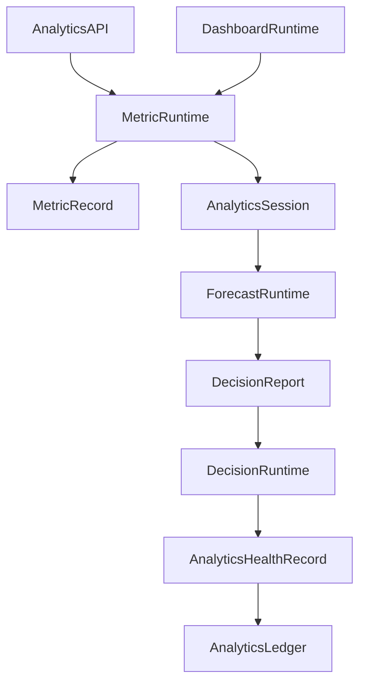

# Enterprise AI Software Factory
# Architecture Design Specification (ADS)

> **Document ID:** ADS-034-v4
>
> **Document Name:** Enterprise Analytics & Business Intelligence — Runtime & Analytics Infrastructure
>
> **Version:** 2.0.0
>
> **Classification:** Enterprise Runtime Specification
>
> **Importance:** CRITICAL
>
> **Depends On:** ADS-034-v1
>
> **Depends On:** ADS-034-v2
>
> **Depends On:** ADS-034-v3
>
> **Next:** ADS-034-v5 — End-to-End Analytics Lifecycle

---

# Executive Summary

This document defines the runtime infrastructure responsible for continuously operating enterprise analytics services.

The runtime manages metric computation, dashboard rendering, report generation, forecasting, anomaly detection, recommendation generation, and executive decision support while maintaining deterministic, governed, and observable analytics services.

The Analytics Runtime serves as the execution kernel for all enterprise analytics operations.

---

# Runtime Philosophy

The Analytics Runtime follows seven principles.

- Metric First
- Continuous Measurement
- Explainable Decisions
- Governed Reporting
- Deterministic Analytics
- Continuous Availability
- Immutable History

Runtime execution never bypasses governance.

---

# Runtime Layers

## Metric Runtime

Responsible for

- Metric Computation
- KPI Evaluation
- Aggregation
- Time Window Processing

---

## Dashboard Runtime

Responsible for

- Dashboard Rendering
- Widget Refresh
- Drill-down Navigation
- Visualization Caching

---

## Forecast Runtime

Responsible for

- Trend Analysis
- Forecast Generation
- Scenario Evaluation
- Confidence Estimation

---

## Decision Runtime

Responsible for

- Recommendation Generation
- Decision Scoring
- Risk Analysis
- Executive Guidance

---

## Health Runtime

Responsible for

- Runtime Monitoring
- Forecast Accuracy
- Dashboard Availability
- Platform Health

---

# Runtime Architecture



Analytics Runtime coordinates every analytics operation.

---

# Runtime Components

| Component | Responsibility |
|------------|----------------|
| Metric Runtime | Metric computation |
| Dashboard Runtime | Visualization |
| Forecast Runtime | Predictive analytics |
| Decision Runtime | Decision intelligence |
| Health Runtime | Runtime monitoring |
| Runtime Monitor | Platform supervision |
| Analytics Ledger | Immutable analytics history |

---

# Runtime Pipeline

```text
Analytics Request

↓

Metric Computation

↓

Forecast Generation

↓

Decision Analysis

↓

Dashboard Rendering

↓

Health Update

↓

Analytics Ledger
```

Every analytics execution follows this lifecycle.

---

# Metric Runtime

Metric Runtime manages

- Aggregations
- KPI Calculations
- Rolling Windows
- Threshold Evaluation
- Confidence Scores

Metric computation remains deterministic.

---

# Dashboard Runtime

Dashboard Runtime coordinates

- Dashboard Assembly
- Widget Rendering
- Interactive Filtering
- Drill-down Queries
- Cache Management

Dashboard rendering remains reproducible.

---

# Analytics Session Management

Every runtime session tracks

- Metric Records
- Dashboard
- Forecast Results
- Decision Report
- Query Profile
- Execution Metadata
- Recommendation Evidence

Analytics Sessions remain immutable.

---

# Runtime Guarantees

The Analytics Runtime guarantees

- Deterministic Metric Computation
- Continuous KPI Evaluation
- Explainable Recommendations
- Dashboard Consistency
- Forecast Reproducibility
- Policy Enforcement
- Immutable Analytics History

---

# End of Part 1
