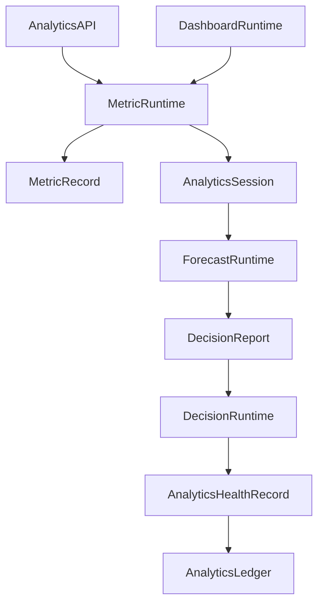
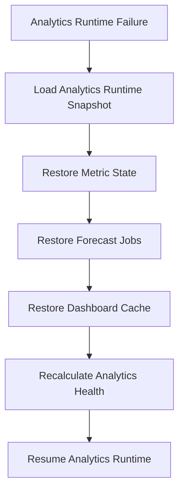

# Enterprise AI Software Factory
# Architecture Design Specification (ADS)

> **Document ID:** ADS-034-v4
>
> **Document Name:** Enterprise Analytics & Business Intelligence — Runtime & Analytics Infrastructure
>
> **Version:** 2.0.0
>
> **Classification:** Enterprise Runtime Specification
>
> **Importance:** CRITICAL
>
> **Depends On:** ADS-034-v1
>
> **Depends On:** ADS-034-v2
>
> **Depends On:** ADS-034-v3
>
> **Next:** ADS-034-v5 — End-to-End Analytics Lifecycle

---

# Executive Summary

This document defines the runtime infrastructure responsible for continuously operating enterprise analytics services.

The runtime manages metric computation, dashboard rendering, report generation, forecasting, anomaly detection, recommendation generation, and executive decision support while maintaining deterministic, governed, and observable analytics services.

The Analytics Runtime serves as the execution kernel for all enterprise analytics operations.

---

# Runtime Philosophy

The Analytics Runtime follows seven principles.

- Metric First
- Continuous Measurement
- Explainable Decisions
- Governed Reporting
- Deterministic Analytics
- Continuous Availability
- Immutable History

Runtime execution never bypasses governance.

---

# Runtime Layers

## Metric Runtime

Responsible for

- Metric Computation
- KPI Evaluation
- Aggregation
- Time Window Processing

---

## Dashboard Runtime

Responsible for

- Dashboard Rendering
- Widget Refresh
- Drill-down Navigation
- Visualization Caching

---

## Forecast Runtime

Responsible for

- Trend Analysis
- Forecast Generation
- Scenario Evaluation
- Confidence Estimation

---

## Decision Runtime

Responsible for

- Recommendation Generation
- Decision Scoring
- Risk Analysis
- Executive Guidance

---

## Health Runtime

Responsible for

- Runtime Monitoring
- Forecast Accuracy
- Dashboard Availability
- Platform Health

---

# Runtime Architecture



Analytics Runtime coordinates every analytics operation.

---

# Runtime Components

| Component | Responsibility |
|------------|----------------|
| Metric Runtime | Metric computation |
| Dashboard Runtime | Visualization |
| Forecast Runtime | Predictive analytics |
| Decision Runtime | Decision intelligence |
| Health Runtime | Runtime monitoring |
| Runtime Monitor | Platform supervision |
| Analytics Ledger | Immutable analytics history |

---

# Runtime Pipeline

```text
Analytics Request

↓

Metric Computation

↓

Forecast Generation

↓

Decision Analysis

↓

Dashboard Rendering

↓

Health Update

↓

Analytics Ledger
```

Every analytics execution follows this lifecycle.

---

# Metric Runtime

Metric Runtime manages

- Aggregations
- KPI Calculations
- Rolling Windows
- Threshold Evaluation
- Confidence Scores

Metric computation remains deterministic.

---

# Dashboard Runtime

Dashboard Runtime coordinates

- Dashboard Assembly
- Widget Rendering
- Interactive Filtering
- Drill-down Queries
- Cache Management

Dashboard rendering remains reproducible.

---

# Analytics Session Management

Every runtime session tracks

- Metric Records
- Dashboard
- Forecast Results
- Decision Report
- Query Profile
- Execution Metadata
- Recommendation Evidence

Analytics Sessions remain immutable.

---

# Runtime Guarantees

The Analytics Runtime guarantees

- Deterministic Metric Computation
- Continuous KPI Evaluation
- Explainable Recommendations
- Dashboard Consistency
- Forecast Reproducibility
- Policy Enforcement
- Immutable Analytics History

---

# Failure Recovery

The Analytics Runtime automatically recovers from computation, forecasting, reporting, and dashboard failures while preserving analytical integrity.

Recovery follows approved governance and recovery policies.



Recovery guarantees

- No metric corruption
- No dashboard inconsistency
- No decision history loss
- Deterministic recovery

---

# Runtime Health Monitoring

Every runtime component continuously reports health.

Collected metrics

- Metric Runtime Health
- Dashboard Runtime Health
- Forecast Runtime Health
- Decision Runtime Health
- Health Runtime Status
- Active Analytics Sessions
- Dashboard Availability
- Forecast Queue Depth

Health Flow

```text
Runtime Component

↓

Heartbeat

↓

Analytics Runtime Monitor

↓

Analytics Operations Dashboard

↓

Alert Engine

↓

Analytics Operations Team
```

Health monitoring remains continuous.

---

# Analytics Runtime Snapshot

The runtime periodically generates Analytics Runtime Snapshots.

```yaml
analyticsRuntimeSnapshot:

  snapshotId:

  generatedAt:

  activeMetrics:

  activeDashboards:

  activeForecastJobs:

  activeAnalyticsSessions:

  decisionQueue:

  platformHealth:

  throughput:

  queryLoad:
```

Analytics Runtime Snapshots provide deterministic operational state.

---

# Runtime Configuration

Example

```yaml
analyticsRuntime:

  continuousMetricComputation: enabled

  automaticDashboardRefresh: enabled

  forecastScheduling: enabled

  anomalyDetection: enabled

  runtimeSnapshots: enabled

  decisionTracing: enabled

  dashboardCaching: enabled

  snapshotInterval: 10m
```

Configuration remains version-controlled.

---

# Analytics Scaling

Analytics Runtime supports

- Horizontal Metric Computation
- Distributed Forecast Processing
- Dashboard Cache Replication
- Parallel Report Generation
- Elastic Query Processing

Scaling remains policy-driven.

---

# Runtime Isolation

Analytics Runtime isolates

- Metric Computations
- Dashboard Sessions
- Forecast Jobs
- Decision Pipelines
- Executive Reports
- Recommendation Generation

Isolation prevents cross-workload interference.

---

# Prometheus Metrics

```text
analytics_runtime_snapshots_total

active_metric_definitions_total

active_dashboards_total

active_forecast_jobs_total

active_analytics_sessions_total

dashboard_render_latency_seconds

forecast_execution_duration_seconds

decision_generation_duration_seconds

analytics_runtime_health_score

report_generation_duration_seconds
```

---

# OpenTelemetry

Distributed tracing spans

```text
Analytics API

↓

Metric Runtime

↓

Forecast Runtime

↓

Decision Runtime

↓

Dashboard Runtime

↓

Health Runtime

↓

Analytics Ledger
```

Every runtime stage contributes trace spans.

---

# Structured Logging

Example

```json
{
  "metricRecord":"MR-051",
  "runtimeSnapshot":"ARS-014",
  "analyticsSession":"AS-107",
  "decisionReport":"DR-032",
  "platformHealth":"Healthy",
  "forecastAccuracy":0.96
}
```

Logs remain immutable and correlated.

---

# Disaster Recovery

Recovery flow

```text
Analytics Runtime Failure

↓

Restore Analytics Runtime Snapshot

↓

Restore Metric State

↓

Resume Forecast Jobs

↓

Restore Dashboard Cache

↓

Validate Analytics Health

↓

Resume Runtime
```

Recovery targets

Recovery Point Objective (RPO)

Near-zero analytics state loss

Recovery Time Objective (RTO)

Less than five minutes

---

# Recommended Production Deployment

```text
Analytics API

↓

Metric Runtime

↓

Dashboard Runtime

↓

Forecast Runtime

↓

Decision Runtime

↓

Health Runtime

↓

Analytics Ledger

↓

OpenTelemetry

↓

Prometheus

↓

Grafana
```

---

# Technology Decision Records

## TDR-034-01

### Technology

Apache Superset

### Decision

Use Apache Superset as the default enterprise dashboard platform.

### Reason

Provides governed dashboards, semantic datasets, role-based access control, and enterprise visualization.

---

## TDR-034-02

### Technology

Apache Druid

### Decision

Use Apache Druid for real-time analytical workloads.

### Reason

Supports low-latency aggregations, time-series analytics, and interactive dashboards.

---

## TDR-034-03

### Technology

Analytics Runtime Snapshot

### Decision

Persist periodic Analytics Runtime Snapshots.

### Reason

Supports diagnostics, recovery, operational visibility, and capacity planning.

---

## TDR-034-04

### Technology

DuckDB

### Decision

Use DuckDB for embedded analytical processing and ad hoc workloads.

### Reason

Provides fast OLAP execution with minimal operational overhead.

---

## TDR-034-05

### Technology

Apache Pinot

### Decision

Support Apache Pinot for high-concurrency, low-latency analytics.

### Reason

Enables real-time KPI computation and interactive executive reporting at scale.

---

# Runtime Checklist

The Analytics Platform MUST

- Generate Analytics Runtime Snapshots
- Continuously compute governed metrics
- Detect KPI anomalies automatically
- Preserve immutable Decision Reports
- Continuously monitor runtime health
- Support deterministic forecasting
- Enable governed executive reporting

The Analytics Platform MUST NOT

- Compute ungoverned metrics
- Bypass decision governance
- Lose analytics history
- Publish stale executive reports
- Allow cross-workload runtime interference

---

# Architecture Decision Records

## ADR-034-09

### Decision

Treat Analytics Runtime Snapshots as immutable runtime artifacts.

### Status

Accepted

### Reason

Snapshots improve diagnostics, recovery, capacity planning, and enterprise operational visibility.

---

## ADR-034-10

### Decision

Separate dashboard rendering from metric computation.

### Status

Accepted

### Reason

Visualization and computation evolve independently, improving scalability and maintainability.

---

## ADR-034-11

### Decision

Execute every analytics workflow within an isolated Analytics Session.

### Status

Accepted

### Reason

Session isolation improves governance, reproducibility, observability, and operational reliability.

---

# Operational Readiness Scorecard

| Capability | Status |
|------------|--------|
| Analytics Runtime | ✅ Required |
| Runtime Snapshots | ✅ Required |
| Metric Runtime | ✅ Required |
| Dashboard Runtime | ✅ Required |
| Runtime Recovery | ✅ Required |
| Continuous KPI Evaluation | ✅ Required |
| Governed Reporting | ✅ Required |
| Deterministic Analytics | ✅ Required |

---

# Related Documents

ADS-021-v5 — Workflow Kernel

ADS-022-v5 — Identity & Trust Plane

ADS-023-v5 — Enterprise Memory Plane

ADS-024-v5 — Agent Execution Platform

ADS-025-v5 — Compute & Infrastructure Platform

ADS-026-v5 — Security Platform

ADS-027-v5 — Observability Platform

ADS-028-v5 — Governance Platform

ADS-029-v5 — Developer Experience Platform

ADS-030-v5 — Integration & Ecosystem Platform

ADS-031-v5 — Operations & Platform Administration

ADS-032-v5 — AI/ML & Model Lifecycle Platform

ADS-033-v5 — Enterprise Data Platform & Knowledge Fabric

ADS-034-v1 — Enterprise Analytics & Business Intelligence

ADS-034-v2 — Analytics Algorithms & Decision Intelligence Framework

ADS-034-v3 — APIs, Events & Contracts

ADS-034-v5 — End-to-End Analytics Lifecycle

---

# End of Document
