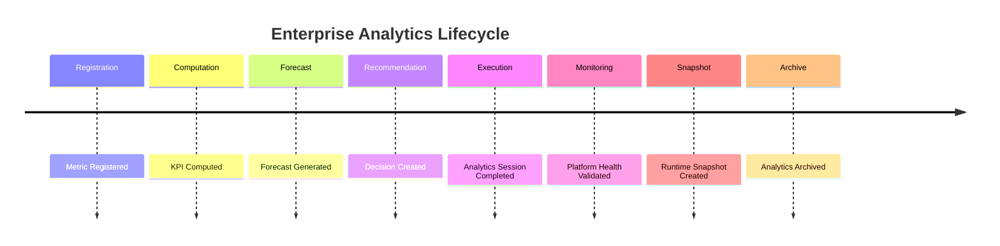

# Enterprise AI Software Factory
# Architecture Design Specification (ADS)

> **Document ID:** ADS-034-v5
>
> **Document Name:** Enterprise Analytics & Business Intelligence — End-to-End Analytics Lifecycle
>
> **Version:** 2.0.0
>
> **Classification:** Reference Implementation
>
> **Importance:** CRITICAL
>
> **Depends On:** ADS-034-v1
>
> **Depends On:** ADS-034-v2
>
> **Depends On:** ADS-034-v3
>
> **Depends On:** ADS-034-v4

---

# Executive Summary

This document demonstrates how the Enterprise Analytics & Business Intelligence Platform manages the complete lifecycle of enterprise analytics—from metric definition and KPI computation through forecasting, reporting, executive decision support, monitoring, and archival.

It illustrates how Metric Definitions, Metric Records, Decision Reports, Analytics Sessions, Analytics Health Records, Analytics Runtime Snapshots, and Analytics Ledger Entries interact throughout real enterprise analytics operations.

Every metric is governed.

Every recommendation is explainable.

Every executive decision is reproducible.

---

# Scenario

An enterprise monitors quarterly revenue growth, customer retention, and operational efficiency to support executive planning and investment decisions.

Participating systems

- Analytics Platform
- Knowledge Platform
- Workflow Kernel
- Governance Platform
- Observability Platform
- Operations Platform

---

# Stage 1 — Metric Registration

Generated

```
MD-2027-023
```

Metric Definition contains

- Formula
- Business Domain
- Aggregation Strategy
- Data Sources
- Governance Status
- Version

Metric Definition becomes immutable.

---

# Stage 2 — Metric Computation

Generated

```
MR-2027-017
```

Metric Record includes

- Computed Value
- Calculation Window
- Confidence Score
- Quality Status
- Governance Status

Metric Record archived.

---

# Stage 3 — KPI Evaluation

KPI Engine computes

- Current Value
- Historical Trend
- Target Comparison
- Threshold Status

Evaluation succeeds.

---

# Stage 4 — Forecast Generation

Forecast Engine executes

- Trend Projection
- Seasonality Analysis
- Confidence Estimation
- Scenario Modeling

Forecast completes successfully.

---

# Stage 5 — Decision Recommendation

Generated

```
DR-2027-011
```

Decision Report includes

- Recommendation
- Supporting Evidence
- Forecast Results
- Confidence Score

Recommendation approved.

---

# Stage 6 — Analytics Execution

Generated

```
AS-2027-082
```

Analytics Session records

- Query Profile
- Dashboard
- Execution Plan
- Result Metadata
- Execution Duration

Execution completes successfully.

---

# Stage 7 — Runtime Monitoring

Generated

```
AHR-2027-009
```

Analytics Health metrics

- Dashboard Availability: 99.99%
- Forecast Accuracy: 96.4%
- Average Query Latency: 132 ms
- Data Freshness: 99.7%
- Platform Health: Healthy

Platform remains Healthy.

---

# Stage 8 — Runtime Snapshot

Generated

```
ARS-2027-005
```

Snapshot contains

- Active Metrics
- Active Dashboards
- Forecast Jobs
- Runtime Health
- Throughput

Snapshot archived.

---

# Stage 9 — Anomaly Detection

Analytics Runtime identifies

- Revenue Growth Variance

Decision Engine recomputes recommendations.

Executive notification generated.

---

# Stage 10 — Analytics Ledger

Generated

```
AL-2027-024
```

Ledger Entry references

- Metric Definition
- Metric Record
- Decision Report
- Analytics Session
- Analytics Health Record
- Runtime Snapshot

Entry becomes immutable.

---

# Stage 11 — Executive Review

Executive board reviews

- KPI Trends
- Forecasts
- Decision Recommendations
- Risk Indicators

Decision approved.

---

# Stage 12 — Archival

Archived artifacts

- Metric Definition
- Metric Record
- Decision Report
- Analytics Session
- Analytics Health Record
- Runtime Snapshot
- Analytics Ledger Entry

Analytics lifecycle remains fully reproducible.

---

# Analytics Timeline



---

# Analytics Event Stream

```text
MetricRegistered

↓

KPIComputed

↓

ForecastCompleted

↓

DecisionReportGenerated

↓

AnalyticsSessionCompleted

↓

AnalyticsHealthUpdated

↓

RuntimeSnapshotCreated

↓

AnalyticsLedgerWritten

↓

AnalyticsArchived
```

---

# Produced Artifacts

| Artifact | Identifier |
|-----------|------------|
| Metric Definition | MD-2027-023 |
| Metric Record | MR-2027-017 |
| Decision Report | DR-2027-011 |
| Analytics Session | AS-2027-082 |
| Analytics Health Record | AHR-2027-009 |
| Analytics Runtime Snapshot | ARS-2027-005 |
| Analytics Ledger Entry | AL-2027-024 |

---

# Runtime Metrics

| Metric | Value |
|---------|------:|
| Registered Metrics | 18,420 |
| Active Dashboards | 1,380 |
| Daily Analytics Sessions | 2.4 M |
| Average Query Latency | 132 ms |
| Forecast Accuracy | 96.4% |
| Decision Reports Generated | 4,200/day |
| KPI Evaluation Success Rate | 99.8% |
| Runtime Availability | 99.99% |

---

# Operational Readiness Scorecard

| Capability | Status |
|------------|--------|
| Metric Definitions | ✅ Verified |
| Metric Records | ✅ Verified |
| Decision Reports | ✅ Verified |
| Analytics Sessions | ✅ Verified |
| Analytics Health Records | ✅ Verified |
| Runtime Snapshots | ✅ Verified |
| Analytics Ledger | ✅ Verified |
| Deterministic Lifecycle | ✅ Verified |

---

# Lessons Learned

The Enterprise Analytics & Business Intelligence Platform demonstrates the following principles.

- Metric Definitions define authoritative business metrics.
- Metric Records preserve computed analytical evidence.
- Decision Reports provide explainable executive recommendations.
- Analytics Sessions preserve governed runtime execution.
- Analytics Health Records continuously measure operational quality.
- Analytics Runtime Snapshots enable deterministic recovery and operational visibility.
- Analytics Ledger Entries preserve immutable analytics history.

---

# Architecture Decision Record

## ADR-034-12

### Decision

Represent enterprise analytics as a deterministic lifecycle composed of immutable analytics artifacts.

### Status

Accepted

### Reason

Artifact-centric analytics improves governance, reproducibility, explainability, operational visibility, executive trust, and enterprise-scale decision intelligence.

---

# Technology Decision Record

## TDR-034-06

### Technology

Enterprise Analytics Platform

### Decision

Implement a centralized Enterprise Analytics & Business Intelligence Platform responsible for metric management, KPI computation, dashboard generation, forecasting, anomaly detection, executive reporting, decision intelligence, and immutable analytics history.

### Reason

A unified Analytics Platform provides trusted, governed, observable, and reproducible enterprise decision support while integrating seamlessly with the Knowledge Fabric, Workflow Kernel, Governance Platform, and Operations Platform.

---

# Related Documents

ADS-021-v5 — Workflow Kernel

ADS-022-v5 — Identity & Trust Plane

ADS-023-v5 — Enterprise Memory Plane

ADS-024-v5 — Agent Execution Platform

ADS-025-v5 — Compute & Infrastructure Platform

ADS-026-v5 — Security Platform

ADS-027-v5 — Observability Platform

ADS-028-v5 — Governance Platform

ADS-029-v5 — Developer Experience Platform

ADS-030-v5 — Integration & Ecosystem Platform

ADS-031-v5 — Operations & Platform Administration

ADS-032-v5 — AI/ML & Model Lifecycle Platform

ADS-033-v5 — Enterprise Data Platform & Knowledge Fabric

ADS-034-v1 — Enterprise Analytics & Business Intelligence

ADS-034-v2 — Analytics Algorithms & Decision Intelligence Framework

ADS-034-v3 — APIs, Events & Contracts

ADS-034-v4 — Runtime & Analytics Infrastructure

---

# End of Document
