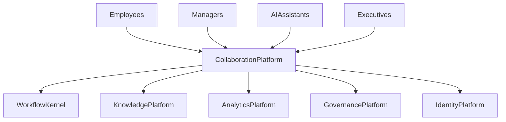
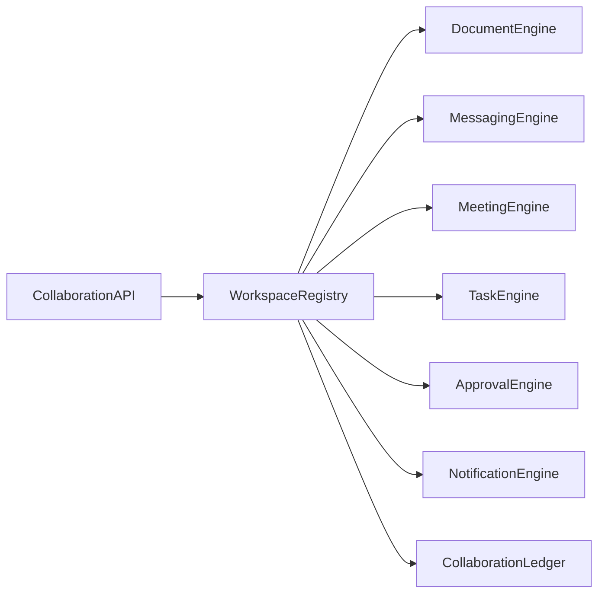

# Enterprise AI Software Factory
# Architecture Design Specification (ADS)

> **Document ID:** ADS-035-v1
>
> **Document Name:** Enterprise Collaboration & Productivity Platform — Architecture
>
> **Version:** 2.0.0
>
> **Classification:** Enterprise Platform Plane
>
> **Importance:** CRITICAL
>
> **Depends On:** ADS-021-v5
>
> **Depends On:** ADS-022-v5
>
> **Depends On:** ADS-023-v5
>
> **Depends On:** ADS-024-v5
>
> **Depends On:** ADS-025-v5
>
> **Depends On:** ADS-026-v5
>
> **Depends On:** ADS-027-v5
>
> **Depends On:** ADS-028-v5
>
> **Depends On:** ADS-029-v5
>
> **Depends On:** ADS-030-v5
>
> **Depends On:** ADS-031-v5
>
> **Depends On:** ADS-032-v5
>
> **Depends On:** ADS-033-v5
>
> **Depends On:** ADS-034-v5
>
> **Next:** ADS-035-v2 — Collaboration Algorithms & Productivity Framework

---

# Executive Summary

The Enterprise Collaboration & Productivity Platform provides centralized management for workspaces, documents, messaging, meetings, tasks, approvals, notifications, calendars, collaborative AI assistants, and human-in-the-loop workflows.

The platform enables secure, governed, observable, and explainable collaboration across the Enterprise AI Software Factory.

Collaboration becomes a first-class enterprise capability.

---

# Why This System Exists

Enterprise execution depends on effective collaboration.

Organizations must continuously

- Create Workspaces
- Collaborate on Documents
- Exchange Messages
- Coordinate Meetings
- Assign Tasks
- Execute Approvals
- Notify Stakeholders
- Schedule Calendars
- Collaborate with AI
- Preserve Organizational Knowledge

The Collaboration Platform standardizes these responsibilities.

---

# Core Philosophy

Collaborate Securely.

Coordinate Transparently.

Approve Responsibly.

Augment Humans with AI.

---

# Design Goals

The platform provides

- Workspace Registry
- Document Collaboration
- Messaging Platform
- Meeting Platform
- Task Management
- Approval Engine
- Notification Engine
- Calendar Services
- Human-in-the-Loop Coordination
- Collaboration Ledger

---

# Architectural Position

Every collaborative activity passes through the Collaboration Platform.

---

# High-Level Architecture

The Workspace Registry coordinates the complete collaboration lifecycle.

---

# Major Components

| Component | Responsibility |
|------------|----------------|
| Collaboration API | Public collaboration interface |
| Workspace Registry | Workspace lifecycle |
| Document Engine | Collaborative documents |
| Messaging Engine | Secure messaging |
| Meeting Engine | Meetings & recordings |
| Task Engine | Task lifecycle |
| Approval Engine | Human approvals |
| Notification Engine | Alerts & notifications |
| Collaboration Ledger | Immutable collaboration history |

---

# Collaboration Domains

| Domain | Purpose |
|---------|---------|
| Workspaces | Team collaboration |
| Documents | Collaborative editing |
| Messages | Communication |
| Meetings | Coordination |
| Tasks | Work execution |
| Approvals | Governance |
| Notifications | Awareness |
| Calendars | Scheduling |

Every domain follows a governed lifecycle.

---

# Collaboration Principles

The platform follows

- Workspace First
- Human-in-the-Loop
- Explainable Collaboration
- Immutable Activity History
- Secure Communication
- Continuous Synchronization
- Governed Participation

---

# Collaboration Boundaries

Every collaboration operation passes through

- Identity Verification
- Security Validation
- Governance Approval
- Workspace Authorization
- Observability
- Immutable Audit

No collaborative activity bypasses enterprise governance.

---

# Architecture Decision Records

## ADR-035-01

### Decision

Centralize enterprise collaboration into a dedicated Collaboration Platform.

### Status

Accepted

### Reason

Centralized collaboration improves governance, traceability, productivity, human-AI interaction, and enterprise coordination.

---

## ADR-035-02

### Decision

Represent collaboration entities as immutable enterprise artifacts.

### Status

Accepted

### Reason

Artifact-centric collaboration improves auditability, reproducibility, governance, and organizational knowledge preservation.

---

# Operational Readiness Scorecard

| Capability | Status |
|------------|--------|
| Workspace Registry | ✅ Required |
| Document Collaboration | ✅ Required |
| Messaging Engine | ✅ Required |
| Meeting Engine | ✅ Required |
| Task Engine | ✅ Required |
| Approval Engine | ✅ Required |
| Notification Engine | ✅ Required |
| Collaboration Ledger | ✅ Required |

---

# Version Roadmap

| Version | Description |
|----------|-------------|
| v1 | Architecture |
| v2 | Collaboration Algorithms & Productivity Framework |
| v3 | APIs, Events & Contracts |
| v4 | Runtime & Collaboration Infrastructure |
| v5 | End-to-End Collaboration Lifecycle |

---

# Related Documents

ADS-021-v5 — Workflow Kernel

ADS-022-v5 — Identity & Trust Plane

ADS-023-v5 — Enterprise Memory Plane

ADS-024-v5 — Agent Execution Platform

ADS-025-v5 — Compute & Infrastructure Platform

ADS-026-v5 — Security Platform

ADS-027-v5 — Observability Platform

ADS-028-v5 — Governance Platform

ADS-029-v5 — Developer Experience Platform

ADS-030-v5 — Integration & Ecosystem Platform

ADS-031-v5 — Operations & Platform Administration

ADS-032-v5 — AI/ML & Model Lifecycle Platform

ADS-033-v5 — Enterprise Data Platform & Knowledge Fabric

ADS-034-v5 — Enterprise Analytics & Business Intelligence

---

# Next Document

**ADS-035-v2 — Collaboration Algorithms & Productivity Framework**

Defines workspace lifecycle, collaborative document editing, messaging protocols, meeting coordination, task orchestration, approval workflows, notification routing, calendar synchronization, and human-AI collaboration algorithms.

---

# End of Document
