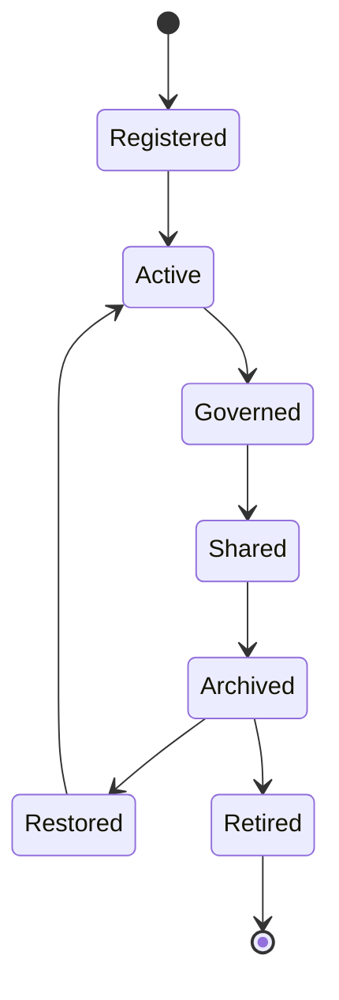

# Enterprise AI Software Factory
# Architecture Design Specification (ADS)

> **Document ID:** ADS-035-v2
>
> **Document Name:** Enterprise Collaboration & Productivity Platform — Collaboration Algorithms & Productivity Framework
>
> **Version:** 2.0.0
>
> **Classification:** Enterprise Platform Plane
>
> **Importance:** CRITICAL
>
> **Depends On:** ADS-035-v1
>
> **Next:** ADS-035-v3 — APIs, Events & Contracts

---

# Executive Summary

This document defines the algorithms responsible for workspace lifecycle management, collaborative document editing, messaging, meeting orchestration, task management, approval workflows, notification routing, calendar synchronization, and human-AI collaboration.

Every workspace is versioned.

Every collaboration is governed.

Every approval is auditable.

---

# Design Philosophy

The Collaboration Platform follows six principles.

- Workspace First
- Human-in-the-Loop
- Explainable Collaboration
- Secure Communication
- Continuous Synchronization
- Immutable History

Collaboration remains deterministic and reproducible.

---

# Collaboration Lifecycle

```text
Workspace Creation

↓

Member Onboarding

↓

Content Collaboration

↓

Task Coordination

↓

Approval Workflow

↓

Notification

↓

Knowledge Preservation

↓

Archival
```

Every workspace follows this lifecycle.

---

# Workspace

Every enterprise collaboration begins with an immutable Workspace definition.

```yaml
workspace:

  workspaceId:

  workspaceName:

  workspaceType:

  owner:

  members:

  securityClassification:

  governancePolicy:

  linkedWorkflows:

  linkedKnowledgeAssets:

  linkedAnalytics:

  lifecycleStatus:

  version:

  createdAt:
```

Workspace definitions remain immutable.

---

# ALG-035-001

## Workspace Registration

Workspace registration validates

- Workspace Identity
- Owner
- Members
- Security Classification
- Governance Policies
- Lifecycle Status

Registration creates a Workspace Record.

---

# ALG-035-002

## Document Collaboration

Document Engine coordinates

- Document Creation
- Version Control
- Concurrent Editing
- Comments
- Suggestions
- Publishing

Documents remain reproducible.

---

# ALG-035-003

## Task Coordination

Task Engine manages

- Task Assignment
- Priorities
- Dependencies
- Deadlines
- Status Updates
- Completion Verification

Tasks remain traceable.

---

# Collaboration Categories

| Category | Purpose |
|----------|----------|
| Workspace | Team collaboration |
| Document | Knowledge creation |
| Task | Work execution |
| Meeting | Coordination |
| Approval | Governance |
| Notification | Awareness |
| Calendar | Scheduling |

Collaboration taxonomy remains extensible.

---

# ALG-035-004

## Meeting Coordination

Meeting Engine manages

- Scheduling
- Participants
- Agenda
- Recording
- Action Items
- Follow-up Tasks

Meetings remain governed.

---

# Collaboration Domains

| Domain | Purpose |
|------|----------|
| Workspaces | Team organization |
| Documents | Shared knowledge |
| Messaging | Communication |
| Meetings | Coordination |
| Tasks | Execution |
| Approvals | Decision making |
| Notifications | Awareness |
| Calendars | Scheduling |

Domains remain extensible.

---

# ALG-035-005

## Approval Workflow

Approval Engine validates

- Approval Chain
- Required Reviewers
- Governance Policies
- Decision History
- Escalation Rules
- Final Decision

Approvals precede publication and execution.

---

# ALG-035-006

## Notification Routing

Notification Engine routes

- Task Assignments
- Approval Requests
- Meeting Invitations
- Deadline Reminders
- System Alerts
- AI Recommendations

Notifications remain policy-driven.

---

# ALG-035-007

## Calendar Synchronization

Calendar Service coordinates

- Meetings
- Deadlines
- Milestones
- Availability
- Time Zones
- Resource Reservations

Calendar synchronization remains deterministic.

---

# ALG-035-008

## Human-AI Collaboration

The Human-AI Collaboration Engine manages

- AI Suggestions
- Human Review
- Approval Requests
- Task Assistance
- Knowledge Recommendations
- Decision Support

Humans always retain final authority.

---

# Workspace Record

Every registered workspace creates a Workspace Record.

```yaml
workspaceRecord:

  workspaceRecordId:

  workspace:

  storageLocation:

  collaborationProfile:

  communicationChannels:

  activeMembers:

  governanceStatus:

  lifecycleStatus:

  version:

  registeredAt:
```

Workspace Records remain immutable.

---

# Collaboration Lifecycle Stages

| Stage | Purpose |
|--------|----------|
| Registered | Workspace created |
| Active | Collaboration enabled |
| Governed | Policies enforced |
| Shared | Cross-team collaboration |
| Archived | Historical preservation |
| Restored | Reopened if required |
| Retired | Permanently closed |

Lifecycle remains policy-driven.

---

# Approval Lifecycle

Supported stages

| Stage | Purpose |
|--------|----------|
| Draft | Awaiting submission |
| Submitted | Pending review |
| Under Review | Active evaluation |
| Approved | Accepted |
| Rejected | Declined |
| Archived | Historical record |

Approvals remain reproducible.

---

# Collaboration State Machine



Every Workspace follows this lifecycle.

---

# Collaboration Pipeline

Every governed collaboration follows

```text
Create Workspace

↓

Invite Members

↓

Collaborate

↓

Assign Tasks

↓

Review

↓

Approve

↓

Notify

↓

Archive
```

Every collaboration remains explainable.

---

# Collaboration Metrics

```text
workspaces_total

workspace_records_total

documents_total

messages_total

meetings_total

tasks_total

approvals_total

notifications_total

calendar_events_total

collaboration_platform_health_score
```

---

# Structured Logging

Example

```json
{
  "workspace":"WS-214",
  "workspaceRecord":"WR-051",
  "approvalId":"APR-093",
  "taskId":"TASK-442",
  "notification":"MeetingReminder",
  "timestamp":"2027-02-11T14:37:52Z"
}
```

Logs remain immutable and correlated.

---

# Architecture Decision Records

## ADR-035-03

### Decision

Represent every managed collaboration environment as a Workspace Record.

### Status

Accepted

### Reason

Workspace Records separate logical collaboration definitions from managed implementations while improving governance, auditability, lifecycle management, and operational consistency.

---

## ADR-035-04

### Decision

Require human approval for governance-controlled collaboration workflows.

### Status

Accepted

### Reason

Human oversight improves accountability, regulatory compliance, organizational trust, and decision quality.

---

## ADR-035-05

### Decision

Treat AI as an assistive participant rather than an autonomous decision maker.

### Status

Accepted

### Reason

Human-in-the-loop collaboration preserves organizational accountability while benefiting from AI-assisted productivity.

---

# Operational Readiness Scorecard

| Capability | Status |
|------------|--------|
| Workspace Definitions | ✅ Required |
| Workspace Records | ✅ Required |
| Document Collaboration | ✅ Required |
| Task Coordination | ✅ Required |
| Meeting Coordination | ✅ Required |
| Approval Workflows | ✅ Required |
| Human-AI Collaboration | ✅ Required |
| Notification Routing | ✅ Required |

---

# Related Documents

ADS-021-v5 — Workflow Kernel

ADS-022-v5 — Identity & Trust Plane

ADS-023-v5 — Enterprise Memory Plane

ADS-024-v5 — Agent Execution Platform

ADS-025-v5 — Compute & Infrastructure Platform

ADS-026-v5 — Security Platform

ADS-027-v5 — Observability Platform

ADS-028-v5 — Governance Platform

ADS-029-v5 — Developer Experience Platform

ADS-030-v5 — Integration & Ecosystem Platform

ADS-031-v5 — Operations & Platform Administration

ADS-032-v5 — AI/ML & Model Lifecycle Platform

ADS-033-v5 — Enterprise Data Platform & Knowledge Fabric

ADS-034-v5 — Enterprise Analytics & Business Intelligence

ADS-035-v1 — Enterprise Collaboration & Productivity Platform

ADS-035-v3 — APIs, Events & Contracts

---

# End of Document
