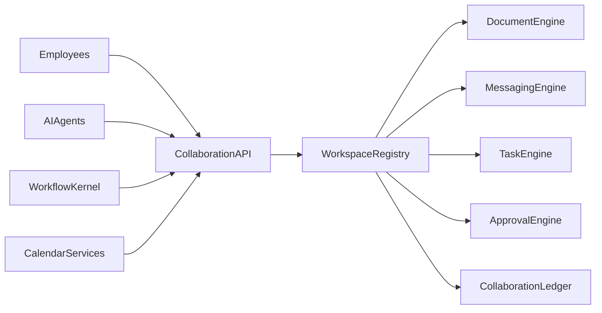
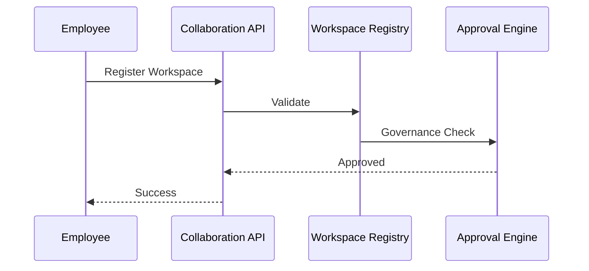
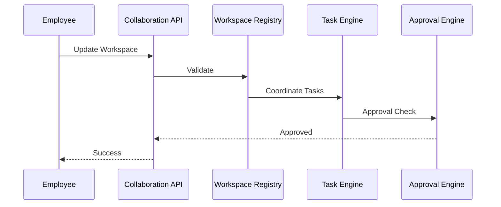

# Enterprise AI Software Factory
# Architecture Design Specification (ADS)

> **Document ID:** ADS-035-v3
>
> **Document Name:** Enterprise Collaboration & Productivity Platform — APIs, Events & Contracts
>
> **Version:** 2.0.0
>
> **Classification:** Enterprise Platform Plane
>
> **Importance:** CRITICAL
>
> **Depends On:** ADS-035-v1
>
> **Depends On:** ADS-035-v2
>
> **Next:** ADS-035-v4 — Runtime & Collaboration Infrastructure

---

# Executive Summary

The Enterprise Collaboration & Productivity Platform exposes standardized APIs for workspace management, document collaboration, messaging, meeting orchestration, task coordination, approval workflows, notification routing, calendar synchronization, and human-AI collaboration.

Every collaboration lifecycle activity occurs through these contracts.

Collaboration implementations may evolve.

Collaboration contracts remain stable.

---

# Communication Principles

Every collaboration request MUST satisfy

- Authenticated
- Authorized
- Versioned
- Observable
- Traceable
- Governed
- Secure
- Tenant Isolated

No collaboration operation bypasses the Collaboration Platform.

---

# Collaboration Communication Architecture



Workspace Registry coordinates every collaboration lifecycle operation.

---

# Public REST API

The Collaboration Platform exposes APIs for

- Workspace Registry
- Document Engine
- Messaging Engine
- Meeting Engine
- Task Engine
- Approval Engine
- Notification Engine
- Calendar Services

---

## API-035-001

### Register Workspace

```http
POST /collaboration/v1/workspaces
```

Purpose

Registers a Workspace.

---

Request

```json
{
  "workspaceName":"AI Product Team",
  "workspaceType":"Engineering",
  "securityClassification":"Internal",
  "version":"1.0.0"
}
```

---

Response

```json
{
  "workspaceRecordId":"WR-051",
  "status":"Registered"
}
```

---

## API-035-002

### Create Task

```http
POST /collaboration/v1/tasks
```

Creates a governed task.

---

## API-035-003

### Submit Approval

```http
POST /collaboration/v1/approvals
```

Starts an approval workflow.

---

## API-035-004

### Schedule Meeting

```http
POST /collaboration/v1/meetings
```

Schedules a governed meeting.

---

## API-035-005

### Send Notification

```http
POST /collaboration/v1/notifications
```

Routes a governed notification.

---

# Internal gRPC Services

```protobuf
service CollaborationService {

rpc RegisterWorkspace(WorkspaceRequest)
returns(WorkspaceResponse);

rpc CreateTask(TaskRequest)
returns(TaskResponse);

rpc SubmitApproval(ApprovalRequest)
returns(ApprovalResponse);

rpc ScheduleMeeting(MeetingRequest)
returns(MeetingResponse);

rpc SendNotification(NotificationRequest)
returns(NotificationResponse);

}
```

---

# Workspace Schema

```protobuf
message Workspace {

string workspace_id = 1;

string workspace_name = 2;

string workspace_type = 3;

string security_classification = 4;

string version = 5;

string governance_status = 6;

}
```

---

# Workspace Record Schema

```protobuf
message WorkspaceRecord {

string workspace_record_id = 1;

string workspace_id = 2;

string collaboration_profile = 3;

string lifecycle_status = 4;

string registered_at = 5;

}
```

---

# Approval Record Schema

```protobuf
message ApprovalRecord {

string approval_record_id = 1;

string workspace_record_id = 2;

string decision = 3;

string governance_policy = 4;

string completed_at = 5;

}
```

---

# MCP Tool Contracts

The Collaboration Platform exposes

```
register_workspace

create_task

submit_approval

schedule_meeting

send_notification

query_workspace

collaboration_diagnostics

calendar_sync
```

Every invocation is authenticated and audited.

---

# Collaboration Events

Every lifecycle activity emits immutable events.

---

## EVT-035-001

WorkspaceRegistered

---

## EVT-035-002

TaskCreated

---

## EVT-035-003

ApprovalSubmitted

---

## EVT-035-004

MeetingScheduled

---

## EVT-035-005

NotificationSent

---

## EVT-035-006

WorkspaceUpdated

---

## EVT-035-007

DocumentPublished

---

## EVT-035-008

WorkspaceArchived

---

# Event Flow



---

# Event Ordering

```text
WorkspaceRegistered

↓

TaskCreated

↓

ApprovalSubmitted

↓

MeetingScheduled

↓

NotificationSent

↓

WorkspaceArchived
```

---

# Event Metadata

Every event contains

```yaml
eventId:
workspaceId:
workspaceRecordId:
approvalRecordId:
traceId:
timestamp:
schemaVersion:
```

---

# Request Validation

Every collaboration lifecycle request follows a deterministic validation pipeline.

```text
Receive Request

↓

Schema Validation

↓

Authentication

↓

Authorization

↓

Workspace Validation

↓

Governance Validation

↓

Policy Validation

↓

Execution
```

Execution begins only after successful validation.

---

# Validation Rules

Every request MUST satisfy

| Rule | Description |
|------|-------------|
| API Version | Supported lifecycle contract |
| Authentication | Valid identity |
| Authorization | Approved workspace permissions |
| Workspace Status | Active governed workspace |
| Governance | Approved collaboration policies |
| Security | Classification requirements satisfied |
| Approval | Required approvals completed |
| Tenant | Tenant isolation enforced |

Validation failures reject the request.

---

# Authentication

Collaboration authentication supports

- OAuth 2.1
- Mutual TLS
- API Keys
- JWT
- OpenID Connect
- SPIFFE / SPIRE

Anonymous collaboration is prohibited.

---

# Authorization

Authorization evaluates

- User Identity
- Workspace Membership
- Team Role
- Document Permissions
- Approval Authority
- Governance Policies

Decision

```text
Allow

↓

Execute

Deny

↓

Reject

Review

↓

Governance Approval
```

Every authorization decision is audited.

---

# Collaboration Session

Every governed collaboration creates an immutable Collaboration Session.

```yaml
collaborationSession:

  sessionId:

  workspaceRecord:

  participants:

  activeDocuments:

  activeTasks:

  activeMeetings:

  aiParticipants:

  sessionState:

  activitySummary:

  completedAt:
```

Collaboration Sessions remain immutable.

---

# Runtime Sequence



---

# Collaboration Policies

Supported policies

| Policy | Purpose |
|---------|----------|
| Workspace Membership | Authorized participation |
| Document Access | Secure collaboration |
| Meeting Policies | Controlled participation |
| Approval Rules | Governance compliance |
| Notification Rules | Delivery preferences |
| AI Participation | Human oversight |

Policies remain version-controlled.

---

# Distributed Tracing

Every collaboration lifecycle operation includes

- Trace ID
- Workspace ID
- Workspace Record ID
- Approval Record ID
- Collaboration Session ID

Trace Flow

```text
Collaboration API

↓

Workspace Registry

↓

Document Engine

↓

Task Engine

↓

Approval Engine

↓

Notification Engine

↓

Collaboration Ledger
```

Every stage contributes trace spans.

---

# Prometheus Metrics

```text
workspaces_total

workspace_records_total

collaboration_sessions_total

documents_active_total

tasks_created_total

meetings_scheduled_total

approvals_processed_total

notifications_sent_total

collaboration_execution_latency_seconds

collaboration_runtime_health_score
```

---

# Structured Logging

Example

```json
{
  "traceId":"trace-74291",
  "workspace":"WS-214",
  "workspaceRecord":"WR-051",
  "approvalRecord":"APR-093",
  "collaborationSession":"CS-108",
  "executionStatus":"Success"
}
```

Logs remain immutable and correlated.

---

# Audit Records

Every collaboration lifecycle operation records

- Workspace
- Workspace Record
- Approval Record
- Collaboration Session
- Workflow ID
- Trace ID
- Timestamp
- Workspace Version

Audit history is append-only.

---

# Reference Standards & Specifications

The Collaboration Platform aligns with

| Standard | Purpose |
|----------|---------|
| OpenAPI 3.1 | REST APIs |
| OpenTelemetry | Distributed tracing |
| OAuth 2.1 | Authentication |
| OpenID Connect | Identity federation |
| CalDAV | Calendar interoperability |
| ActivityPub (optional) | Federated collaboration |
| NIST SP 800-53 | Security controls |

---

# Architecture Decision Records

## ADR-035-06

### Decision

Represent every governed collaboration execution as a Collaboration Session.

### Status

Accepted

### Reason

Collaboration Sessions provide replayability, operational observability, governance evidence, and auditability.

---

## ADR-035-07

### Decision

Separate workspace management from runtime collaboration execution.

### Status

Accepted

### Reason

Workspace definitions evolve independently from runtime activities, improving scalability and maintainability.

---

## ADR-035-08

### Decision

Require governed approvals before controlled collaboration activities.

### Status

Accepted

### Reason

Governed approvals improve organizational accountability, compliance, and operational trust.

---

# Operational Readiness Scorecard

| Capability | Status |
|------------|--------|
| Workspace Definitions | ✅ Required |
| Workspace Records | ✅ Required |
| Approval Records | ✅ Required |
| Collaboration Sessions | ✅ Required |
| Distributed Tracing | ✅ Required |
| Immutable Audit | ✅ Required |
| Standards Compliance | ✅ Required |
| Governed Collaboration | ✅ Required |

---

# Related Documents

ADS-021-v5 — Workflow Kernel

ADS-022-v5 — Identity & Trust Plane

ADS-023-v5 — Enterprise Memory Plane

ADS-024-v5 — Agent Execution Platform

ADS-025-v5 — Compute & Infrastructure Platform

ADS-026-v5 — Security Platform

ADS-027-v5 — Observability Platform

ADS-028-v5 — Governance Platform

ADS-029-v5 — Developer Experience Platform

ADS-030-v5 — Integration & Ecosystem Platform

ADS-031-v5 — Operations & Platform Administration

ADS-032-v5 — AI/ML & Model Lifecycle Platform

ADS-033-v5 — Enterprise Data Platform & Knowledge Fabric

ADS-034-v5 — Enterprise Analytics & Business Intelligence

ADS-035-v1 — Enterprise Collaboration & Productivity Platform

ADS-035-v2 — Collaboration Algorithms & Productivity Framework

ADS-035-v4 — Runtime & Collaboration Infrastructure

---

# End of Document
