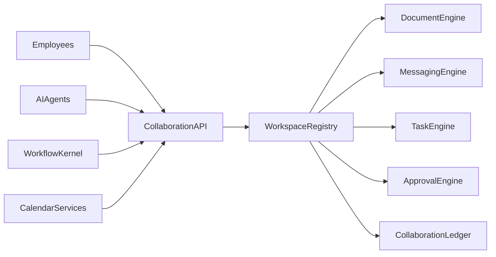
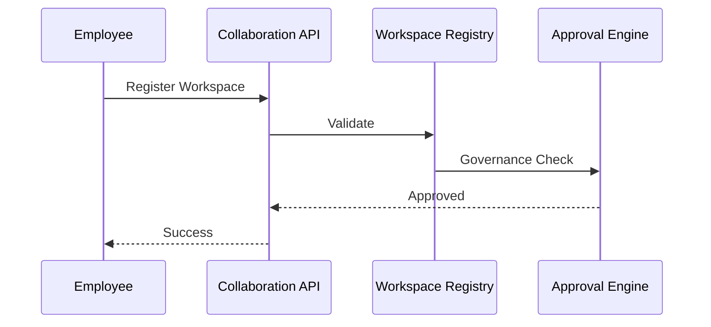

# Enterprise AI Software Factory
# Architecture Design Specification (ADS)

> **Document ID:** ADS-035-v3
>
> **Document Name:** Enterprise Collaboration & Productivity Platform — APIs, Events & Contracts
>
> **Version:** 2.0.0
>
> **Classification:** Enterprise Platform Plane
>
> **Importance:** CRITICAL
>
> **Depends On:** ADS-035-v1
>
> **Depends On:** ADS-035-v2
>
> **Next:** ADS-035-v4 — Runtime & Collaboration Infrastructure

---

# Executive Summary

The Enterprise Collaboration & Productivity Platform exposes standardized APIs for workspace management, document collaboration, messaging, meeting orchestration, task coordination, approval workflows, notification routing, calendar synchronization, and human-AI collaboration.

Every collaboration lifecycle activity occurs through these contracts.

Collaboration implementations may evolve.

Collaboration contracts remain stable.

---

# Communication Principles

Every collaboration request MUST satisfy

- Authenticated
- Authorized
- Versioned
- Observable
- Traceable
- Governed
- Secure
- Tenant Isolated

No collaboration operation bypasses the Collaboration Platform.

---

# Collaboration Communication Architecture



Workspace Registry coordinates every collaboration lifecycle operation.

---

# Public REST API

The Collaboration Platform exposes APIs for

- Workspace Registry
- Document Engine
- Messaging Engine
- Meeting Engine
- Task Engine
- Approval Engine
- Notification Engine
- Calendar Services

---

## API-035-001

### Register Workspace

```http
POST /collaboration/v1/workspaces
```

Purpose

Registers a Workspace.

---

Request

```json
{
  "workspaceName":"AI Product Team",
  "workspaceType":"Engineering",
  "securityClassification":"Internal",
  "version":"1.0.0"
}
```

---

Response

```json
{
  "workspaceRecordId":"WR-051",
  "status":"Registered"
}
```

---

## API-035-002

### Create Task

```http
POST /collaboration/v1/tasks
```

Creates a governed task.

---

## API-035-003

### Submit Approval

```http
POST /collaboration/v1/approvals
```

Starts an approval workflow.

---

## API-035-004

### Schedule Meeting

```http
POST /collaboration/v1/meetings
```

Schedules a governed meeting.

---

## API-035-005

### Send Notification

```http
POST /collaboration/v1/notifications
```

Routes a governed notification.

---

# Internal gRPC Services

```protobuf
service CollaborationService {

rpc RegisterWorkspace(WorkspaceRequest)
returns(WorkspaceResponse);

rpc CreateTask(TaskRequest)
returns(TaskResponse);

rpc SubmitApproval(ApprovalRequest)
returns(ApprovalResponse);

rpc ScheduleMeeting(MeetingRequest)
returns(MeetingResponse);

rpc SendNotification(NotificationRequest)
returns(NotificationResponse);

}
```

---

# Workspace Schema

```protobuf
message Workspace {

string workspace_id = 1;

string workspace_name = 2;

string workspace_type = 3;

string security_classification = 4;

string version = 5;

string governance_status = 6;

}
```

---

# Workspace Record Schema

```protobuf
message WorkspaceRecord {

string workspace_record_id = 1;

string workspace_id = 2;

string collaboration_profile = 3;

string lifecycle_status = 4;

string registered_at = 5;

}
```

---

# Approval Record Schema

```protobuf
message ApprovalRecord {

string approval_record_id = 1;

string workspace_record_id = 2;

string decision = 3;

string governance_policy = 4;

string completed_at = 5;

}
```

---

# MCP Tool Contracts

The Collaboration Platform exposes

```
register_workspace

create_task

submit_approval

schedule_meeting

send_notification

query_workspace

collaboration_diagnostics

calendar_sync
```

Every invocation is authenticated and audited.

---

# Collaboration Events

Every lifecycle activity emits immutable events.

---

## EVT-035-001

WorkspaceRegistered

---

## EVT-035-002

TaskCreated

---

## EVT-035-003

ApprovalSubmitted

---

## EVT-035-004

MeetingScheduled

---

## EVT-035-005

NotificationSent

---

## EVT-035-006

WorkspaceUpdated

---

## EVT-035-007

DocumentPublished

---

## EVT-035-008

WorkspaceArchived

---

# Event Flow



---

# Event Ordering

```text
WorkspaceRegistered

↓

TaskCreated

↓

ApprovalSubmitted

↓

MeetingScheduled

↓

NotificationSent

↓

WorkspaceArchived
```

---

# Event Metadata

Every event contains

```yaml
eventId:
workspaceId:
workspaceRecordId:
approvalRecordId:
traceId:
timestamp:
schemaVersion:
```

---

# End of Part 1
