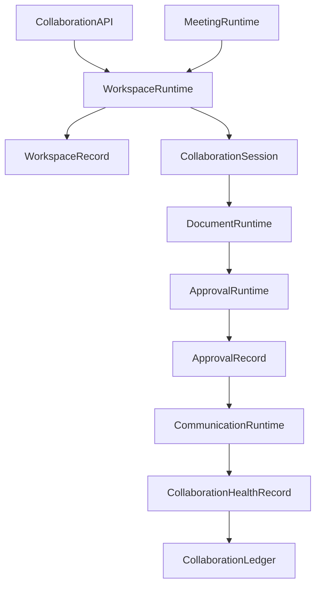

# Enterprise AI Software Factory
# Architecture Design Specification (ADS)

> **Document ID:** ADS-035-v4
>
> **Document Name:** Enterprise Collaboration & Productivity Platform — Runtime & Collaboration Infrastructure
>
> **Version:** 2.0.0
>
> **Classification:** Enterprise Runtime Specification
>
> **Importance:** CRITICAL
>
> **Depends On:** ADS-035-v1
>
> **Depends On:** ADS-035-v2
>
> **Depends On:** ADS-035-v3
>
> **Next:** ADS-035-v5 — End-to-End Collaboration Lifecycle

---

# Executive Summary

This document defines the runtime infrastructure responsible for continuously operating enterprise collaboration services.

The runtime manages workspace synchronization, collaborative editing, messaging, meetings, task execution, approvals, notifications, calendars, and AI-assisted collaboration while maintaining deterministic, governed, and observable collaboration services.

The Collaboration Runtime serves as the execution kernel for all enterprise collaboration activities.

---

# Runtime Philosophy

The Collaboration Runtime follows seven principles.

- Workspace First
- Human-in-the-Loop
- Continuous Collaboration
- Governed Participation
- Deterministic Coordination
- Continuous Availability
- Immutable Activity History

Runtime execution never bypasses governance.

---

# Runtime Layers

## Workspace Runtime

Responsible for

- Workspace Synchronization
- Membership Management
- Policy Enforcement
- Context Distribution

---

## Document Runtime

Responsible for

- Real-time Collaboration
- Conflict Resolution
- Version Synchronization
- Publishing

---

## Communication Runtime

Responsible for

- Messaging
- Notifications
- Presence
- Conversation Routing

---

## Meeting Runtime

Responsible for

- Scheduling
- Live Sessions
- Recording
- Action Items

---

## Approval Runtime

Responsible for

- Review Routing
- Escalation
- Approval Decisions
- Governance Enforcement

---

## Health Runtime

Responsible for

- Runtime Monitoring
- Collaboration Health
- Messaging Health
- Synchronization Health

---

# Runtime Architecture



Collaboration Runtime coordinates every collaboration activity.

---

# Runtime Components

| Component | Responsibility |
|------------|----------------|
| Workspace Runtime | Workspace execution |
| Document Runtime | Collaborative editing |
| Communication Runtime | Messaging & notifications |
| Meeting Runtime | Meeting lifecycle |
| Approval Runtime | Approval execution |
| Health Runtime | Runtime monitoring |
| Collaboration Ledger | Immutable collaboration history |

---

# Runtime Pipeline

```text
Collaboration Request

↓

Workspace Resolution

↓

Policy Validation

↓

Collaboration Execution

↓

Approval Evaluation

↓

Notification Delivery

↓

Collaboration Ledger
```

Every collaboration activity follows this lifecycle.

---

# Workspace Runtime

Workspace Runtime manages

- Membership
- Context Synchronization
- Resource Allocation
- Workspace State
- Policy Enforcement

Workspace execution remains deterministic.

---

# Document Runtime

Document Runtime coordinates

- Concurrent Editing
- Merge Resolution
- Version History
- Publication
- Access Validation

Document collaboration remains reproducible.

---

# Collaboration Session Management

Every runtime session tracks

- Workspace Record
- Active Participants
- Documents
- Tasks
- Meetings
- AI Participants
- Activity Timeline

Collaboration Sessions remain immutable.

---

# Runtime Guarantees

The Collaboration Runtime guarantees

- Deterministic Collaboration
- Continuous Synchronization
- Explainable Approvals
- Consistent Workspace State
- Policy Enforcement
- Human Oversight
- Immutable Collaboration History

---

# End of Part 1
