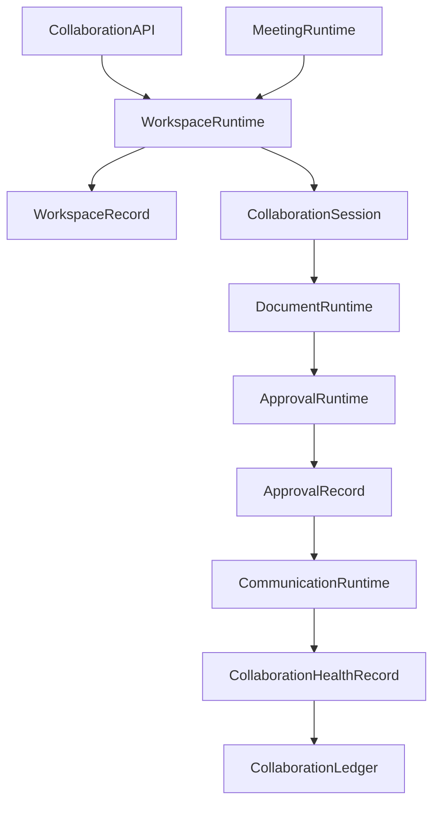
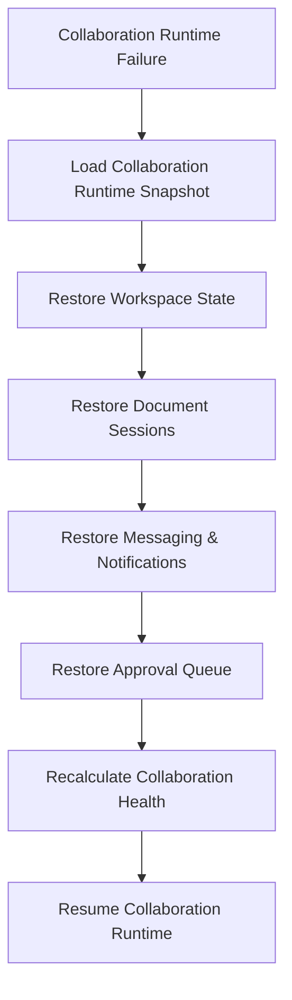

# Enterprise AI Software Factory
# Architecture Design Specification (ADS)

> **Document ID:** ADS-035-v4
>
> **Document Name:** Enterprise Collaboration & Productivity Platform — Runtime & Collaboration Infrastructure
>
> **Version:** 2.0.0
>
> **Classification:** Enterprise Runtime Specification
>
> **Importance:** CRITICAL
>
> **Depends On:** ADS-035-v1
>
> **Depends On:** ADS-035-v2
>
> **Depends On:** ADS-035-v3
>
> **Next:** ADS-035-v5 — End-to-End Collaboration Lifecycle

---

# Executive Summary

This document defines the runtime infrastructure responsible for continuously operating enterprise collaboration services.

The runtime manages workspace synchronization, collaborative editing, messaging, meetings, task execution, approvals, notifications, calendars, and AI-assisted collaboration while maintaining deterministic, governed, and observable collaboration services.

The Collaboration Runtime serves as the execution kernel for all enterprise collaboration activities.

---

# Runtime Philosophy

The Collaboration Runtime follows seven principles.

- Workspace First
- Human-in-the-Loop
- Continuous Collaboration
- Governed Participation
- Deterministic Coordination
- Continuous Availability
- Immutable Activity History

Runtime execution never bypasses governance.

---

# Runtime Layers

## Workspace Runtime

Responsible for

- Workspace Synchronization
- Membership Management
- Policy Enforcement
- Context Distribution

---

## Document Runtime

Responsible for

- Real-time Collaboration
- Conflict Resolution
- Version Synchronization
- Publishing

---

## Communication Runtime

Responsible for

- Messaging
- Notifications
- Presence
- Conversation Routing

---

## Meeting Runtime

Responsible for

- Scheduling
- Live Sessions
- Recording
- Action Items

---

## Approval Runtime

Responsible for

- Review Routing
- Escalation
- Approval Decisions
- Governance Enforcement

---

## Health Runtime

Responsible for

- Runtime Monitoring
- Collaboration Health
- Messaging Health
- Synchronization Health

---

# Runtime Architecture



Collaboration Runtime coordinates every collaboration activity.

---

# Runtime Components

| Component | Responsibility |
|------------|----------------|
| Workspace Runtime | Workspace execution |
| Document Runtime | Collaborative editing |
| Communication Runtime | Messaging & notifications |
| Meeting Runtime | Meeting lifecycle |
| Approval Runtime | Approval execution |
| Health Runtime | Runtime monitoring |
| Collaboration Ledger | Immutable collaboration history |

---

# Runtime Pipeline

```text
Collaboration Request

↓

Workspace Resolution

↓

Policy Validation

↓

Collaboration Execution

↓

Approval Evaluation

↓

Notification Delivery

↓

Collaboration Ledger
```

Every collaboration activity follows this lifecycle.

---

# Workspace Runtime

Workspace Runtime manages

- Membership
- Context Synchronization
- Resource Allocation
- Workspace State
- Policy Enforcement

Workspace execution remains deterministic.

---

# Document Runtime

Document Runtime coordinates

- Concurrent Editing
- Merge Resolution
- Version History
- Publication
- Access Validation

Document collaboration remains reproducible.

---

# Collaboration Session Management

Every runtime session tracks

- Workspace Record
- Active Participants
- Documents
- Tasks
- Meetings
- AI Participants
- Activity Timeline

Collaboration Sessions remain immutable.

---

# Runtime Guarantees

The Collaboration Runtime guarantees

- Deterministic Collaboration
- Continuous Synchronization
- Explainable Approvals
- Consistent Workspace State
- Policy Enforcement
- Human Oversight
- Immutable Collaboration History

---

# Failure Recovery

The Collaboration Runtime automatically recovers from workspace, messaging, meeting, document, and approval failures while preserving collaboration integrity.

Recovery follows approved governance and recovery policies.



Recovery guarantees

- No workspace corruption
- No document inconsistency
- No approval history loss
- Deterministic recovery

---

# Runtime Health Monitoring

Every runtime component continuously reports health.

Collected metrics

- Workspace Runtime Health
- Document Runtime Health
- Communication Runtime Health
- Meeting Runtime Health
- Approval Runtime Health
- Active Collaboration Sessions
- Synchronization Status
- Notification Queue Depth

Health Flow

```text
Runtime Component

↓

Heartbeat

↓

Collaboration Runtime Monitor

↓

Operations Dashboard

↓

Alert Engine

↓

Collaboration Operations Team
```

Health monitoring remains continuous.

---

# Collaboration Runtime Snapshot

The runtime periodically generates Collaboration Runtime Snapshots.

```yaml
collaborationRuntimeSnapshot:

  snapshotId:

  generatedAt:

  activeWorkspaces:

  activeCollaborationSessions:

  activeMeetings:

  activeDocuments:

  notificationQueue:

  synchronizationStatus:

  platformHealth:

  throughput:
```

Collaboration Runtime Snapshots provide deterministic operational state.

---

# Runtime Configuration

Example

```yaml
collaborationRuntime:

  realtimeCollaboration: enabled

  documentSynchronization: enabled

  approvalRouting: enabled

  meetingCoordination: enabled

  notificationDelivery: enabled

  runtimeSnapshots: enabled

  aiAssistance: enabled

  snapshotInterval: 10m
```

Configuration remains version-controlled.

---

# Collaboration Scaling

Collaboration Runtime supports

- Horizontal Workspace Distribution
- Distributed Document Synchronization
- Elastic Messaging Infrastructure
- Parallel Approval Processing
- Scalable Notification Delivery

Scaling remains policy-driven.

---

# Runtime Isolation

Collaboration Runtime isolates

- Workspaces
- Collaboration Sessions
- Documents
- Meetings
- Approval Pipelines
- Notification Channels

Isolation prevents cross-workspace interference.

---

# Prometheus Metrics

```text
collaboration_runtime_snapshots_total

active_workspaces_total

active_collaboration_sessions_total

active_documents_total

meeting_runtime_duration_seconds

approval_processing_duration_seconds

notification_delivery_duration_seconds

workspace_sync_latency_seconds

collaboration_runtime_health_score

document_conflict_resolutions_total
```

---

# OpenTelemetry

Distributed tracing spans

```text
Collaboration API

↓

Workspace Runtime

↓

Document Runtime

↓

Communication Runtime

↓

Meeting Runtime

↓

Approval Runtime

↓

Collaboration Ledger
```

Every runtime stage contributes trace spans.

---

# Structured Logging

Example

```json
{
  "workspaceRecord":"WR-051",
  "runtimeSnapshot":"CRS-013",
  "collaborationSession":"CS-108",
  "approvalRecord":"APR-093",
  "platformHealth":"Healthy",
  "activeParticipants":42
}
```

Logs remain immutable and correlated.

---

# Disaster Recovery

Recovery flow

```text
Collaboration Runtime Failure

↓

Restore Collaboration Runtime Snapshot

↓

Restore Workspace State

↓

Resume Collaboration Sessions

↓

Restore Approval Queue

↓

Validate Collaboration Health

↓

Resume Runtime
```

Recovery targets

Recovery Point Objective (RPO)

Near-zero collaboration state loss

Recovery Time Objective (RTO)

Less than five minutes

---

# Recommended Production Deployment

```text
Collaboration API

↓

Workspace Runtime

↓

Document Runtime

↓

Communication Runtime

↓

Meeting Runtime

↓

Approval Runtime

↓

Collaboration Ledger

↓

OpenTelemetry

↓

Prometheus

↓

Grafana
```

---

# Technology Decision Records

## TDR-035-01

### Technology

Matrix

### Decision

Use Matrix as the default secure messaging protocol.

### Reason

Provides decentralized, secure, interoperable enterprise messaging with end-to-end encryption support.

---

## TDR-035-02

### Technology

OnlyOffice

### Decision

Support OnlyOffice for collaborative document editing.

### Reason

Provides enterprise-grade real-time document collaboration with version history and editing controls.

---

## TDR-035-03

### Technology

Collaboration Runtime Snapshot

### Decision

Persist periodic Collaboration Runtime Snapshots.

### Reason

Supports diagnostics, recovery, operational visibility, and capacity planning.

---

## TDR-035-04

### Technology

Jitsi Meet

### Decision

Support Jitsi Meet as the default open meeting platform.

### Reason

Provides secure video conferencing, recordings, and extensibility.

---

## TDR-035-05

### Technology

Apache Kafka

### Decision

Use Apache Kafka for collaboration event streaming.

### Reason

Supports scalable messaging, notifications, event replay, and workflow integration.

---

# Runtime Checklist

The Collaboration Platform MUST

- Generate Collaboration Runtime Snapshots
- Synchronize workspaces continuously
- Preserve immutable approval history
- Support deterministic collaboration
- Maintain document consistency
- Continuously monitor runtime health
- Enforce governed participation

The Collaboration Platform MUST NOT

- Allow unauthorized collaboration
- Bypass approval workflows
- Lose collaboration history
- Publish inconsistent document state
- Allow cross-workspace runtime interference

---

# Architecture Decision Records

## ADR-035-09

### Decision

Treat Collaboration Runtime Snapshots as immutable runtime artifacts.

### Status

Accepted

### Reason

Snapshots improve diagnostics, recovery, capacity planning, and operational visibility.

---

## ADR-035-10

### Decision

Separate workspace synchronization from collaboration execution.

### Status

Accepted

### Reason

Workspace state management evolves independently from runtime collaboration, improving scalability and resilience.

---

## ADR-035-11

### Decision

Execute every collaboration workflow within an isolated Collaboration Session.

### Status

Accepted

### Reason

Session isolation improves governance, reproducibility, observability, and operational reliability.

---

# Operational Readiness Scorecard

| Capability | Status |
|------------|--------|
| Collaboration Runtime | ✅ Required |
| Runtime Snapshots | ✅ Required |
| Workspace Runtime | ✅ Required |
| Document Runtime | ✅ Required |
| Runtime Recovery | ✅ Required |
| Continuous Synchronization | ✅ Required |
| Governed Collaboration | ✅ Required |
| Deterministic Execution | ✅ Required |

---

# Related Documents

ADS-021-v5 — Workflow Kernel

ADS-022-v5 — Identity & Trust Plane

ADS-023-v5 — Enterprise Memory Plane

ADS-024-v5 — Agent Execution Platform

ADS-025-v5 — Compute & Infrastructure Platform

ADS-026-v5 — Security Platform

ADS-027-v5 — Observability Platform

ADS-028-v5 — Governance Platform

ADS-029-v5 — Developer Experience Platform

ADS-030-v5 — Integration & Ecosystem Platform

ADS-031-v5 — Operations & Platform Administration

ADS-032-v5 — AI/ML & Model Lifecycle Platform

ADS-033-v5 — Enterprise Data Platform & Knowledge Fabric

ADS-034-v5 — Enterprise Analytics & Business Intelligence

ADS-035-v1 — Enterprise Collaboration & Productivity Platform

ADS-035-v2 — Collaboration Algorithms & Productivity Framework

ADS-035-v3 — APIs, Events & Contracts

ADS-035-v5 — End-to-End Collaboration Lifecycle

---

# End of Document
