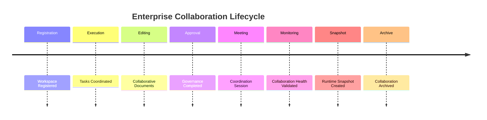

# Enterprise AI Software Factory
# Architecture Design Specification (ADS)

> **Document ID:** ADS-035-v5
>
> **Document Name:** Enterprise Collaboration & Productivity Platform — End-to-End Collaboration Lifecycle
>
> **Version:** 2.0.0
>
> **Classification:** Reference Implementation
>
> **Importance:** CRITICAL
>
> **Depends On:** ADS-035-v1
>
> **Depends On:** ADS-035-v2
>
> **Depends On:** ADS-035-v3
>
> **Depends On:** ADS-035-v4

---

# Executive Summary

This document demonstrates how the Enterprise Collaboration & Productivity Platform manages the complete lifecycle of enterprise collaboration—from workspace creation and collaborative work through approvals, meetings, notifications, monitoring, and archival.

It illustrates how Workspaces, Workspace Records, Approval Records, Collaboration Sessions, Collaboration Health Records, Collaboration Runtime Snapshots, and Collaboration Ledger Entries interact throughout real enterprise collaboration operations.

Every collaboration is governed.

Every approval is auditable.

Every collaborative activity is reproducible.

---

# Scenario

An enterprise launches a cross-functional product initiative involving engineering, product management, legal, compliance, and AI assistants.

Participating systems

- Collaboration Platform
- Workflow Kernel
- Knowledge Platform
- Analytics Platform
- Governance Platform
- Operations Platform

---

# Stage 1 — Workspace Registration

Generated

```
WS-2027-014
```

Workspace contains

- Workspace Name
- Workspace Type
- Security Classification
- Members
- Governance Policy
- Version

Workspace becomes immutable.

---

# Stage 2 — Workspace Record

Generated

```
WR-2027-009
```

Workspace Record includes

- Collaboration Profile
- Communication Channels
- Active Members
- Lifecycle Status
- Governance Status

Workspace Record archived.

---

# Stage 3 — Task Coordination

Task Engine creates

- Development Tasks
- Documentation Tasks
- Review Tasks
- Compliance Tasks

Task execution begins.

---

# Stage 4 — Collaborative Editing

Document Runtime coordinates

- Concurrent Editing
- Version History
- AI Suggestions
- Human Review
- Publishing

Documents synchronize successfully.

---

# Stage 5 — Approval Workflow

Generated

```
APR-2027-017
```

Approval Record contains

- Reviewers
- Decision
- Governance Policy
- Supporting Artifacts
- Audit Trail

Approval succeeds.

---

# Stage 6 — Collaboration Session

Generated

```
CS-2027-066
```

Collaboration Session records

- Participants
- Active Documents
- Meetings
- AI Participants
- Activity Timeline

Session completes successfully.

---

# Stage 7 — Runtime Monitoring

Generated

```
CHR-2027-006
```

Collaboration Health metrics

- Workspace Availability: 99.99%
- Document Sync Health: Healthy
- Notification Delivery: 99.98%
- Approval Latency: 1.8 s
- Platform Health: Healthy

Platform remains Healthy.

---

# Stage 8 — Runtime Snapshot

Generated

```
CRS-2027-004
```

Snapshot contains

- Active Workspaces
- Active Sessions
- Active Meetings
- Notification Queue
- Runtime Health

Snapshot archived.

---

# Stage 9 — Meeting Coordination

Meeting Runtime executes

- Agenda Review
- Live Meeting
- Recording
- Action Item Assignment
- Calendar Updates

Meeting completes successfully.

---

# Stage 10 — Collaboration Ledger

Generated

```
CL-2027-021
```

Ledger Entry references

- Workspace
- Workspace Record
- Approval Record
- Collaboration Session
- Collaboration Health Record
- Runtime Snapshot

Entry becomes immutable.

---

# Stage 11 — Human-AI Collaboration

AI assistants generate

- Task Recommendations
- Knowledge Suggestions
- Draft Documents
- Meeting Summaries

Human reviewers approve all governed outputs before publication.

---

# Stage 12 — Archival

Archived artifacts

- Workspace
- Workspace Record
- Approval Record
- Collaboration Session
- Collaboration Health Record
- Runtime Snapshot
- Collaboration Ledger Entry

Collaboration lifecycle remains fully reproducible.

---

# Collaboration Timeline



---

# Collaboration Event Stream

```text
WorkspaceRegistered

↓

TaskCreated

↓

DocumentUpdated

↓

ApprovalCompleted

↓

CollaborationSessionCompleted

↓

MeetingCompleted

↓

CollaborationHealthUpdated

↓

RuntimeSnapshotCreated

↓

CollaborationLedgerWritten

↓

WorkspaceArchived
```

---

# Produced Artifacts

| Artifact | Identifier |
|-----------|------------|
| Workspace | WS-2027-014 |
| Workspace Record | WR-2027-009 |
| Approval Record | APR-2027-017 |
| Collaboration Session | CS-2027-066 |
| Collaboration Health Record | CHR-2027-006 |
| Collaboration Runtime Snapshot | CRS-2027-004 |
| Collaboration Ledger Entry | CL-2027-021 |

---

# Runtime Metrics

| Metric | Value |
|---------|------:|
| Active Workspaces | 9,240 |
| Daily Collaboration Sessions | 4.8 M |
| Active Documents | 312,000 |
| Meeting Success Rate | 99.9% |
| Notification Delivery Rate | 99.98% |
| Approval SLA Compliance | 99.7% |
| Average Document Sync Latency | 86 ms |
| Runtime Availability | 99.99% |

---

# Operational Readiness Scorecard

| Capability | Status |
|------------|--------|
| Workspaces | ✅ Verified |
| Workspace Records | ✅ Verified |
| Approval Records | ✅ Verified |
| Collaboration Sessions | ✅ Verified |
| Collaboration Health Records | ✅ Verified |
| Runtime Snapshots | ✅ Verified |
| Collaboration Ledger | ✅ Verified |
| Deterministic Lifecycle | ✅ Verified |

---

# Lessons Learned

The Enterprise Collaboration & Productivity Platform demonstrates the following principles.

- Workspaces define authoritative collaboration boundaries.
- Workspace Records preserve managed collaboration implementations.
- Approval Records capture governed organizational decisions.
- Collaboration Sessions preserve runtime collaboration evidence.
- Collaboration Health Records continuously measure platform quality.
- Collaboration Runtime Snapshots enable deterministic recovery and operational visibility.
- Collaboration Ledger Entries preserve immutable collaboration history.

---

# Architecture Decision Record

## ADR-035-12

### Decision

Represent enterprise collaboration as a deterministic lifecycle composed of immutable collaboration artifacts.

### Status

Accepted

### Reason

Artifact-centric collaboration improves governance, reproducibility, operational visibility, regulatory compliance, human-AI coordination, and enterprise productivity.

---

# Technology Decision Record

## TDR-035-06

### Technology

Enterprise Collaboration Platform

### Decision

Implement a centralized Enterprise Collaboration & Productivity Platform responsible for workspaces, collaborative editing, messaging, meetings, approvals, notifications, calendar coordination, human-AI collaboration, and immutable collaboration history.

### Reason

A unified Collaboration Platform provides secure, governed, observable, and reproducible enterprise collaboration while integrating seamlessly with the Workflow Kernel, Knowledge Platform, Analytics Platform, Governance Platform, and Operations Platform.

---

# Related Documents

ADS-021-v5 — Workflow Kernel

ADS-022-v5 — Identity & Trust Plane

ADS-023-v5 — Enterprise Memory Plane

ADS-024-v5 — Agent Execution Platform

ADS-025-v5 — Compute & Infrastructure Platform

ADS-026-v5 — Security Platform

ADS-027-v5 — Observability Platform

ADS-028-v5 — Governance Platform

ADS-029-v5 — Developer Experience Platform

ADS-030-v5 — Integration & Ecosystem Platform

ADS-031-v5 — Operations & Platform Administration

ADS-032-v5 — AI/ML & Model Lifecycle Platform

ADS-033-v5 — Enterprise Data Platform & Knowledge Fabric

ADS-034-v5 — Enterprise Analytics & Business Intelligence

ADS-035-v1 — Enterprise Collaboration & Productivity Platform

ADS-035-v2 — Collaboration Algorithms & Productivity Framework

ADS-035-v3 — APIs, Events & Contracts

ADS-035-v4 — Runtime & Collaboration Infrastructure

---

# End of Document
