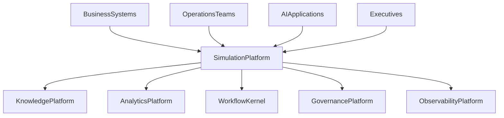
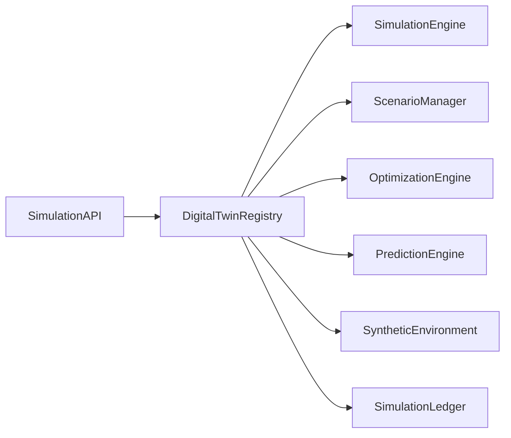

# Enterprise AI Software Factory
# Architecture Design Specification (ADS)

> **Document ID:** ADS-036-v1
>
> **Document Name:** Enterprise Digital Twin & Simulation Platform — Architecture
>
> **Version:** 2.0.0
>
> **Classification:** Enterprise Platform Plane
>
> **Importance:** CRITICAL
>
> **Depends On:** ADS-021-v5
>
> **Depends On:** ADS-022-v5
>
> **Depends On:** ADS-023-v5
>
> **Depends On:** ADS-024-v5
>
> **Depends On:** ADS-025-v5
>
> **Depends On:** ADS-026-v5
>
> **Depends On:** ADS-027-v5
>
> **Depends On:** ADS-028-v5
>
> **Depends On:** ADS-029-v5
>
> **Depends On:** ADS-030-v5
>
> **Depends On:** ADS-031-v5
>
> **Depends On:** ADS-032-v5
>
> **Depends On:** ADS-033-v5
>
> **Depends On:** ADS-034-v5
>
> **Depends On:** ADS-035-v5
>
> **Next:** ADS-036-v2 — Simulation Algorithms & Digital Twin Framework

---

# Executive Summary

The Enterprise Digital Twin & Simulation Platform provides centralized management for digital twins, scenario modeling, system simulations, synthetic environments, optimization workflows, predictive analysis, Monte Carlo simulations, capacity planning, and enterprise what-if analysis.

The platform enables organizations to model, simulate, validate, and optimize complex enterprise systems before changes are deployed into production.

Simulation becomes a first-class enterprise capability.

---

# Why This System Exists

Enterprise systems evolve continuously.

Organizations must continuously

- Model Business Processes
- Simulate Operations
- Evaluate What-if Scenarios
- Predict Resource Demand
- Optimize Capacity
- Validate Policy Changes
- Analyze Risk
- Run Synthetic Experiments
- Evaluate AI Behavior
- Forecast System Outcomes

The Digital Twin Platform standardizes these responsibilities.

---

# Core Philosophy

Model Reality.

Simulate Safely.

Predict Reliably.

Optimize Continuously.

---

# Design Goals

The platform provides

- Digital Twin Registry
- Simulation Engine
- Scenario Manager
- Optimization Engine
- Monte Carlo Engine
- Synthetic Environment
- Capacity Planning Engine
- Prediction Engine
- Simulation Governance
- Simulation Ledger

---

# Architectural Position

Every enterprise simulation flows through the Simulation Platform.

---

# High-Level Architecture

The Digital Twin Registry coordinates the complete simulation lifecycle.

---

# Major Components

| Component | Responsibility |
|------------|----------------|
| Simulation API | Public simulation interface |
| Digital Twin Registry | Twin lifecycle |
| Simulation Engine | Execution of simulations |
| Scenario Manager | What-if scenarios |
| Optimization Engine | Resource optimization |
| Prediction Engine | Outcome prediction |
| Synthetic Environment | Safe experimentation |
| Simulation Ledger | Immutable simulation history |

---

# Simulation Domains

| Domain | Purpose |
|---------|---------|
| Digital Twins | System representation |
| Scenarios | Alternative futures |
| Simulations | Operational modeling |
| Optimization | Resource planning |
| Predictions | Outcome estimation |
| Synthetic Environments | Safe experimentation |
| Capacity Planning | Scaling decisions |
| Risk Analysis | Failure modeling |

Every domain follows a governed lifecycle.

---

# Simulation Principles

The platform follows

- Twin First
- Explainable Simulation
- Deterministic Execution
- Scenario Isolation
- Continuous Validation
- Governed Experimentation
- Immutable Simulation History

---

# Simulation Boundaries

Every simulation operation passes through

- Identity Verification
- Security Validation
- Governance Approval
- Scenario Validation
- Observability
- Immutable Audit

No enterprise simulation bypasses governance.

---

# Architecture Decision Records

## ADR-036-01

### Decision

Centralize enterprise simulation into a dedicated Digital Twin Platform.

### Status

Accepted

### Reason

Centralized simulation improves prediction quality, operational planning, governance, explainability, and enterprise optimization.

---

## ADR-036-02

### Decision

Represent digital twins and simulations as immutable enterprise artifacts.

### Status

Accepted

### Reason

Artifact-centric simulation improves reproducibility, auditability, optimization, governance, and long-term enterprise learning.

---

# Operational Readiness Scorecard

| Capability | Status |
|------------|--------|
| Digital Twin Registry | ✅ Required |
| Simulation Engine | ✅ Required |
| Scenario Manager | ✅ Required |
| Optimization Engine | ✅ Required |
| Prediction Engine | ✅ Required |
| Synthetic Environment | ✅ Required |
| Simulation Governance | ✅ Required |
| Simulation Ledger | ✅ Required |

---

# Version Roadmap

| Version | Description |
|----------|-------------|
| v1 | Architecture |
| v2 | Simulation Algorithms & Digital Twin Framework |
| v3 | APIs, Events & Contracts |
| v4 | Runtime & Simulation Infrastructure |
| v5 | End-to-End Simulation Lifecycle |

---

# Related Documents

ADS-021-v5 — Workflow Kernel

ADS-022-v5 — Identity & Trust Plane

ADS-023-v5 — Enterprise Memory Plane

ADS-024-v5 — Agent Execution Platform

ADS-025-v5 — Compute & Infrastructure Platform

ADS-026-v5 — Security Platform

ADS-027-v5 — Observability Platform

ADS-028-v5 — Governance Platform

ADS-029-v5 — Developer Experience Platform

ADS-030-v5 — Integration & Ecosystem Platform

ADS-031-v5 — Operations & Platform Administration

ADS-032-v5 — AI/ML & Model Lifecycle Platform

ADS-033-v5 — Enterprise Data Platform & Knowledge Fabric

ADS-034-v5 — Enterprise Analytics & Business Intelligence

ADS-035-v5 — Enterprise Collaboration & Productivity Platform

---

# Next Document

**ADS-036-v2 — Simulation Algorithms & Digital Twin Framework**

Defines digital twin lifecycle, scenario modeling, simulation execution, optimization algorithms, predictive modeling, synthetic environment orchestration, capacity planning, and enterprise what-if analysis.

---

# End of Document
