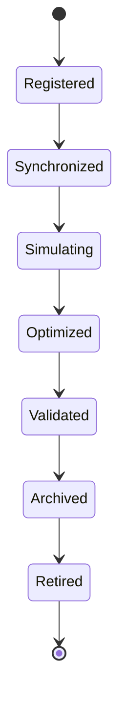

# Enterprise AI Software Factory
# Architecture Design Specification (ADS)

> **Document ID:** ADS-036-v2
>
> **Document Name:** Enterprise Digital Twin & Simulation Platform — Simulation Algorithms & Digital Twin Framework
>
> **Version:** 2.0.0
>
> **Classification:** Enterprise Platform Plane
>
> **Importance:** CRITICAL
>
> **Depends On:** ADS-036-v1
>
> **Next:** ADS-036-v3 — APIs, Events & Contracts

---

# Executive Summary

This document defines the algorithms responsible for digital twin lifecycle management, scenario modeling, simulation execution, predictive modeling, optimization, synthetic environment orchestration, capacity planning, and enterprise what-if analysis.

Every digital twin is versioned.

Every simulation is reproducible.

Every prediction is explainable.

---

# Design Philosophy

The Simulation Platform follows six principles.

- Twin First
- Deterministic Simulation
- Explainable Predictions
- Scenario Isolation
- Continuous Synchronization
- Immutable History

Enterprise simulations remain reproducible.

---

# Digital Twin Lifecycle

```text
Twin Registration

↓

Synchronization

↓

Scenario Modeling

↓

Simulation Execution

↓

Optimization

↓

Prediction

↓

Validation

↓

Archival
```

Every Digital Twin follows this lifecycle.

---

# Digital Twin

Every enterprise simulation begins with an immutable Digital Twin.

```yaml
digitalTwin:

  twinId:

  twinName:

  twinType:

  representedSystem:

  owner:

  simulationModel:

  dataSources:

  synchronizationPolicy:

  governanceStatus:

  lifecycleStatus:

  version:

  createdAt:
```

Digital Twin definitions remain immutable.

---

# ALG-036-001

## Twin Registration

Twin registration validates

- Twin Identity
- Represented System
- Simulation Model
- Data Sources
- Synchronization Policy
- Governance Policies

Registration creates a Twin Record.

---

# ALG-036-002

## Synchronization

Synchronization Engine coordinates

- Data Refresh
- State Synchronization
- Event Replay
- Configuration Updates
- Dependency Resolution

Twin state remains consistent.

---

# ALG-036-003

## Scenario Modeling

Scenario Manager defines

- Initial Conditions
- Variables
- Constraints
- Assumptions
- External Events
- Success Criteria

Scenarios remain version-controlled.

---

# Simulation Categories

| Category | Purpose |
|----------|----------|
| Operational | Business process simulation |
| Infrastructure | Platform capacity |
| Financial | Cost forecasting |
| AI | Model behavior |
| Security | Threat simulation |
| Supply Chain | Logistics planning |
| Customer | Behavior modeling |

Simulation taxonomy remains extensible.

---

# ALG-036-004

## Simulation Execution

Simulation Engine executes

- Discrete Event Simulation
- System Dynamics
- Agent-Based Simulation
- Monte Carlo Simulation
- Hybrid Simulation

Simulation execution remains deterministic.

---

# Simulation Domains

| Domain | Purpose |
|------|----------|
| Digital Twins | Virtual enterprise assets |
| Scenarios | Alternative futures |
| Simulations | Operational execution |
| Optimization | Resource allocation |
| Predictions | Outcome estimation |
| Synthetic Environments | Safe experimentation |
| Capacity Planning | Scaling analysis |
| Risk Analysis | Failure prediction |

Simulation domains remain extensible.

---

# ALG-036-005

## Prediction Engine

Prediction Engine validates

- Simulation Outputs
- Historical Data
- Forecast Models
- Confidence Scores
- Sensitivity Analysis
- Outcome Ranking

Predictions precede enterprise recommendations.

---

# ALG-036-006

## Optimization Engine

Optimization Engine continuously evaluates

- Resource Allocation
- Capacity Utilization
- Cost Efficiency
- Performance Targets
- Constraint Satisfaction
- Multi-objective Trade-offs

Optimization recommendations remain explainable.

---

# ALG-036-007

## Synthetic Environment Orchestration

Synthetic Environment manages

- Test Data Generation
- Virtual Infrastructure
- AI Agent Simulation
- Event Injection
- Failure Scenarios
- Environmental Isolation

Synthetic environments remain reproducible.

---

# ALG-036-008

## Capacity Planning

Capacity Planning evaluates

- Resource Demand
- Infrastructure Limits
- Growth Trends
- Peak Utilization
- Bottlenecks
- Scaling Recommendations

Capacity planning remains deterministic.

---

# Twin Record

Every registered Digital Twin creates a Twin Record.

```yaml
twinRecord:

  twinRecordId:

  digitalTwin:

  synchronizationState:

  simulationEngine:

  activeScenario:

  healthStatus:

  governanceStatus:

  lifecycleStatus:

  version:

  synchronizedAt:
```

Twin Records remain immutable.

---

# Digital Twin Lifecycle Stages

| Stage | Purpose |
|--------|----------|
| Registered | Twin created |
| Synchronized | Current state aligned |
| Simulating | Active execution |
| Optimized | Recommendations generated |
| Validated | Results verified |
| Archived | Historical preservation |
| Retired | Lifecycle complete |

Simulation lifecycle remains policy-driven.

---

# Scenario Lifecycle

Supported stages

| Stage | Purpose |
|--------|----------|
| Defined | Scenario created |
| Configured | Variables assigned |
| Executed | Simulation completed |
| Evaluated | Outcomes analyzed |
| Approved | Results accepted |
| Archived | Historical reference |

Scenario history remains reproducible.

---

# Simulation State Machine



Every Digital Twin follows this lifecycle.

---

# Simulation Pipeline

Every governed simulation follows

```text
Register Twin

↓

Synchronize State

↓

Configure Scenario

↓

Execute Simulation

↓

Optimize Outcomes

↓

Generate Predictions

↓

Validate Results

↓

Archive
```

Every simulation remains explainable.

---

# Simulation Metrics

```text
digital_twins_total

twin_records_total

active_scenarios_total

simulation_runs_total

prediction_jobs_total

optimization_jobs_total

capacity_plans_total

synthetic_environment_runs_total

simulation_latency_seconds

simulation_platform_health_score
```

---

# Structured Logging

Example

```json
{
  "digitalTwin":"DT-214",
  "twinRecord":"TR-051",
  "scenario":"SC-094",
  "predictionConfidence":0.96,
  "optimizationScore":98.2,
  "timestamp":"2027-03-08T11:26:41Z"
}
```

Logs remain immutable and correlated.

---

# Architecture Decision Records

## ADR-036-03

### Decision

Represent every managed Digital Twin as a Twin Record.

### Status

Accepted

### Reason

Twin Records separate logical enterprise representations from runtime simulation implementations while improving governance, synchronization, reproducibility, and lifecycle management.

---

## ADR-036-04

### Decision

Require scenario isolation for every simulation.

### Status

Accepted

### Reason

Scenario isolation prevents cross-simulation interference, improves reproducibility, and enables safe experimentation.

---

## ADR-036-05

### Decision

Continuously synchronize Digital Twins with enterprise state.

### Status

Accepted

### Reason

Continuous synchronization improves simulation fidelity, prediction accuracy, and operational trust.

---

# Operational Readiness Scorecard

| Capability | Status |
|------------|--------|
| Digital Twins | ✅ Required |
| Twin Records | ✅ Required |
| Scenario Modeling | ✅ Required |
| Simulation Execution | ✅ Required |
| Optimization Engine | ✅ Required |
| Prediction Engine | ✅ Required |
| Synthetic Environments | ✅ Required |
| Capacity Planning | ✅ Required |

---

# Related Documents

ADS-021-v5 — Workflow Kernel

ADS-022-v5 — Identity & Trust Plane

ADS-023-v5 — Enterprise Memory Plane

ADS-024-v5 — Agent Execution Platform

ADS-025-v5 — Compute & Infrastructure Platform

ADS-026-v5 — Security Platform

ADS-027-v5 — Observability Platform

ADS-028-v5 — Governance Platform

ADS-029-v5 — Developer Experience Platform

ADS-030-v5 — Integration & Ecosystem Platform

ADS-031-v5 — Operations & Platform Administration

ADS-032-v5 — AI/ML & Model Lifecycle Platform

ADS-033-v5 — Enterprise Data Platform & Knowledge Fabric

ADS-034-v5 — Enterprise Analytics & Business Intelligence

ADS-035-v5 — Enterprise Collaboration & Productivity Platform

ADS-036-v1 — Enterprise Digital Twin & Simulation Platform

ADS-036-v3 — APIs, Events & Contracts

---

# End of Document
