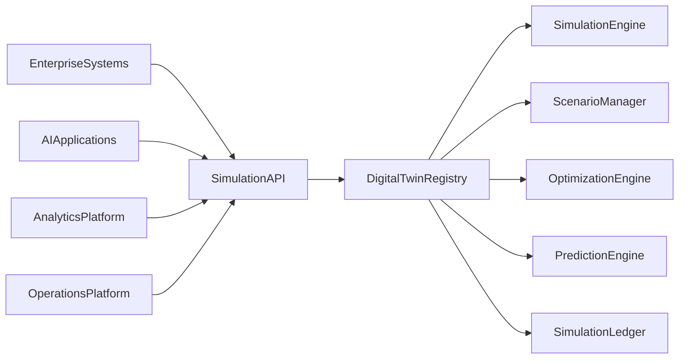
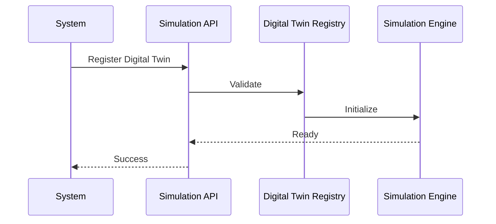
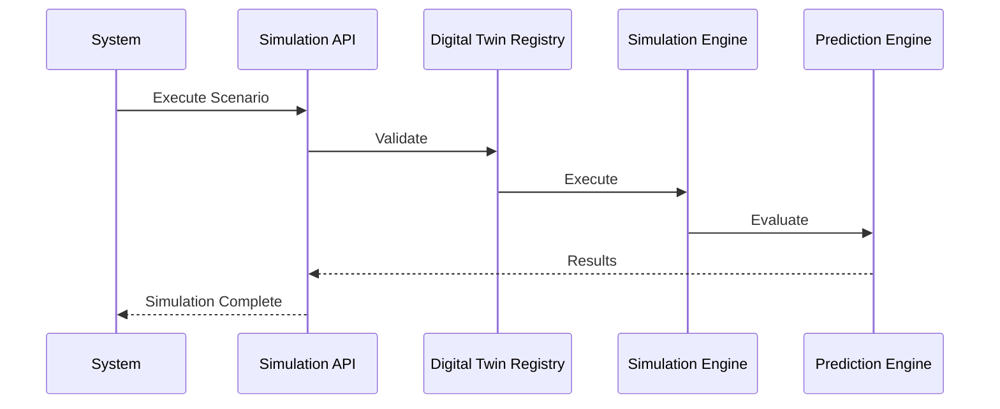

# Enterprise AI Software Factory
# Architecture Design Specification (ADS)

> **Document ID:** ADS-036-v3
>
> **Document Name:** Enterprise Digital Twin & Simulation Platform — APIs, Events & Contracts
>
> **Version:** 2.0.0
>
> **Classification:** Enterprise Platform Plane
>
> **Importance:** CRITICAL
>
> **Depends On:** ADS-036-v1
>
> **Depends On:** ADS-036-v2
>
> **Next:** ADS-036-v4 — Runtime & Simulation Infrastructure

---

# Executive Summary

The Enterprise Digital Twin & Simulation Platform exposes standardized APIs for digital twin registration, synchronization, scenario execution, optimization, prediction, capacity planning, and synthetic environment orchestration.

Every simulation lifecycle activity occurs through these contracts.

Simulation implementations may evolve.

Simulation contracts remain stable.

---

# Communication Principles

Every simulation request MUST satisfy

- Authenticated
- Authorized
- Versioned
- Observable
- Explainable
- Governed
- Secure
- Tenant Isolated

No simulation operation bypasses the Simulation Platform.

---

# Simulation Communication Architecture



Digital Twin Registry coordinates every simulation lifecycle operation.

---

# Public REST API

The Simulation Platform exposes APIs for

- Digital Twin Registry
- Scenario Manager
- Simulation Engine
- Optimization Engine
- Prediction Engine
- Capacity Planning
- Synthetic Environment
- Simulation Governance

---

## API-036-001

### Register Digital Twin

```http
POST /simulation/v1/digital-twins
```

Purpose

Registers a Digital Twin.

---

Request

```json
{
  "twinName":"North America Logistics Network",
  "twinType":"SupplyChain",
  "representedSystem":"Global Logistics",
  "version":"1.0.0"
}
```

---

Response

```json
{
  "twinRecordId":"TR-051",
  "status":"Registered"
}
```

---

## API-036-002

### Execute Scenario

```http
POST /simulation/v1/scenarios
```

Creates and executes a governed simulation scenario.

---

## API-036-003

### Optimize Resources

```http
POST /simulation/v1/optimizations
```

Executes optimization algorithms.

---

## API-036-004

### Generate Prediction

```http
POST /simulation/v1/predictions
```

Runs governed predictive analysis.

---

## API-036-005

### Create Synthetic Environment

```http
POST /simulation/v1/synthetic-environments
```

Creates an isolated experimentation environment.

---

# Internal gRPC Services

```protobuf
service SimulationService {

rpc RegisterDigitalTwin(TwinRequest)
returns(TwinResponse);

rpc ExecuteScenario(ScenarioRequest)
returns(ScenarioResponse);

rpc OptimizeResources(OptimizationRequest)
returns(OptimizationResponse);

rpc GeneratePrediction(PredictionRequest)
returns(PredictionResponse);

rpc CreateSyntheticEnvironment(EnvironmentRequest)
returns(EnvironmentResponse);

}
```

---

# Digital Twin Schema

```protobuf
message DigitalTwin {

string twin_id = 1;

string twin_name = 2;

string twin_type = 3;

string represented_system = 4;

string version = 5;

string governance_status = 6;

}
```

---

# Twin Record Schema

```protobuf
message TwinRecord {

string twin_record_id = 1;

string twin_id = 2;

string synchronization_state = 3;

string lifecycle_status = 4;

string synchronized_at = 5;

}
```

---

# Scenario Record Schema

```protobuf
message ScenarioRecord {

string scenario_record_id = 1;

string twin_record_id = 2;

string execution_profile = 3;

string validation_status = 4;

string completed_at = 5;

}
```

---

# MCP Tool Contracts

The Simulation Platform exposes

```
register_digital_twin

execute_scenario

optimize_resources

generate_prediction

create_synthetic_environment

query_twin

simulation_diagnostics

capacity_planning
```

Every invocation is authenticated and audited.

---

# Simulation Events

Every lifecycle activity emits immutable events.

---

## EVT-036-001

DigitalTwinRegistered

---

## EVT-036-002

TwinSynchronized

---

## EVT-036-003

ScenarioExecuted

---

## EVT-036-004

OptimizationCompleted

---

## EVT-036-005

PredictionGenerated

---

## EVT-036-006

SyntheticEnvironmentCreated

---

## EVT-036-007

ScenarioValidated

---

## EVT-036-008

SimulationArchived

---

# Event Flow



---

# Event Ordering

```text
DigitalTwinRegistered

↓

TwinSynchronized

↓

ScenarioExecuted

↓

OptimizationCompleted

↓

PredictionGenerated

↓

ScenarioValidated

↓

SimulationArchived
```

---

# Event Metadata

Every event contains

```yaml
eventId:
twinId:
twinRecordId:
scenarioRecordId:
traceId:
timestamp:
schemaVersion:
```

---

# Request Validation

Every simulation lifecycle request follows a deterministic validation pipeline.

```text
Receive Request

↓

Schema Validation

↓

Authentication

↓

Authorization

↓

Twin Validation

↓

Scenario Validation

↓

Governance Validation

↓

Execution
```

Execution begins only after successful validation.

---

# Validation Rules

Every request MUST satisfy

| Rule | Description |
|------|-------------|
| API Version | Supported lifecycle contract |
| Authentication | Valid identity |
| Authorization | Approved simulation permissions |
| Twin Version | Registered Digital Twin |
| Scenario Integrity | Valid scenario configuration |
| Governance | Approved simulation policies |
| Resource Availability | Required compute capacity |
| Tenant | Tenant isolation enforced |

Validation failures reject the request.

---

# Authentication

Simulation authentication supports

- OAuth 2.1
- Mutual TLS
- API Keys
- JWT
- OpenID Connect
- SPIFFE / SPIRE

Anonymous simulation execution is prohibited.

---

# Authorization

Authorization evaluates

- User Identity
- Organization
- Twin Ownership
- Scenario Permissions
- Simulation Policies
- Governance Rules

Decision

```text
Allow

↓

Execute

Deny

↓

Reject

Review

↓

Governance Approval
```

Every authorization decision is audited.

---

# Simulation Session

Every governed simulation execution creates an immutable Simulation Session.

```yaml
simulationSession:

  sessionId:

  twinRecord:

  scenarioRecord:

  simulationEngine:

  optimizationPlan:

  predictionProfile:

  executionGraph:

  executionState:

  executionDuration:

  completedAt:
```

Simulation Sessions remain immutable.

---

# Runtime Sequence



---

# Simulation Policies

Supported policies

| Policy | Purpose |
|---------|----------|
| Twin Synchronization | State consistency |
| Scenario Isolation | Safe execution |
| Resource Allocation | Capacity control |
| Prediction Validation | Confidence enforcement |
| Optimization Rules | Objective governance |
| Experiment Approval | Controlled experimentation |

Policies remain version-controlled.

---

# Distributed Tracing

Every simulation lifecycle operation includes

- Trace ID
- Twin ID
- Twin Record ID
- Scenario Record ID
- Simulation Session ID

Trace Flow

```text
Simulation API

↓

Digital Twin Registry

↓

Simulation Engine

↓

Optimization Engine

↓

Prediction Engine

↓

Simulation Ledger
```

Every stage contributes trace spans.

---

# Prometheus Metrics

```text
digital_twins_total

twin_records_total

scenario_records_total

simulation_sessions_total

simulation_runs_total

prediction_jobs_total

optimization_jobs_total

synthetic_environment_runs_total

simulation_execution_latency_seconds

simulation_runtime_health_score
```

---

# Structured Logging

Example

```json
{
  "traceId":"trace-93184",
  "digitalTwin":"DT-214",
  "twinRecord":"TR-051",
  "scenarioRecord":"SR-094",
  "simulationSession":"SS-118",
  "executionStatus":"Success"
}
```

Logs remain immutable and correlated.

---

# Audit Records

Every simulation lifecycle operation records

- Digital Twin
- Twin Record
- Scenario Record
- Simulation Session
- Workflow ID
- Trace ID
- Timestamp
- Twin Version

Audit history is append-only.

---

# Reference Standards & Specifications

The Simulation Platform aligns with

| Standard | Purpose |
|----------|---------|
| OpenAPI 3.1 | REST APIs |
| OpenTelemetry | Distributed tracing |
| FMI 3.0 | Functional Mock-up Interface |
| SysML v2 | System modeling |
| Modelica | Physical system modeling |
| NIST AI RMF | AI-assisted simulation governance |
| ISO 23247 | Digital Twin Framework for Manufacturing |

---

# Architecture Decision Records

## ADR-036-06

### Decision

Represent every governed simulation execution as a Simulation Session.

### Status

Accepted

### Reason

Simulation Sessions provide replayability, operational observability, governance evidence, performance analytics, and auditability.

---

## ADR-036-07

### Decision

Separate Digital Twin management from runtime simulation execution.

### Status

Accepted

### Reason

Twin definitions evolve independently from runtime execution, improving scalability, maintainability, and simulation reproducibility.

---

## ADR-036-08

### Decision

Require validated Digital Twins before simulation execution.

### Status

Accepted

### Reason

Validated twins improve prediction accuracy, simulation fidelity, governance, and enterprise trust.

---

# Operational Readiness Scorecard

| Capability | Status |
|------------|--------|
| Digital Twins | ✅ Required |
| Twin Records | ✅ Required |
| Scenario Records | ✅ Required |
| Simulation Sessions | ✅ Required |
| Distributed Tracing | ✅ Required |
| Immutable Audit | ✅ Required |
| Standards Compliance | ✅ Required |
| Governed Simulation | ✅ Required |

---

# Related Documents

ADS-021-v5 — Workflow Kernel

ADS-022-v5 — Identity & Trust Plane

ADS-023-v5 — Enterprise Memory Plane

ADS-024-v5 — Agent Execution Platform

ADS-025-v5 — Compute & Infrastructure Platform

ADS-026-v5 — Security Platform

ADS-027-v5 — Observability Platform

ADS-028-v5 — Governance Platform

ADS-029-v5 — Developer Experience Platform

ADS-030-v5 — Integration & Ecosystem Platform

ADS-031-v5 — Operations & Platform Administration

ADS-032-v5 — AI/ML & Model Lifecycle Platform

ADS-033-v5 — Enterprise Data Platform & Knowledge Fabric

ADS-034-v5 — Enterprise Analytics & Business Intelligence

ADS-035-v5 — Enterprise Collaboration & Productivity Platform

ADS-036-v1 — Enterprise Digital Twin & Simulation Platform

ADS-036-v2 — Simulation Algorithms & Digital Twin Framework

ADS-036-v4 — Runtime & Simulation Infrastructure

---

# End of Document
