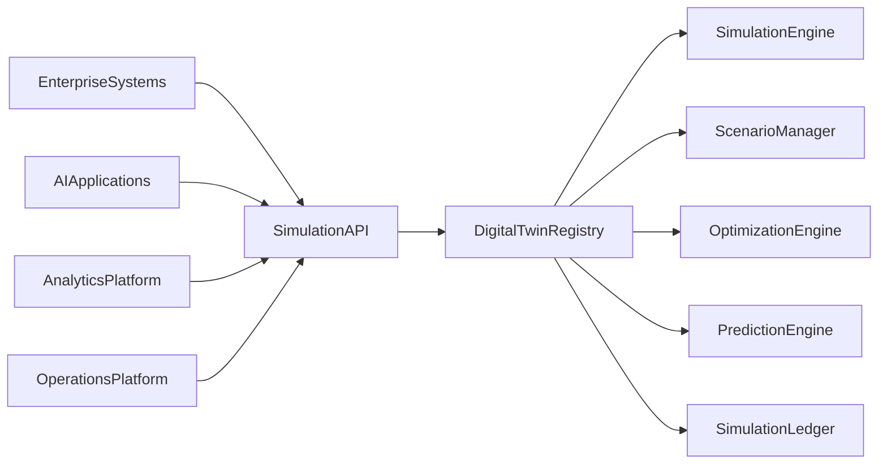
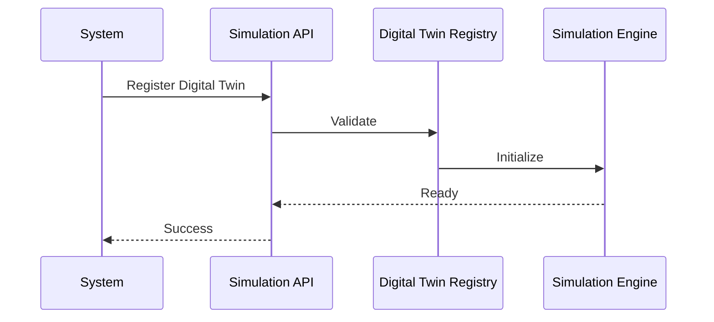

# Enterprise AI Software Factory
# Architecture Design Specification (ADS)

> **Document ID:** ADS-036-v3
>
> **Document Name:** Enterprise Digital Twin & Simulation Platform — APIs, Events & Contracts
>
> **Version:** 2.0.0
>
> **Classification:** Enterprise Platform Plane
>
> **Importance:** CRITICAL
>
> **Depends On:** ADS-036-v1
>
> **Depends On:** ADS-036-v2
>
> **Next:** ADS-036-v4 — Runtime & Simulation Infrastructure

---

# Executive Summary

The Enterprise Digital Twin & Simulation Platform exposes standardized APIs for digital twin registration, synchronization, scenario execution, optimization, prediction, capacity planning, and synthetic environment orchestration.

Every simulation lifecycle activity occurs through these contracts.

Simulation implementations may evolve.

Simulation contracts remain stable.

---

# Communication Principles

Every simulation request MUST satisfy

- Authenticated
- Authorized
- Versioned
- Observable
- Explainable
- Governed
- Secure
- Tenant Isolated

No simulation operation bypasses the Simulation Platform.

---

# Simulation Communication Architecture



Digital Twin Registry coordinates every simulation lifecycle operation.

---

# Public REST API

The Simulation Platform exposes APIs for

- Digital Twin Registry
- Scenario Manager
- Simulation Engine
- Optimization Engine
- Prediction Engine
- Capacity Planning
- Synthetic Environment
- Simulation Governance

---

## API-036-001

### Register Digital Twin

```http
POST /simulation/v1/digital-twins
```

Purpose

Registers a Digital Twin.

---

Request

```json
{
  "twinName":"North America Logistics Network",
  "twinType":"SupplyChain",
  "representedSystem":"Global Logistics",
  "version":"1.0.0"
}
```

---

Response

```json
{
  "twinRecordId":"TR-051",
  "status":"Registered"
}
```

---

## API-036-002

### Execute Scenario

```http
POST /simulation/v1/scenarios
```

Creates and executes a governed simulation scenario.

---

## API-036-003

### Optimize Resources

```http
POST /simulation/v1/optimizations
```

Executes optimization algorithms.

---

## API-036-004

### Generate Prediction

```http
POST /simulation/v1/predictions
```

Runs governed predictive analysis.

---

## API-036-005

### Create Synthetic Environment

```http
POST /simulation/v1/synthetic-environments
```

Creates an isolated experimentation environment.

---

# Internal gRPC Services

```protobuf
service SimulationService {

rpc RegisterDigitalTwin(TwinRequest)
returns(TwinResponse);

rpc ExecuteScenario(ScenarioRequest)
returns(ScenarioResponse);

rpc OptimizeResources(OptimizationRequest)
returns(OptimizationResponse);

rpc GeneratePrediction(PredictionRequest)
returns(PredictionResponse);

rpc CreateSyntheticEnvironment(EnvironmentRequest)
returns(EnvironmentResponse);

}
```

---

# Digital Twin Schema

```protobuf
message DigitalTwin {

string twin_id = 1;

string twin_name = 2;

string twin_type = 3;

string represented_system = 4;

string version = 5;

string governance_status = 6;

}
```

---

# Twin Record Schema

```protobuf
message TwinRecord {

string twin_record_id = 1;

string twin_id = 2;

string synchronization_state = 3;

string lifecycle_status = 4;

string synchronized_at = 5;

}
```

---

# Scenario Record Schema

```protobuf
message ScenarioRecord {

string scenario_record_id = 1;

string twin_record_id = 2;

string execution_profile = 3;

string validation_status = 4;

string completed_at = 5;

}
```

---

# MCP Tool Contracts

The Simulation Platform exposes

```
register_digital_twin

execute_scenario

optimize_resources

generate_prediction

create_synthetic_environment

query_twin

simulation_diagnostics

capacity_planning
```

Every invocation is authenticated and audited.

---

# Simulation Events

Every lifecycle activity emits immutable events.

---

## EVT-036-001

DigitalTwinRegistered

---

## EVT-036-002

TwinSynchronized

---

## EVT-036-003

ScenarioExecuted

---

## EVT-036-004

OptimizationCompleted

---

## EVT-036-005

PredictionGenerated

---

## EVT-036-006

SyntheticEnvironmentCreated

---

## EVT-036-007

ScenarioValidated

---

## EVT-036-008

SimulationArchived

---

# Event Flow



---

# Event Ordering

```text
DigitalTwinRegistered

↓

TwinSynchronized

↓

ScenarioExecuted

↓

OptimizationCompleted

↓

PredictionGenerated

↓

ScenarioValidated

↓

SimulationArchived
```

---

# Event Metadata

Every event contains

```yaml
eventId:
twinId:
twinRecordId:
scenarioRecordId:
traceId:
timestamp:
schemaVersion:
```

---

# End of Part 1
