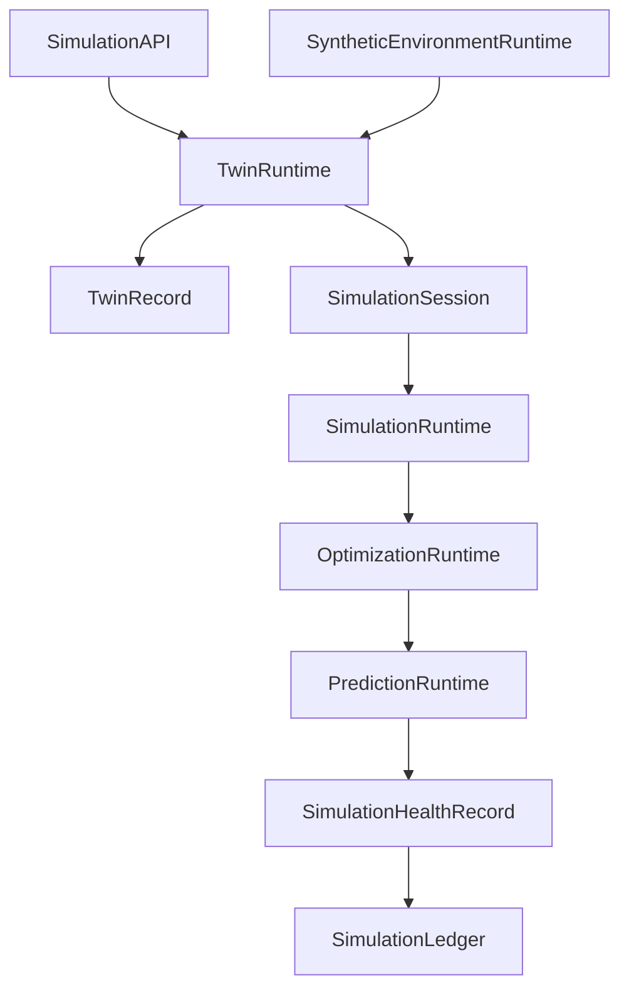

# Enterprise AI Software Factory
# Architecture Design Specification (ADS)

> **Document ID:** ADS-036-v4
>
> **Document Name:** Enterprise Digital Twin & Simulation Platform — Runtime & Simulation Infrastructure
>
> **Version:** 2.0.0
>
> **Classification:** Enterprise Runtime Specification
>
> **Importance:** CRITICAL
>
> **Depends On:** ADS-036-v1
>
> **Depends On:** ADS-036-v2
>
> **Depends On:** ADS-036-v3
>
> **Next:** ADS-036-v5 — End-to-End Simulation Lifecycle

---

# Executive Summary

This document defines the runtime infrastructure responsible for continuously operating enterprise digital twins and simulation services.

The runtime manages digital twin synchronization, simulation execution, prediction pipelines, optimization workflows, synthetic environments, and enterprise scenario evaluation while maintaining deterministic, governed, and observable runtime behavior.

The Simulation Runtime serves as the execution kernel for all enterprise simulation activities.

---

# Runtime Philosophy

The Simulation Runtime follows seven principles.

- Twin First
- Continuous Synchronization
- Deterministic Execution
- Explainable Predictions
- Governed Experimentation
- Continuous Availability
- Immutable Simulation History

Runtime execution never bypasses governance.

---

# Runtime Layers

## Twin Runtime

Responsible for

- Twin Synchronization
- State Management
- Event Replay
- Configuration Updates

---

## Simulation Runtime

Responsible for

- Scenario Execution
- Discrete Event Simulation
- Agent Simulation
- Monte Carlo Execution

---

## Optimization Runtime

Responsible for

- Resource Optimization
- Constraint Solving
- Objective Evaluation
- Recommendation Generation

---

## Prediction Runtime

Responsible for

- Forecast Generation
- Confidence Analysis
- Outcome Ranking
- Sensitivity Analysis

---

## Synthetic Environment Runtime

Responsible for

- Environment Provisioning
- Failure Injection
- Test Data Generation
- Isolation Management

---

## Health Runtime

Responsible for

- Runtime Monitoring
- Simulation Health
- Synchronization Health
- Prediction Health

---

# Runtime Architecture



Simulation Runtime coordinates every simulation activity.

---

# Runtime Components

| Component | Responsibility |
|------------|----------------|
| Twin Runtime | Digital twin execution |
| Simulation Runtime | Scenario execution |
| Optimization Runtime | Resource optimization |
| Prediction Runtime | Predictive analysis |
| Synthetic Environment Runtime | Isolated experimentation |
| Health Runtime | Runtime monitoring |
| Simulation Ledger | Immutable simulation history |

---

# Runtime Pipeline

```text
Simulation Request

↓

Twin Synchronization

↓

Scenario Execution

↓

Optimization

↓

Prediction

↓

Health Update

↓

Simulation Ledger
```

Every simulation execution follows this lifecycle.

---

# Twin Runtime

Twin Runtime manages

- State Synchronization
- Event Processing
- Dependency Resolution
- Configuration Updates
- Consistency Validation

Twin execution remains deterministic.

---

# Simulation Runtime

Simulation Runtime coordinates

- Scenario Scheduling
- Simulation Execution
- Parallel Workloads
- Result Aggregation
- Replay Support

Simulation execution remains reproducible.

---

# Simulation Session Management

Every runtime session tracks

- Twin Record
- Scenario Record
- Simulation Engine
- Optimization Results
- Prediction Results
- Execution Timeline
- Runtime Metadata

Simulation Sessions remain immutable.

---

# Runtime Guarantees

The Simulation Runtime guarantees

- Deterministic Simulation
- Continuous Synchronization
- Explainable Predictions
- Scenario Isolation
- Policy Enforcement
- Immutable Simulation History
- Runtime Reproducibility

---

# End of Part 1
