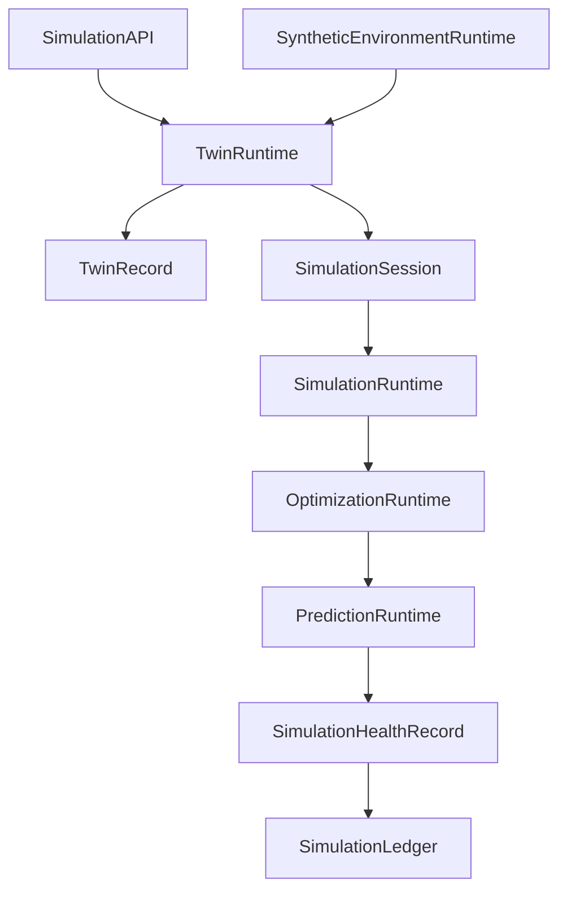
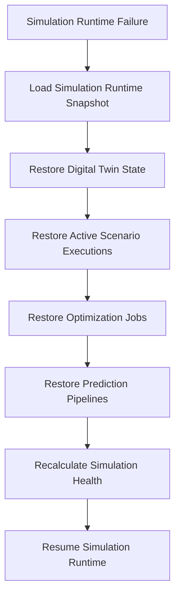

# Enterprise AI Software Factory
# Architecture Design Specification (ADS)

> **Document ID:** ADS-036-v4
>
> **Document Name:** Enterprise Digital Twin & Simulation Platform — Runtime & Simulation Infrastructure
>
> **Version:** 2.0.0
>
> **Classification:** Enterprise Runtime Specification
>
> **Importance:** CRITICAL
>
> **Depends On:** ADS-036-v1
>
> **Depends On:** ADS-036-v2
>
> **Depends On:** ADS-036-v3
>
> **Next:** ADS-036-v5 — End-to-End Simulation Lifecycle

---

# Executive Summary

This document defines the runtime infrastructure responsible for continuously operating enterprise digital twins and simulation services.

The runtime manages digital twin synchronization, simulation execution, prediction pipelines, optimization workflows, synthetic environments, and enterprise scenario evaluation while maintaining deterministic, governed, and observable runtime behavior.

The Simulation Runtime serves as the execution kernel for all enterprise simulation activities.

---

# Runtime Philosophy

The Simulation Runtime follows seven principles.

- Twin First
- Continuous Synchronization
- Deterministic Execution
- Explainable Predictions
- Governed Experimentation
- Continuous Availability
- Immutable Simulation History

Runtime execution never bypasses governance.

---

# Runtime Layers

## Twin Runtime

Responsible for

- Twin Synchronization
- State Management
- Event Replay
- Configuration Updates

---

## Simulation Runtime

Responsible for

- Scenario Execution
- Discrete Event Simulation
- Agent Simulation
- Monte Carlo Execution

---

## Optimization Runtime

Responsible for

- Resource Optimization
- Constraint Solving
- Objective Evaluation
- Recommendation Generation

---

## Prediction Runtime

Responsible for

- Forecast Generation
- Confidence Analysis
- Outcome Ranking
- Sensitivity Analysis

---

## Synthetic Environment Runtime

Responsible for

- Environment Provisioning
- Failure Injection
- Test Data Generation
- Isolation Management

---

## Health Runtime

Responsible for

- Runtime Monitoring
- Simulation Health
- Synchronization Health
- Prediction Health

---

# Runtime Architecture



Simulation Runtime coordinates every simulation activity.

---

# Runtime Components

| Component | Responsibility |
|------------|----------------|
| Twin Runtime | Digital twin execution |
| Simulation Runtime | Scenario execution |
| Optimization Runtime | Resource optimization |
| Prediction Runtime | Predictive analysis |
| Synthetic Environment Runtime | Isolated experimentation |
| Health Runtime | Runtime monitoring |
| Simulation Ledger | Immutable simulation history |

---

# Runtime Pipeline

```text
Simulation Request

↓

Twin Synchronization

↓

Scenario Execution

↓

Optimization

↓

Prediction

↓

Health Update

↓

Simulation Ledger
```

Every simulation execution follows this lifecycle.

---

# Twin Runtime

Twin Runtime manages

- State Synchronization
- Event Processing
- Dependency Resolution
- Configuration Updates
- Consistency Validation

Twin execution remains deterministic.

---

# Simulation Runtime

Simulation Runtime coordinates

- Scenario Scheduling
- Simulation Execution
- Parallel Workloads
- Result Aggregation
- Replay Support

Simulation execution remains reproducible.

---

# Simulation Session Management

Every runtime session tracks

- Twin Record
- Scenario Record
- Simulation Engine
- Optimization Results
- Prediction Results
- Execution Timeline
- Runtime Metadata

Simulation Sessions remain immutable.

---

# Runtime Guarantees

The Simulation Runtime guarantees

- Deterministic Simulation
- Continuous Synchronization
- Explainable Predictions
- Scenario Isolation
- Policy Enforcement
- Immutable Simulation History
- Runtime Reproducibility

---

# Failure Recovery

The Simulation Runtime automatically recovers from digital twin, simulation, optimization, prediction, and synthetic environment failures while preserving simulation integrity.

Recovery follows approved governance and recovery policies.



Recovery guarantees

- No Digital Twin corruption
- No Scenario inconsistency
- No Prediction history loss
- Deterministic recovery

---

# Runtime Health Monitoring

Every runtime component continuously reports health.

Collected metrics

- Twin Runtime Health
- Simulation Runtime Health
- Optimization Runtime Health
- Prediction Runtime Health
- Synthetic Environment Health
- Active Simulation Sessions
- Synchronization Status
- Simulation Queue Depth

Health Flow

```text
Runtime Component

↓

Heartbeat

↓

Simulation Runtime Monitor

↓

Simulation Operations Dashboard

↓

Alert Engine

↓

Simulation Operations Team
```

Health monitoring remains continuous.

---

# Simulation Runtime Snapshot

The runtime periodically generates Simulation Runtime Snapshots.

```yaml
simulationRuntimeSnapshot:

  snapshotId:

  generatedAt:

  activeDigitalTwins:

  activeSimulationSessions:

  activeScenarioExecutions:

  optimizationQueue:

  predictionQueue:

  syntheticEnvironments:

  platformHealth:

  throughput:
```

Simulation Runtime Snapshots provide deterministic operational state.

---

# Runtime Configuration

Example

```yaml
simulationRuntime:

  continuousSynchronization: enabled

  automaticScenarioExecution: enabled

  optimizationScheduling: enabled

  predictionPipelines: enabled

  syntheticEnvironments: enabled

  runtimeSnapshots: enabled

  replaySupport: enabled

  snapshotInterval: 10m
```

Configuration remains version-controlled.

---

# Simulation Scaling

Simulation Runtime supports

- Horizontal Twin Synchronization
- Distributed Scenario Execution
- Parallel Monte Carlo Processing
- Elastic Optimization Pipelines
- Distributed Prediction Execution

Scaling remains policy-driven.

---

# Runtime Isolation

Simulation Runtime isolates

- Digital Twins
- Scenario Executions
- Simulation Sessions
- Prediction Pipelines
- Optimization Jobs
- Synthetic Environments

Isolation prevents cross-simulation interference.

---

# Prometheus Metrics

```text
simulation_runtime_snapshots_total

active_digital_twins_total

active_simulation_sessions_total

active_scenarios_total

optimization_queue_depth

prediction_queue_depth

simulation_execution_duration_seconds

twin_synchronization_latency_seconds

simulation_runtime_health_score

synthetic_environment_count
```

---

# OpenTelemetry

Distributed tracing spans

```text
Simulation API

↓

Twin Runtime

↓

Simulation Runtime

↓

Optimization Runtime

↓

Prediction Runtime

↓

Synthetic Environment Runtime

↓

Simulation Ledger
```

Every runtime stage contributes trace spans.

---

# Structured Logging

Example

```json
{
  "twinRecord":"TR-051",
  "runtimeSnapshot":"SRS-014",
  "simulationSession":"SS-118",
  "scenarioRecord":"SR-094",
  "platformHealth":"Healthy",
  "predictionAccuracy":0.97
}
```

Logs remain immutable and correlated.

---

# Disaster Recovery

Recovery flow

```text
Simulation Runtime Failure

↓

Restore Simulation Runtime Snapshot

↓

Restore Digital Twin State

↓

Resume Scenario Executions

↓

Restore Prediction Pipelines

↓

Validate Simulation Health

↓

Resume Runtime
```

Recovery targets

Recovery Point Objective (RPO)

Near-zero simulation state loss

Recovery Time Objective (RTO)

Less than five minutes

---

# Recommended Production Deployment

```text
Simulation API

↓

Twin Runtime

↓

Simulation Runtime

↓

Optimization Runtime

↓

Prediction Runtime

↓

Synthetic Environment Runtime

↓

Simulation Ledger

↓

OpenTelemetry

↓

Prometheus

↓

Grafana
```

---

# Technology Decision Records

## TDR-036-01

### Technology

AnyLogic

### Decision

Support AnyLogic for enterprise-grade hybrid simulation.

### Reason

Provides discrete-event, system dynamics, and agent-based simulation within a unified platform.

---

## TDR-036-02

### Technology

OpenModelica

### Decision

Support OpenModelica for physical and engineering system simulations.

### Reason

Provides standards-based Modelica execution with strong interoperability.

---

## TDR-036-03

### Technology

Simulation Runtime Snapshot

### Decision

Persist periodic Simulation Runtime Snapshots.

### Reason

Supports diagnostics, replay, recovery, operational visibility, and capacity planning.

---

## TDR-036-04

### Technology

Ray

### Decision

Use Ray for distributed simulation execution.

### Reason

Supports scalable parallel simulation workloads, distributed optimization, and AI-assisted computation.

---

## TDR-036-05

### Technology

Optuna

### Decision

Use Optuna for optimization and hyperparameter search.

### Reason

Provides efficient optimization strategies for simulation objectives and constrained resource planning.

---

# Runtime Checklist

The Simulation Platform MUST

- Generate Simulation Runtime Snapshots
- Continuously synchronize Digital Twins
- Preserve immutable Scenario Records
- Support deterministic simulations
- Maintain scenario isolation
- Continuously monitor runtime health
- Enforce governed experimentation

The Simulation Platform MUST NOT

- Execute ungoverned simulations
- Bypass scenario validation
- Lose simulation history
- Allow cross-simulation interference
- Publish unvalidated prediction results

---

# Architecture Decision Records

## ADR-036-09

### Decision

Treat Simulation Runtime Snapshots as immutable runtime artifacts.

### Status

Accepted

### Reason

Snapshots improve diagnostics, replay, recovery, operational visibility, and enterprise resilience.

---

## ADR-036-10

### Decision

Separate Digital Twin synchronization from simulation execution.

### Status

Accepted

### Reason

Twin synchronization and simulation execution evolve independently, improving scalability, maintainability, and operational resilience.

---

## ADR-036-11

### Decision

Execute every simulation workflow within an isolated Simulation Session.

### Status

Accepted

### Reason

Session isolation improves reproducibility, governance, observability, replayability, and operational reliability.

---

# Operational Readiness Scorecard

| Capability | Status |
|------------|--------|
| Simulation Runtime | ✅ Required |
| Runtime Snapshots | ✅ Required |
| Twin Runtime | ✅ Required |
| Simulation Runtime | ✅ Required |
| Runtime Recovery | ✅ Required |
| Continuous Synchronization | ✅ Required |
| Governed Simulation | ✅ Required |
| Deterministic Execution | ✅ Required |

---

# Related Documents

ADS-021-v5 — Workflow Kernel

ADS-022-v5 — Identity & Trust Plane

ADS-023-v5 — Enterprise Memory Plane

ADS-024-v5 — Agent Execution Platform

ADS-025-v5 — Compute & Infrastructure Platform

ADS-026-v5 — Security Platform

ADS-027-v5 — Observability Platform

ADS-028-v5 — Governance Platform

ADS-029-v5 — Developer Experience Platform

ADS-030-v5 — Integration & Ecosystem Platform

ADS-031-v5 — Operations & Platform Administration

ADS-032-v5 — AI/ML & Model Lifecycle Platform

ADS-033-v5 — Enterprise Data Platform & Knowledge Fabric

ADS-034-v5 — Enterprise Analytics & Business Intelligence

ADS-035-v5 — Enterprise Collaboration & Productivity Platform

ADS-036-v1 — Enterprise Digital Twin & Simulation Platform

ADS-036-v2 — Simulation Algorithms & Digital Twin Framework

ADS-036-v3 — APIs, Events & Contracts

ADS-036-v5 — End-to-End Simulation Lifecycle

---

# End of Document
