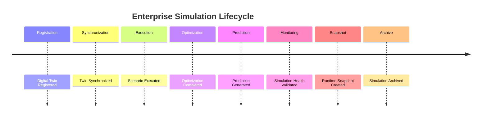

# Enterprise AI Software Factory
# Architecture Design Specification (ADS)

> **Document ID:** ADS-036-v5
>
> **Document Name:** Enterprise Digital Twin & Simulation Platform — End-to-End Simulation Lifecycle
>
> **Version:** 2.0.0
>
> **Classification:** Reference Implementation
>
> **Importance:** CRITICAL
>
> **Depends On:** ADS-036-v1
>
> **Depends On:** ADS-036-v2
>
> **Depends On:** ADS-036-v3
>
> **Depends On:** ADS-036-v4

---

# Executive Summary

This document demonstrates how the Enterprise Digital Twin & Simulation Platform manages the complete lifecycle of enterprise simulations—from digital twin registration and synchronization through scenario execution, optimization, prediction, monitoring, and archival.

It illustrates how Digital Twins, Twin Records, Scenario Records, Simulation Sessions, Simulation Health Records, Simulation Runtime Snapshots, and Simulation Ledger Entries interact throughout real enterprise simulation operations.

Every simulation is governed.

Every prediction is explainable.

Every optimization is reproducible.

---

# Scenario

An enterprise evaluates the impact of opening three new regional distribution centers while migrating warehouse automation to AI-assisted operations.

Participating systems

- Simulation Platform
- Knowledge Platform
- Analytics Platform
- Workflow Kernel
- Governance Platform
- Operations Platform

---

# Stage 1 — Digital Twin Registration

Generated

```
DT-2027-018
```

Digital Twin contains

- Twin Name
- Represented System
- Simulation Model
- Data Sources
- Synchronization Policy
- Version

Digital Twin becomes immutable.

---

# Stage 2 — Twin Synchronization

Generated

```
TR-2027-011
```

Twin Record includes

- Synchronization State
- Active Scenario
- Simulation Engine
- Health Status
- Governance Status

Twin Record archived.

---

# Stage 3 — Scenario Definition

Generated

```
SR-2027-006
```

Scenario includes

- Initial Conditions
- Resource Constraints
- Demand Forecast
- Failure Injection
- Optimization Objectives

Scenario approved.

---

# Stage 4 — Simulation Execution

Simulation Runtime executes

- Discrete Event Simulation
- Monte Carlo Analysis
- Agent-Based Simulation
- Capacity Analysis

Simulation completes successfully.

---

# Stage 5 — Optimization

Optimization Engine evaluates

- Warehouse Placement
- Staffing Levels
- Fleet Allocation
- Infrastructure Utilization

Optimization recommendations generated.

---

# Stage 6 — Prediction

Prediction Engine generates

- Demand Forecast
- Throughput Estimates
- Cost Projections
- Risk Scores
- Confidence Levels

Predictions validated.

---

# Stage 7 — Simulation Session

Generated

```
SS-2027-041
```

Simulation Session records

- Twin Record
- Scenario Record
- Execution Graph
- Prediction Results
- Runtime Metadata

Execution completes successfully.

---

# Stage 8 — Runtime Monitoring

Generated

```
SHR-2027-004
```

Simulation Health metrics

- Twin Synchronization: Healthy
- Prediction Accuracy: 97.2%
- Simulation Queue: Stable
- Optimization Success Rate: 99.3%
- Platform Health: Healthy

Platform remains Healthy.

---

# Stage 9 — Runtime Snapshot

Generated

```
SRS-2027-003
```

Snapshot contains

- Active Digital Twins
- Active Simulation Sessions
- Optimization Queue
- Prediction Queue
- Runtime Health

Snapshot archived.

---

# Stage 10 — Simulation Ledger

Generated

```
SL-2027-015
```

Ledger Entry references

- Digital Twin
- Twin Record
- Scenario Record
- Simulation Session
- Simulation Health Record
- Runtime Snapshot

Entry becomes immutable.

---

# Stage 11 — Executive Review

Decision makers evaluate

- Simulation Outcomes
- Optimization Recommendations
- Risk Assessment
- Capacity Plan
- Sensitivity Analysis

Recommended strategy approved for staged deployment.

---

# Stage 12 — Archival

Archived artifacts

- Digital Twin
- Twin Record
- Scenario Record
- Simulation Session
- Simulation Health Record
- Runtime Snapshot
- Simulation Ledger Entry

Simulation lifecycle remains fully reproducible.

---

# Simulation Timeline



---

# Simulation Event Stream

```text
DigitalTwinRegistered

↓

TwinSynchronized

↓

ScenarioExecuted

↓

OptimizationCompleted

↓

PredictionGenerated

↓

SimulationSessionCompleted

↓

SimulationHealthUpdated

↓

RuntimeSnapshotCreated

↓

SimulationLedgerWritten

↓

SimulationArchived
```

---

# Produced Artifacts

| Artifact | Identifier |
|-----------|------------|
| Digital Twin | DT-2027-018 |
| Twin Record | TR-2027-011 |
| Scenario Record | SR-2027-006 |
| Simulation Session | SS-2027-041 |
| Simulation Health Record | SHR-2027-004 |
| Simulation Runtime Snapshot | SRS-2027-003 |
| Simulation Ledger Entry | SL-2027-015 |

---

# Runtime Metrics

| Metric | Value |
|---------|------:|
| Active Digital Twins | 2,840 |
| Daily Simulation Sessions | 510,000 |
| Prediction Accuracy | 97.2% |
| Optimization Success Rate | 99.3% |
| Average Simulation Duration | 18.4 s |
| Scenario Validation Success Rate | 99.8% |
| Synthetic Environments | 1,150 |
| Runtime Availability | 99.99% |

---

# Operational Readiness Scorecard

| Capability | Status |
|------------|--------|
| Digital Twins | ✅ Verified |
| Twin Records | ✅ Verified |
| Scenario Records | ✅ Verified |
| Simulation Sessions | ✅ Verified |
| Simulation Health Records | ✅ Verified |
| Runtime Snapshots | ✅ Verified |
| Simulation Ledger | ✅ Verified |
| Deterministic Lifecycle | ✅ Verified |

---

# Lessons Learned

The Enterprise Digital Twin & Simulation Platform demonstrates the following principles.

- Digital Twins define authoritative enterprise representations.
- Twin Records preserve managed runtime implementations.
- Scenario Records capture governed simulation definitions and outcomes.
- Simulation Sessions preserve runtime execution evidence.
- Simulation Health Records continuously measure operational quality.
- Simulation Runtime Snapshots enable deterministic recovery and operational visibility.
- Simulation Ledger Entries preserve immutable simulation history.

---

# Architecture Decision Record

## ADR-036-12

### Decision

Represent enterprise simulation as a deterministic lifecycle composed of immutable simulation artifacts.

### Status

Accepted

### Reason

Artifact-centric simulation improves governance, reproducibility, operational visibility, optimization quality, enterprise forecasting, and long-term organizational learning.

---

# Technology Decision Record

## TDR-036-06

### Technology

Enterprise Digital Twin Platform

### Decision

Implement a centralized Enterprise Digital Twin & Simulation Platform responsible for digital twins, scenario modeling, optimization, prediction, synthetic environments, capacity planning, and immutable simulation history.

### Reason

 A unified Simulation Platform provides governed, explainable, observable, and reproducible enterprise simulation while integrating seamlessly with the Knowledge Platform, Analytics Platform, Workflow Kernel, Governance Platform, and Operations Platform.

---

# Related Documents

ADS-021-v5 — Workflow Kernel

ADS-022-v5 — Identity & Trust Plane

ADS-023-v5 — Enterprise Memory Plane

ADS-024-v5 — Agent Execution Platform

ADS-025-v5 — Compute & Infrastructure Platform

ADS-026-v5 — Security Platform

ADS-027-v5 — Observability Platform

ADS-028-v5 — Governance Platform

ADS-029-v5 — Developer Experience Platform

ADS-030-v5 — Integration & Ecosystem Platform

ADS-031-v5 — Operations & Platform Administration

ADS-032-v5 — AI/ML & Model Lifecycle Platform

ADS-033-v5 — Enterprise Data Platform & Knowledge Fabric

ADS-034-v5 — Enterprise Analytics & Business Intelligence

ADS-035-v5 — Enterprise Collaboration & Productivity Platform

ADS-036-v1 — Enterprise Digital Twin & Simulation Platform

ADS-036-v2 — Simulation Algorithms & Digital Twin Framework

ADS-036-v3 — APIs, Events & Contracts

ADS-036-v4 — Runtime & Simulation Infrastructure

---

# End of Document
