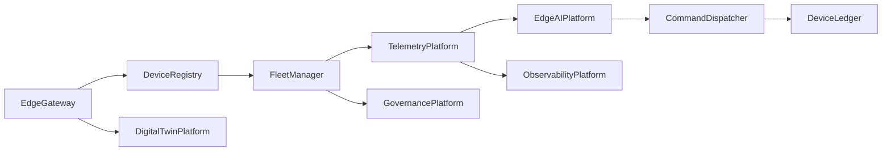

# Enterprise AI Software Factory
# Architecture Design Specification (ADS)

> **Document ID:** ADS-037-v1
>
> **Document Name:** Enterprise Edge, IoT & Cyber-Physical Systems Platform — Architecture
>
> **Version:** 1.0.0
>
> **Classification:** Enterprise Platform Plane
>
> **Importance:** CRITICAL
>
> **Depends On:** ADS-021-v5
>
> **Depends On:** ADS-022-v5
>
> **Depends On:** ADS-025-v5
>
> **Depends On:** ADS-026-v5
>
> **Depends On:** ADS-027-v5
>
> **Depends On:** ADS-030-v5
>
> **Depends On:** ADS-036-v5
>
> **Next:** ADS-037-v2 — Edge Algorithms & Device Lifecycle

---

# Executive Summary

The Enterprise Edge, IoT & Cyber-Physical Systems Platform extends the Enterprise AI Software Factory into physical environments by providing a unified control plane for edge devices, industrial equipment, embedded systems, gateways, robotics, sensors, and autonomous systems.

The platform enables secure device onboarding, fleet management, telemetry ingestion, edge AI deployment, digital asset management, remote orchestration, and resilient offline operation.

Every device is governed.

Every deployment is versioned.

Every telemetry stream is observable.

---

# Design Philosophy

The platform is built on eight principles.

- Device First
- Edge Native
- Secure by Default
- Offline Resilient
- Event Driven
- Zero Trust
- Deterministic Operations
- Fleet Scale Management

---

# Platform Architecture



The Device Registry coordinates the complete device lifecycle.

---

# Core Components

## Device Registry

Maintains

- Device Identity
- Hardware Profile
- Firmware Version
- Software Inventory
- Security Status
- Ownership
- Lifecycle State

---

## Fleet Manager

Responsible for

- Fleet Provisioning
- Fleet Segmentation
- Policy Assignment
- Bulk Operations
- Rollouts
- Rollbacks

---

## Telemetry Platform

Responsible for

- Sensor Streams
- Metrics
- Logs
- Events
- Diagnostics
- Health Monitoring

---

## Edge AI Platform

Responsible for

- Model Deployment
- Local Inference
- AI Runtime
- Model Versioning
- Resource Scheduling

---

## Command Dispatcher

Responsible for

- Remote Commands
- Configuration Updates
- Firmware Updates
- Policy Synchronization
- Emergency Shutdown

---

## Device Ledger

Maintains immutable records for

- Device Registration
- Firmware Updates
- Command Execution
- Telemetry Integrity
- Security Events

---

# Primary Artifacts

The platform introduces

- Device
- Device Record
- Fleet
- Deployment Package
- Edge Session
- Telemetry Record
- Edge Health Record
- Runtime Snapshot
- Device Ledger Entry

---

# Device

Every managed endpoint is represented as a Device.

```yaml
device:

  deviceId:

  deviceName:

  deviceType:

  manufacturer:

  model:

  firmwareVersion:

  softwareVersion:

  connectivity:

  location:

  owner:

  lifecycleState:
```

Device identifiers remain immutable.

---

# Platform Responsibilities

The platform governs

- Device Identity
- Fleet Operations
- Telemetry Collection
- Edge AI Deployment
- Secure Command Execution
- Firmware Lifecycle
- Cyber-Physical Coordination
- Runtime Health

---

# Supported Device Types

| Category | Examples |
|----------|----------|
| Sensors | Temperature, Pressure, Vibration |
| Actuators | Motors, Valves, Relays |
| Industrial Controllers | PLCs, RTUs |
| Robotics | Autonomous Mobile Robots, Robotic Arms |
| Vision Systems | Industrial Cameras |
| Vehicles | AGVs, Drones |
| Medical Devices | Diagnostic Equipment |
| Smart Infrastructure | Meters, Building Automation |

---

# Platform Guarantees

The platform guarantees

- Authenticated Devices
- Secure Communications
- Immutable Device Identity
- Fleet Consistency
- Offline Operation
- Event Ordering
- Auditability
- High Availability

---

# End of Part 1
