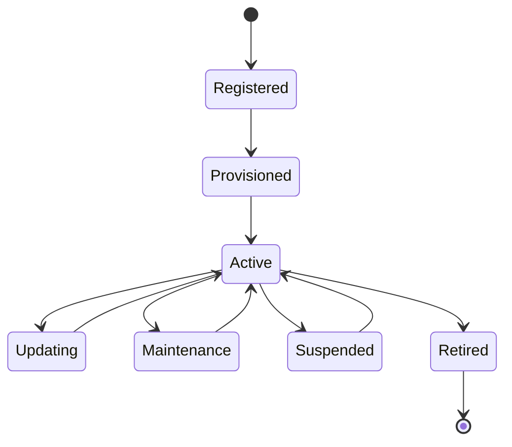

# Enterprise AI Software Factory
# Architecture Design Specification (ADS)

> **Document ID:** ADS-037-v2
>
> **Document Name:** Enterprise Edge, IoT & Cyber-Physical Systems Platform — Device Algorithms & Lifecycle
>
> **Version:** 1.0.0
>
> **Classification:** Enterprise Platform Plane
>
> **Importance:** CRITICAL
>
> **Depends On:** ADS-037-v1
>
> **Next:** ADS-037-v3 — APIs, Events & Contracts

---

# Executive Summary

This document defines the lifecycle algorithms governing enterprise edge devices, fleets, telemetry pipelines, firmware distribution, AI model deployment, and cyber-physical coordination.

Every managed device follows a deterministic lifecycle.

Every deployment is governed.

Every state transition is auditable.

---

# Design Philosophy

The Device Lifecycle follows six principles.

- Immutable Device Identity
- Deterministic State Transitions
- Secure Provisioning
- Continuous Health Monitoring
- Controlled Deployments
- Recoverable Operations

---

# ALG-037-001

## Device Registration

Every edge device SHALL be registered before joining a managed fleet.

Registration validates

- Device Identity
- Hardware Fingerprint
- Manufacturer Certificate
- Firmware Version
- Security Attestation
- Ownership

Successful registration creates a Device Record.

---

# Device

```yaml
device:

  deviceId:

  deviceName:

  deviceType:

  manufacturer:

  model:

  firmwareVersion:

  softwareVersion:

  connectivity:

  location:

  owner:

  lifecycleState:
```

Device identity remains immutable.

---

# ALG-037-002

## Device Provisioning

Provisioning performs

- Credential Installation
- Certificate Enrollment
- Configuration Assignment
- Fleet Membership
- Policy Distribution
- Time Synchronization

Provisioning completes before operational activation.

---

# ALG-037-003

## Fleet Assignment

Fleet Manager assigns devices based on

- Geography
- Device Type
- Business Unit
- Environment
- Security Classification
- Operational Role

Fleet membership remains policy-driven.

---

# Fleet Categories

| Fleet | Purpose |
|--------|----------|
| Production | Live operations |
| Staging | Validation |
| Development | Testing |
| Laboratory | Experimental devices |
| Disaster Recovery | Standby capacity |

---

# ALG-037-004

## Telemetry Collection

Telemetry Platform continuously collects

- Metrics
- Sensor Readings
- Logs
- Events
- Diagnostics
- Resource Utilization

Collection intervals are policy-controlled.

---

# Telemetry Types

| Type | Examples |
|------|----------|
| Metrics | CPU, Memory, Battery |
| Sensors | Temperature, Pressure |
| Events | Reboot, Fault |
| Diagnostics | Self-test Results |
| AI Metrics | Inference Latency |
| Network | Signal Strength |

---

# ALG-037-005

## Firmware Lifecycle

Firmware deployment follows

1. Validation
2. Staged Rollout
3. Health Verification
4. Progressive Expansion
5. Completion
6. Rollback (if required)

Firmware updates remain version-controlled.

---

# Device Record

Every registered device generates an immutable Device Record.

```yaml
deviceRecord:

  deviceRecordId:

  device:

  registrationStatus:

  firmwareStatus:

  connectivityStatus:

  securityPosture:

  assignedFleet:

  edgeRuntime:

  lifecycleState:

  lastSeenAt:
```

Device Records remain append-only.

---

# ALG-037-006

## Edge AI Deployment

The Edge AI Platform deploys AI workloads using governed rollout policies.

Deployment stages

- Package Validation
- Compatibility Verification
- Resource Assessment
- Model Installation
- Warm-Up
- Health Verification
- Activation

Only verified models become active.

---

# ALG-037-007

## Remote Command Execution

The Command Dispatcher executes

- Configuration Updates
- Firmware Installation
- Runtime Restart
- Diagnostics
- Log Collection
- Emergency Shutdown

Every command is authenticated, authorized, and audited.

---

# ALG-037-008

## Offline Synchronization

Devices operating without network connectivity SHALL continue autonomous execution.

Offline capabilities include

- Local Decision Making
- Event Buffering
- Telemetry Caching
- Policy Enforcement
- AI Inference

Synchronization resumes automatically when connectivity is restored.

---

# Fleet Record

Every managed fleet generates a Fleet Record.

```yaml
fleetRecord:

  fleetRecordId:

  fleet:

  memberDevices:

  deploymentPolicy:

  firmwareBaseline:

  securityBaseline:

  operationalStatus:

  healthScore:

  lastEvaluatedAt:
```

Fleet Records remain immutable.

---

# Device Lifecycle Stages

| Stage | Purpose |
|--------|----------|
| Registered | Device identity established |
| Provisioned | Credentials and policies assigned |
| Active | Device operational |
| Updating | Firmware or software deployment |
| Maintenance | Restricted operation |
| Suspended | Temporarily disabled |
| Retired | Permanently removed |

Lifecycle transitions are policy-controlled.

---

# Fleet Lifecycle

Supported stages

| Stage | Purpose |
|--------|----------|
| Created | Fleet initialized |
| Populated | Devices assigned |
| Operational | Production use |
| Updating | Controlled rollout |
| Validated | Health verified |
| Archived | Historical retention |

Fleet history remains reproducible.

---

# Device State Machine



Every managed device follows this lifecycle.

---

# Fleet Management Pipeline

```text
Register Device

↓

Provision Device

↓

Assign Fleet

↓

Deploy Policies

↓

Collect Telemetry

↓

Deploy AI Models

↓

Execute Commands

↓

Monitor Health

↓

Archive Lifecycle
```

---

# Edge Metrics

```text
registered_devices_total

active_devices_total

fleet_records_total

firmware_updates_total

edge_ai_deployments_total

telemetry_events_total

offline_devices_total

command_executions_total

device_health_score

fleet_health_score
```

---

# Structured Logging

Example

```json
{
  "deviceId":"DEV-481",
  "deviceRecord":"DR-102",
  "fleetRecord":"FR-019",
  "firmwareVersion":"3.2.7",
  "edgeRuntime":"Running",
  "timestamp":"2027-04-16T09:22:14Z"
}
```

Logs remain immutable and correlated.

---

# Architecture Decision Records

## ADR-037-03

### Decision

Represent every managed fleet as a Fleet Record.

### Status

Accepted

### Reason

Fleet Records provide operational governance, deployment consistency, compliance tracking, and large-scale fleet management.

---

## ADR-037-04

### Decision

Support autonomous offline execution.

### Status

Accepted

### Reason

Edge devices must continue safe operation despite intermittent or unavailable connectivity.

---

## ADR-037-05

### Decision

Separate logical device identity from operational state.

### Status

Accepted

### Reason

Decoupling identity from runtime state improves lifecycle management, auditability, resilience, and operational scalability.

---

# Operational Readiness Scorecard

| Capability | Status |
|------------|--------|
| Device Registry | ✅ Required |
| Device Records | ✅ Required |
| Fleet Records | ✅ Required |
| Edge AI Deployment | ✅ Required |
| Telemetry Collection | ✅ Required |
| Offline Operation | ✅ Required |
| Remote Commands | ✅ Required |
| Firmware Lifecycle | ✅ Required |

---

# Related Documents

ADS-021-v5 — Workflow Kernel

ADS-022-v5 — Identity & Trust Plane

ADS-025-v5 — Compute & Infrastructure Platform

ADS-026-v5 — Security Platform

ADS-027-v5 — Observability Platform

ADS-030-v5 — Integration & Ecosystem Platform

ADS-036-v5 — Enterprise Digital Twin & Simulation Platform

ADS-037-v1 — Enterprise Edge, IoT & Cyber-Physical Systems Platform

ADS-037-v3 — APIs, Events & Contracts

---

# End of Document
