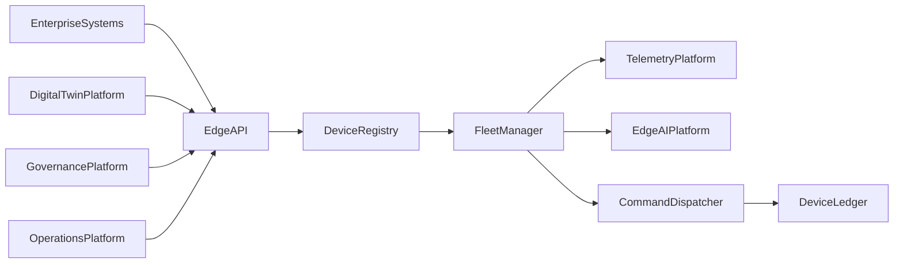
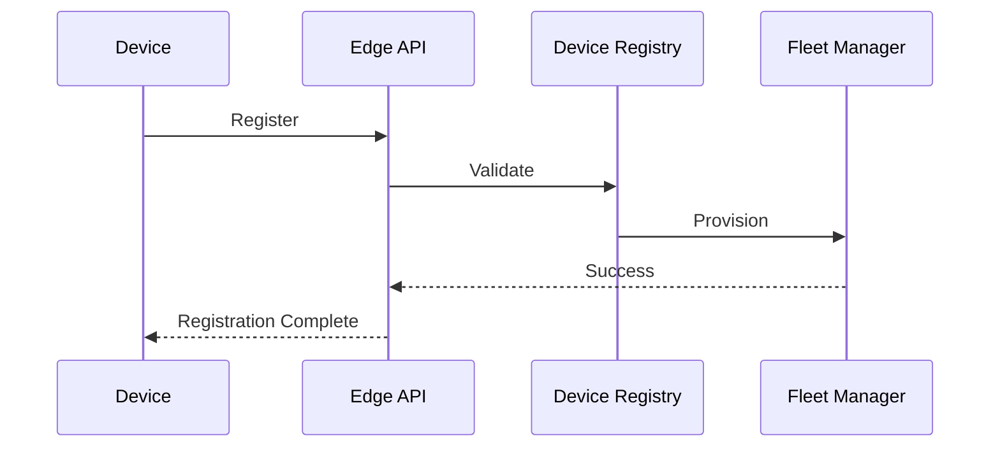
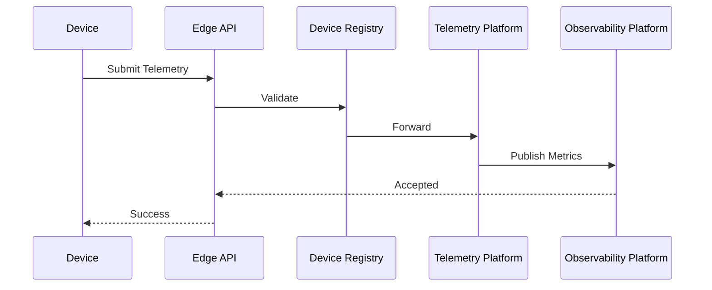

# Enterprise AI Software Factory
# Architecture Design Specification (ADS)

> **Document ID:** ADS-037-v3
>
> **Document Name:** Enterprise Edge, IoT & Cyber-Physical Systems Platform — APIs, Events & Contracts
>
> **Version:** 1.0.0
>
> **Classification:** Enterprise Platform Plane
>
> **Importance:** CRITICAL
>
> **Depends On:** ADS-037-v1
>
> **Depends On:** ADS-037-v2
>
> **Next:** ADS-037-v4 — Runtime & Edge Infrastructure

---

# Executive Summary

This document defines the public APIs, internal service contracts, event model, and messaging patterns for the Enterprise Edge, IoT & Cyber-Physical Systems Platform.

The platform exposes standardized interfaces for device registration, fleet management, telemetry ingestion, firmware deployment, edge AI lifecycle management, remote command execution, and cyber-physical orchestration.

Every edge interaction is authenticated.

Every event is immutable.

Every command is auditable.

---

# Communication Principles

Every edge request SHALL be

- Authenticated
- Authorized
- Versioned
- Observable
- Tenant Isolated
- Idempotent
- Secure
- Governed

No unmanaged communication is permitted.

---

# Communication Architecture



The Device Registry coordinates every lifecycle operation.

---

# Public REST APIs

The Edge Platform exposes APIs for

- Device Registry
- Fleet Management
- Telemetry
- Edge AI
- Command Dispatch
- Firmware Management
- Runtime Health
- Governance

---

## API-037-001

### Register Device

```http
POST /edge/v1/devices
```

Registers a managed edge device.

---

Request

```json
{
  "deviceName":"Warehouse Sensor 18",
  "deviceType":"TemperatureSensor",
  "manufacturer":"ExampleCorp",
  "model":"TS-900",
  "firmwareVersion":"1.4.2"
}
```

---

Response

```json
{
  "deviceRecordId":"DR-204",
  "status":"Registered"
}
```

---

## API-037-002

### Provision Device

```http
POST /edge/v1/provision
```

Assigns credentials, configuration, and fleet membership.

---

## API-037-003

### Deploy Package

```http
POST /edge/v1/deployments
```

Deploys firmware, software, and AI bundles to managed fleets.

---

## API-037-004

### Execute Command

```http
POST /edge/v1/commands
```

Executes authenticated remote commands.

---

## API-037-005

### Submit Telemetry

```http
POST /edge/v1/telemetry
```

Accepts telemetry, metrics, diagnostics, and events from managed devices.

---

# Internal gRPC Services

```protobuf
service EdgePlatformService {

rpc RegisterDevice(DeviceRequest)
returns(DeviceResponse);

rpc ProvisionDevice(ProvisionRequest)
returns(ProvisionResponse);

rpc DeployPackage(DeploymentRequest)
returns(DeploymentResponse);

rpc ExecuteCommand(CommandRequest)
returns(CommandResponse);

rpc SubmitTelemetry(TelemetryRequest)
returns(TelemetryResponse);

}
```

---

# Device Schema

```protobuf
message Device {

string device_id = 1;

string device_name = 2;

string device_type = 3;

string firmware_version = 4;

string lifecycle_state = 5;

}
```

---

# Device Record Schema

```protobuf
message DeviceRecord {

string device_record_id = 1;

string device_id = 2;

string registration_status = 3;

string firmware_status = 4;

string connectivity_status = 5;

}
```

---

# Fleet Record Schema

```protobuf
message FleetRecord {

string fleet_record_id = 1;

string fleet_id = 2;

string deployment_policy = 3;

string operational_status = 4;

string health_score = 5;

}
```

---

# Deployment Package Schema

```protobuf
message DeploymentPackage {

string package_id = 1;

string package_version = 2;

string target_fleet = 3;

string firmware_bundle = 4;

string ai_model_bundle = 5;

}
```

---

# MCP Tool Contracts

The Edge Platform exposes

```text
register_device

provision_device

deploy_package

execute_command

submit_telemetry

query_device

fleet_status

edge_runtime_diagnostics
```

Every invocation is authenticated and audited.

---

# Platform Events

Every lifecycle activity emits immutable events.

---

## EVT-037-001

DeviceRegistered

---

## EVT-037-002

DeviceProvisioned

---

## EVT-037-003

FleetAssigned

---

## EVT-037-004

DeploymentStarted

---

## EVT-037-005

DeploymentCompleted

---

## EVT-037-006

TelemetryReceived

---

## EVT-037-007

CommandExecuted

---

## EVT-037-008

DeviceRetired

---

# Event Flow



---

# Event Ordering

```text
DeviceRegistered

↓

DeviceProvisioned

↓

FleetAssigned

↓

DeploymentStarted

↓

DeploymentCompleted

↓

TelemetryReceived

↓

CommandExecuted

↓

DeviceRetired
```

---

# Event Metadata

Every event contains

```yaml
eventId:
deviceId:
deviceRecordId:
fleetRecordId:
traceId:
timestamp:
schemaVersion:
```

---

# Request Validation

Every edge platform request follows a deterministic validation pipeline.

```text
Receive Request

↓

Schema Validation

↓

Authentication

↓

Authorization

↓

Device Validation

↓

Fleet Validation

↓

Deployment Validation

↓

Policy Validation

↓

Execution
```

Execution begins only after successful validation.

---

# Validation Rules

Every request MUST satisfy

| Rule | Description |
|------|-------------|
| API Version | Supported platform contract |
| Authentication | Valid device or user identity |
| Authorization | Approved permissions |
| Device Registration | Device exists in registry |
| Fleet Membership | Valid fleet assignment |
| Deployment Integrity | Signed deployment package |
| Policy Compliance | Governance rules satisfied |
| Tenant Isolation | Cross-tenant access prohibited |

Validation failures reject the request.

---

# Authentication

Supported mechanisms

- OAuth 2.1
- Mutual TLS (mTLS)
- X.509 Device Certificates
- JWT
- OpenID Connect
- SPIFFE / SPIRE

Anonymous device communication is prohibited.

---

# Authorization

Authorization evaluates

- Device Identity
- User Identity
- Fleet Ownership
- Deployment Permissions
- Command Scope
- Governance Policies

Decision flow

```text
Allow

↓

Execute

Deny

↓

Reject

Review

↓

Governance Approval
```

Every authorization decision is recorded in the Device Ledger.

---

# Edge Session

Every governed runtime interaction creates an immutable Edge Session.

```yaml
edgeSession:

  sessionId:

  deviceRecord:

  fleetRecord:

  deploymentPackage:

  runtimeProfile:

  connectivityState:

  securityContext:

  executionState:

  startedAt:

  endedAt:
```

Edge Sessions remain immutable.

---

# Runtime Sequence



---

# Platform Policies

Supported policies

| Policy | Purpose |
|---------|----------|
| Device Registration | Identity governance |
| Fleet Membership | Operational grouping |
| Firmware Deployment | Safe rollout |
| AI Model Deployment | Controlled activation |
| Telemetry Retention | Data governance |
| Remote Commands | Secure execution |
| Offline Operation | Autonomous resilience |

Policies remain version-controlled.

---

# Distributed Tracing

Every edge operation includes

- Trace ID
- Device ID
- Device Record ID
- Fleet Record ID
- Edge Session ID

Trace Flow

```text
Edge API

↓

Device Registry

↓

Fleet Manager

↓

Telemetry Platform

↓

Edge AI Platform

↓

Command Dispatcher

↓

Device Ledger
```

Every service contributes trace spans.

---

# Prometheus Metrics

```text
edge_devices_total

active_edge_sessions_total

fleet_records_total

deployment_packages_total

telemetry_ingestion_total

telemetry_ingestion_latency_seconds

command_executions_total

firmware_rollouts_total

edge_runtime_health_score
```

---

# Structured Logging

Example

```json
{
  "traceId":"trace-47291",
  "deviceId":"DEV-481",
  "deviceRecord":"DR-102",
  "fleetRecord":"FR-019",
  "edgeSession":"ES-551",
  "executionStatus":"Success"
}
```

Logs remain immutable and correlated.

---

# Audit Records

Every platform operation records

- Device
- Device Record
- Fleet Record
- Deployment Package
- Edge Session
- Workflow ID
- Trace ID
- Timestamp
- Firmware Version

Audit history is append-only.

---

# Reference Standards & Specifications

The Edge Platform aligns with

| Standard | Purpose |
|----------|---------|
| OpenAPI 3.1 | REST APIs |
| gRPC | Internal services |
| MQTT 5.0 | Lightweight messaging |
| OPC UA | Industrial interoperability |
| IEC 62443 | Industrial cybersecurity |
| OpenTelemetry | Distributed tracing |
| NIST SP 800-207 | Zero Trust Architecture |

---

# Architecture Decision Records

## ADR-037-06

### Decision

Represent every runtime interaction as an Edge Session.

### Status

Accepted

### Reason

Edge Sessions provide replayability, observability, governance evidence, runtime diagnostics, and operational auditability.

---

## ADR-037-07

### Decision

Require signed Deployment Packages for every firmware, software, and AI rollout.

### Status

Accepted

### Reason

Cryptographically signed packages improve integrity, provenance, and supply chain security.

---

## ADR-037-08

### Decision

Enforce policy validation before all remote operations.

### Status

Accepted

### Reason

Centralized policy enforcement prevents unauthorized commands, inconsistent deployments, and non-compliant device behavior.

---

# Operational Readiness Scorecard

| Capability | Status |
|------------|--------|
| REST APIs | ✅ Required |
| gRPC Services | ✅ Required |
| MQTT Support | ✅ Required |
| Edge Sessions | ✅ Required |
| Distributed Tracing | ✅ Required |
| Immutable Audit | ✅ Required |
| Standards Compliance | ✅ Required |
| Zero Trust Security | ✅ Required |

---

# Related Documents

ADS-021-v5 — Workflow Kernel

ADS-022-v5 — Identity & Trust Plane

ADS-025-v5 — Compute & Infrastructure Platform

ADS-026-v5 — Security Platform

ADS-027-v5 — Observability Platform

ADS-030-v5 — Integration & Ecosystem Platform

ADS-036-v5 — Enterprise Digital Twin & Simulation Platform

ADS-037-v1 — Enterprise Edge, IoT & Cyber-Physical Systems Platform

ADS-037-v2 — Device Algorithms & Lifecycle

ADS-037-v4 — Runtime & Edge Infrastructure

---

# End of Document
