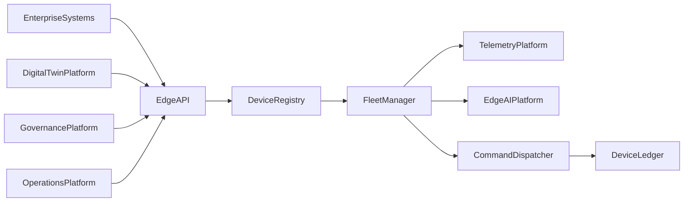
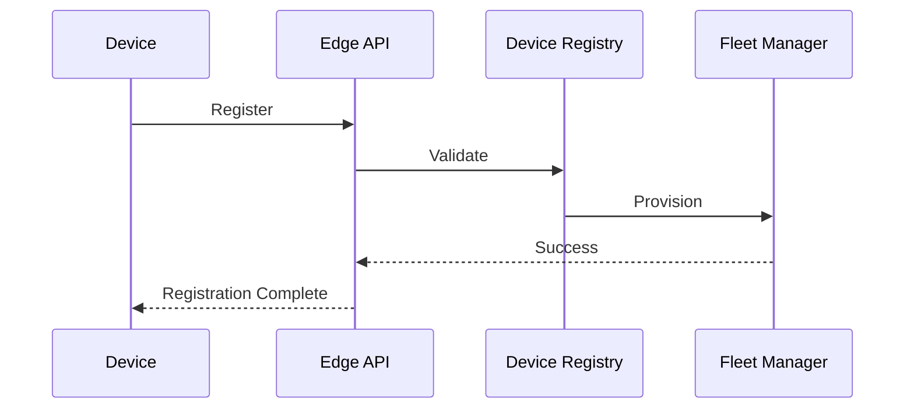

# Enterprise AI Software Factory
# Architecture Design Specification (ADS)

> **Document ID:** ADS-037-v3
>
> **Document Name:** Enterprise Edge, IoT & Cyber-Physical Systems Platform — APIs, Events & Contracts
>
> **Version:** 1.0.0
>
> **Classification:** Enterprise Platform Plane
>
> **Importance:** CRITICAL
>
> **Depends On:** ADS-037-v1
>
> **Depends On:** ADS-037-v2
>
> **Next:** ADS-037-v4 — Runtime & Edge Infrastructure

---

# Executive Summary

This document defines the public APIs, internal service contracts, event model, and messaging patterns for the Enterprise Edge, IoT & Cyber-Physical Systems Platform.

The platform exposes standardized interfaces for device registration, fleet management, telemetry ingestion, firmware deployment, edge AI lifecycle management, remote command execution, and cyber-physical orchestration.

Every edge interaction is authenticated.

Every event is immutable.

Every command is auditable.

---

# Communication Principles

Every edge request SHALL be

- Authenticated
- Authorized
- Versioned
- Observable
- Tenant Isolated
- Idempotent
- Secure
- Governed

No unmanaged communication is permitted.

---

# Communication Architecture



The Device Registry coordinates every lifecycle operation.

---

# Public REST APIs

The Edge Platform exposes APIs for

- Device Registry
- Fleet Management
- Telemetry
- Edge AI
- Command Dispatch
- Firmware Management
- Runtime Health
- Governance

---

## API-037-001

### Register Device

```http
POST /edge/v1/devices
```

Registers a managed edge device.

---

Request

```json
{
  "deviceName":"Warehouse Sensor 18",
  "deviceType":"TemperatureSensor",
  "manufacturer":"ExampleCorp",
  "model":"TS-900",
  "firmwareVersion":"1.4.2"
}
```

---

Response

```json
{
  "deviceRecordId":"DR-204",
  "status":"Registered"
}
```

---

## API-037-002

### Provision Device

```http
POST /edge/v1/provision
```

Assigns credentials, configuration, and fleet membership.

---

## API-037-003

### Deploy Package

```http
POST /edge/v1/deployments
```

Deploys firmware, software, and AI bundles to managed fleets.

---

## API-037-004

### Execute Command

```http
POST /edge/v1/commands
```

Executes authenticated remote commands.

---

## API-037-005

### Submit Telemetry

```http
POST /edge/v1/telemetry
```

Accepts telemetry, metrics, diagnostics, and events from managed devices.

---

# Internal gRPC Services

```protobuf
service EdgePlatformService {

rpc RegisterDevice(DeviceRequest)
returns(DeviceResponse);

rpc ProvisionDevice(ProvisionRequest)
returns(ProvisionResponse);

rpc DeployPackage(DeploymentRequest)
returns(DeploymentResponse);

rpc ExecuteCommand(CommandRequest)
returns(CommandResponse);

rpc SubmitTelemetry(TelemetryRequest)
returns(TelemetryResponse);

}
```

---

# Device Schema

```protobuf
message Device {

string device_id = 1;

string device_name = 2;

string device_type = 3;

string firmware_version = 4;

string lifecycle_state = 5;

}
```

---

# Device Record Schema

```protobuf
message DeviceRecord {

string device_record_id = 1;

string device_id = 2;

string registration_status = 3;

string firmware_status = 4;

string connectivity_status = 5;

}
```

---

# Fleet Record Schema

```protobuf
message FleetRecord {

string fleet_record_id = 1;

string fleet_id = 2;

string deployment_policy = 3;

string operational_status = 4;

string health_score = 5;

}
```

---

# Deployment Package Schema

```protobuf
message DeploymentPackage {

string package_id = 1;

string package_version = 2;

string target_fleet = 3;

string firmware_bundle = 4;

string ai_model_bundle = 5;

}
```

---

# MCP Tool Contracts

The Edge Platform exposes

```text
register_device

provision_device

deploy_package

execute_command

submit_telemetry

query_device

fleet_status

edge_runtime_diagnostics
```

Every invocation is authenticated and audited.

---

# Platform Events

Every lifecycle activity emits immutable events.

---

## EVT-037-001

DeviceRegistered

---

## EVT-037-002

DeviceProvisioned

---

## EVT-037-003

FleetAssigned

---

## EVT-037-004

DeploymentStarted

---

## EVT-037-005

DeploymentCompleted

---

## EVT-037-006

TelemetryReceived

---

## EVT-037-007

CommandExecuted

---

## EVT-037-008

DeviceRetired

---

# Event Flow



---

# Event Ordering

```text
DeviceRegistered

↓

DeviceProvisioned

↓

FleetAssigned

↓

DeploymentStarted

↓

DeploymentCompleted

↓

TelemetryReceived

↓

CommandExecuted

↓

DeviceRetired
```

---

# Event Metadata

Every event contains

```yaml
eventId:
deviceId:
deviceRecordId:
fleetRecordId:
traceId:
timestamp:
schemaVersion:
```

---

# End of Part 1
