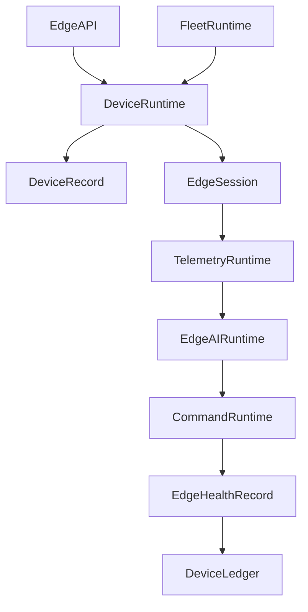

# Enterprise AI Software Factory
# Architecture Design Specification (ADS)

> **Document ID:** ADS-037-v4
>
> **Document Name:** Enterprise Edge, IoT & Cyber-Physical Systems Platform — Runtime & Edge Infrastructure
>
> **Version:** 1.0.0
>
> **Classification:** Enterprise Runtime Specification
>
> **Importance:** CRITICAL
>
> **Depends On:** ADS-037-v1
>
> **Depends On:** ADS-037-v2
>
> **Depends On:** ADS-037-v3
>
> **Next:** ADS-037-v5 — End-to-End Edge Lifecycle

---

# Executive Summary

This document defines the runtime infrastructure responsible for operating enterprise edge devices at scale.

The runtime continuously manages device connectivity, telemetry ingestion, AI inference, firmware deployment, command execution, fleet orchestration, and cyber-physical coordination while maintaining deterministic, resilient, and observable execution.

The Edge Runtime serves as the execution kernel for all managed devices.

---

# Runtime Philosophy

The Edge Runtime follows seven principles.

- Device First
- Offline First
- Continuous Synchronization
- Secure Execution
- Deterministic Operations
- Fleet Scale Management
- Immutable Operational History

Runtime execution never bypasses governance.

---

# Runtime Layers

## Device Runtime

Responsible for

- Device Connectivity
- State Management
- Identity Validation
- Runtime Configuration

---

## Fleet Runtime

Responsible for

- Fleet Scheduling
- Deployment Coordination
- Policy Distribution
- Rollback Management

---

## Telemetry Runtime

Responsible for

- Telemetry Ingestion
- Metrics Aggregation
- Event Streaming
- Diagnostics Processing

---

## Edge AI Runtime

Responsible for

- Model Loading
- Local Inference
- Resource Scheduling
- Runtime Optimization

---

## Command Runtime

Responsible for

- Secure Command Dispatch
- Command Acknowledgement
- Retry Management
- Emergency Operations

---

## Health Runtime

Responsible for

- Runtime Monitoring
- Device Health
- Fleet Health
- Connectivity Health

---

# Runtime Architecture



The Edge Runtime coordinates every managed device operation.

---

# Runtime Components

| Component | Responsibility |
|------------|----------------|
| Device Runtime | Device execution |
| Fleet Runtime | Fleet orchestration |
| Telemetry Runtime | Data ingestion |
| Edge AI Runtime | Local inference |
| Command Runtime | Remote operations |
| Health Runtime | Runtime monitoring |
| Device Ledger | Immutable operational history |

---

# Runtime Pipeline

```text
Device Connect

↓

Identity Validation

↓

Policy Synchronization

↓

Telemetry Collection

↓

AI Inference

↓

Command Execution

↓

Health Update

↓

Ledger Persistence
```

Every runtime interaction follows this lifecycle.

---

# Device Runtime

Device Runtime manages

- Connectivity
- Local State
- Configuration
- Synchronization
- Dependency Resolution

Runtime execution remains deterministic.

---

# Telemetry Runtime

Telemetry Runtime coordinates

- Sensor Streams
- Event Processing
- Metrics Aggregation
- Diagnostic Collection
- Forwarding to Observability

Telemetry remains ordered and durable.

---

# Edge Session Management

Every runtime session tracks

- Device Record
- Fleet Record
- Deployment Package
- Runtime Profile
- Connectivity State
- Command History
- Runtime Metadata

Edge Sessions remain immutable.

---

# Runtime Guarantees

The Edge Runtime guarantees

- Deterministic Device Execution
- Continuous Synchronization
- Secure Command Delivery
- Offline Resilience
- Fleet Policy Enforcement
- Immutable Operational History
- Runtime Reproducibility

---

# End of Part 1
