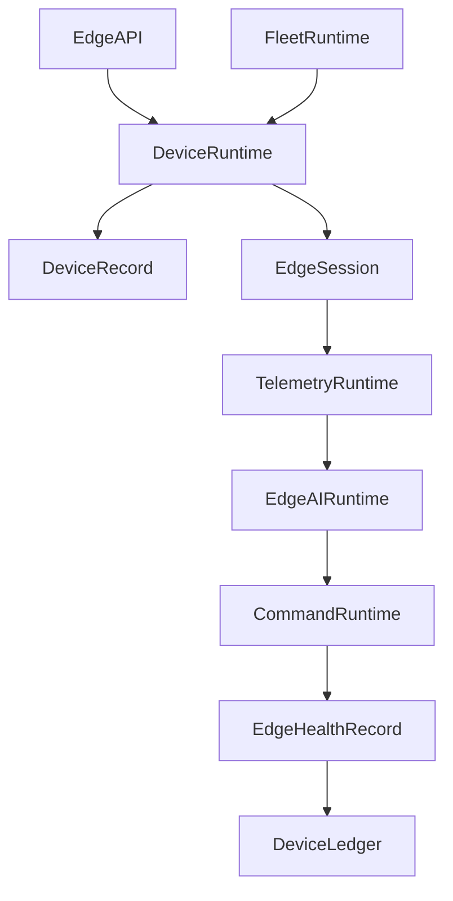
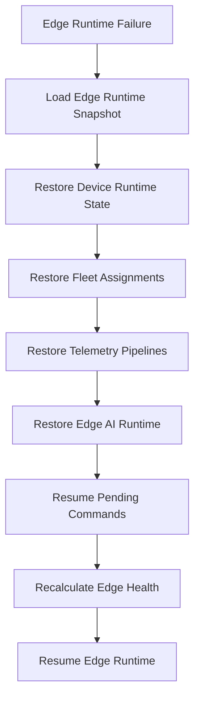

# Enterprise AI Software Factory
# Architecture Design Specification (ADS)

> **Document ID:** ADS-037-v4
>
> **Document Name:** Enterprise Edge, IoT & Cyber-Physical Systems Platform — Runtime & Edge Infrastructure
>
> **Version:** 1.0.0
>
> **Classification:** Enterprise Runtime Specification
>
> **Importance:** CRITICAL
>
> **Depends On:** ADS-037-v1
>
> **Depends On:** ADS-037-v2
>
> **Depends On:** ADS-037-v3
>
> **Next:** ADS-037-v5 — End-to-End Edge Lifecycle

---

# Executive Summary

This document defines the runtime infrastructure responsible for operating enterprise edge devices at scale.

The runtime continuously manages device connectivity, telemetry ingestion, AI inference, firmware deployment, command execution, fleet orchestration, and cyber-physical coordination while maintaining deterministic, resilient, and observable execution.

The Edge Runtime serves as the execution kernel for all managed devices.

---

# Runtime Philosophy

The Edge Runtime follows seven principles.

- Device First
- Offline First
- Continuous Synchronization
- Secure Execution
- Deterministic Operations
- Fleet Scale Management
- Immutable Operational History

Runtime execution never bypasses governance.

---

# Runtime Layers

## Device Runtime

Responsible for

- Device Connectivity
- State Management
- Identity Validation
- Runtime Configuration

---

## Fleet Runtime

Responsible for

- Fleet Scheduling
- Deployment Coordination
- Policy Distribution
- Rollback Management

---

## Telemetry Runtime

Responsible for

- Telemetry Ingestion
- Metrics Aggregation
- Event Streaming
- Diagnostics Processing

---

## Edge AI Runtime

Responsible for

- Model Loading
- Local Inference
- Resource Scheduling
- Runtime Optimization

---

## Command Runtime

Responsible for

- Secure Command Dispatch
- Command Acknowledgement
- Retry Management
- Emergency Operations

---

## Health Runtime

Responsible for

- Runtime Monitoring
- Device Health
- Fleet Health
- Connectivity Health

---

# Runtime Architecture



The Edge Runtime coordinates every managed device operation.

---

# Runtime Components

| Component | Responsibility |
|------------|----------------|
| Device Runtime | Device execution |
| Fleet Runtime | Fleet orchestration |
| Telemetry Runtime | Data ingestion |
| Edge AI Runtime | Local inference |
| Command Runtime | Remote operations |
| Health Runtime | Runtime monitoring |
| Device Ledger | Immutable operational history |

---

# Runtime Pipeline

```text
Device Connect

↓

Identity Validation

↓

Policy Synchronization

↓

Telemetry Collection

↓

AI Inference

↓

Command Execution

↓

Health Update

↓

Ledger Persistence
```

Every runtime interaction follows this lifecycle.

---

# Device Runtime

Device Runtime manages

- Connectivity
- Local State
- Configuration
- Synchronization
- Dependency Resolution

Runtime execution remains deterministic.

---

# Telemetry Runtime

Telemetry Runtime coordinates

- Sensor Streams
- Event Processing
- Metrics Aggregation
- Diagnostic Collection
- Forwarding to Observability

Telemetry remains ordered and durable.

---

# Edge Session Management

Every runtime session tracks

- Device Record
- Fleet Record
- Deployment Package
- Runtime Profile
- Connectivity State
- Command History
- Runtime Metadata

Edge Sessions remain immutable.

---

# Runtime Guarantees

The Edge Runtime guarantees

- Deterministic Device Execution
- Continuous Synchronization
- Secure Command Delivery
- Offline Resilience
- Fleet Policy Enforcement
- Immutable Operational History
- Runtime Reproducibility

---

# Failure Recovery

The Edge Runtime automatically recovers from device, fleet, telemetry, AI runtime, and command execution failures while preserving operational integrity.

Recovery follows approved governance and recovery policies.



Recovery guarantees

- No device identity corruption
- No fleet inconsistency
- No telemetry loss beyond configured buffering policies
- Deterministic recovery

---

# Runtime Health Monitoring

Every runtime component continuously reports health.

Collected metrics

- Device Runtime Health
- Fleet Runtime Health
- Telemetry Runtime Health
- Edge AI Runtime Health
- Command Runtime Health
- Active Edge Sessions
- Connectivity Status
- Deployment Queue Depth

Health Flow

```text
Runtime Component

↓

Heartbeat

↓

Edge Runtime Monitor

↓

Operations Dashboard

↓

Alert Engine

↓

Operations Team
```

Health monitoring remains continuous.

---

# Edge Runtime Snapshot

The runtime periodically generates Edge Runtime Snapshots.

```yaml
edgeRuntimeSnapshot:

  snapshotId:

  generatedAt:

  activeDevices:

  activeEdgeSessions:

  activeDeployments:

  telemetryQueueDepth:

  commandQueueDepth:

  aiRuntimeStatus:

  platformHealth:

  throughput:
```

Runtime Snapshots provide deterministic operational state.

---

# Runtime Configuration

Example

```yaml
edgeRuntime:

  automaticProvisioning: enabled

  continuousSynchronization: enabled

  telemetryStreaming: enabled

  edgeAI: enabled

  firmwareRollouts: enabled

  commandDispatcher: enabled

  runtimeSnapshots: enabled

  snapshotInterval: 5m
```

Configuration remains version-controlled.

---

# Runtime Scaling

The Edge Runtime supports

- Horizontal Device Management
- Distributed Telemetry Processing
- Elastic Fleet Coordination
- Parallel AI Inference
- Regional Edge Clusters

Scaling remains policy-driven.

---

# Runtime Isolation

The Edge Runtime isolates

- Devices
- Fleets
- Edge Sessions
- AI Workloads
- Deployment Pipelines
- Telemetry Streams

Isolation prevents cross-tenant and cross-fleet interference.

---

# Prometheus Metrics

```text
edge_runtime_snapshots_total

active_devices_total

active_edge_sessions_total

active_deployments_total

telemetry_queue_depth

command_queue_depth

edge_ai_inference_latency_seconds

device_connectivity_latency_seconds

edge_runtime_health_score

fleet_policy_sync_duration_seconds
```

---

# OpenTelemetry

Distributed tracing spans

```text
Edge API

↓

Device Runtime

↓

Fleet Runtime

↓

Telemetry Runtime

↓

Edge AI Runtime

↓

Command Runtime

↓

Device Ledger
```

Every runtime stage contributes trace spans.

---

# Structured Logging

Example

```json
{
  "deviceRecord":"DR-102",
  "edgeRuntimeSnapshot":"ERS-011",
  "edgeSession":"ES-551",
  "fleetRecord":"FR-019",
  "platformHealth":"Healthy",
  "connectivityState":"Online"
}
```

Logs remain immutable and correlated.

---

# Disaster Recovery

Recovery flow

```text
Edge Runtime Failure

↓

Restore Edge Runtime Snapshot

↓

Restore Device Runtime State

↓

Restore Fleet Assignments

↓

Resume Telemetry Pipelines

↓

Validate Runtime Health

↓

Resume Operations
```

Recovery targets

Recovery Point Objective (RPO)

Near-zero operational state loss

Recovery Time Objective (RTO)

Less than five minutes

---

# Recommended Production Deployment

```text
Edge API

↓

Device Runtime

↓

Fleet Runtime

↓

Telemetry Runtime

↓

Edge AI Runtime

↓

Command Runtime

↓

Device Ledger

↓

OpenTelemetry

↓

Prometheus

↓

Grafana
```

---

# Technology Decision Records

## TDR-037-01

### Technology

Kubernetes (K3s / KubeEdge)

### Decision

Support lightweight Kubernetes distributions for edge orchestration.

### Reason

Provides scalable container orchestration across constrained edge environments.

---

## TDR-037-02

### Technology

MQTT Broker

### Decision

Use MQTT for device messaging.

### Reason

Provides lightweight, reliable publish/subscribe communication for IoT devices.

---

## TDR-037-03

### Technology

Edge Runtime Snapshot

### Decision

Persist periodic runtime snapshots.

### Reason

Supports diagnostics, replay, disaster recovery, and operational visibility.

---

## TDR-037-04

### Technology

ONNX Runtime

### Decision

Use ONNX Runtime for portable edge inference.

### Reason

Supports efficient execution across heterogeneous hardware platforms.

---

## TDR-037-05

### Technology

OTA Deployment Service

### Decision

Support staged over-the-air firmware and software updates.

### Reason

Enables safe, governed, and reversible deployments across large device fleets.

---

# Runtime Checklist

The Edge Platform MUST

- Generate Edge Runtime Snapshots
- Continuously monitor device health
- Support offline operation
- Enforce signed deployment packages
- Maintain immutable operational history
- Secure remote command execution
- Preserve telemetry integrity

The Edge Platform MUST NOT

- Execute unsigned deployment packages
- Bypass policy validation
- Lose operational audit history
- Permit unauthorized commands
- Break tenant isolation

---

# Architecture Decision Records

## ADR-037-09

### Decision

Treat Edge Runtime Snapshots as immutable runtime artifacts.

### Status

Accepted

### Reason

Snapshots improve diagnostics, replay, recovery, and operational resilience.

---

## ADR-037-10

### Decision

Separate fleet orchestration from device runtime execution.

### Status

Accepted

### Reason

Independent evolution improves scalability, maintainability, and deployment flexibility.

---

## ADR-037-11

### Decision

Execute all managed device interactions within isolated Edge Sessions.

### Status

Accepted

### Reason

Session isolation improves security, observability, reproducibility, and operational reliability.

---

# Operational Readiness Scorecard

| Capability | Status |
|------------|--------|
| Edge Runtime | ✅ Required |
| Runtime Snapshots | ✅ Required |
| Fleet Runtime | ✅ Required |
| Telemetry Runtime | ✅ Required |
| Runtime Recovery | ✅ Required |
| Offline Operation | ✅ Required |
| Zero Trust Security | ✅ Required |
| Deterministic Execution | ✅ Required |

---

# Related Documents

ADS-021-v5 — Workflow Kernel

ADS-022-v5 — Identity & Trust Plane

ADS-025-v5 — Compute & Infrastructure Platform

ADS-026-v5 — Security Platform

ADS-027-v5 — Observability Platform

ADS-030-v5 — Integration & Ecosystem Platform

ADS-036-v5 — Enterprise Digital Twin & Simulation Platform

ADS-037-v1 — Enterprise Edge, IoT & Cyber-Physical Systems Platform

ADS-037-v2 — Device Algorithms & Lifecycle

ADS-037-v3 — APIs, Events & Contracts

ADS-037-v5 — End-to-End Edge Lifecycle

---

# End of Document
