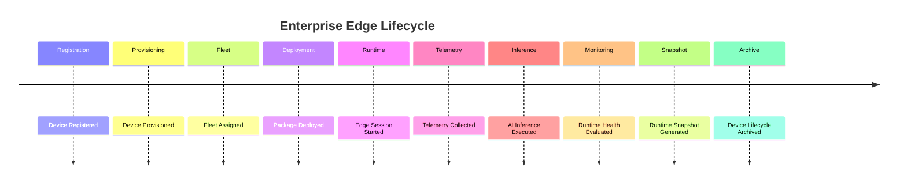

# Enterprise AI Software Factory
# Architecture Design Specification (ADS)

> **Document ID:** ADS-037-v5
>
> **Document Name:** Enterprise Edge, IoT & Cyber-Physical Systems Platform — End-to-End Edge Lifecycle
>
> **Version:** 1.0.0
>
> **Classification:** Reference Implementation
>
> **Importance:** CRITICAL
>
> **Depends On:** ADS-037-v1
>
> **Depends On:** ADS-037-v2
>
> **Depends On:** ADS-037-v3
>
> **Depends On:** ADS-037-v4

---

# Executive Summary

This document demonstrates the complete lifecycle of an enterprise-managed edge ecosystem—from secure device registration and fleet provisioning through telemetry ingestion, AI inference, command execution, runtime monitoring, disaster recovery, and archival.

It illustrates how Devices, Device Records, Fleet Records, Deployment Packages, Edge Sessions, Telemetry Records, Edge Health Records, Edge Runtime Snapshots, and Edge Ledger Entries interact throughout operational execution.

Every device is governed.

Every deployment is verifiable.

Every runtime interaction is auditable.

---

# Scenario

A multinational manufacturer deploys **25,000 smart sensors**, **1,200 industrial robots**, and **400 autonomous guided vehicles (AGVs)** across multiple production facilities.

Participating systems

- Edge Platform
- Digital Twin Platform
- Knowledge Platform
- Analytics Platform
- Governance Platform
- Observability Platform

---

# Stage 1 — Device Registration

Generated

```
DEV-2027-014521
```

Device contains

- Hardware Identity
- Manufacturer Certificate
- Firmware Version
- Device Type
- Security Profile

Registration completes successfully.

---

# Stage 2 — Device Provisioning

Generated

```
DR-2027-00932
```

Provisioning includes

- Device Certificate
- Fleet Assignment
- Runtime Configuration
- Security Policies
- Time Synchronization

Device Record archived.

---

# Stage 3 — Fleet Assignment

Generated

```
FR-2027-00044
```

Fleet configured with

- Production Policies
- Firmware Baseline
- AI Deployment Strategy
- Rollback Policy
- Telemetry Policy

Fleet becomes operational.

---

# Stage 4 — Deployment Package

Generated

```
DP-2027-00118
```

Deployment Package contains

- Firmware Bundle
- Software Bundle
- AI Model Bundle
- Integrity Checksum
- Digital Signature

Package verified and approved.

---

# Stage 5 — Edge Runtime

Generated

```
ES-2027-00631
```

Edge Session manages

- Device Connectivity
- AI Runtime
- Command History
- Runtime Metadata
- Security Context

Runtime activated.

---

# Stage 6 — Telemetry Collection

Generated

```
TR-2027-04129
```

Telemetry includes

- Sensor Measurements
- Runtime Metrics
- Diagnostics
- AI Inference Statistics
- Connectivity Events

Telemetry stored.

---

# Stage 7 — Edge AI Inference

Edge AI Runtime performs

- Local Object Detection
- Equipment Fault Prediction
- Predictive Maintenance
- Quality Inspection

Inference completes successfully.

---

# Stage 8 — Runtime Monitoring

Generated

```
EHR-2027-00027
```

Edge Health metrics

- Device Availability: 99.98%
- Connectivity Health: Healthy
- AI Runtime Health: Healthy
- Firmware Compliance: 100%
- Fleet Health Score: 98.9%

Platform remains Healthy.

---

# Stage 9 — Runtime Snapshot

Generated

```
ERS-2027-00012
```

Snapshot contains

- Active Devices
- Active Edge Sessions
- Deployment Queue
- Telemetry Queue
- Runtime Health

Snapshot archived.

---

# Stage 10 — Edge Ledger

Generated

```
EL-2027-00083
```

Ledger Entry references

- Device
- Device Record
- Fleet Record
- Deployment Package
- Edge Session
- Telemetry Record
- Edge Health Record
- Runtime Snapshot

Entry becomes immutable.

---

# Stage 11 — Executive Review

Operations leadership evaluates

- Fleet Health
- Deployment Success
- Device Availability
- AI Inference Performance
- Predictive Maintenance Outcomes

Global rollout approved.

---

# Stage 12 — Retirement & Archival

Archived artifacts

- Device
- Device Record
- Fleet Record
- Deployment Package
- Edge Session
- Telemetry Record
- Edge Health Record
- Runtime Snapshot
- Edge Ledger Entry

Lifecycle remains fully reproducible.

---

# Edge Lifecycle Timeline



---

# Event Stream

```text
DeviceRegistered

↓

DeviceProvisioned

↓

FleetAssigned

↓

DeploymentStarted

↓

DeploymentCompleted

↓

TelemetryReceived

↓

InferenceCompleted

↓

EdgeHealthUpdated

↓

RuntimeSnapshotCreated

↓

EdgeLedgerWritten

↓

DeviceRetired
```

---

# Produced Artifacts

| Artifact | Identifier |
|-----------|------------|
| Device | DEV-2027-014521 |
| Device Record | DR-2027-00932 |
| Fleet Record | FR-2027-00044 |
| Deployment Package | DP-2027-00118 |
| Edge Session | ES-2027-00631 |
| Telemetry Record | TR-2027-04129 |
| Edge Health Record | EHR-2027-00027 |
| Edge Runtime Snapshot | ERS-2027-00012 |
| Edge Ledger Entry | EL-2027-00083 |

---

# Runtime Metrics

| Metric | Value |
|---------|------:|
| Managed Devices | 26,600 |
| Active Edge Sessions | 24,870 |
| Telemetry Events / Day | 8.6 Billion |
| OTA Deployment Success Rate | 99.95% |
| AI Inference Success Rate | 99.91% |
| Fleet Policy Compliance | 100% |
| Average Command Latency | 42 ms |
| Platform Availability | 99.99% |

---

# Operational Readiness Scorecard

| Capability | Status |
|------------|--------|
| Device Registry | ✅ Verified |
| Fleet Management | ✅ Verified |
| OTA Deployment | ✅ Verified |
| Edge AI Runtime | ✅ Verified |
| Telemetry Pipeline | ✅ Verified |
| Runtime Snapshots | ✅ Verified |
| Edge Ledger | ✅ Verified |
| Deterministic Lifecycle | ✅ Verified |

---

# Lessons Learned

The Enterprise Edge Platform demonstrates the following principles.

- Devices maintain immutable identities throughout their lifecycle.
- Device Records separate logical identity from operational state.
- Fleet Records govern coordinated fleet operations.
- Deployment Packages provide reproducible software and AI distribution.
- Edge Sessions preserve runtime execution context.
- Telemetry Records ensure durable operational evidence.
- Edge Health Records continuously evaluate operational quality.
- Edge Runtime Snapshots support recovery and replay.
- Edge Ledger Entries provide immutable enterprise audit history.

---

# Architecture Decision Record

## ADR-037-12

### Decision

Represent enterprise edge operations as a deterministic lifecycle composed of immutable operational artifacts.

### Status

Accepted

### Reason

Artifact-centric edge management improves governance, reproducibility, observability, resilience, compliance, and operational excellence.

---

# Technology Decision Record

## TDR-037-06

### Technology

Enterprise Edge Platform

### Decision

Implement a centralized Enterprise Edge, IoT & Cyber-Physical Systems Platform responsible for device identity, fleet orchestration, telemetry, edge AI, OTA deployment, runtime health, and immutable operational history.

### Reason

A unified Edge Platform enables secure, governed, scalable, and observable management of cyber-physical systems while integrating seamlessly with the Digital Twin, Knowledge, Analytics, Governance, and Observability platforms.

---

# Related Documents

ADS-021-v5 — Workflow Kernel

ADS-022-v5 — Identity & Trust Plane

ADS-025-v5 — Compute & Infrastructure Platform

ADS-026-v5 — Security Platform

ADS-027-v5 — Observability Platform

ADS-030-v5 — Integration & Ecosystem Platform

ADS-036-v5 — Enterprise Digital Twin & Simulation Platform

ADS-037-v1 — Enterprise Edge, IoT & Cyber-Physical Systems Platform

ADS-037-v2 — Device Algorithms & Lifecycle

ADS-037-v3 — APIs, Events & Contracts

ADS-037-v4 — Runtime & Edge Infrastructure

---

# End of Document
